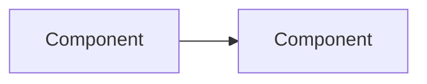

# Self Git Workflow Skill

Personal Git workflow for **github.self.com** repos (user: `coyote7wolf`).

> **Auto-detection**: If remote URL contains `github.self.com` → use this skill, NOT the Metropia `git` skill.

---

## Prerequisites

**1. Switch gh account** before any `gh` CLI operation (PR, issue, project):

```bash
gh auth switch --user coyote7wolf
```

> Default `gh` account is `EyolfLin-Metropia` (work). Always switch first.

**2. Git user config** — set per-repo using `.gitconfig-self`:

```bash
git config user.name "wolf04"
git config user.email "mickey985ha@gmail.com"
```

> Source: `~/.gitconfig-self`. Always verify with `git config user.name` before first commit.

**3. Workflow order** — always follow this sequence:

```
1. Create Issue
2. Branch from dev
3. Commit (with #issue)
4. Push feature branch
5. Create PR to dev
6. Claude Code Review (post comment on PR via gh pr comment)
7. Read Gemini Review comments (if any)
8. Fix all review comments (Claude + Gemini)
9. Human Merge (user decides when to merge)
```

> Never push before the issue exists. Commit message must reference the issue number.
> Feature branches always branch from `dev` and PR back to `dev`.
> Claude must ALWAYS review after creating a PR — never skip.
> After fixing review comments, re-read Gemini comments to ensure nothing is missed.
> **Auto-commit, auto-PR, auto-review — but NEVER auto-merge.** Claude can commit, push, create PR, and post review automatically. Only the user decides when to merge.

---

## Branch Strategy

### Long-lived Branches

```
dev       ← main development line (GitHub default branch)
stable    ← stable version / demo ready
```

- `dev`: all feature/fix branches merge here via PR
- `stable`: only updated from `dev` when a version is ready to demo/release
- **No `main` branch** — `dev` is the default

### Feature Branch Naming

Format: `<type>/#<issue-number>-<short-description>`

Examples:
- `feature/#12-ai-whiteboard-canvas`
- `fix/#5-websocket-reconnect`
- `chore/#8-setup-ci`

### Development Flow

```
1. Create Issue on GitHub
2. Create feature branch from dev
   └─ git checkout -b <type>/#<issue>-xxx dev
3. Develop + Commit (with #issue in message)
4. Push feature branch
5. Create PR → dev (with --assignee, --label, --project)
6. Claude Code Review (post review comment on PR)
7. Read Gemini Review comments (if any)
8. Fix all review comments (commit + push to same branch)
9. Human Merge (user decides when to merge)
10. When milestone ready: PR dev → stable + tag version
```

### Release Flow (dev → stable)

```bash
# Create PR from dev to stable
gh pr create --base stable --title "🚀release: v0.x.0" --body "..."

# After merge, tag on stable
git checkout stable && git pull
git tag -a <project>/v0.x.0 -m "<project>/v0.x.0: <milestone description>"
git push origin <project>/v0.x.0
```

### Tag Versioning

Format: `<project>/v<major>.<minor>.<patch>`

**Project prefixes:**

| Prefix       | Project                    |
| ------------ | -------------------------- |
| `workspace`  | Global / cross-project     |
| `whiteboard` | Realtime AI Whiteboard     |
| `workflow`   | Enterprise Workflow System |
| `3d-asset`   | 3D Asset Collaboration     |

**Version bumping (Conventional Commits + SemVer):**

Version is determined by commit types since last tag — not manually decided.

| Commit Type | Version Bump | Trigger |
| ----------- | ------------ | ------- |
| `fix`       | **patch** `0.0.X` | Bug fix, backward compatible |
| `feat`      | **minor** `0.X.0` | New feature, backward compatible |
| any type + `BREAKING CHANGE` in footer | **major** `X.0.0` | Breaking change, not backward compatible |
| `docs`, `chore`, `style`, `refactor`, `test` | **no release** | No version bump |

> Automated via `release-please` GitHub Action.

**Examples:**

```
workspace/v0.1.0     ← first feat commits (folder structure + docs)
whiteboard/v0.1.0    ← first feat commits (proposal + spec)
whiteboard/v0.1.1    ← fix: correct API schema typo
whiteboard/v0.2.0    ← feat: add canvas realtime sync
whiteboard/v1.0.0    ← feat + BREAKING CHANGE: redesign WebSocket protocol
```

### Branch Protection Rules

| Branch   | Rules                                |
| -------- | ------------------------------------ |
| `dev`    | PR only, no direct push             |
| `stable` | PR only, no direct push, require review |

---

## Commit Message

### Format (Standard Conventional Commits)

Title (parsed by release-please):
```
<type>(<scope>): <short description> (#<issue-number>)
```

Body (optional, emoji goes here):
```
<emoji> <summary of changes>

- <change 1>
- <change 2>

Co-Authored-By: Claude Opus 4.6 (1M context) <noreply@anthropic.com>
```

> **Why**: release-please requires standard Conventional Commits title to auto-tag.
> Emoji in title breaks the parser. Put emoji in body instead.

### Types & Emoji

| Type       | Emoji | Use Case                              |
| ---------- | ----- | ------------------------------------- |
| `feat`     | ✨    | New feature                           |
| `fix`      | 🐛    | Bug fix                               |
| `refactor` | ♻️    | Code refactoring (no behavior change) |
| `docs`     | 📘    | Documentation only                    |
| `test`     | 🧪    | Adding/updating tests                 |
| `chore`    | 📦    | Build, tooling, config changes        |
| `style`    | 🎨    | Formatting, whitespace (no logic)     |
| `init`     | 🎉    | Initial project setup                 |

### Rules

1. **Title**: `<type>(<scope>): <description> (#issue)` — no emoji in title
2. **Scope**: `(whiteboard)`, `(workflow)`, `(3d-asset)`, `(ci)`, `(docs)` — always required
3. **Issue**: `(#number)` at end of title if linked
4. **Description**: English, imperative mood, no period
5. **Emoji**: first line of body, not title
6. **Body**: bullet points for main changes (optional for small commits)
7. **Co-Author**: always include Co-Authored-By line

### Examples

With issue number:
```
feat(whiteboard): add real-time cursor sync (#12)

✨ WebSocket broadcast for cursor positions

- Implement broadcast for cursor positions
- Add throttle to reduce message frequency

Co-Authored-By: Claude Opus 4.6 (1M context) <noreply@anthropic.com>
```

Bug fix:
```
fix(whiteboard): resolve websocket disconnect (#5)

🐛 Connection drops after 30s idle

Co-Authored-By: Claude Opus 4.6 (1M context) <noreply@anthropic.com>
```

No issue:
```
chore(ci): add GitHub Actions workflow

📦 ESLint + Semgrep + gitleaks

Co-Authored-By: Claude Opus 4.6 (1M context) <noreply@anthropic.com>
```

---

## Push

```bash
# First push - set upstream
git push -u origin <branch-name>

# Subsequent pushes
git push
```

---

## Pull Request

### Create PR

```bash
gh pr create \
  --title "<type>(<scope>): <title> (#<issue>)" \
  --assignee @me \
  --label "<label>" \
  --project "Fullstack AI Workspace" \
  --body "$(cat <<'EOF'
## Summary

<1-3 bullet points explaining what and why>

## Changes

- <file/module>: <what changed>

## Design

<Figma link if UI changes, or "N/A">

## Test Plan

<How to test, or "N/A">

## Related Issue

Closes #<issue-number>
EOF
)"
```

### PR Defaults

Always include:
- `--assignee @me` — auto-assign PR creator
- `--label` — match the issue label (e.g. `chore`, `project:whiteboard`)
- `--project "Fullstack AI Workspace"` — add to project board

### PR Title Format

```
<type>(<scope>): <short description> (#<issue>)
```

---

## Issue

### Create Issue

```bash
gh issue create --title "<title>" --body "$(cat <<'EOF'
## Description

<What is the issue or feature request>

## Acceptance Criteria

- [ ] <criteria 1>
- [ ] <criteria 2>

## Notes

<Additional context>
EOF
)"
```

### Common Commands

| Action             | Command                                      |
| ------------------ | -------------------------------------------- |
| Create issue       | `gh issue create --title "..." --body "..."`  |
| List issues        | `gh issue list`                               |
| View issue         | `gh issue view <number>`                      |
| Close issue        | `gh issue close <number>`                     |
| Reopen issue       | `gh issue reopen <number>`                    |
| Add labels         | `gh issue edit <number> --add-label "bug"`    |
| Assign             | `gh issue edit <number> --add-assignee @me`   |

---

## Project (GitHub Projects v2)

```bash
# List projects
gh project list

# View project items
gh project item-list <project-number>

# Add issue to project
gh project item-add <project-number> --url <issue-url>
```

---

## Code Review

After creating a PR, **always perform a code review** and post the result as a PR comment.

### Review Format

```markdown
## 🤖 Claude Code Review

### Summary
- 1-3 bullet points of what changed and why

### Architecture Impact

(Generate a mermaid diagram showing affected components and their relationships.
 If changes are docs-only, show which doc sections were affected.)

### Review
| File | Severity | Comment |
|------|----------|---------|
| `file:line` | ⚠️ warning / 💡 suggestion / ✅ good | description |

### Security Scan
| Check | Status | Detail |
|-------|--------|--------|
| OWASP Injection | ✅ / ⚠️ | (parameterized queries, no string concat in SQL) |
| OWASP Auth | ✅ / ⚠️ | (token validation, expiry, no hardcoded secrets) |
| OWASP XSS | ✅ / ⚠️ | (input escaped, CSP headers) |
| OWASP Access Control | ✅ / ⚠️ | (authz on every endpoint, resource ACL) |
| CWE-798 Hardcoded Creds | ✅ / ⚠️ | (no secrets in code) |
| CWE-400 Resource Limits | ✅ / ⚠️ | (rate limiting, input size limits) |
| Data Exposure | ✅ / ⚠️ | (no PII in logs or error responses) |

(Skip security scan section for docs-only PRs)

### Risk Level
🟢 Low / 🟡 Medium / 🔴 High — with one-line reasoning
```

### Step-by-step

1. **Claude Review** — after creating PR, immediately review and post comment:
   ```bash
   gh pr comment <pr-number> --body "<review content>"
   ```

2. **Gemini Review** — read Gemini's review comments on the PR:
   ```bash
   gh api repos/<owner>/<repo>/pulls/<pr-number>/comments --jq '.[].body'
   gh api repos/<owner>/<repo>/pulls/<pr-number>/reviews --jq '.[].body'
   ```

3. **Fix all review comments** — apply fixes from both Claude and Gemini reviews, commit + push to the same branch.

4. **Human Merge** — user decides when to merge. Never merge automatically.

### Full Workflow

```
Issue → Branch → Commit → Push → PR
  → Claude Review (gh pr comment)
  → Read Gemini Review
  → Fix all review comments
  → Human Merge
```

> Review is done by Claude directly via `gh pr comment`, NOT via GitHub Actions.
> Always check for Gemini review comments after posting Claude review.

---

## Quick Reference

| Action             | Command                                    |
| ------------------ | ------------------------------------------ |
| Commit             | `git commit -m "<type>(<scope>): desc (#issue)"` |
| Push (first time)  | `git push -u origin <branch>`              |
| Push (subsequent)  | `git push`                                 |
| Create PR          | `gh pr create --title "..." --body "..."`  |
| View PR            | `gh pr view`                               |
| Create issue       | `gh issue create ...`                      |
| List issues        | `gh issue list`                            |
| List projects      | `gh project list`                          |

---

## Code Quality Self-Check

Before every commit, Claude must verify:

### SOLID Principles
- [ ] **S** — Single Responsibility: each file/class does one thing
- [ ] **O** — Open/Closed: extend via interfaces, not modifying existing code
- [ ] **L** — Liskov Substitution: subtypes replaceable without breaking
- [ ] **I** — Interface Segregation: no fat interfaces, split by consumer
- [ ] **D** — Dependency Inversion: depend on abstractions, not concretions

### Design Patterns
- [ ] No god objects or mega-components (>200 lines → split)
- [ ] Hooks extract reusable logic from components
- [ ] Services abstract external I/O (API, DB, storage)
- [ ] DTOs validate input at boundaries
- [ ] Repository pattern for data access (not raw queries in controllers)

### Code Review Checklist (for Claude PR comments)
- [ ] No inline styles (use CSS modules)
- [ ] No `any` types (use proper interfaces)
- [ ] No hardcoded secrets or URLs (use env vars)
- [ ] No unused imports or variables
- [ ] Error handling: no silent catches, proper error responses
- [ ] Auth: endpoints protected, tenant isolation verified
- [ ] Performance: no N+1 queries, throttle high-frequency events
- [ ] Security: input validated, SQL injection prevented, XSS prevented

### DRY (Don't Repeat Yourself)
- [ ] No duplicate code across files (extract to shared util/hook/service)
- [ ] No copy-paste components (extract to shared component)
- [ ] No repeated API calls (use cache or shared store)
- [ ] No repeated styles (use CSS modules/tokens/variables)
- [ ] No repeated validation logic (use shared DTOs/schemas)
- [ ] Reuse existing libraries before writing custom (check pnpm list first)
- [ ] **Optimistic Locking** — when multiple users can edit the same resource (e.g. board, asset version), use a `version` column. Read version → update WHERE version = X → if 0 rows affected, conflict error
- [ ] **Redis Atomic Ops** — for counters (usage metering, rate limiting), use `INCR`/`DECR` not read-then-write. Prevents double-count race conditions
- [ ] **DB Transactions** — when multiple tables must update together (e.g. create board + add owner), wrap in `prisma.$transaction()`
- [ ] **Singleton Pattern** — DB connection pool, Redis client, WebSocket server should be single instance. In NestJS use `@Injectable({ scope: Scope.DEFAULT })` (default is singleton)
- [ ] **Factory Pattern** — when creating different objects by condition (e.g. API client real vs mock, notification channel email vs push), use a factory function, not if/else chains
- [ ] **Idempotent APIs** — POST endpoints that create resources should handle duplicate requests gracefully (e.g. unique constraint catch → return existing instead of error)
- [ ] **Kafka Exactly-Once** — for audit log and event sourcing, configure `acks: all` + `enable.idempotence: true` + consumer `isolation.level: read_committed`

### PR Review Comment Format

Every Claude PR review MUST include this self-check section:

```markdown
## 🤖 Claude Code Review

### Self-Check
- [x] **SOLID** — Single Responsibility, Open/Closed, Liskov, Interface Segregation, Dependency Inversion
- [x] **DRY** — No duplicate code, components, styles, validation. Reused existing libraries.
- [x] **Design Patterns** — Singleton for shared resources, Factory for conditional creation, no god objects (>200 lines)
- [x] **Concurrency** — No race conditions, optimistic locking where needed, atomic Redis ops
- [x] **Security** — Auth on all endpoints, tenant isolation, input validated via DTOs, no hardcoded secrets
- [x] **Performance** — No N+1 queries, high-frequency events throttled, lazy loading where appropriate
- [ ] **Issue found**: <describe specific problem and fix suggestion>

### Review
| File | Status | Comment |
|------|--------|---------|
| ... | ✅ / ⚠️ / ❌ | ... |

### Risk Level
🟢 Low / 🟡 Medium / 🔴 High — <one line reason>
```

> If all checks pass, mark all as [x]. If any check fails, mark as [ ] and describe the issue.
> This self-check replaces the old review format. Always use this format from now on.
