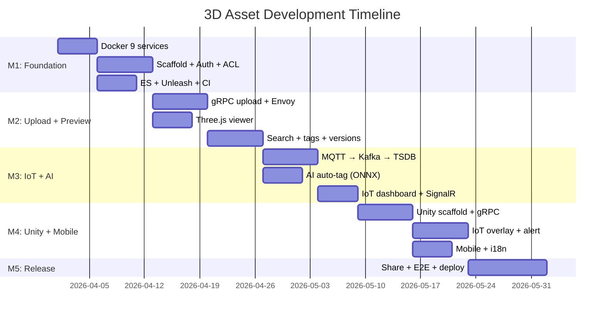

# Development Roadmap: 3D Asset Collaboration

## Effort Estimation Method

Using **T-shirt sizing** (same as workspace-wide convention).

## Definition of Done

- [ ] Code reviewed and merged to `dev`
- [ ] Unit tests written and passing
- [ ] API documented (OpenAPI for REST, .proto for gRPC)
- [ ] UI matches Figma (if applicable)
- [ ] Storybook story added (if UI component)
- [ ] Feature flag configured in Unleash (if gradual rollout)
- [ ] Analytics event implemented (if user-facing)
- [ ] Security scan passes (Semgrep + Trivy in CI)
- [ ] No lint or security scan errors

## Milestones

### M1: Foundation — `3d-asset/v0.1.0`

**Goal:** Docker infra, project scaffold, auth (JWT + API Key), brand isolation, feature flags, security scans in CI.
**Duration:** 3 weeks

| Feature | Priority | Size | Platform | System | Dependency | Status |
|---------|----------|------|----------|--------|-----------|--------|
| Docker Compose (PG, TimescaleDB, Redis, Kafka, MinIO, ES, Mosquitto, Unleash, MailHog) | P0 | L | — | Infra | — | Not started |
| ASP.NET Core project scaffold (Hexagonal structure) | P0 | L | — | Asset API | Docker | Not started |
| React project scaffold (Vite + RTK + Router + Three.js) | P0 | M | Web | Asset Portal | — | Not started |
| Python FastAPI project scaffold (AI Service) | P0 | M | — | AI Service | Docker | Not started |
| User auth (JWT + API Key for M2M) | P0 | L | — | Asset API | Scaffold | Not started |
| Brand model + bucket-per-tenant MinIO isolation | P0 | L | — | Asset API + MinIO | Auth | Not started |
| Brand member ACL (owner / editor / viewer) | P0 | M | — | Asset API | Brand model | Not started |
| EF Core migrations (initial schema) | P0 | M | — | Asset API | Docker PG | Not started |
| Elasticsearch index setup | P0 | M | — | Asset API | ES Docker | Not started |
| Unleash feature flags integration | P0 | S | All | All | Unleash Docker | Not started |
| API Layer pattern (real + mock) — web | P0 | S | Web | Asset Portal | React scaffold | Not started |
| Storybook setup | P1 | S | Web | Asset Portal | React scaffold | Not started |
| Security scan in CI (Semgrep + Trivy) | P1 | M | — | CI | — | Not started |
| CI workflow (dotnet format + Ruff + ESLint) | P1 | S | — | CI | — | Not started |

**Risks:**
| Risk | Impact | Mitigation |
|------|--------|------------|
| 9 Docker services — high RAM usage | Medium | Test startup on 32GB Mac, optimize service configs |
| Hexagonal architecture boilerplate | Medium | Use .NET Clean Architecture templates as starting point |

---

### M2: Upload + Preview — `3d-asset/v0.2.0`

**Goal:** gRPC file upload, Three.js browser preview, versioning, search.
**Duration:** 3 weeks

| Feature | Priority | Size | Platform | System | Dependency | Status |
|---------|----------|------|----------|--------|-----------|--------|
| gRPC service definition (.proto) | P0 | M | — | Asset API | Scaffold | Not started |
| gRPC chunked upload (bidirectional stream + resume) | P0 | XL | — | Asset API | gRPC proto | Not started |
| gRPC-Web proxy (Envoy) | P0 | M | — | Infra | gRPC | Not started |
| gRPC-Web upload client | P0 | L | Web | Asset Portal | Envoy | Not started |
| MinIO versioned storage | P0 | M | — | Asset API | MinIO | Not started |
| Asset version management (create, list, revert) | P0 | L | — | Asset API | MinIO versioned | Not started |
| Three.js 3D viewer (React Three Fiber + Drei) | P0 | L | Web | Asset Portal | React scaffold | Not started |
| Asset detail page (3D viewer + metadata + versions) | P0 | L | Web | Asset Portal | Three.js viewer | Not started |
| Elasticsearch full-text search + autocomplete | P0 | L | Web | Asset API + Portal | ES index | Not started |
| Faceted filter sidebar (format, brand, date, tags) | P1 | M | Web | Asset Portal | Search | Not started |
| Asset tagging (manual add/remove) | P1 | M | Web | Asset API + Portal | ES | Not started |
| Thumbnail generation (server-side async worker) | P1 | M | — | Asset API | Kafka events | Not started |
| Integration tests (upload + search) | P1 | M | — | CI | Upload + search | Not started |

**Risks:**
| Risk | Impact | Mitigation |
|------|--------|------------|
| gRPC-Web + Envoy proxy complexity | High | Use official Envoy gRPC-Web filter config |
| Large GLB files crash browser | Medium | Progressive LOD, warn for files > 200MB |

---

### M3: IoT + AI — `3d-asset/v0.3.0`

**Goal:** IoT data pipeline (MQTT → Kafka → TimescaleDB), AI auto-tagging, SignalR realtime.
**Duration:** 3 weeks

| Feature | Priority | Size | Platform | System | Dependency | Status |
|---------|----------|------|----------|--------|-----------|--------|
| MQTT → Kafka bridge configuration | P0 | M | — | Infra | Mosquitto + Kafka | Not started |
| IoT Consumer (Kafka → TimescaleDB) | P0 | L | — | IoT Consumer | Kafka bridge | Not started |
| IoT threshold alerting (cached device lookup) | P1 | M | — | IoT Consumer | Consumer | Not started |
| SignalR hub for IoT realtime data | P0 | L | — | Asset API | Consumer alerts | Not started |
| IoT dashboard (time-series charts — ECharts) | P1 | L | Web | Asset Portal | SignalR + TimescaleDB | Not started |
| AI auto-tagging service (ONNX classification) | P1 | L | — | AI Service | FastAPI scaffold | Not started |
| AI tag suggestion UI (dashed border tags) | P1 | M | Web | Asset Portal | AI Service callback | Not started |
| SignalR hub for asset change notifications | P1 | M | — | Asset API | Kafka events | Not started |
| Integration tests (IoT pipeline end-to-end) | P1 | M | — | CI | IoT Consumer | Not started |
| Integration tests (AI tagging flow) | P1 | M | — | CI | AI Service | Not started |

**Risks:**
| Risk | Impact | Mitigation |
|------|--------|------------|
| MQTT → Kafka bridge message loss | Medium | Use QoS 1 + Kafka acks, dead letter queue |
| ONNX model accuracy for 3D assets | Medium | Generate multi-angle thumbnails for 2D classification. Future: explore 3D-native models (PointNet/DGCNN) for mesh-based tagging |

---

### M4: Unity + Mobile — `3d-asset/v0.4.0`

**Goal:** Unity client (gRPC + SignalR + IoT overlay), lightweight mobile app.
**Duration:** 3 weeks

| Feature | Priority | Size | Platform | System | Dependency | Status |
|---------|----------|------|----------|--------|-----------|--------|
| Unity project scaffold (UI Toolkit + gRPC + SignalR) | P1 | L | Unity | Unity Client | — | Not started |
| Unity gRPC client (upload/download) | P1 | L | Unity | Unity Client | gRPC proto | Not started |
| Unity SignalR client (realtime IoT data) | P1 | L | Unity | Unity Client | SignalR hub | Not started |
| Unity IoT overlay (3D billboard markers + color coding) | P1 | XL | Unity | Unity Client | SignalR | Not started |
| Unity asset browser + inspector | P1 | M | Unity | Unity Client | gRPC client | Not started |
| Unity auth (API Key via Keychain/Keystore) | P1 | M | Unity | Unity Client | API Key auth | Not started |
| Unity alert handler (visual + audio) | P1 | M | Unity | Unity Client | IoT overlay | Not started |
| React Native mobile scaffold (Expo) | P2 | M | Mobile | Mobile App | — | Not started |
| Mobile asset list (2D thumbnails) + detail | P2 | M | Mobile | Mobile App | REST API | Not started |
| Mobile push notifications | P2 | M | Mobile | Mobile App | Kafka + FCM | Not started |
| Version compare (side-by-side synced 3D viewers) | P2 | L | Web | Asset Portal | Three.js | Not started |
| i18n (en + zh-TW) — all frontends | P2 | M | All | All frontends | — | Not started |

**Risks:**
| Risk | Impact | Mitigation |
|------|--------|------------|
| Unity gRPC plugin compatibility | Medium | Test Grpc.Net.Client with Unity 2022 LTS early |
| Unity IoT overlay performance with many sensors | Medium | LOD for markers, limit visible range |

---

### M5: Polish + Release — `3d-asset/v1.0.0`

**Goal:** E2E tests, performance, share links, demo build, demo-ready.
**Duration:** 2 weeks

| Feature | Priority | Size | Platform | System | Dependency | Status |
|---------|----------|------|----------|--------|-----------|--------|
| Share links (time-limited, permission-scoped) | P1 | M | Web | Asset API + Portal | ACL | Not started |
| E2E tests (Playwright — upload → search → preview flow) | P1 | L | Web | CI | All features | Not started |
| Load tests (k6 — large file upload stress) | P1 | M | — | CI | gRPC upload | Not started |
| Performance profiling (Three.js render, gRPC throughput, ES query) | P1 | M | All | All | All features | Not started |
| Static demo build (mock mode → GitHub Pages) | P2 | M | Web | Asset Portal | API Layer | Not started |
| Demo video recording | P2 | S | — | — | All features | Not started |
| GitHub Pages deploy | P2 | M | Web | CI | Static demo | Not started |

> Security scans in CI from M1. Integration tests in M2 + M3. Quality built into each milestone.

## Dependency Graph

## Release Plan

| Tag | Milestone | Branch | What's Included |
|-----|-----------|--------|----------------|
| 3d-asset/v0.1.0-rc.1 | M1 | dev | Scaffold, auth, brand isolation |
| 3d-asset/v0.1.0 | M1 | stable | Foundation complete |
| 3d-asset/v0.2.0 | M2 | stable | Upload + preview + search |
| 3d-asset/v0.3.0 | M3 | stable | IoT pipeline + AI tagging |
| 3d-asset/v0.4.0 | M4 | stable | Unity + mobile |
| 3d-asset/v1.0.0 | M5 | stable | MVP — demo ready |

## Tech Debt Planned

| Item | When | Priority |
|------|------|----------|
| Optimize Three.js progressive LOD for large models | After M2 | Medium |
| FBX → GLB server-side conversion (Blender CLI) | After M2 | Medium |
| TimescaleDB data retention policy (auto-delete > 90 days) | After M3 | Medium |
| Elasticsearch index lifecycle management | After M3 | Medium |
| API Key rotation reminder system | After M4 | Medium |
