# System Architecture: 3D Asset Collaboration

## Table of Contents

- [Architecture Pattern](#architecture-pattern)
- [C4 Model](#c4-model)
  - [Level 1: System Context](#level-1-system-context)
  - [Level 2: Container Diagram](#level-2-container-diagram)
  - [Level 3: Component Diagram (Asset API — Hexagonal)](#level-3-component-diagram-asset-api-hexagonal)
  - [Level 3: Component Diagram (IoT Pipeline)](#level-3-component-diagram-iot-pipeline)
  - [Level 3: Component Diagram (Asset Portal — React + Three.js)](#level-3-component-diagram-asset-portal-react-threejs)
  - [Level 3: Component Diagram (Unity Client — C#)](#level-3-component-diagram-unity-client-c)
  - [Level 3: Component Diagram (Mobile App — Lightweight)](#level-3-component-diagram-mobile-app-lightweight)
- [Component Overview](#component-overview)
- [Data Flow (Sequence Diagrams)](#data-flow-sequence-diagrams)
  - [Flow 1: Upload 3D Asset (gRPC Streaming)](#flow-1-upload-3d-asset-grpc-streaming)
  - [Flow 2: Search Assets (Elasticsearch)](#flow-2-search-assets-elasticsearch)
  - [Flow 3: IoT Digital Twin (MQTT → Kafka → Unity)](#flow-3-iot-digital-twin-mqtt-kafka-unity)
  - [Flow 4: Version Compare](#flow-4-version-compare)
- [API Contracts (High-level)](#api-contracts-high-level)
- [Database Schema (High-level)](#database-schema-high-level)
- [Deployment Diagram](#deployment-diagram)
- [Security Architecture](#security-architecture)
- [Infrastructure Dependencies](#infrastructure-dependencies)
- [Scalability Considerations](#scalability-considerations)
- [ADRs Created](#adrs-created)

---


## Architecture Pattern

**Hexagonal Architecture (Ports & Adapters) + EDA** — ASP.NET Core backend with core logic isolated behind port interfaces. Input adapters: gRPC, REST, SignalR. Output adapters: PostgreSQL, Elasticsearch, MinIO, TimescaleDB, Kafka, Redis. IoT data flows through MQTT → Kafka → TimescaleDB. Python AI service for asset auto-tagging.

## C4 Model

### Level 1: System Context

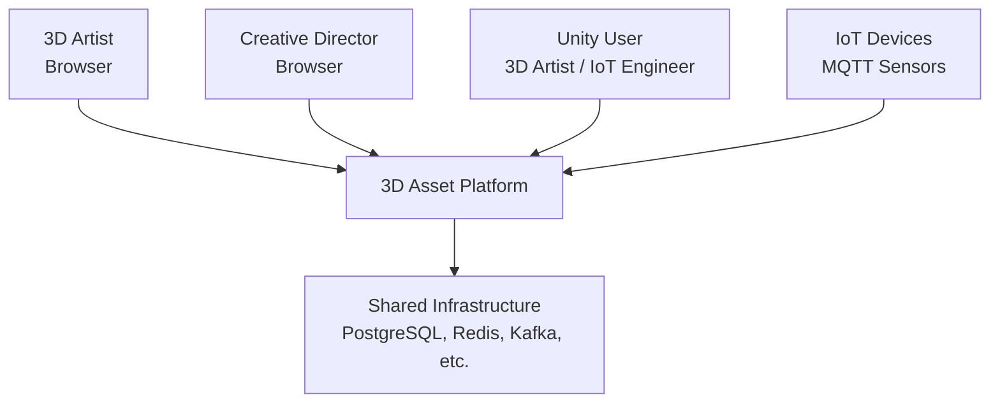

### Level 2: Container Diagram

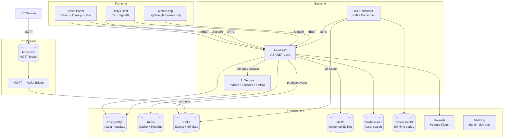

### Level 3: Component Diagram (Asset API — Hexagonal)

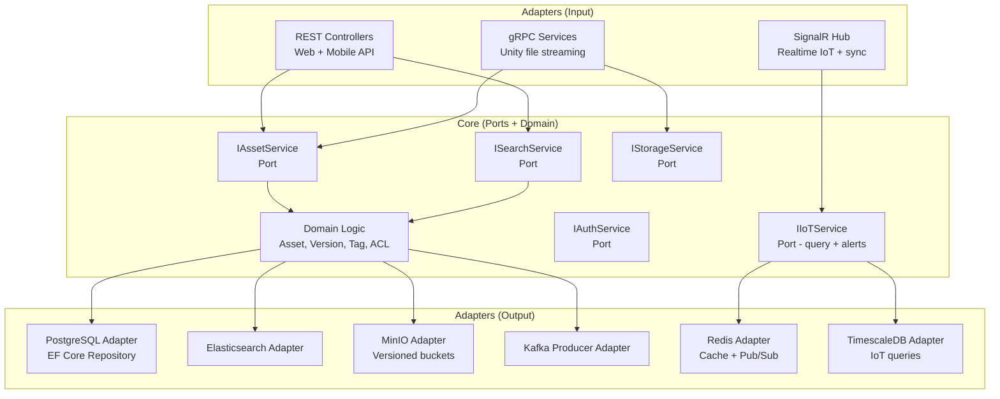

### Level 3: Component Diagram (IoT Pipeline)

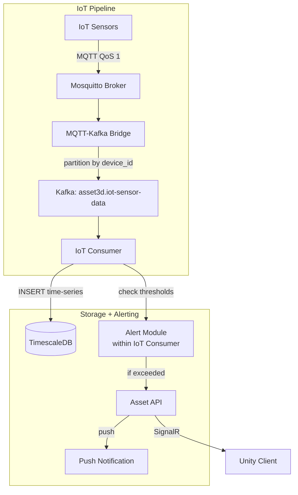

### Level 3: Component Diagram (Asset Portal — React + Three.js)

```mermaid
graph TD
  subgraph "Asset Portal (React + Three.js + Vite)"
    ROUTER_P[React Router<br/>Pages + Auth Guard]
    STORE_P[Redux Toolkit (RTK)<br/>assets, search, ui, auth]
    VIEWER[3D Viewer Module<br/>React Three Fiber + Drei]
    SEARCH[Search Module<br/>Elasticsearch autocomplete]
    UPLOAD[Upload Module<br/>gRPC-Web via Envoy + progress]
    FILTER[Filter Sidebar<br/>Faceted filters]
    TAG_EDITOR[Tag Editor<br/>Add/remove + AI suggestions]
    VERSION[Version Manager<br/>Timeline + side-by-side compare]
    API_P[API Client<br/>REST (real / mock switching)]
    I18N_P[i18n<br/>react-i18next]
  end

  ROUTER_P --> STORE_P
  ROUTER_P --> VIEWER
  ROUTER_P --> SEARCH
  ROUTER_P --> I18N_P
  STORE_P --> API_P
  API_P -->|REST| ASSET_API[Asset API]
  UPLOAD -->|gRPC-Web| ASSET_API
  SEARCH -->|autocomplete| API_P
  SEARCH --> STORE_P
  FILTER --> STORE_P
  TAG_EDITOR --> API_P
  VIEWER -->|presigned URL| API_P
  VERSION --> VIEWER
  VERSION --> STORE_P
```

#### Asset Portal — Key Modules

| Module | Responsibility | Key Libraries |
|--------|---------------|---------------|
| Router | Page routing, JWT auth guard | React Router v6 |
| Store | Global state (assets, search results, filters, auth) | Redux Toolkit (RTK) |
| 3D Viewer | GLB rendering, orbit controls, material inspection | React Three Fiber, @react-three/drei |
| Search | Elasticsearch autocomplete, debounced input, result ranking | Custom + Axios |
| Upload | gRPC-Web chunked upload, progress bar, resume | gRPC-Web via Envoy proxy |
| Filter Sidebar | Faceted filters (format, brand, date, tags) | Custom components |
| Tag Editor | Add/remove tags, AI auto-tag suggestions (dashed border) | Custom |
| Version Manager | Version timeline, side-by-side 3D compare (synced orbit) | Custom + React Three Fiber |
| API Client | REST calls, real/mock switching by env | Axios + API Layer pattern |
| i18n | Multi-language (en, zh-TW) | react-i18next |

#### Asset Portal — Route Structure

| Route | Page | Auth |
|-------|------|------|
| `/auth` | Login (JWT + API Key) | Public |
| `/` | Asset Library (grid + filter sidebar) | JWT |
| `/asset/:id` | Asset Detail (3D viewer + metadata + versions) | JWT |
| `/asset/:id/compare` | Version Compare (side-by-side 3D) | JWT |
| `/upload` | Upload (drag-and-drop + metadata form) | JWT |
| `/search` | Search Results (faceted) | JWT |
| `/iot` | IoT Dashboard (time-series charts) | JWT |
| `/admin/brand` | Brand Settings (ACL editor) | JWT (brand owner) |
| `/settings` | Account (profile, API keys) | JWT |

### Level 3: Component Diagram (Unity Client — C#)

```mermaid
graph TD
  subgraph "Unity Client (C# + Unity 2022 LTS)"
    SCENE[Scene Manager<br/>Load/switch 3D scenes]
    ASSET_BROWSER[Asset Browser<br/>Grid view + search]
    VIEWPORT[3D Viewport<br/>Camera controls (WASD + mouse)]
    IOT_OVERLAY[IoT Overlay<br/>3D billboard markers]
    SIGNALR_C[SignalR Client<br/>Realtime sensor updates]
    GRPC_C[gRPC Client<br/>File upload/download]
    INSPECTOR[Asset Inspector<br/>Metadata + versions + download]
    AUTH_C[Auth Module<br/>API Key via Keychain/Keystore]
    CACHE[Local Cache<br/>Asset metadata + last sensor values]
    ALERT[Alert Handler<br/>Visual + audio alerts]
  end

  SCENE --> VIEWPORT
  VIEWPORT --> IOT_OVERLAY
  SIGNALR_C -->|realtime data| IOT_OVERLAY
  SIGNALR_C -->|realtime data| CACHE
  SIGNALR_C -->|threshold check| ALERT
  SIGNALR_C -->|SignalR| ASSET_API[Asset API]
  GRPC_C -->|gRPC| ASSET_API
  GRPC_C --> CACHE
  CACHE -->|read| IOT_OVERLAY
  ASSET_BROWSER --> GRPC_C
  INSPECTOR --> GRPC_C
  AUTH_C --> GRPC_C
  AUTH_C --> SIGNALR_C
```

#### Unity Client — Key Modules

| Module | Responsibility | Key Tech |
|--------|---------------|----------|
| Scene Manager | Load factory floor models, switch between scenes | Unity SceneManager |
| Asset Browser | Browse and search 3D assets (in-Unity) | Unity UI Toolkit |
| 3D Viewport | Camera movement (WASD), orbit, zoom | Cinemachine |
| IoT Overlay | 3D billboard markers on model coordinates, color-coded | Custom shader + Billboard |
| SignalR Client | Realtime sensor data subscription | Microsoft.AspNetCore.SignalR.Client |
| gRPC Client | Upload/download 3D assets (chunked stream) | Grpc.Net.Client |
| Asset Inspector | View metadata, versions, trigger download | Unity UI Toolkit |
| Auth Module | Store + send API Key for M2M auth | iOS Keychain / Android Keystore (via Unity plugin) |
| Local Cache | Cache asset metadata + last known sensor values | Unity JsonUtility + local file |
| Alert Handler | Red flash border + sound when threshold exceeded | Custom UI + AudioSource |

#### Unity Client — Scene Structure

| Scene | Content | When Loaded |
|-------|---------|-------------|
| Login | API Key input, connection test | App launch |
| Asset Browser | Grid of 3D assets, search bar | After login |
| 3D Viewport | Factory floor model + IoT overlays | When user opens a scene |
| Asset Inspector | Side panel overlay on 3D Viewport | When user clicks an asset |

### Level 3: Component Diagram (Mobile App — Lightweight)

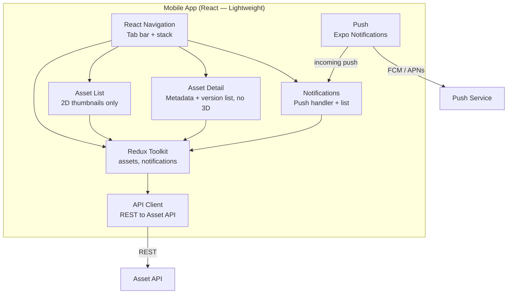

#### Mobile App — Key Modules

| Module | Responsibility | Key Libraries |
|--------|---------------|---------------|
| Navigation | Tab bar (Assets, Search, Notifications, Profile) | React Navigation v6 |
| Store | Asset list, notification state | Redux Toolkit |
| Asset List | 2D thumbnail grid (no 3D preview) | FlatList |
| Asset Detail | Metadata, version list, download link (no 3D viewer) | Custom screen |
| Notifications | Push notification handler + notification list | Expo Notifications |
| API Client | REST calls to Asset API | Axios |

> Mobile is **not** a primary platform. No 3D preview, no upload. Browse + notifications only.

#### Mobile App — Navigation Structure

| Tab | Screens | Auth |
|-----|---------|------|
| Assets | Asset List → Asset Detail | JWT |
| Search | Search → Asset Detail | JWT |
| Notifications | Notification List | JWT |
| Profile | Account, API Keys | JWT |

## Component Overview

| Component | Tech | System | Responsibility |
|-----------|------|--------|---------------|
| Asset Portal | React + Three.js + Vite + Redux Toolkit | Frontend | Asset browse, search, 3D preview, upload |
| Unity Client | C# + Unity 2022 LTS + SignalR | Frontend | 3D editing, IoT overlay, advanced preview |
| Mobile App | React (lightweight) | Frontend | Browse + notifications only |
| Asset API | ASP.NET Core (C#) | Backend | REST + gRPC + SignalR, core business logic |
| AI Service | Python + FastAPI + ONNX Runtime | Worker | Asset auto-tagging, image classification |
| IoT Consumer | Kafka Consumer (C#) | Worker | Ingest IoT data → TimescaleDB, alerting |
| MQTT-Kafka Bridge | Mosquitto + Kafka Connect | Pipeline | Bridge MQTT messages to Kafka topic |

## Data Flow (Sequence Diagrams)

### Flow 1: Upload 3D Asset (gRPC Streaming)

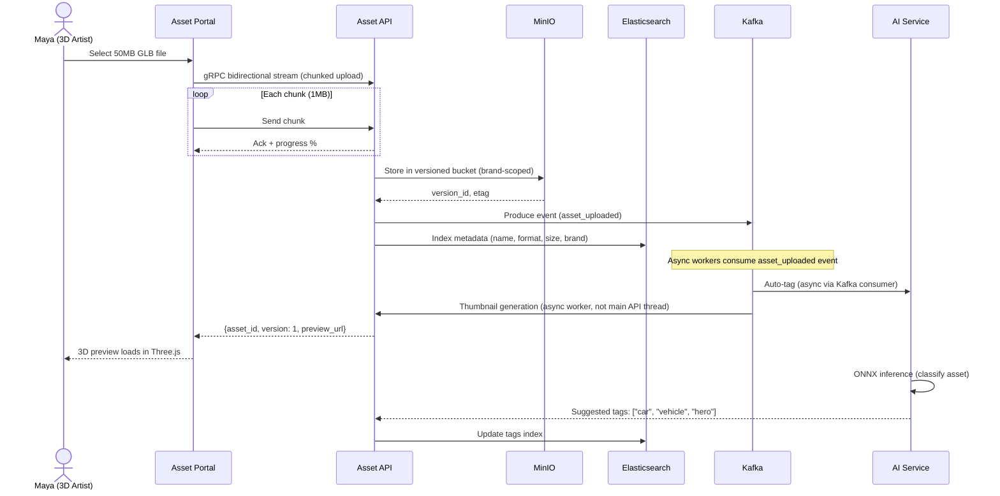

### Flow 2: Search Assets (Elasticsearch)

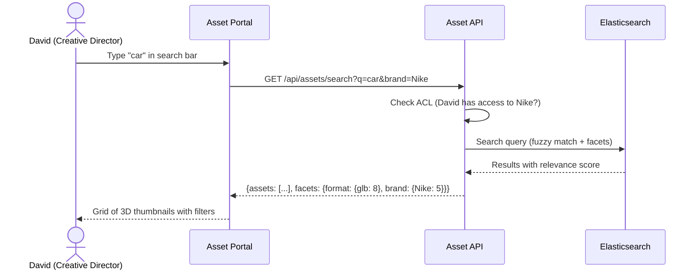

### Flow 3: IoT Digital Twin (MQTT → Kafka → Unity)

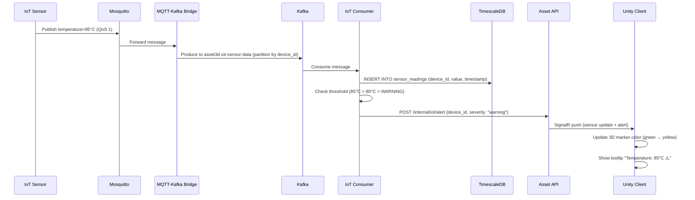

### Flow 4: Version Compare

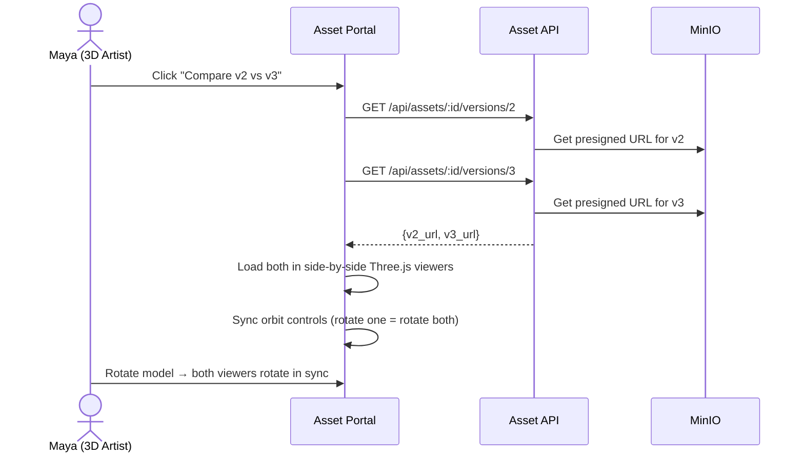

## API Contracts (High-level)

| Endpoint | Protocol | System | Direction | Description |
|----------|----------|--------|-----------|-------------|
| `GET /api/assets` | REST | Asset API | Client → Server | List assets (paginated, filtered) |
| `GET /api/assets/:id` | REST | Asset API | Client → Server | Asset detail + metadata |
| `GET /api/assets/search?q=` | REST | Asset API | Client → Server | Elasticsearch search |
| `GET /api/assets/:id/versions/:v` | REST | Asset API | Client → Server | Get presigned URL for specific version |
| `AssetService.Upload` | gRPC stream | Asset API | Client → Server | Chunked bidirectional file upload |
| `AssetService.Download` | gRPC stream | Asset API | Server → Client | Server-side streaming download |
| `POST /api/assets/:id/tags` | REST | Asset API | Client → Server | Add/remove tags |
| `POST /api/assets/:id/share` | REST | Asset API | Client → Server | Generate share link with ACL |
| SignalR `/hub/iot` | SignalR | Asset API | Bidirectional | Realtime IoT sensor updates |
| SignalR `/hub/assets` | SignalR | Asset API | Bidirectional | Asset change notifications |
| `POST /internal/iot/alert` | REST | Asset API | IoT Consumer → API | Internal alert from consumer |
| `POST /internal/ai/tags` | REST | Asset API | AI Service → API | AI-suggested tags callback |
| `asset3d.iot-sensor-data` | Kafka | — | MQTT Bridge → Consumer | IoT sensor readings |
| `asset3d.asset-events` | Kafka | — | API → Analytics | Asset lifecycle events |
| `analytics.asset3d-events` | Kafka | — | API → Analytics | User behavior events |

## Database Schema (High-level)

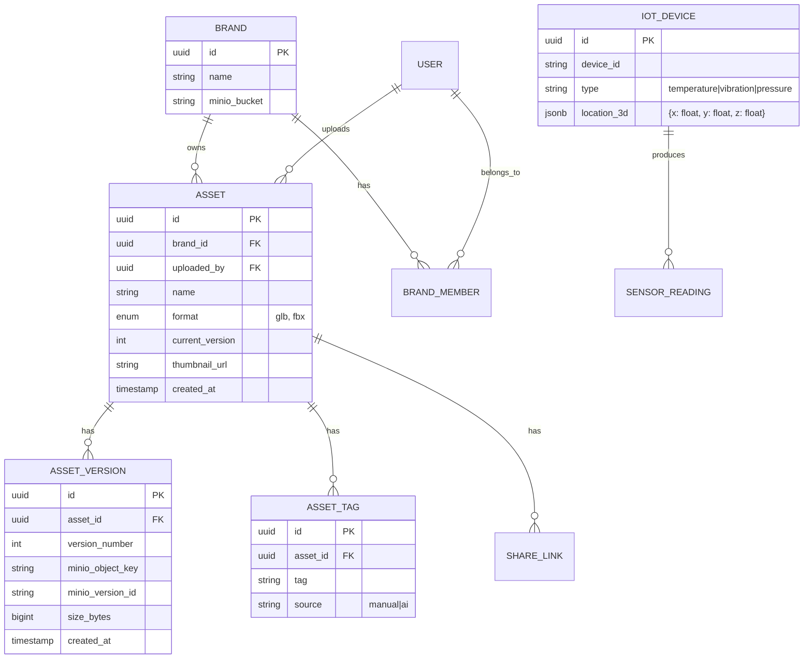

> `SENSOR_READING` lives in **TimescaleDB** (separate instance), not main PostgreSQL:

```sql
-- TimescaleDB hypertable
CREATE TABLE sensor_readings (
  time        TIMESTAMPTZ NOT NULL,
  device_id   TEXT        NOT NULL,
  value       DOUBLE PRECISION,
  unit        TEXT
);
SELECT create_hypertable('sensor_readings', 'time');
```

## Deployment Diagram

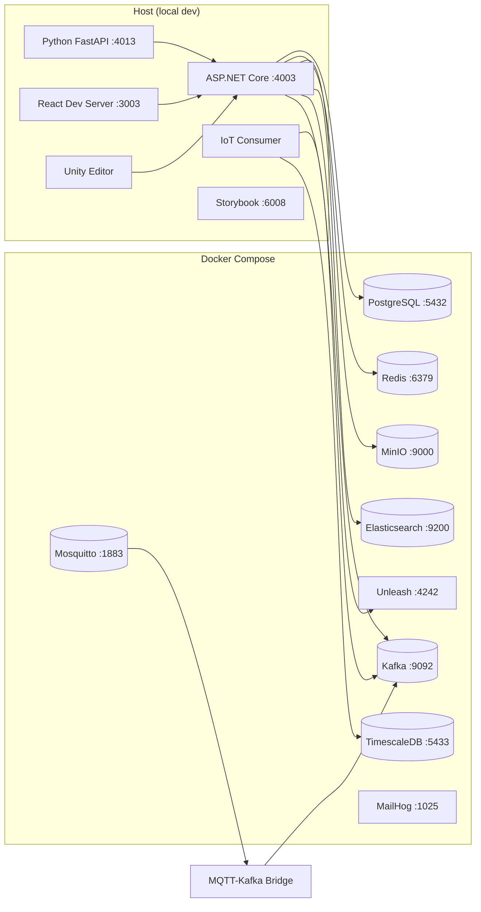

## Security Architecture

| Layer | Measure |
|-------|---------|
| Auth (Web) | JWT with RS256. Login via email/password. |
| Auth (Unity/IoT) | API Key for M2M authentication. Per-device keys for IoT. |
| Authorization | Resource-level ACL: Owner / Editor / Viewer per asset + brand. |
| Multi-tenancy | Bucket-per-brand in MinIO. `brand_id` filter on all queries. |
| Data in transit | HTTPS (REST), gRPCs (gRPC + TLS), WSS (SignalR). |
| Data at rest | MinIO SSE-S3 encryption. |
| File validation | Validate file format (GLB/FBX magic bytes) before storing. Reject malicious files. |
| Input validation | FluentValidation at API boundary. Sanitize search queries for Elasticsearch injection. |
| Rate limiting | Per-user Redis sliding window. Upload rate: 50/hour. API: 200/min. |
| CORS | Whitelist `localhost:3003` (web). Unity uses gRPC (no CORS). |
| Dependencies | SAST (Semgrep) + SCA (Trivy) in CI. |

## Infrastructure Dependencies

| Service | Purpose | Port |
|---------|---------|------|
| PostgreSQL | Asset metadata, users, brands, ACL | 5432 |
| TimescaleDB | IoT sensor time-series data | 5433 |
| Redis | Cache, Pub/Sub (SignalR scale-out) | 6379 |
| Kafka | Event streaming (IoT bridge + asset events + analytics) | 9092 |
| MinIO | 3D file storage (versioned, brand-scoped buckets) | 9000 |
| Elasticsearch | Full-text asset search (name, tags, description) | 9200 |
| Mosquitto | MQTT broker for IoT sensor ingestion | 1883 |
| Unleash | Feature flags | 4242 |
| MailHog | Email notifications (local) | 1025 |

## Scalability Considerations

| Concern | Current (local) | Production Strategy |
|---------|-----------------|-------------------|
| File storage | Single MinIO | S3 with CloudFront CDN for presigned URLs |
| Search | Single Elasticsearch | ES cluster with replicas |
| IoT ingestion | Single Kafka broker | Multi-broker Kafka, multiple consumer instances |
| Time-series | Single TimescaleDB | TimescaleDB multi-node or Amazon Timestream |
| 3D preview | Client-side Three.js | CDN for model files, progressive LOD |
| gRPC | Single ASP.NET Core | Horizontal scaling with load balancer (gRPC supports it) |
| SignalR | Single instance | Redis backplane for SignalR scale-out |
| AI inference | Single ONNX model | Multiple FastAPI workers, GPU if available |

## ADRs Created

- [ADR-0001: Why gRPC over REST for large file transfer](adrs/ADR-0001-why-grpc-for-file-transfer.md)
- [ADR-0002: Why Three.js over Unity WebGL for browser preview](adrs/ADR-0002-why-threejs-over-unity-web.md)
- [ADR-0003: Why MQTT → Kafka bridge for IoT data](adrs/ADR-0003-why-mqtt-kafka-bridge.md)
- [ADR-0004: Why Elasticsearch over PostgreSQL for asset search](adrs/ADR-0004-why-elasticsearch-over-pg-search.md)
- [ADR-0005: Why TimescaleDB for IoT time-series data](adrs/ADR-0005-why-timescaledb-for-iot.md)
- [ADR-0006: Why Hexagonal Architecture for 3D Asset backend](adrs/ADR-0006-why-hexagonal.md)
