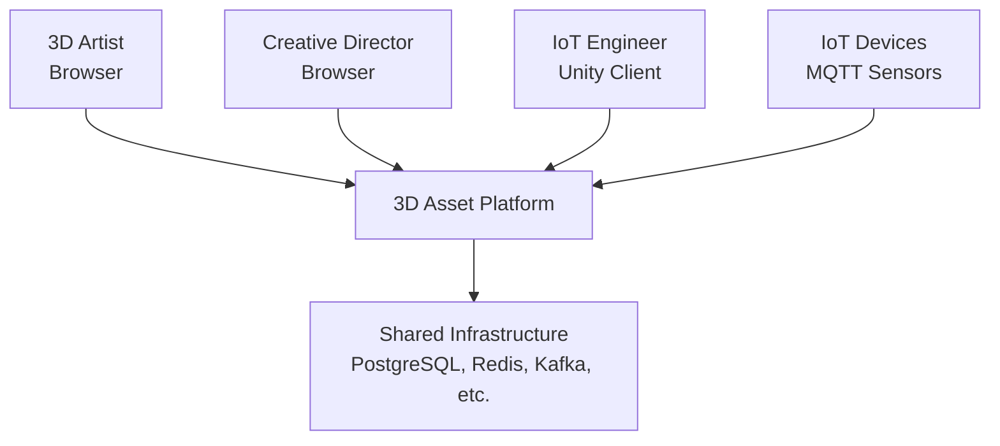
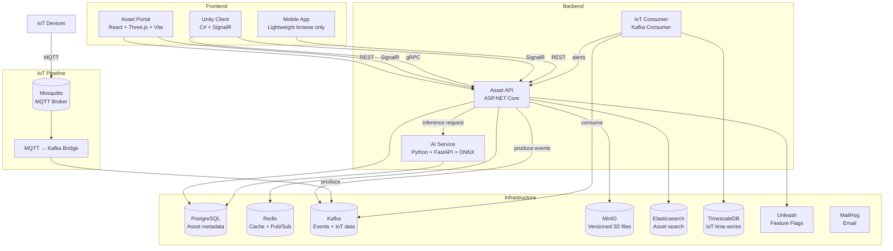
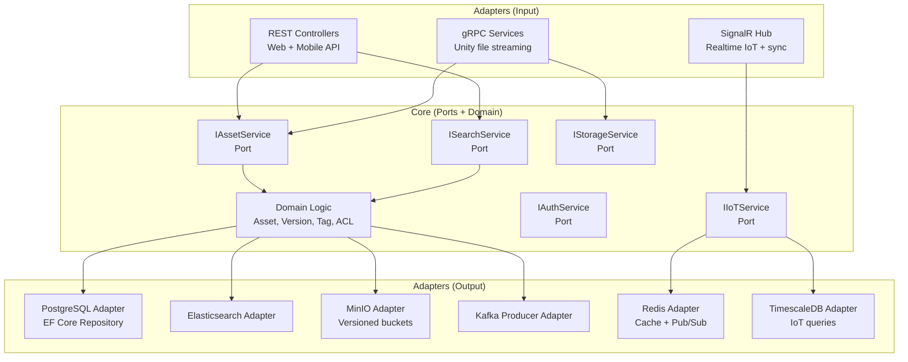
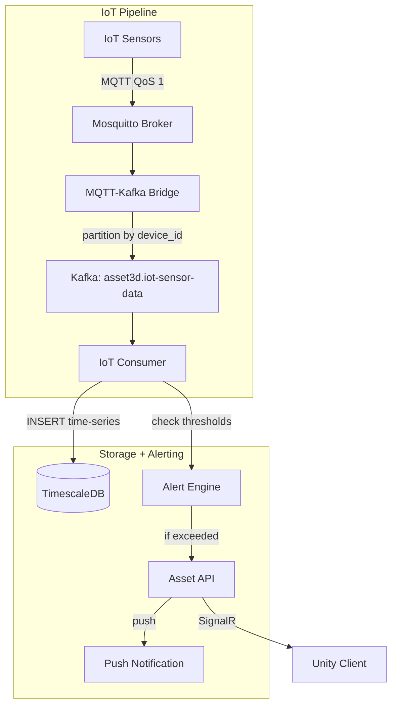
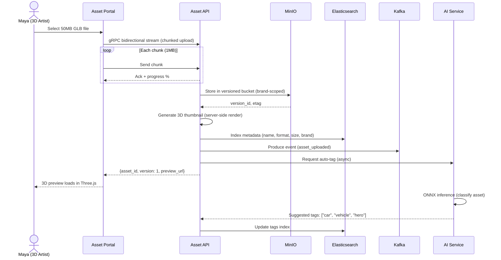
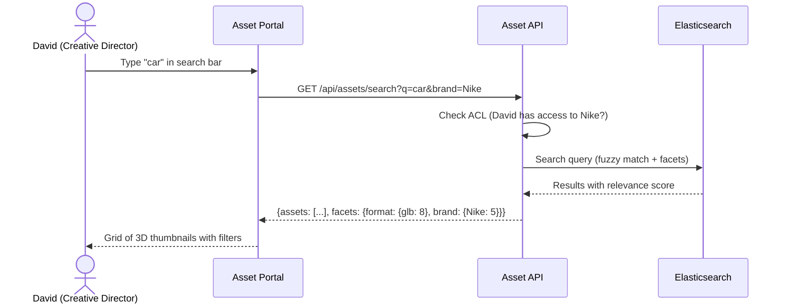
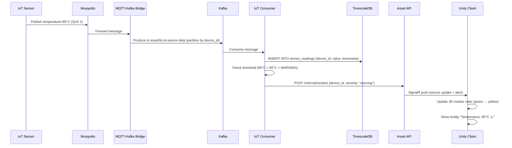
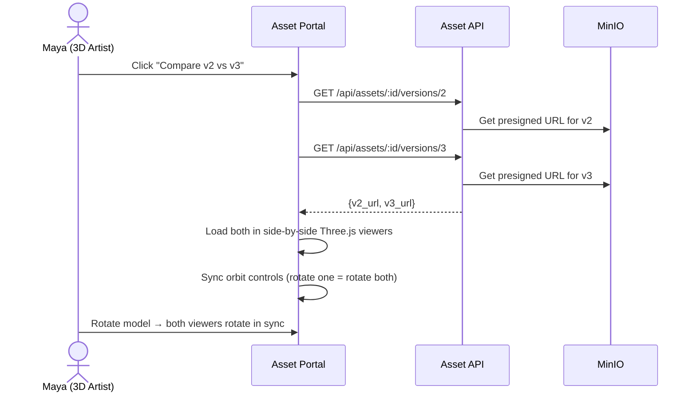
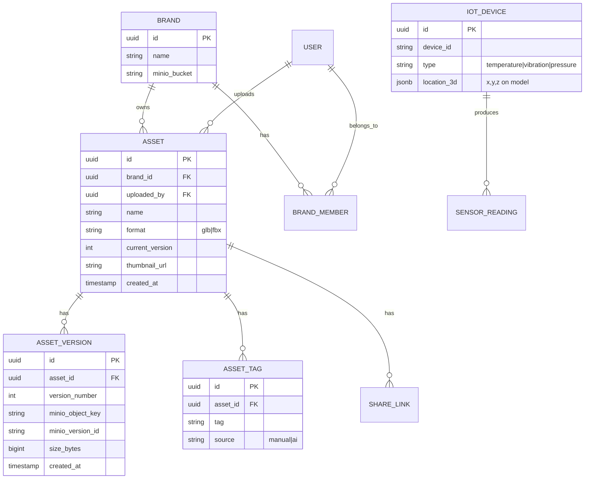
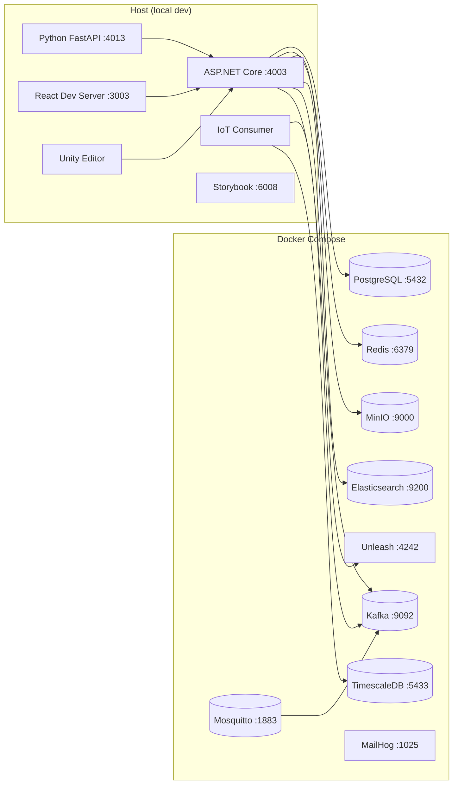

# System Architecture: 3D Asset Collaboration

## Architecture Pattern

**Hexagonal Architecture (Ports & Adapters) + EDA** — ASP.NET Core backend with core logic isolated from I/O adapters (gRPC, REST, MQTT, SignalR, MinIO, Elasticsearch). IoT data flows through MQTT → Kafka → TimescaleDB. Python AI service for asset auto-tagging.

## C4 Model

### Level 1: System Context



### Level 2: Container Diagram



### Level 3: Component Diagram (Asset API — Hexagonal)



### Level 3: Component Diagram (IoT Pipeline)



## Component Overview

| Component | Tech | System | Responsibility |
|-----------|------|--------|---------------|
| Asset Portal | React + Three.js + Vite + Redux Toolkit | Frontend | Asset browse, search, 3D preview, upload |
| Unity Client | C# + Unity 2022 LTS + SignalR | Frontend | 3D editing, IoT overlay, advanced preview |
| Mobile App | React (lightweight) | Frontend | Browse + notifications only |
| Asset API | ASP.NET Core (C#) | Backend | REST + gRPC + SignalR, core business logic |
| AI Service | Python + FastAPI + ONNX Runtime | Worker | Asset auto-tagging, image classification |
| IoT Consumer | Kafka Consumer (C#) | Worker | Ingest IoT data → TimescaleDB, alerting |
| MQTT-Kafka Bridge | Mosquitto + Kafka Connect | Pipeline | Bridge MQTT messages to Kafka topic |

## Data Flow (Sequence Diagrams)

### Flow 1: Upload 3D Asset (gRPC Streaming)



### Flow 2: Search Assets (Elasticsearch)



### Flow 3: IoT Digital Twin (MQTT → Kafka → Unity)



### Flow 4: Version Compare



## API Contracts (High-level)

| Endpoint | Protocol | System | Direction | Description |
|----------|----------|--------|-----------|-------------|
| `GET /api/assets` | REST | Asset API | Client → Server | List assets (paginated, filtered) |
| `GET /api/assets/:id` | REST | Asset API | Client → Server | Asset detail + metadata |
| `GET /api/assets/search?q=` | REST | Asset API | Client → Server | Elasticsearch search |
| `GET /api/assets/:id/versions/:v` | REST | Asset API | Client → Server | Get presigned URL for specific version |
| `AssetService.Upload` | gRPC stream | Asset API | Client → Server | Chunked bidirectional file upload |
| `AssetService.Download` | gRPC stream | Asset API | Server → Client | Server-side streaming download |
| `POST /api/assets/:id/tags` | REST | Asset API | Client → Server | Add/remove tags |
| `POST /api/assets/:id/share` | REST | Asset API | Client → Server | Generate share link with ACL |
| SignalR `/hub/iot` | SignalR | Asset API | Bidirectional | Realtime IoT sensor updates |
| SignalR `/hub/assets` | SignalR | Asset API | Bidirectional | Asset change notifications |
| `POST /internal/iot/alert` | REST | Asset API | IoT Consumer → API | Internal alert from consumer |
| `POST /internal/ai/tags` | REST | Asset API | AI Service → API | AI-suggested tags callback |
| `asset3d.iot-sensor-data` | Kafka | — | MQTT Bridge → Consumer | IoT sensor readings |
| `asset3d.asset-events` | Kafka | — | API → Analytics | Asset lifecycle events |
| `analytics.asset3d-events` | Kafka | — | API → Analytics | User behavior events |

## Database Schema (High-level)



> `SENSOR_READING` lives in **TimescaleDB** (separate instance), not main PostgreSQL:

```sql
-- TimescaleDB hypertable
CREATE TABLE sensor_readings (
  time        TIMESTAMPTZ NOT NULL,
  device_id   TEXT        NOT NULL,
  value       DOUBLE PRECISION,
  unit        TEXT
);
SELECT create_hypertable('sensor_readings', 'time');
```

## Deployment Diagram



## Security Architecture

| Layer | Measure |
|-------|---------|
| Auth (Web) | JWT with RS256. Login via email/password. |
| Auth (Unity/IoT) | API Key for M2M authentication. Per-device keys for IoT. |
| Authorization | Resource-level ACL: Owner / Editor / Viewer per asset + brand. |
| Multi-tenancy | Bucket-per-brand in MinIO. `brand_id` filter on all queries. |
| Data in transit | HTTPS (REST), gRPCs (gRPC + TLS), WSS (SignalR). |
| Data at rest | MinIO SSE-S3 encryption. |
| File validation | Validate file format (GLB/FBX magic bytes) before storing. Reject malicious files. |
| Input validation | FluentValidation at API boundary. Sanitize search queries for Elasticsearch injection. |
| Rate limiting | Per-user Redis sliding window. Upload rate: 50/hour. API: 200/min. |
| CORS | Whitelist `localhost:3003` (web). Unity uses gRPC (no CORS). |
| Dependencies | SAST (Semgrep) + SCA (Trivy) in CI. |

## Infrastructure Dependencies

| Service | Purpose | Port |
|---------|---------|------|
| PostgreSQL | Asset metadata, users, brands, ACL | 5432 |
| TimescaleDB | IoT sensor time-series data | 5433 |
| Redis | Cache, Pub/Sub (SignalR scale-out) | 6379 |
| Kafka | Event streaming (IoT bridge + asset events + analytics) | 9092 |
| MinIO | 3D file storage (versioned, brand-scoped buckets) | 9000 |
| Elasticsearch | Full-text asset search (name, tags, description) | 9200 |
| Mosquitto | MQTT broker for IoT sensor ingestion | 1883 |
| Unleash | Feature flags | 4242 |
| MailHog | Email notifications (local) | 1025 |

## Scalability Considerations

| Concern | Current (local) | Production Strategy |
|---------|-----------------|-------------------|
| File storage | Single MinIO | S3 with CloudFront CDN for presigned URLs |
| Search | Single Elasticsearch | ES cluster with replicas |
| IoT ingestion | Single Kafka broker | Multi-broker Kafka, multiple consumer instances |
| Time-series | Single TimescaleDB | TimescaleDB multi-node or Amazon Timestream |
| 3D preview | Client-side Three.js | CDN for model files, progressive LOD |
| gRPC | Single ASP.NET Core | Horizontal scaling with load balancer (gRPC supports it) |
| SignalR | Single instance | Redis backplane for SignalR scale-out |
| AI inference | Single ONNX model | Multiple FastAPI workers, GPU if available |

## ADRs Created

- [ADR-0001: Why gRPC over REST for large file transfer](adrs/ADR-0001-why-grpc-for-file-transfer.md)
- [ADR-0002: Why Three.js over Unity WebGL for browser preview](adrs/ADR-0002-why-threejs-over-unity-web.md)
- [ADR-0003: Why MQTT → Kafka bridge for IoT data](adrs/ADR-0003-why-mqtt-kafka-bridge.md)
- [ADR-0004: Why Elasticsearch over PostgreSQL for asset search](adrs/ADR-0004-why-elasticsearch-over-pg-search.md)
- [ADR-0005: Why TimescaleDB for IoT time-series data](adrs/ADR-0005-why-timescaledb-for-iot.md)
- [ADR-0006: Why Hexagonal Architecture for 3D Asset backend](adrs/ADR-0006-why-hexagonal.md)
