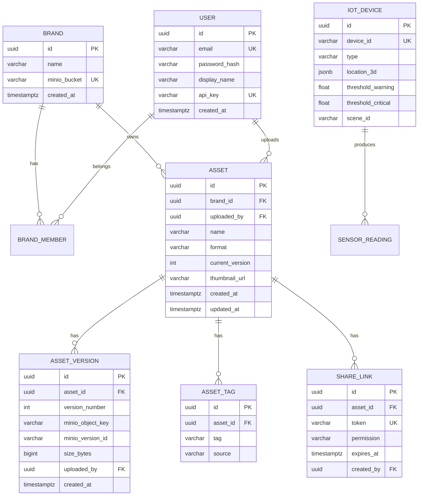
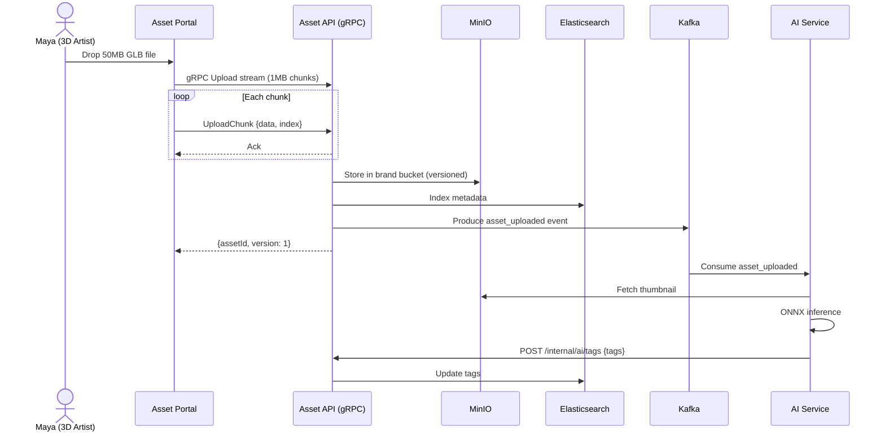
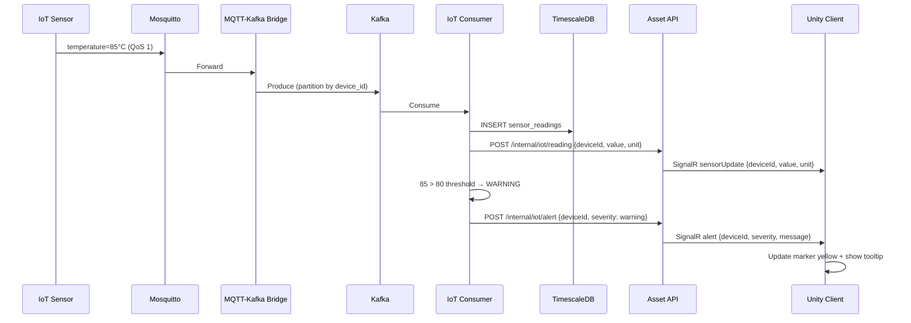

# Technical Design: 3D Asset Collaboration

## Table of Contents

- [System: Asset API (ASP.NET Core — Hexagonal)](#system-asset-api-aspnet-core-hexagonal)
  - [API Specification — REST](#api-specification-rest)
  - [API Specification — gRPC](#api-specification-grpc)
  - [API Specification — SignalR Hubs](#api-specification-signalr-hubs)
  - [Database Tables](#database-tables)
  - [Indexes](#indexes)
- [System: AI Service (Python + FastAPI + ONNX)](#system-ai-service-python-fastapi-onnx)
  - [API Specification](#api-specification)
  - [Classification Pipeline](#classification-pipeline)
  - [Model](#model)
- [System: IoT Consumer (Kafka Consumer)](#system-iot-consumer-kafka-consumer)
  - [Consumed Topics](#consumed-topics)
  - [Threshold Alerting Logic](#threshold-alerting-logic)
  - [TimescaleDB Write](#timescaledb-write)
- [System: Asset Portal (React + Three.js)](#system-asset-portal-react-threejs)
  - [State Management (Redux Toolkit)](#state-management-redux-toolkit)
  - [Route Definitions](#route-definitions)
  - [3D Viewer Implementation](#3d-viewer-implementation)
  - [gRPC-Web Upload](#grpc-web-upload)
  - [Elasticsearch Search](#elasticsearch-search)
  - [API Client (Real vs Mock)](#api-client-real-vs-mock)
- [System: Unity Client (C#)](#system-unity-client-c)
  - [Architecture — MVC with Service Layer](#architecture-mvc-with-service-layer)
  - [Key Services](#key-services)
  - [IoT Overlay Implementation](#iot-overlay-implementation)
  - [SignalR Connection](#signalr-connection)
- [System: Mobile App (React — Lightweight)](#system-mobile-app-react-lightweight)
  - [State Management (Redux Toolkit)](#state-management-redux-toolkit)
  - [Navigation (React Navigation)](#navigation-react-navigation)
  - [Push Notifications](#push-notifications)
- [Database Schema (Full)](#database-schema-full)
  - [ER Diagram](#er-diagram)
  - [Migrations](#migrations)
  - [Data Migration Strategy](#data-migration-strategy)
- [Sequence Diagrams (Key Flows)](#sequence-diagrams-key-flows)
  - [Flow: gRPC Upload with Auto-tag](#flow-grpc-upload-with-auto-tag)
  - [Flow: IoT Realtime → Unity](#flow-iot-realtime-unity)
- [Authentication & Authorization](#authentication-authorization)
  - [Token Types](#token-types)
- [Error Handling](#error-handling)
- [Caching Strategy](#caching-strategy)
- [Background Jobs / Workers](#background-jobs-workers)
- [Third-party Integrations](#third-party-integrations)
- [ADRs Created](#adrs-created)

---


## System: Asset API (ASP.NET Core — Hexagonal)

### API Specification — REST

| Method | Path | Request | Response | Auth |
|--------|------|---------|----------|------|
| GET | `/api/assets` | `?page&size&brand&format&tags` | `{assets[], total, page}` | JWT |
| GET | `/api/assets/:id` | — | `{asset, versions[], tags[]}` | JWT (ACL checked) |
| GET | `/api/assets/:id/versions/:v` | — | `{presignedUrl, version}` | JWT |
| POST | `/api/assets/:id/tags` | `{tags: ["car","hero"]}` | `{asset}` | JWT (editor+) |
| DELETE | `/api/assets/:id/tags/:tag` | — | `204` | JWT (editor+) |
| POST | `/api/assets/:id/share` | `{permission, expiresIn}` | `{shareUrl, token}` | JWT (owner) |
| GET | `/api/assets/search` | `?q&brand&format&dateFrom&dateTo` | `{assets[], facets, total}` | JWT (ACL filtered) |
| POST | `/api/attachments/upload` | multipart `{file, brandId}` | `{attachmentId, url}` | JWT |
| GET | `/api/iot/sensors` | `?deviceIds` | `{sensors[]}` | JWT / API Key |
| GET | `/api/iot/sensors/:id/readings` | `?from&to&bucket` | `{readings[], avg, min, max}` | JWT / API Key |
| POST | `/internal/iot/alert` | `{deviceId, value, severity}` | `202` | Internal only |
| POST | `/internal/ai/tags` | `{assetId, tags[]}` | `202` | Internal only |
| GET | `/api/brands` | — | `{brands[]}` | JWT |
| GET | `/api/brands/:id/members` | — | `{members[]}` | JWT (brand member) |
| POST | `/api/brands/:id/members` | `{userId, role}` | `{member}` | JWT (brand owner) |
| GET | `/api/user/me` | — | `{user, brands[]}` | JWT |
| GET | `/api/config/mobile` | — | `{theme, features, copy}` | JWT / API Key |

### API Specification — gRPC

```protobuf
syntax = "proto3";
package asset.v1;

service AssetService {
  // Chunked bidirectional upload
  rpc Upload(stream UploadChunk) returns (UploadResponse);
  // Server-side streaming download
  rpc Download(DownloadRequest) returns (stream DownloadChunk);
}

message UploadChunk {
  string asset_id = 1;      // empty for new asset
  string brand_id = 2;
  string filename = 3;
  bytes data = 4;            // 1MB chunks
  int64 total_size = 5;
  int32 chunk_index = 6;
}

message UploadResponse {
  string asset_id = 1;
  int32 version = 2;
  string preview_url = 3;
}

message DownloadRequest {
  string asset_id = 1;
  int32 version = 2;        // 0 = latest
}

message DownloadChunk {
  bytes data = 1;
  int64 total_size = 2;
  int32 chunk_index = 3;
}
```

### API Specification — SignalR Hubs

| Hub | Event | Direction | Payload | Description |
|-----|-------|-----------|---------|-------------|
| `/hub/iot` | `sensorUpdate` | Server → Client | `{deviceId, value, unit, timestamp}` | Live sensor reading |
| `/hub/iot` | `alert` | Server → Client | `{deviceId, severity, value, message}` | Threshold alert |
| `/hub/assets` | `assetUploaded` | Server → Client | `{assetId, name, brandId}` | New asset notification |
| `/hub/assets` | `versionCreated` | Server → Client | `{assetId, version}` | New version notification |

### Database Tables

#### Table: `brands`

| Column | Type | Constraints | Description |
|--------|------|------------|-------------|
| id | uuid | PK | |
| name | varchar(255) | NOT NULL | Brand name |
| minio_bucket | varchar(255) | UNIQUE, NOT NULL | Isolated MinIO bucket |
| created_at | timestamptz | DEFAULT now() | |

#### Table: `brand_members`

| Column | Type | Constraints | Description |
|--------|------|------------|-------------|
| id | uuid | PK | |
| brand_id | uuid | FK → brands.id, NOT NULL | |
| user_id | uuid | FK → users.id, NOT NULL | |
| role | varchar(20) | NOT NULL | owner / editor / viewer |
| UNIQUE | (brand_id, user_id) | | |

#### Table: `users`

| Column | Type | Constraints | Description |
|--------|------|------------|-------------|
| id | uuid | PK | |
| email | varchar(255) | UNIQUE, NOT NULL | |
| password_hash | varchar(255) | NOT NULL | bcrypt |
| display_name | varchar(100) | NOT NULL | |
| api_key | varchar(255) | UNIQUE, NULL | For M2M / Unity auth |
| created_at | timestamptz | DEFAULT now() | |

#### Table: `assets`

| Column | Type | Constraints | Description |
|--------|------|------------|-------------|
| id | uuid | PK | |
| brand_id | uuid | FK → brands.id, NOT NULL | |
| uploaded_by | uuid | FK → users.id, NOT NULL | |
| name | varchar(255) | NOT NULL | |
| format | varchar(10) | NOT NULL | glb / fbx |
| current_version | int | DEFAULT 1 | |
| thumbnail_url | varchar(500) | NULL | Auto-generated |
| created_at | timestamptz | DEFAULT now() | |
| updated_at | timestamptz | DEFAULT now() | |

#### Table: `asset_versions`

| Column | Type | Constraints | Description |
|--------|------|------------|-------------|
| id | uuid | PK | |
| asset_id | uuid | FK → assets.id, NOT NULL | |
| version_number | int | NOT NULL | |
| minio_object_key | varchar(500) | NOT NULL | |
| minio_version_id | varchar(255) | NOT NULL | MinIO versioning |
| size_bytes | bigint | NOT NULL | |
| uploaded_by | uuid | FK → users.id | |
| created_at | timestamptz | DEFAULT now() | |
| UNIQUE | (asset_id, version_number) | | |

#### Table: `asset_tags`

| Column | Type | Constraints | Description |
|--------|------|------------|-------------|
| id | uuid | PK | |
| asset_id | uuid | FK → assets.id, NOT NULL | |
| tag | varchar(100) | NOT NULL | |
| source | varchar(10) | DEFAULT 'manual' | manual / ai |
| UNIQUE | (asset_id, tag) | | |

#### Table: `share_links`

| Column | Type | Constraints | Description |
|--------|------|------------|-------------|
| id | uuid | PK | |
| asset_id | uuid | FK → assets.id, NOT NULL | |
| token | varchar(255) | UNIQUE, NOT NULL | |
| permission | varchar(10) | NOT NULL | view / download |
| expires_at | timestamptz | NOT NULL | |
| created_by | uuid | FK → users.id | |

#### Table: `iot_devices`

| Column | Type | Constraints | Description |
|--------|------|------------|-------------|
| id | uuid | PK | |
| device_id | varchar(100) | UNIQUE, NOT NULL | MQTT client ID |
| type | varchar(50) | NOT NULL | temperature / vibration / pressure |
| location_3d | jsonb | NOT NULL | `{"x": 1.0, "y": 2.5, "z": 0.3}` |
| threshold_warning | float | NULL | Yellow alert level |
| threshold_critical | float | NULL | Red alert level |
| scene_id | varchar(100) | NULL | Which Unity scene |

### Indexes

| Table | Columns | Type | Purpose |
|-------|---------|------|---------|
| assets | brand_id, created_at DESC | btree | Brand asset list |
| assets | uploaded_by | btree | My uploads |
| asset_versions | asset_id, version_number | btree unique | Version lookup |
| asset_tags | asset_id | btree | Tags per asset |
| asset_tags | tag | btree | Search by tag |
| share_links | token | btree unique | Share link lookup |
| share_links | expires_at | btree | Cleanup expired links |
| iot_devices | device_id | btree unique | MQTT lookup |

## System: AI Service (Python + FastAPI + ONNX)

### API Specification

| Method | Path | Request | Response | Auth |
|--------|------|---------|----------|------|
| POST | `/api/ai/classify` | `{assetId, imageUrl}` | `{tags[], confidence[]}` | Internal API Key |

### Classification Pipeline

| Step | Input | Output | Tool |
|------|-------|--------|------|
| 1. Fetch thumbnail | `assetId` | Image bytes | MinIO presigned URL |
| 2. Preprocess | Image bytes | Tensor | PIL + numpy |
| 3. Inference | Tensor | Class probabilities | ONNX Runtime |
| 4. Post-process | Probabilities | Top-5 tags with confidence | numpy |
| 5. Callback | Tags | — | POST to Asset API `/internal/ai/tags` |

### Model

| Item | Value |
|------|-------|
| Model | ResNet-50 or EfficientNet-B0 (pretrained on ImageNet) |
| Format | ONNX |
| Input | 224x224 RGB image |
| Output | 1000 class probabilities → mapped to asset-relevant tags |
| Inference time | < 500ms on CPU |

## System: IoT Consumer (Kafka Consumer)

### Consumed Topics

| Topic | Consumer Group | Action |
|-------|---------------|--------|
| `asset3d.iot-sensor-data` | `iot-consumer` | Write to TimescaleDB + check thresholds |
| `asset3d.asset-events` | `asset-event-consumer` | Update Elasticsearch index, trigger thumbnail generation |

### Threshold Alerting Logic

```csharp
// Simplified alert check — device thresholds cached in-memory (refreshed every 5 min)
var device = deviceCache.GetOrRefresh(reading.DeviceId);
if (device.ThresholdCritical != null && reading.Value > device.ThresholdCritical)
{
    await alertService.SendAlert(device, reading, Severity.Critical);
}
else if (device.ThresholdWarning != null && reading.Value > device.ThresholdWarning)
{
    await alertService.SendAlert(device, reading, Severity.Warning);
}
```

### TimescaleDB Write

```sql
INSERT INTO sensor_readings (time, device_id, value, unit)
VALUES ($1, $2, $3, $4);
```

---

## System: Asset Portal (React + Three.js)

### State Management (Redux Toolkit)

| Slice | State | Actions | Selectors |
|-------|-------|---------|-----------|
| `authSlice` | `user, token, apiKey` | `login(), logout(), setApiKey()` | `isAuthenticated` |
| `assetSlice` | `assets[], current, versions[], loading` | `fetchAssets(), fetchDetail(), uploadVersion()` | `currentAsset, sortedVersions` |
| `searchSlice` | `query, results[], facets, loading` | `search(), setFilters(), clearFilters()` | `filteredResults` |
| `iotSlice` | `sensors[], readings[], alerts[]` | `fetchSensors(), fetchReadings()` | `activeSensors, criticalAlerts` |
| `uiSlice` | `sidebarOpen, locale, theme` | `toggleSidebar(), setLocale()` | — |

### Route Definitions

| Route | Component | Guard | Lazy Load |
|-------|-----------|-------|-----------|
| `/auth` | `AuthPage` | Public | No |
| `/` | `AssetLibraryPage` | `requireAuth` | Yes |
| `/asset/:id` | `AssetDetailPage` | `requireAuth` (ACL) | Yes |
| `/asset/:id/compare` | `VersionComparePage` | `requireAuth` | Yes |
| `/upload` | `UploadPage` | `requireAuth` (editor+) | Yes |
| `/search` | `SearchResultsPage` | `requireAuth` | Yes |
| `/iot` | `IoTDashboardPage` | `requireAuth` | Yes |
| `/admin/brand` | `BrandSettingsPage` | `requireAuth` (brand owner) | Yes |
| `/settings` | `AccountPage` | `requireAuth` | Yes |

### 3D Viewer Implementation

```typescript
// src/components/ThreeViewer.tsx
import { Canvas } from '@react-three/fiber'
import { OrbitControls, useGLTF, Environment } from '@react-three/drei'

function AssetModel({ url }: { url: string }) {
  const { scene } = useGLTF(url)
  return <primitive object={scene} />
}

export function ThreeViewer({ modelUrl }: { modelUrl: string }) {
  return (
    <Canvas camera={{ position: [0, 2, 5] }}>
      <ambientLight intensity={0.5} />
      <directionalLight position={[10, 10, 5]} />
      <AssetModel url={modelUrl} />
      <OrbitControls enableDamping />
      <Environment preset="studio" />
    </Canvas>
  )
}
```

### gRPC-Web Upload

```typescript
// src/api/grpc-upload.ts
import { AssetServiceClient } from '../proto/asset_grpc_web_pb'

const client = new AssetServiceClient(ENVOY_PROXY_URL)

export async function uploadFile(
  file: File,
  brandId: string,
  onProgress: (pct: number) => void
): Promise<UploadResponse> {
  const stream = client.upload()
  const CHUNK_SIZE = 1024 * 1024 // 1MB

  for (let offset = 0; offset < file.size; offset += CHUNK_SIZE) {
    const chunk = new UploadChunk()
    chunk.setBrandId(brandId)
    chunk.setFilename(file.name)
    chunk.setData(await file.slice(offset, offset + CHUNK_SIZE).arrayBuffer())
    chunk.setTotalSize(file.size)
    chunk.setChunkIndex(Math.floor(offset / CHUNK_SIZE))
    stream.write(chunk)
    onProgress(Math.min(100, Math.round((offset + CHUNK_SIZE) / file.size * 100)))
  }

  return new Promise((resolve, reject) => {
    stream.on('status', (status) => {
      if (status.code !== 0) reject(new Error(status.details))
    })
    stream.on('end', () => {
      // For client-streaming, response is returned via callback
    })
    stream.on('error', (err) => reject(err))

    // End the stream and receive the single UploadResponse
    stream.end((err, response) => {
      if (err) reject(err)
      else resolve(response.toObject())
    })
  })
}
```

### Elasticsearch Search

```typescript
// src/api/search.ts
export async function searchAssets(query: string, filters: Filters) {
  const response = await api.get('/api/assets/search', {
    params: { q: query, ...filters }
  })
  return response.data // { assets[], facets, total }
}
```

### API Client (Real vs Mock)

```
src/api/
├─ client.interface.ts
├─ real-client.ts          ← Axios → Asset API REST
├─ grpc-upload.ts          ← gRPC-Web → Asset API gRPC (via Envoy)
├─ mock-client.ts          ← Return mock JSON
├─ index.ts                ← Factory by VITE_API_URL
└─ mocks/
    ├─ assets.json
    ├─ search-results.json
    └─ iot-sensors.json
```

---

## System: Unity Client (C#)

### Architecture — MVC with Service Layer

```
┌─────────────────┐
│   Views (UI)     │  ← Unity UI Toolkit
├─────────────────┤
│  Controllers     │  ← MonoBehaviour scripts
├─────────────────┤
│   Services       │  ← gRPC, SignalR, Cache
├─────────────────┤
│  Data Models     │  ← C# DTOs
└─────────────────┘
```

### Key Services

| Service | Responsibility | Connection |
|---------|---------------|-----------|
| `GrpcAssetService` | Upload/download 3D files | gRPC to Asset API |
| `SignalRService` | Realtime IoT sensor data | SignalR to Asset API |
| `AuthService` | API Key management | iOS Keychain / Android Keystore |
| `CacheService` | Local metadata + sensor cache | JsonUtility + local file |
| `AlertService` | Visual + audio alerts | Unity UI + AudioSource |
| `SceneService` | Load/switch 3D scenes | Unity SceneManager |

### IoT Overlay Implementation

```csharp
// IoTMarker.cs — Billboard marker on 3D model
public class IoTMarker : MonoBehaviour
{
    [SerializeField] private TextMeshPro valueLabel;
    [SerializeField] private MeshRenderer markerRenderer;

    private Material normalMat, warningMat, criticalMat;

    public void UpdateReading(SensorReading reading)
    {
        valueLabel.text = $"{reading.Value:F1} {reading.Unit}";

        markerRenderer.material = reading.Severity switch
        {
            Severity.Normal => normalMat,    // Green
            Severity.Warning => warningMat,  // Yellow
            Severity.Critical => criticalMat, // Red
            _ => normalMat
        };

        // Billboard: always face camera
        transform.LookAt(Camera.main.transform);
    }
}
```

### SignalR Connection

```csharp
// SignalRService.cs
public class SignalRService : MonoBehaviour
{
    private HubConnection connection;

    async void Start()
    {
        connection = new HubConnectionBuilder()
            .WithUrl($"{apiUrl}/hub/iot", options => {
                options.Headers.Add("X-API-Key", AuthService.GetApiKey());
            })
            .WithAutomaticReconnect()
            .Build();

        connection.On<SensorUpdate>("sensorUpdate", update => {
            CacheService.UpdateSensor(update);
            // Dispatch to main thread for UI update
            UnityMainThread.Post(() => {
                var marker = FindMarker(update.DeviceId);
                marker?.UpdateReading(update);
            });
        });

        connection.On<Alert>("alert", alert => {
            AlertService.ShowAlert(alert);
        });

        await connection.StartAsync();
    }
}
```

---

## System: Mobile App (React — Lightweight)

### State Management (Redux Toolkit)

| Slice | State | Actions | Notes |
|-------|-------|---------|-------|
| `authSlice` | `user, token` | `login(), logout()` | JWT auth |
| `assetSlice` | `assets[], loading` | `fetchAssets(), fetchDetail()` | 2D thumbnails only |
| `notifSlice` | `notifications[], unreadCount` | `fetchNotifications(), markRead()` | Push handler |

### Navigation (React Navigation)

| Tab | Stack Screens | Auth |
|-----|--------------|------|
| Assets | Asset List → Asset Detail | JWT |
| Search | Search → Asset Detail | JWT |
| Notifications | Notification List | JWT |
| Profile | Account, API Keys | JWT |

### Push Notifications

```typescript
// Same pattern as Whiteboard mobile
export async function registerForPushNotificationsAsync() {
  try {
    const token = (await Notifications.getExpoPushTokenAsync()).data
    await api.registerPushToken(token)
  } catch (error) {
    console.error('Failed to register for push notifications', error)
  }
}
```

> Mobile is lightweight — no 3D preview, no upload. Browse + notifications only.

---

## Database Schema (Full)

### ER Diagram



> `SENSOR_READING` in TimescaleDB (port 5433):

```sql
CREATE TABLE sensor_readings (
  time        TIMESTAMPTZ NOT NULL,
  device_id   TEXT        NOT NULL,
  value       DOUBLE PRECISION NOT NULL,
  unit        TEXT
);
SELECT create_hypertable('sensor_readings', 'time');
CREATE INDEX idx_sensor_device_time ON sensor_readings (device_id, time DESC);
```

### Migrations

| Item | Standard |
|------|---------|
| Tool | EF Core Migrations |
| Naming | `YYYYMMDDHHMMSS_Description` |
| Rollback | Revert with new migration. Never use `database drop` in production. |

### Data Migration Strategy

| Scenario | Strategy |
|----------|---------|
| Add column | Add with default, backfill async |
| Rename column | Add new → copy → remove old (2 releases) |
| New brand | Auto-create MinIO bucket on brand creation |

## Sequence Diagrams (Key Flows)

### Flow: gRPC Upload with Auto-tag



### Flow: IoT Realtime → Unity



## Authentication & Authorization

| Role | Browse Assets | Upload | Edit Tags | Delete | Manage Brand | IoT View |
|------|-------------|--------|-----------|--------|-------------|----------|
| Viewer | ✅ (own brand) | ❌ | ❌ | ❌ | ❌ | ✅ |
| Editor | ✅ | ✅ | ✅ | ❌ | ❌ | ✅ |
| Owner | ✅ | ✅ | ✅ | ✅ | ✅ | ✅ |
| API Key (M2M) | ✅ | ✅ (gRPC) | ❌ | ❌ | ❌ | ✅ |

### Token Types

| Token | TTL | Storage | Used By |
|-------|-----|---------|---------|
| JWT | 15 min | Memory | Web portal |
| Refresh Token | 7 days | HttpOnly cookie | Web portal |
| API Key | 90 days (rotatable, revocable) | iOS Keychain / Android Keystore | Unity client, IoT devices |
| Share Token | Configurable (1h-7d) | URL parameter | External partners |

## Error Handling

| Code | HTTP | Description |
|------|------|-------------|
| `AUTH_INVALID` | 401 | JWT/API Key invalid |
| `AUTH_FORBIDDEN` | 403 | No permission (ACL) |
| `ASSET_NOT_FOUND` | 404 | Asset not in this brand |
| `BRAND_NOT_FOUND` | 404 | Brand doesn't exist |
| `UPLOAD_FAILED` | 500 | gRPC upload error |
| `UPLOAD_TOO_LARGE` | 413 | File > 500MB |
| `FORMAT_UNSUPPORTED` | 415 | Not GLB/FBX |
| `SEARCH_UNAVAILABLE` | 503 | Elasticsearch down → fallback to PG |
| `IOT_STALE` | 200 + header | Sensor data > 30s old |
| `RATE_LIMITED` | 429 | Upload: 50/hr, API: 200/min |

## Caching Strategy

| Key Pattern | TTL | Invalidation | Data |
|-------------|-----|-------------|------|
| `asset:{id}:meta` | 5 min | On upload/tag change | Asset metadata |
| `brand:{id}:members` | 10 min | On member change | ACL list |
| `search:{hash}` | 1 min | On any asset change in brand | Search results |
| `iot:{deviceId}:latest` | Realtime | On new reading | Last sensor value |

## Background Jobs / Workers

| Job | System | Trigger | Input | Output |
|-----|--------|---------|-------|--------|
| IoT Ingest | IoT Consumer | Kafka `asset3d.iot-sensor-data` | Sensor reading | TimescaleDB INSERT + alert check |
| AI Auto-tag | AI Service | Kafka `asset3d.asset-events` (asset_uploaded) | Asset thumbnail | Tags → Asset API callback |
| Thumbnail Gen | Asset API (async) | Kafka `asset3d.asset-events` (asset_uploaded) | 3D model | PNG thumbnail → MinIO |
| ES Index Sync | Asset API (async worker) | Kafka `asset3d.asset-events` (tag_updated) | Asset + tags | Elasticsearch re-index |
| Share Link Cleanup | Asset API (scheduled) | Cron every hour | — | Delete expired share links |

## Third-party Integrations

| Integration | Purpose | How |
|-------------|---------|-----|
| Elasticsearch | Full-text asset search | NEST (.NET client) |
| TimescaleDB | IoT time-series storage | Npgsql (PostgreSQL driver) |
| MinIO | 3D file storage (versioned) | MinIO .NET SDK |
| Mosquitto | MQTT broker | Kafka Connect MQTT source connector |
| Kafka | Event streaming | Confluent .NET Kafka client |
| ONNX Runtime | AI inference | Microsoft.ML.OnnxRuntime (Python) |
| Unleash | Feature flags | Unleash .NET SDK |
| MailHog | Email (dev only) | SmtpClient → localhost:1025 |

## ADRs Created

- [ADR-0001: Why gRPC over REST for large file transfer](adrs/ADR-0001-why-grpc-for-file-transfer.md)
- [ADR-0002: Why Three.js over Unity WebGL for browser preview](adrs/ADR-0002-why-threejs-over-unity-web.md)
- [ADR-0003: Why MQTT → Kafka bridge for IoT data](adrs/ADR-0003-why-mqtt-kafka-bridge.md)
- [ADR-0004: Why Elasticsearch over PostgreSQL for asset search](adrs/ADR-0004-why-elasticsearch-over-pg-search.md)
- [ADR-0005: Why TimescaleDB for IoT time-series data](adrs/ADR-0005-why-timescaledb-for-iot.md)
- [ADR-0006: Why Hexagonal Architecture for 3D Asset backend](adrs/ADR-0006-why-hexagonal.md)
