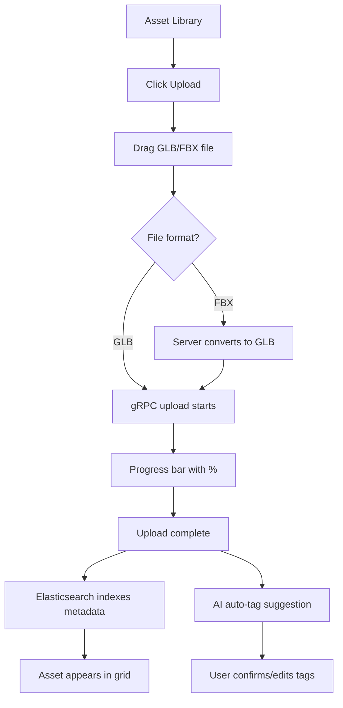
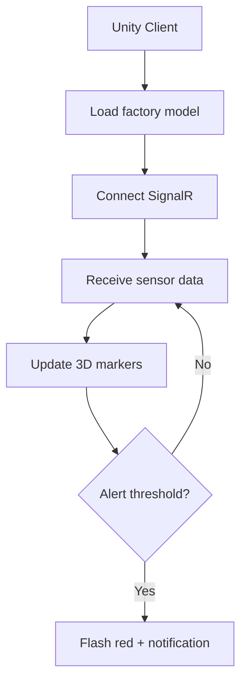
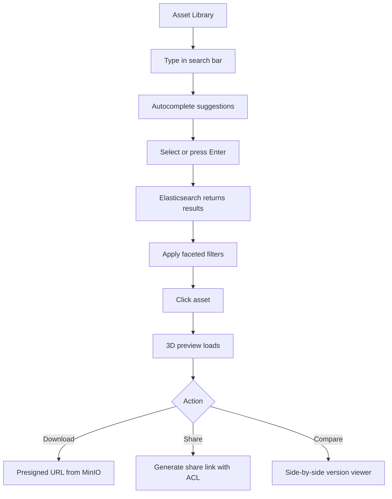

# UI/UX Design: 3D Asset Collaboration

## Table of Contents

- [Design Principles](#design-principles)
- [Figma Project Structure](#figma-project-structure)
- [Web UI — Asset Portal](#web-ui-asset-portal)
  - [Screen Inventory (Asset Portal)](#screen-inventory-asset-portal)
  - [Asset Portal Layout](#asset-portal-layout)
  - [Asset Detail Layout](#asset-detail-layout)
  - [Web-specific Patterns](#web-specific-patterns)
- [Web UI — IoT Dashboard](#web-ui-iot-dashboard)
  - [IoT Dashboard Layout](#iot-dashboard-layout)
- [Unity Client](#unity-client)
  - [Screen Inventory (Unity)](#screen-inventory-unity)
  - [Unity Viewport Layout](#unity-viewport-layout)
  - [Unity-specific Patterns](#unity-specific-patterns)
- [Mobile UI (iOS + Android)](#mobile-ui-ios-android)
  - [Screen Inventory (Mobile)](#screen-inventory-mobile)
  - [Mobile-specific Patterns](#mobile-specific-patterns)
- [Screen States](#screen-states)
- [User Flows](#user-flows)
  - [Upload + Preview Flow](#upload-preview-flow)
  - [IoT Digital Twin Flow](#iot-digital-twin-flow)
  - [Search + Browse Flow](#search-browse-flow)
- [Interaction Specification](#interaction-specification)
  - [Web Interactions](#web-interactions)
  - [Unity Interactions](#unity-interactions)
- [Key Components](#key-components)
- [Design Tokens](#design-tokens)
- [Responsive Breakpoints](#responsive-breakpoints)
- [Handoff Notes](#handoff-notes)
- [Accessibility (a11y) Checklist](#accessibility-a11y-checklist)
- [Figma Version History](#figma-version-history)
- [Screenshots](#screenshots)

---

## Design Principles

1. **3D is the hero** — the 3D viewer is the center of the experience. Maximize viewport, minimize UI noise.
2. **Search-first discovery** — users find assets by searching, not browsing folders. Search bar always prominent.
3. **Version clarity** — asset version history must be obvious. Never confuse which version is current.
4. **IoT in context** — sensor data overlaid on 3D model, not in a separate dashboard. Spatial context matters.
5. **Brand isolation** — each brand's assets feel like a separate library. Cross-brand access is explicit.

## Figma Project Structure

| File | Content | Link |
|------|---------|------|
| 3D Asset — Design System | Shared components, tokens, icons | [Figma URL TBD] |
| 3D Asset — Wireframes | Low-fi wireframes for all screens | [Figma URL TBD] |
| 3D Asset — UI Design | High-fi mockups (final) | [Figma URL TBD] |
| 3D Asset — Prototype | Interactive prototype with transitions | [Figma URL TBD] |

## Web UI — Asset Portal

### Screen Inventory (Asset Portal)

| Screen | Route | Components | Figma Page | Status |
|--------|-------|-----------|-----------|--------|
| Login | `/auth` | Login form, API Key input (for M2M) | Screens — Auth | Draft |
| Asset Library | `/` | Search bar, Filter sidebar, Asset grid, Brand switcher | Screens — Library | Draft |
| Asset Detail | `/asset/:id` | 3D Viewer (Three.js), Metadata panel, Version history, Tags | Screens — Asset Detail | Draft |
| Version Compare | `/asset/:id/compare` | Side-by-side 3D viewers, Version selector | Screens — Compare | Draft |
| Upload | `/upload` | Drag-and-drop zone, Progress bar, Metadata form | Screens — Upload | Draft |
| Search Results | `/search?q=...` | Result grid, Faceted filters (format, brand, date), Sort | Screens — Search | Draft |
| IoT Dashboard | `/iot` | Time-series charts, Sensor list, Alert history | Screens — IoT Dashboard | Draft |
| Brand Settings | `/admin/brand` | ACL editor, Member list, Shared links | Screens — Brand Admin | Draft |
| Account | `/settings` | Profile, API keys, Notification preferences | Screens — Account | Draft |

### Asset Portal Layout

```
┌─────────────────────────────────────────────────┐
│ Top Bar: Logo │ [Search...............] │ 🔔 👤  │
├──────────┬──────────────────────────────────────┤
│          │                                      │
│ Filter   │     Asset Grid                       │
│ Sidebar  │     ┌─────┐ ┌─────┐ ┌─────┐        │
│          │     │ 3D  │ │ 3D  │ │ 3D  │        │
│ Format:  │     │thumb│ │thumb│ │thumb│        │
│ □ GLB    │     │     │ │     │ │     │        │
│ □ FBX    │     │name │ │name │ │name │        │
│          │     │v3·Nike│v1·Adidas│v2·Nike│       │
│ Brand:   │     └─────┘ └─────┘ └─────┘        │
│ □ Nike   │                                      │
│ □ Adidas │     ┌─────┐ ┌─────┐ ┌─────┐        │
│          │     │ ... │ │ ... │ │ ... │        │
│ Date:    │     └─────┘ └─────┘ └─────┘        │
│ [range]  │                                      │
├──────────┴──────────────────────────────────────┤
│ Pagination: < 1 2 3 ... 12 >                    │
└─────────────────────────────────────────────────┘
```

### Asset Detail Layout

```
┌─────────────────────────────────────────────────┐
│ Top Bar: ← Back │ Asset Name │ [Download] [Share]│
├─────────────────────────────┬───────────────────┤
│                             │                   │
│                             │ Metadata Panel    │
│     3D Viewer               │                   │
│     (Three.js)              │ Format: GLB       │
│                             │ Size: 52 MB       │
│     [rotate] [zoom]         │ Brand: Nike       │
│     [fullscreen]            │ Tags: car, hero,  │
│   campaign-2026    │
│                             │ Created: 2026-03  │
│                             │ By: Maya          │
│                             │                   │
│                             │ ── Versions ──    │
│                             │ v3 ← current      │
│                             │ v2 · 2026-03-15   │
│                             │ v1 · 2026-03-01   │
│                             │ [Compare versions] │
├─────────────────────────────┴───────────────────┤
│ Tags: [car] [hero] [campaign-2026] [+ Add tag]  │
└─────────────────────────────────────────────────┘
```

### Web-specific Patterns

| Pattern | Implementation |
|---------|---------------|
| Navigation | Top bar with search as primary action. No side nav on detail page. |
| 3D Viewer | Three.js canvas. Orbit controls (drag=rotate, scroll=zoom, right-drag=pan). |
| Asset grid | Responsive grid. 3D thumbnail (auto-generated from model). |
| Search | Elasticsearch-powered. Autocomplete on type (debounced 300ms). Faceted filters. |
| Upload | Drag-and-drop zone. gRPC chunked upload with progress bar + resume. |
| Version compare | Two Three.js viewers side by side. Synced rotation. |
| Tag editing | Click tag to remove. Type to add. AI auto-suggest on upload. |

## Web UI — IoT Dashboard

### IoT Dashboard Layout

```
┌─────────────────────────────────────────────────┐
│ Top Bar: Logo │ IoT Dashboard │ [Sensor Config] │
├──────────┬──────────────────────────────────────┤
│          │                                      │
│ Sensor   │  ┌─────────────────────────────┐     │
│ List     │  │ Temperature (last 24h)      │     │
│          │  │ ~~~~~~~~/\~~~~/\~~~~        │     │
│ □ Temp   │  │ ___/       \/    \___      │     │
│ ■ Vibr   │  └─────────────────────────────┘     │
│ □ Press  │                                      │
│          │  ┌─────────────────────────────┐     │
│ Alerts:  │  │ Vibration (last 24h)        │     │
│ 🔴 2     │  │ ___/\____/\____/\___       │     │
│ 🟡 5     │  └─────────────────────────────┘     │
│          │                                      │
│          │  ┌─────────────────────────────┐     │
│          │  │ Alert History               │     │
│          │  │ 🔴 Temp > 80°C  10:32 AM   │     │
│          │  │ 🟡 Vibr > 5g    09:15 AM   │     │
│          │  └─────────────────────────────┘     │
└──────────┴──────────────────────────────────────┘
```

## Unity Client

### Screen Inventory (Unity)

| Screen | Description | Figma Page | Status |
|--------|-----------|-----------|--------|
| Login | API Key input for M2M auth | Screens — Unity | Draft |
| Asset Browser | Grid of 3D assets with search | Screens — Unity | Draft |
| 3D Viewport | Full 3D scene with IoT overlay | Screens — Unity | Draft |
| IoT Overlay | Sensor markers on 3D model (color-coded) | Screens — Unity | Draft |
| Asset Inspector | Metadata, versions, download | Screens — Unity | Draft |

### Unity Viewport Layout

```
┌─────────────────────────────────────────────────┐
│ Menu: File │ View │ IoT │ Help                   │
├─────────────────────────────────────────────────┤
│                                                  │
│              3D Viewport                         │
│                                                  │
│     [Factory Floor Model]                        │
│                                                  │
│        🟢 Sensor A: 42°C                        │
│                 🟡 Sensor B: 4.2g               │
│                          🔴 Sensor C: 95°C      │
│                                                  │
├──────────────────────────┬──────────────────────┤
│ Sensor Panel             │ Properties           │
│ ■ Sensor A: Temperature  │ Name: Main Motor     │
│ ■ Sensor B: Vibration    │ Status: Warning      │
│ ■ Sensor C: Temperature  │ Last update: 2s ago  │
│ [Configure] [Alerts]     │ [View History]       │
└──────────────────────────┴──────────────────────┘
```

### Unity-specific Patterns

| Pattern | Implementation |
|---------|---------------|
| 3D Navigation | WASD movement, mouse orbit, scroll zoom |
| IoT markers | 3D billboards attached to model coordinates. Color: green/yellow/red. |
| Sensor click | Click marker → tooltip with current value + sparkline |
| Alert | Full-screen flash border (red) + sound + toast |
| Real-time data | SignalR subscription. Updates every 1-2 seconds. |
| Offline | Cache last known sensor values. Show "stale" indicator. |

## Mobile UI (iOS + Android)

> Mobile is **not** a primary platform for 3D Asset. It provides lightweight asset browsing and notification management. 3D preview is limited on mobile.

### Screen Inventory (Mobile)

| Screen | Route | Platform | Figma Page | Status |
|--------|-------|----------|-----------|--------|
| Login | `/auth` | iOS + Android | Screens — Mobile | Draft |
| Asset List | `/` | iOS + Android | Screens — Mobile | Draft |
| Asset Detail (2D preview) | `/asset/:id` | iOS + Android | Screens — Mobile | Draft |
| Notifications | `/notifications` | iOS + Android | Screens — Mobile | Draft |
| Profile | `/profile` | iOS + Android | Screens — Mobile | Draft |

### Mobile-specific Patterns

| Pattern | iOS | Android |
|---------|-----|---------|
| Navigation | Tab bar: Assets, Search, Notifications, Profile | Bottom navigation: same |
| 3D preview | Static thumbnail only (no Three.js on mobile) | Same |
| Asset detail | 2D preview image + metadata + version list | Same |
| Upload | Not supported on mobile (desktop/Unity only) | Same |
| Push notification | "Asset uploaded", "IoT alert triggered" | Same |

## Screen States

| State | Description | Example |
|-------|------------|---------|
| Default | Normal loaded state with data | Asset grid with thumbnails |
| Loading | Skeleton loader (grid shape) | Asset grid loading |
| Empty | No assets in this brand | "No assets yet — upload your first 3D model" |
| Error | API failure | "Failed to load assets. Tap to retry." |
| 3D Loading | Model loading in viewer | Spinner overlay on 3D canvas + "Loading model..." |
| 3D Error | Model failed to render | "Preview unavailable — download to view in Unity" |
| Search Empty | No search results | "No assets match 'xyz'. Try different keywords." |
| Offline | No network (Unity/Mobile) | Show cached data + "Offline — sensor data may be stale" |

## User Flows

### Upload + Preview Flow



### IoT Digital Twin Flow



### Search + Browse Flow



## Interaction Specification

### Web Interactions

| Element | Trigger | Action | Animation | Duration |
|---------|---------|--------|-----------|----------|
| Asset card | Hover | Slight elevation + show action icons | Shadow grow | 200ms |
| Asset card | Click | Navigate to detail | Page transition | 200ms |
| 3D Viewer | Drag | Rotate model | Orbit controls (60fps) | Realtime |
| 3D Viewer | Scroll | Zoom in/out | Smooth zoom | 150ms |
| 3D Viewer | Double-click | Reset camera position | Smooth tween | 300ms |
| Search | Type | Autocomplete dropdown | Fade in | 150ms |
| Filter checkbox | Click | Filter results | Fade transition on grid | 200ms |
| Upload dropzone | Drag over | Highlight border (blue dashed) | Border color change | 100ms |
| Upload progress | During upload | Linear progress bar | Linear | Duration of upload |
| Tag | Click × | Remove tag | Shrink + fade | 150ms |
| Tag input | Type + Enter | Add tag | Expand + fade in | 150ms |
| Version compare | Load | Two viewers appear side-by-side | Fade in | 200ms |
| Version compare | Rotate one | Both viewers rotate in sync | Synced orbit | Realtime |
| Toast | Show/hide | Slide from top-right | Slide + fade | 300ms |

### Unity Interactions

| Element | Trigger | Action | Animation | Duration |
|---------|---------|--------|-----------|----------|
| 3D Scene | WASD keys | Move camera | Smooth movement | Realtime |
| 3D Scene | Mouse drag | Orbit camera | Smooth orbit | Realtime |
| IoT marker | Hover | Enlarge marker + show label | Scale 1.2 | 100ms |
| IoT marker | Click | Open sensor detail tooltip | Popup | 200ms |
| Alert | Threshold exceeded | Red flash border + sound | Flash 3x | 1000ms |
| Sensor panel | Click sensor | Highlight marker in 3D | Pulse glow | 500ms |

## Key Components

| Component | Variants | States | Notes |
|-----------|----------|--------|-------|
| Asset Card | grid (thumbnail), list (row) | default, hover, selected, loading | Shows 3D thumbnail + name + brand + version |
| 3D Viewer | single, compare (dual) | loading, loaded, error | Three.js with OrbitControls |
| Search Bar | compact (top bar), expanded (search page) | default, focused, loading, has-results | Elasticsearch autocomplete |
| Filter Sidebar | — | expanded, collapsed (mobile) | Faceted: format, brand, date range, tags |
| Tag Chip | — | default, removable, ai-suggested | AI suggestions have dashed border |
| Upload Dropzone | — | default, drag-over, uploading, complete, error | gRPC progress bar |
| Version Timeline | horizontal | current, past, compare-selected | Dots connected by line |
| IoT Sensor Marker (Unity) | — | normal (green), warning (yellow), critical (red), stale (gray) | 3D billboard |
| Time-series Chart | line, area | loading, loaded, no-data | ECharts for web, custom for Unity |
| Notification Badge | count | empty (hidden), has-count | Red dot |

## Design Tokens

| Token | File | Example |
|-------|------|---------|
| Colors | `tokens/colors.json` | Primary: `#6366F1` (Indigo), 3D bg: `#1A1A2E`, Success: `#10B981`, Warning: `#F59E0B`, Danger: `#EF4444` |
| Spacing | `tokens/spacing.json` | 4px grid. Card gap: 16px. Sidebar width: 240px. |
| Typography | `tokens/typography.json` | Body: 14px/1.5 'Inter', 'Helvetica Neue', Arial, sans-serif. Heading: 20px/1.3 Bold. |
| Shadows | `tokens/shadows.json` | Card: `0 2px 8px rgba(0,0,0,0.08)`. Hover: `0 8px 24px rgba(0,0,0,0.12)`. |
| Border radius | `tokens/radius.json` | Button: 8px. Card: 12px. Tag: 16px (pill). Viewer: 0px (full bleed). |

## Responsive Breakpoints

| Breakpoint | Width | Layout Change |
|-----------|-------|--------------|
| Mobile | < 768px | No filter sidebar (sheet overlay). Asset list instead of grid. No 3D viewer (static thumbnail). |
| Tablet | 768-1024px | Filter sidebar collapsed. 2-column grid. 3D viewer smaller. |
| Desktop | > 1024px | Full filter sidebar + 3-column grid. Full 3D viewer. |

## Handoff Notes

| Item | Where to Find |
|------|--------------|
| 3D Viewer | React Three Fiber (`@react-three/fiber`) + Drei helpers (`@react-three/drei`) |
| Icons | Lucide React — 24px stroke icons |
| Charts | ECharts (Apache) — time-series line/area charts for IoT |
| Search | Elasticsearch — autocomplete via `_suggest` API |
| File upload | gRPC-Web via Envoy proxy (browser can't call gRPC directly) |
| Unity UI | Unity UI Toolkit (not legacy IMGUI) |

## Accessibility (a11y) Checklist

- [ ] Color contrast ≥ 4.5:1
- [ ] 3D viewer has keyboard controls (arrow keys to rotate, +/- to zoom)
- [ ] IoT sensor colors have text labels (not color-only)
- [ ] Search results announced by screen reader (`aria-live`)
- [ ] Upload dropzone is keyboard-activatable (Enter/Space to open file picker)
- [ ] Tag chips are keyboard-removable (focus + Delete key)
- [ ] Touch targets ≥ 44x44px on mobile
- [ ] 3D loading state has text description (not just spinner)

## Figma Version History

| Version | Git Tag | Date | Figma Page | What Changed |
|---------|---------|------|-----------|-------------|
| — | — | — | — | No designs yet — UI spec complete, ready to start Figma |

> See [dev_guidelines.md](../../docs/dev_guidelines.md#figma--stitch-version-control) for Figma operation guide.

## Screenshots

```
3d_asset_collaboration/docs/screenshots/
├─ v0.1.0/
│   ├─ asset-library.png
│   ├─ asset-detail-3d.png
│   ├─ iot-dashboard.png
│   └─ unity-viewport.png
└─ v0.2.0/
    └─ ...
```

> No screenshots yet — will be added when Figma designs are created.
