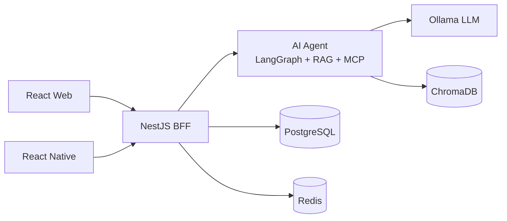
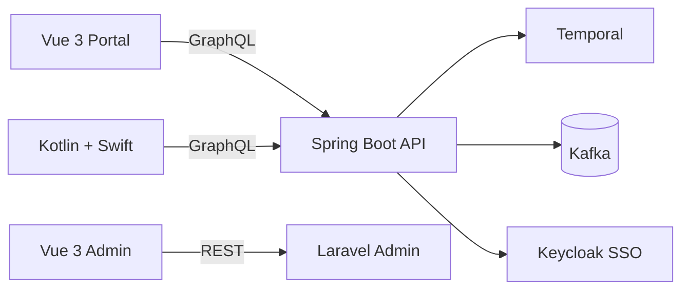
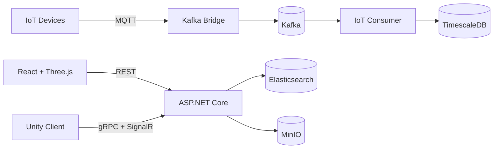

# Fullstack AI Workspace

> 3 fullstack projects × 3 industries × 7 languages × 18 systems

**Releases**

| Project | Version |
|---------|---------|
| Workspace |  |
| Whiteboard |  |
| Workflow |  |
| 3D Asset |  |

---

## 🏗️ Shared Platform

| Role | Tech |
|------|------|
| Database |  |
| Cache |  |
| Message Queue |   |
| Object Storage |  |
| Auth |     |
| Feature Flags |  |
| CI/CD |   |
| Design |   |
| AI Pair |  |

---

## 📋 Realtime AI Whiteboard — SaaS

> Miro + ChatGPT, fully local. CRDT realtime sync + AI agent state machine.

| System | Tech |
|--------|------|
| Web App |     |
| BFF + API |     |
| AI Service |        |
| Mobile |   |

📐 [Figma](https://www.figma.com/design/mIygAbHRH0NbXxXO5K4yV6/Whiteboard---Design) · 🚀 [Live Demo](https://eyolf6coyote7.github.io/fullstack_ai_workspace/whiteboard/) · 📖 [Docs](realtime_ai_whiteboard/docs/)

---

## ⚙️ Enterprise Workflow System — Semiconductor

> Multi-step approval with Temporal orchestration + Kafka event sourcing + immutable audit trail.

| System | Tech |
|--------|------|
| Employee Portal |    |
| Admin Dashboard |   |
| Workflow API |     |
| Admin API |   |
| Notification |   |
| Mobile |   |

📐 [Figma](https://www.figma.com/design/Uj6nyMA7fnlciLrBekuJ1Z/Workflow---Design) · 🚀 [Live Demo](https://eyolf6coyote7.github.io/fullstack_ai_workspace/workflow/) · 📖 [Docs](enterprise_workflow_system/docs/)

---

## 🎨 3D Asset Collaboration — Media / Advertising

> DAM + Digital Twin + IoT. gRPC streaming for large files + Three.js browser preview.

| System | Tech |
|--------|------|
| Asset Portal |    |
| Unity Client |    |
| Asset API |    |
| AI Service |    |
| IoT Pipeline |    |
| Mobile |  |

📐 [Figma](https://www.figma.com/design/CAwm8PZw10ch6ynVjWVwXf/Asset---Design) · 🚀 [Live Demo](https://eyolf6coyote7.github.io/fullstack_ai_workspace/3d-asset/) · 📖 [Docs](3d_asset_collaboration/docs/)

---

## Key Highlights

- **AI Agent State Machine** — LangGraph + RAG + MCP tool use + LoRA fine-tuning + Langfuse observability
- **3 Architecture Patterns** — Modular Monolith + BFF, Clean Architecture + DDD + CQRS, Hexagonal (Ports & Adapters)
- **3 API Styles** — REST + WebSocket + SSE, GraphQL + Subscriptions, gRPC + SignalR
- **Event-Driven** — Kafka (event sourcing, exactly-once, partitioning), MQTT → Kafka bridge
- **Multi-platform** — React, Vue 3, React Native, Kotlin (Android), Swift (iOS), Unity (C#)
- **Production-Ready** — Feature flags (Unleash), multi-tenancy, 2FA (Keycloak TOTP), SAST/SCA scanning

## Architecture Overview

### Whiteboard — SaaS



### Workflow — Semiconductor



### 3D Asset — Media / Advertising



## Tech Diversity

| Dimension | Whiteboard | Workflow | 3D Asset |
|-----------|-----------|----------|----------|
| BE Language | TypeScript | Kotlin + PHP | C# + Python + Go |
| FE Framework | React | Vue 3 | React + Three.js |
| Architecture | Modular Monolith + BFF | Clean Arch + DDD + CQRS | Hexagonal |
| API | REST + WebSocket | GraphQL | gRPC + REST |
| Messaging | Redis Stream | Kafka | MQTT → Kafka |
| AI | LangGraph Agent + RAG | — | ONNX Runtime |
| Auth | JWT + Guest | Keycloak OAuth2/SSO + 2FA | API Key + JWT + ACL |
| State Mgmt | Zustand | Pinia | Redux Toolkit |

## Documentation

| Document | Description |
|----------|-------------|
| [Tech Stack](docs/global_tech_stack.md) | Architecture patterns, system overview, tech decisions |
| [Infrastructure](docs/global_infra.md) | Docker services, ports, networking, Kafka topics |
| [Dev Guidelines](docs/dev_guidelines.md) | Workflow, templates, coding standards, security scanning |
| [Project Plan](docs/project_plan.md) | Execution plan and progress tracking |
| [AI-Assisted Development](docs/ai_assisted_development.md) | Claude Code + Gemini co-work methodology |

## Quick Start

```bash
# Clone
git clone git@github.com:Eyolf6Coyote7/fullstack_ai_workspace.git

# Start shared infrastructure
docker compose up -d

# Start Whiteboard (example)
cd realtime_ai_whiteboard/bff-api && pnpm install && pnpm start:dev
cd realtime_ai_whiteboard/web-app && pnpm install && pnpm dev
```

## Built With

This project is built with **[Claude Code](https://claude.ai/claude-code)** as an AI pair programmer.
Every PR is reviewed by Claude (architecture + security) and Gemini (code quality).
All merge decisions are made by a human.
