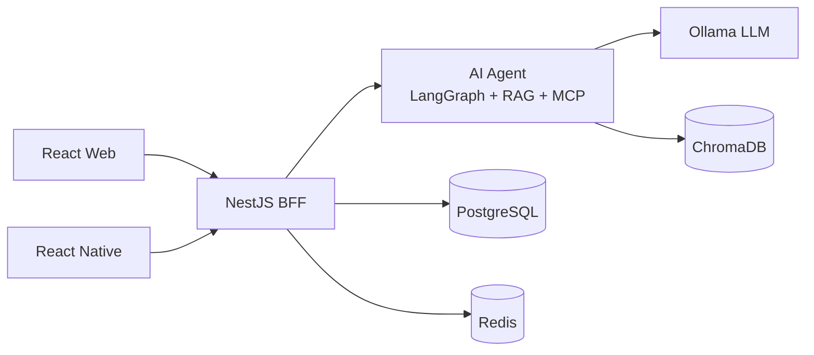
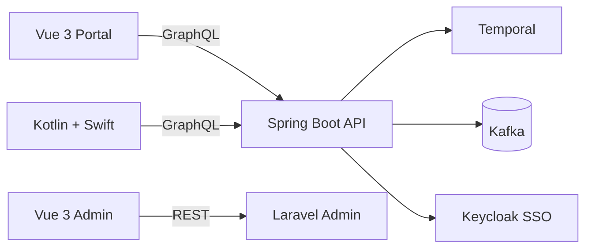
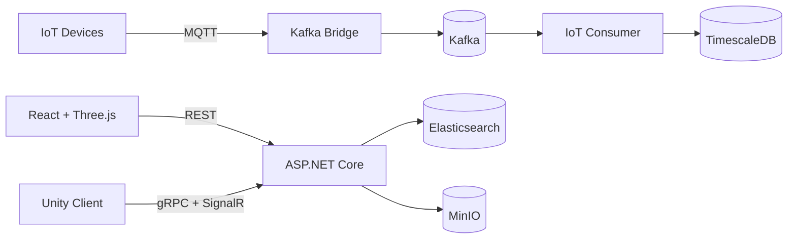

# Fullstack AI Workspace


> A portfolio monorepo with **3 fullstack projects** across **3 industries**, built with **7 languages** and **18 systems** — demonstrating Staff-level breadth in frontend, backend, mobile, AI, and system design.

## Key Highlights

- **AI Agent with State Machine** — LangGraph + RAG + MCP tool use + LoRA fine-tuning (not just a chatbot)
- **3 Architecture Patterns** — Modular Monolith, Clean Architecture + DDD + CQRS, Hexagonal
- **3 API Styles** — REST + WebSocket, GraphQL, gRPC
- **Event-Driven** — Kafka (event sourcing, exactly-once, partitioning), MQTT → Kafka bridge
- **Production-Ready** — Feature flags, multi-tenancy, 2FA, SAST/SCA security scanning, SLO targets

## Architecture Overview

### Whiteboard — SaaS



### Workflow — Semiconductor



### 3D Asset — Media / Advertising



## Projects

| Project | Industry | Frontend | Backend | Mobile | Live Demo |
|---------|----------|----------|---------|--------|-----------|
| [Realtime AI Whiteboard](realtime_ai_whiteboard/) | SaaS | React | NestJS (TypeScript) | React Native | [Demo](https://eyolf6coyote7.github.io/fullstack_ai_workspace/whiteboard/) |
| [Enterprise Workflow System](enterprise_workflow_system/) | Semiconductor | Vue 3 | Spring Boot (Kotlin) + Laravel (PHP) | Kotlin + Swift | [Demo](https://eyolf6coyote7.github.io/fullstack_ai_workspace/workflow/) |
| [3D Asset Collaboration](3d_asset_collaboration/) | Media / Advertising | React + Three.js | ASP.NET Core (C#) | Unity (C#) | [Demo](https://eyolf6coyote7.github.io/fullstack_ai_workspace/3d-asset/) |

> Demo links are static versions with mock data. For full functionality (AI, Kafka, realtime), run locally.

## Tech Diversity

| Dimension | Whiteboard | Workflow | 3D Asset |
|-----------|-----------|----------|----------|
| BE Language | TypeScript | Kotlin + PHP | C# + Python + Go |
| FE Framework | React | Vue 3 | React + Three.js |
| Architecture | Modular Monolith + BFF | Clean Arch + DDD + CQRS | Hexagonal |
| API | REST + WebSocket | GraphQL | gRPC + REST |
| Messaging | Redis Stream | Kafka | MQTT → Kafka |
| AI | LangGraph Agent + RAG | — | ONNX Runtime |
| Auth | JWT + Guest | Keycloak OAuth2/SSO + 2FA | API Key + JWT + ACL |
| State Mgmt | Zustand | Pinia | Redux Toolkit |

## Documentation

| Document | Description |
|----------|-------------|
| [Tech Stack](docs/global_tech_stack.md) | Architecture patterns, system overview, tech decisions |
| [Infrastructure](docs/global_infra.md) | Docker services, ports, networking, Kafka topics |
| [Dev Guidelines](docs/dev_guidelines.md) | Workflow, templates, coding standards, security scanning |
| [Project Plan](docs/project_plan.md) | Execution plan and progress tracking |
| [AI-Assisted Development](docs/ai_assisted_development.md) | Claude Code + Gemini co-work methodology |

## Quick Start

```bash
# Clone
git clone git@github.com:Eyolf6Coyote7/fullstack_ai_workspace.git

# Start shared infrastructure
docker compose up -d

# Start a specific project (e.g. Whiteboard)
cd realtime_ai_whiteboard/backend && npm install && npm run dev
cd realtime_ai_whiteboard/web && npm install && npm run dev
```

## Built With

This project is built with **[Claude Code](https://claude.ai/claude-code)** as an AI pair programmer.
Every PR is reviewed by Claude (architecture + security) and Gemini (code quality).
All merge decisions are made by a human.
