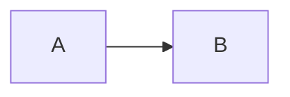

# AI-Assisted Development Guide

This project is built with **Claude Code (Opus 4.6)** as an AI pair programmer and **Gemini Code Review** as an automated reviewer. This document describes the AI co-work methodology, tools, and conventions.

## AI Tools Used

| Tool | Role | When |
|------|------|------|
| **Claude Code** | AI pair programmer | Writing docs, code, PRs, reviews |
| **Gemini Code Review** | Automated code reviewer | Every PR (GitHub App) |
| **Ollama** | Local LLM for product AI features | Runtime (Whiteboard AI agent) |
| **Google Stitch** | AI-assisted UI layout generation | During Figma design phase |
| **Figma MCP** | Claude reads Figma files for review | During design verification |

## Development Workflow with AI

```
1. User describes what to build
2. Claude creates GitHub Issue
3. Claude creates feature branch
4. Claude writes code / docs
5. Claude commits + pushes
6. Claude creates PR (with --assignee, --label, --project)
7. Claude posts Code Review comment (architecture + security checklist)
8. Gemini posts automated review
9. Claude reads Gemini review + fixes all comments
10. Claude replies to Gemini with fix summary
11. Human reviews and merges (NEVER auto-merge)
```

## Claude Code Review Format

Every PR receives a Claude review comment:

```markdown
## 🤖 Claude Code Review

### Summary
- 1-3 bullet points

### Architecture Impact


### Security Scan (code PRs only)
| Check | Status | Detail |
|-------|--------|--------|

### Review
| File | Severity | Comment |
|------|----------|---------|

### Risk Level
🟢 Low / 🟡 Medium / 🔴 High
```

## Gemini Review Handling

When Gemini posts review comments:
1. Claude reads all comments via GitHub API
2. Claude fixes each issue
3. Claude commits with descriptive message referencing each fix
4. Claude replies to the PR with a summary table:

```markdown
## Gemini Review — All X Items Fixed in [commit]

| # | Priority | Comment | Fix |
|---|----------|---------|-----|
```

## Co-authorship

All commits include:
```
Co-Authored-By: Claude Opus 4.6 (1M context) <noreply@anthropic.com>
```

## Git Conventions (AI-specific)

| Rule | Description |
|------|-------------|
| Never auto-merge | Human makes all merge decisions |
| Always create issue first | Even for small changes |
| Always create feature branch | Never push to dev/stable directly |
| Always add --project | Every PR linked to "Fullstack AI Workspace" project |
| Always review | Claude reviews every PR, never skip |
| Always check Gemini | Read + fix Gemini comments before requesting merge |

## Prompt Patterns

How to instruct Claude effectively:

| You say | Claude does |
|---------|-------------|
| "寫 Whiteboard ConOps" | Create issue → branch → write doc → PR → review |
| "幫我改 XXX" | Same workflow (issue → branch → PR) |
| "fix Gemini review" | Read comments → fix → commit → reply |
| "開始" | Start next task in todo list |
| "merged" | Move to next task |
| "review 一下" | Claude re-reads and evaluates quality |

## What Claude Cannot Do

| Limitation | Workaround |
|-----------|-----------|
| Cannot merge PRs | Human merges manually |
| Cannot create Figma designs | Claude writes UI spec, human creates in Figma |
| Cannot run local Docker | Human runs `docker compose up`, Claude writes config |
| Cannot access external URLs | Human provides content, Claude processes it |
| Cannot reply to Gemini inline comments | Claude posts summary as PR comment |

## Quality Metrics

| Metric | Target |
|--------|--------|
| Gemini review pass rate (no high/critical) | > 80% first attempt |
| PR review completeness | 100% (every PR reviewed) |
| Issue linkage | 100% (every PR has Closes #) |
| Co-authorship attribution | 100% (every commit has Co-Authored-By) |
