# Development Guidelines

## Development Phases

Each project follows the same document lifecycle. Phases are sequential for initial development.

### Initial Development (v0 → v1)

| Phase | Document | ADR? | Purpose |
|-------|----------|------|---------|
| 1 | `conops.md` | ✅ | Concept of Operations — product vision, personas, scenarios |
| 2 | `prd.md` | — | Product Requirements — features, user stories, acceptance criteria |
| 3 | `ui_ux_design.md` | — | UI/UX — Figma wireframes, design system, interaction spec |
| 4 | `system_architecture.md` | ✅ | System design — C4 model, data flow, deployment |
| 5 | `technical_design.md` | ✅ | Implementation detail — APIs, DB schema, algorithms |
| 6 | `development_roadmap.md` | — | Timeline — milestones, priorities, dependencies |
| 7 | `testing_strategy.md` | — | Test plan — unit, integration, E2E, load |

**When to write ADRs and RFCs:**

| Document | When | During Initial Dev? |
|----------|------|-------------------|
| **ADRs** | During Phase 1 (ConOps), Phase 4 (System Arch), Phase 5 (Tech Design) — whenever a major tech decision is made | ✅ Yes — created alongside the phase docs |
| **RFCs** | During Feature Iteration (v1+) — before developing a major new feature | ❌ No — only after initial development is complete |

> ADR example during ConOps: deciding "Why Yjs over OT for collaboration?" → write `ADR-0001-why-yjs-over-ot.md`
> RFC example during iteration: proposing "Add voice chat to whiteboard" → write `RFC-0001-voice-chat.md`

> **One doc per project, not per system.** Each project has multiple systems (e.g. Whiteboard has BFF, AI Service, etc.). Use `## System: [name]` sections within the same doc to separate each system's details. This keeps everything in one place and avoids doc sprawl.

### Document Templates

---

#### 1. ConOps (Concept of Operations) — `conops.md`

Defines **what** the product is, **who** it's for, and **why** it matters.

```markdown
# ConOps: [Project Name]

## Product Vision
<!-- One-sentence definition of the product -->

## Industry Context
<!-- Which industry (SaaS / Semiconductor / Media), market landscape -->

## Competitive Analysis
| Competitor | Strengths | Weaknesses | Our Differentiator |
|-----------|-----------|------------|-------------------|

## Stakeholder Map
| Stakeholder | Role | Interest | Influence |
|-------------|------|----------|-----------|
| End User | Daily user | High | Low |
| Admin | System manager | High | Medium |
| Product Owner | Decision maker | High | High |

## Target Users
<!-- User personas with role, goals, pain points -->
| Persona | Role | Goal | Pain Point |
|---------|------|------|------------|

## Assumptions & Constraints
| Type | Description |
|------|-------------|
| Assumption | [e.g. Users have stable internet for initial sync] |
| Constraint | [e.g. All infra must run locally, no cloud] |
| Dependency | [e.g. Ollama must support the target LLM model] |

## Core Scenarios
<!-- 3-5 primary user flows, written as user stories -->
### Scenario 1: [Name]
**As a** [persona], **I want to** [action], **so that** [outcome].
Flow: step 1 → step 2 → step 3

## OKR / Success Metrics
| Objective | Key Result | Target |
|-----------|-----------|--------|

## Risk Register
| Risk | Impact | Likelihood | Mitigation |
|------|--------|-----------|------------|

## ADRs Created
- ADR-NNNN: [title]
```

---

#### 2. PRD (Product Requirements Document) — `prd.md`

Defines **what** to build — features, user stories, acceptance criteria.

```markdown
# PRD: [Project Name]

## Overview
<!-- 2-3 sentence product summary, link back to ConOps -->

## User Journey Map
<!-- High-level end-to-end journey for each persona -->
### [Persona Name] Journey
| Stage | Action | Touchpoint | Emotion | Opportunity |
|-------|--------|-----------|---------|-------------|
| Discover | [how they find the product] | Web / referral | Curious | |
| Onboard | [first-time experience] | App | Excited / Confused | |
| Use | [daily workflow] | App | Productive | |
| Return | [why they come back] | Push / Email | Satisfied | |

## Feature List
| # | Feature | Priority | Platform | System | Status | Analytics Event |
|---|---------|----------|----------|--------|--------|----------------|
| F1 | [name] | P0 | Web + Mobile | BFF + API | Planned | [event_name] |
| F2 | [name] | P1 | Web (Admin) | Admin API | Planned | [event_name] |
| F3 | [name] | P2 | Mobile only | Mobile App | Planned | [event_name] |

## Feature Details

### F1: [Feature Name]
**User Story:** As a [persona], I want to [action], so that [outcome].

**Acceptance Criteria:**
- [ ] Given [context], when [action], then [result]
- [ ] Given [context], when [action], then [result]

**Edge Cases:**
- What happens when [edge case]?

**Out of Scope:**
- [explicitly excluded items]

**Analytics:**
- Event: `[event_name]`
- Properties: `{ key: value }`
- Success metric: [what to measure]

<!-- Repeat for each feature -->

## Non-functional Requirements
| Requirement | Target |
|-------------|--------|
| Performance | p99 latency < [X]ms |
| Availability | [X]% uptime |
| Security | [OWASP, auth, encryption] |
| Scalability | [concurrent users, data volume] |
| i18n | [supported locales] |
| a11y | WCAG 2.1 AA |

## Release Criteria
<!-- All must be true before marking a milestone as done -->
- [ ] All P0 features implemented and tested
- [ ] No P0/P1 bugs open
- [ ] Performance meets SLO targets
- [ ] Security scan passes (SAST/SCA)
- [ ] UI matches Figma (Final status)
- [ ] Storybook components up to date

## Dependencies
<!-- External systems, APIs, shared infra -->
```

---
#### 3. UI/UX Design — `ui_ux_design.md`

Defines **how it looks and feels** — Figma as single source of truth, design system, interaction specs.

```markdown
# UI/UX Design: [Project Name]

## Design Principles
<!-- 3-5 guiding principles for this product's UX -->
1. [principle]
2. [principle]

## Figma Project Structure

### Figma File Organization
| File | Content | Link |
|------|---------|------|
| [Project] — Design System | Shared components, tokens, icons | [Figma URL] |
| [Project] — Wireframes | Low-fi wireframes for all screens | [Figma URL] |
| [Project] — UI Design | High-fi mockups (final) | [Figma URL] |
| [Project] — Prototype | Interactive prototype with transitions | [Figma URL] |

### Figma Pages (within each file)
| Page | Content |
|------|---------|
| Cover | Project name, status, last updated |
| Components | Reusable component library |
| Screens — [Feature] | All screens for a feature |
| Flows — [User Journey] | Connected prototype flow |
| Archive | Deprecated designs (don't delete, archive) |

## Design Tools

| Tool | Purpose | Cost |
|------|---------|------|
| **Figma** (free version) | Wireframes, high-fi mockups, design system, component library | Free |
| **Google Stitch** (stitch.withgoogle.com) | AI-assisted layout generation, rapid prototyping | Free |
| **Storybook** | Component documentation, visual testing, a11y checking | Free |

## Figma Workflow

```
1. Define requirements    → PRD feature + acceptance criteria
2. Write UI spec          → Claude generates component list, layout, interactions
3. Generate layouts       → Use Google Stitch for rapid layout exploration
4. Wireframe (low-fi)     → Figma wireframe, grayscale, no styling
5. Review wireframe       → Validate flow with PRD acceptance criteria
6. UI design (high-fi)    → Apply design tokens, real content, final styling
7. Interaction spec       → Define hover, click, transition, animation, loading states
8. Prototype              → Link screens in Figma for clickable walkthrough
9. Design review          → Final approval, mark page as "✅ Final"
10. Handoff               → Dev implements from Figma Dev Mode
11. Storybook             → Each component matches Figma 1:1
```

## Figma + Stitch Version Control

Figma free version has no branch feature. Use **page naming + repo screenshots** to align with git versions.

### Figma Side — How to Operate

**Step 1: Create Figma file per project**
```
Figma → New File → Name: "[Project] — Design"
Example: "Whiteboard — Design"
```

**Step 2: Organize pages by version**
```
Pages in Figma:
├─ Components          ← shared components, no version number, always latest
├─ v0.1.0 — Wireframes ← low-fi wireframes for milestone 1
├─ v0.2.0 — High-fi    ← high-fi mockups for milestone 2
├─ ...                  ← new page per milestone
└─ Archive              ← deprecated designs, moved here (never delete)
```

**Step 3: When starting a new milestone**
```
1. Duplicate the latest versioned page
2. Rename to new version: "v0.x.0 — [description]"
3. Make changes on the new page
4. Keep old page untouched (it's your history)
```

**Step 4: Using Google Stitch**
```
1. Open stitch.withgoogle.com
2. Describe the screen layout you need (from UI spec)
3. Stitch generates layout options
4. Pick the best one → screenshot or recreate in Figma
5. Stitch is for exploration only — Figma is the source of truth
```

### Repo Side — How to Sync with Git

**On every git tag (milestone complete):**
```bash
# 1. Export key screens from Figma as PNG
#    Figma → Select frame → Export → PNG 2x

# 2. Save to repo
mkdir -p [project]/docs/screenshots/v0.x.0/
# Copy exported PNGs here

# 3. Update ui_ux_design.md changelog
# Add entry to Figma Version History table

# 4. Commit with the tag
git add [project]/docs/screenshots/
git commit -m "📘docs: add Figma screenshots for v0.x.0"
```

**In `ui_ux_design.md` — Figma Version History table:**
```markdown
## Figma Version History

| Version | Git Tag | Date | Figma Page | What Changed |
|---------|---------|------|-----------|-------------|
| v0.1.0 | whiteboard/v0.1.0 | 2026-04-xx | v0.1.0 — Wireframes | Initial wireframes for all screens |
| v0.2.0 | whiteboard/v0.2.0 | 2026-05-xx | v0.2.0 — High-fi | Applied design tokens, real content |
```

### Summary

| Where | What | When |
|-------|------|------|
| Figma | New page per version | Every milestone |
| Google Stitch | Layout exploration | During wireframe phase |
| Repo `screenshots/` | Exported PNGs | Every git tag |
| Repo `ui_ux_design.md` | Figma link + changelog | Every milestone |
| Storybook | Component matches Figma | During development |

## Web UI

### Screen Inventory (Web)
| Screen | Route | System | Figma Page | Status |
|--------|-------|--------|-----------|--------|
| | | | | Draft / Review / Final |

### Web-specific Patterns
| Pattern | Implementation |
|---------|---------------|
| Navigation | Top nav + side panel |
| Layout | CSS Grid / Flexbox, responsive |
| Keyboard shortcuts | Define per feature |
| Drag & drop | HTML5 DnD API |

## Mobile UI (iOS + Android)

### Screen Inventory (Mobile)
| Screen | Route | Platform | Figma Page | Status |
|--------|-------|----------|-----------|--------|
| | | iOS + Android / iOS only / Android only | | Draft / Review / Final |

### Mobile-specific Patterns
| Pattern | iOS | Android |
|---------|-----|---------|
| Navigation | Tab bar (bottom) | Bottom navigation |
| Back | Swipe from left edge | System back button |
| Pull to refresh | UIRefreshControl | SwipeRefreshLayout |
| Gestures | Swipe, pinch, long press | Same |
| Safe area | iOS notch / Dynamic Island | Status bar + nav bar |
| Haptics | UIImpactFeedbackGenerator | HapticFeedbackConstants |

### Platform-specific Screens
<!-- Screens that differ between iOS and Android -->
| Screen | iOS Difference | Android Difference |
|--------|---------------|-------------------|
| Settings | iOS Settings style | Material Design style |
| Share | UIActivityViewController | Android Share sheet |
| Permissions | iOS permission dialog | Android runtime permission |

## Admin UI (if applicable)

### Screen Inventory (Admin)
| Screen | Route | Figma Page | Status |
|--------|-------|-----------|--------|
| | | | Draft / Review / Final |

### Admin-specific Patterns
| Pattern | Implementation |
|---------|---------------|
| Data tables | Sortable, filterable, paginated |
| Forms | Validation, error states, multi-step |
| Dashboard | Charts, KPIs, real-time updates |
| RBAC | Show/hide based on admin role |

## Screen States (every screen on every platform must define all states)
| State | Description | Required? |
|-------|------------|-----------|
| Default | Normal loaded state | ✅ Always |
| Loading | Skeleton / spinner while fetching | ✅ Always |
| Empty | No data yet (first-time user) | ✅ Always |
| Error | API failure / network error | ✅ Always |
| Partial | Some data loaded, some failed | When applicable |
| Disabled | Feature behind feature flag or paywall | When applicable |
| Offline | No network (mobile) | ✅ Mobile always |

## User Flows
<!-- Mermaid flowchart for key user journeys, one per platform if different -->

### Web Flow
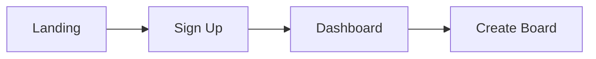

### Mobile Flow
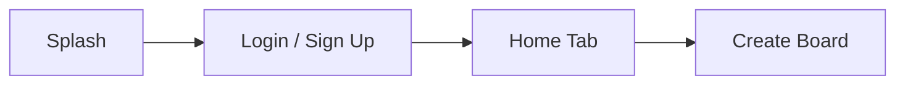

## Interaction Specification

### Web Interactions
| Element | Trigger | Action | Animation | Duration |
|---------|---------|--------|-----------|----------|
| Button | Hover | Background color change | ease-in-out | 150ms |
| Modal | Open | Fade in + scale up | ease-out | 200ms |
| Toast | Show | Slide in from top | ease-out | 300ms |
| Page transition | Navigate | Fade | ease-in-out | 200ms |

### Mobile Interactions
| Element | Trigger | Action | Animation | Duration |
|---------|---------|--------|-----------|----------|
| Button | Tap | Ripple / highlight | native | 100ms |
| Bottom sheet | Swipe up | Slide up from bottom | spring | 300ms |
| Toast | Show | Slide in from bottom | ease-out | 300ms |
| Screen transition | Navigate | Push from right (iOS) / Fade (Android) | native | 300ms |

## Component Library

| Component | Props | Variants | States | Storybook |
|-----------|-------|----------|--------|-----------|
| Button | size, variant, disabled | primary, secondary, ghost | default, hover, active, disabled, loading | ✅ |
| Input | label, error, placeholder | text, password, search | default, focus, error, disabled | ✅ |

> Every component in Figma must have a matching Storybook story.

## Design Tokens
<!-- Reference to shared tokens/ directory — single source of truth -->
| Token | File | Example |
|-------|------|---------|
| Colors | `tokens/colors.json` | `--color-primary: #1976D2` |
| Spacing | `tokens/spacing.json` | `--space-4: 16px` (4px grid) |
| Typography | `tokens/typography.json` | `--font-body: 14px/1.5 Inter` |
| Shadows | `tokens/shadows.json` | `--shadow-md: 0 4px 6px rgba(...)` |
| Border radius | `tokens/radius.json` | `--radius-md: 8px` |

> Tokens are defined in code, imported into Figma via Tokens Studio plugin.

## Responsive Breakpoints
| Breakpoint | Width | Layout | Figma Frame |
|-----------|-------|--------|-------------|
| Mobile | < 768px | Single column, bottom nav | 375 x 812 |
| Tablet | 768-1024px | Two column, side nav | 768 x 1024 |
| Desktop | > 1024px | Full layout, top nav + side panel | 1440 x 900 |

## Handoff Notes (Figma → Developer)

| Item | Where to Find |
|------|--------------|
| Spacing & sizing | Figma Dev Mode → Inspect panel |
| Colors | Design tokens (not hardcoded hex) |
| Assets (icons, images) | Figma → Export as SVG / PNG |
| Interaction specs | This doc → Interaction Specification table |
| Responsive behavior | This doc → Responsive Breakpoints table |
| Component props | Storybook → Component docs |

## Accessibility (a11y) Checklist
- [ ] Color contrast ≥ 4.5:1 (use Figma a11y plugin to verify)
- [ ] All images have alt text defined in Figma layer names
- [ ] Focus order documented (tab sequence)
- [ ] Keyboard shortcuts defined for key actions
- [ ] Touch targets ≥ 44x44px (mobile)
- [ ] Screen reader tested (VoiceOver / TalkBack)
- [ ] Reduced motion alternatives for all animations
- [ ] Error messages are descriptive (not just "Error")
```

---


#### 4. System Architecture — `system_architecture.md`

Defines **how** the system is structured — components, data flow, infrastructure.

```markdown
# System Architecture: [Project Name]

## Architecture Pattern
<!-- e.g. Modular Monolith, Clean Architecture, Hexagonal -->

## C4 Model

### Level 1: System Context
<!-- Who uses the system? What external systems does it interact with? -->
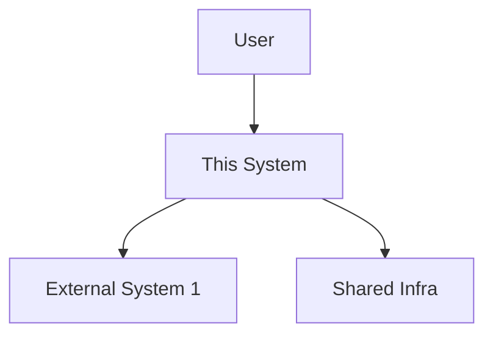

### Level 2: Container Diagram
<!-- Frontend, backend, DB, queue — how are they separated? -->
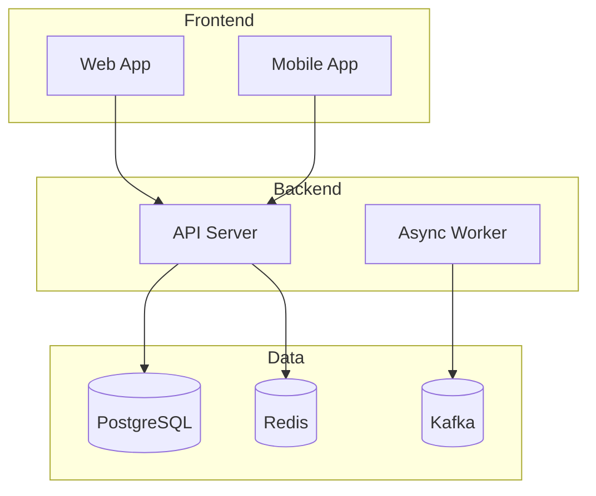

### Level 3: Component Diagram (per system)
<!-- Internal modules/services within each container -->
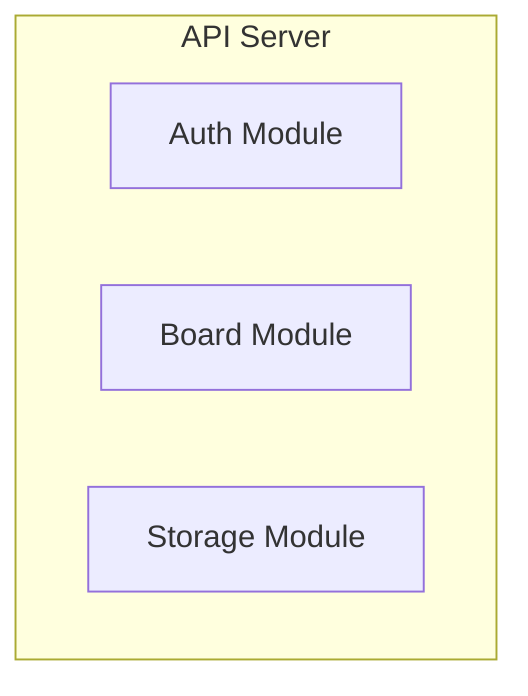

> Level 4 (Code) is not drawn — use code itself as documentation.

## Component Overview
| Component | Tech | System | Responsibility |
|-----------|------|--------|---------------|

## Data Flow (Sequence Diagrams)
<!-- Sequence diagram for each key scenario -->

### Flow 1: [Scenario Name]
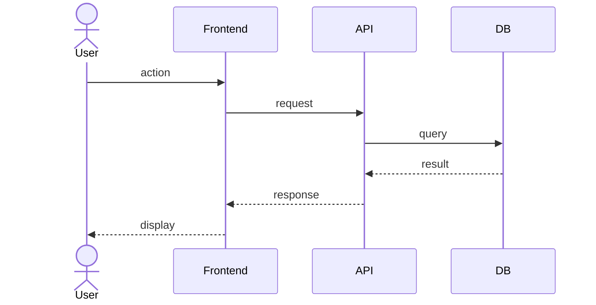

### Flow 2: [Async Scenario]
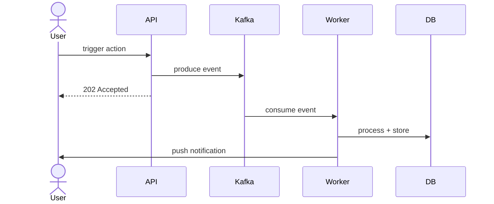

## API Contracts (High-level)
<!-- Detail goes in technical_design.md -->
| Endpoint / Topic | Protocol | Direction | Description |
|-----------------|----------|-----------|-------------|

## Database Schema (High-level)
<!-- ER diagram — detail goes in technical_design -->
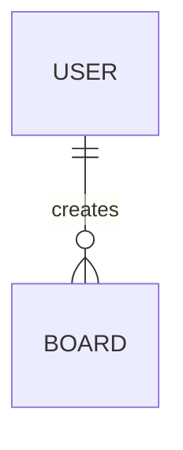

## Deployment Diagram
<!-- How are services deployed locally? -->
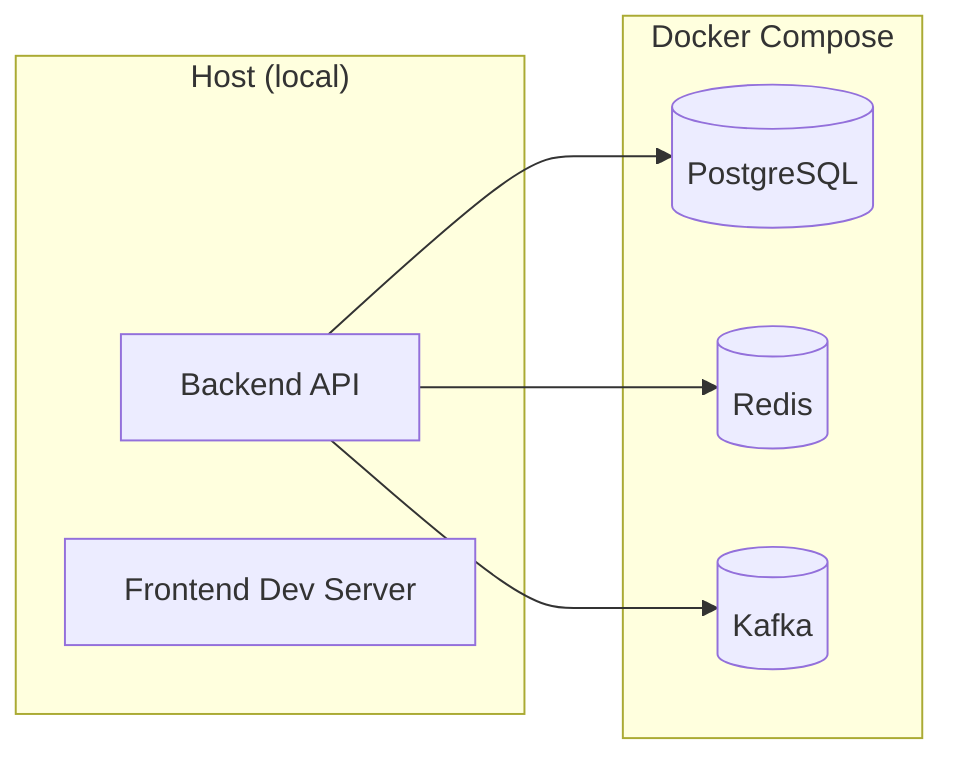

## Security Architecture
| Layer | Measure |
|-------|---------|
| Network | Docker network isolation, no exposed ports except mapped |
| Auth | [JWT / OAuth2 / API Key] — per project |
| Authorization | [RBAC / ACL] — per project |
| Data in transit | TLS (HTTPS, WSS, gRPCs) |
| Data at rest | MinIO SSE, PostgreSQL encryption |
| Secrets | `.env` files, Docker secrets, never in code |
| Input validation | DTO validation at API boundary |
| Dependencies | SAST/SCA scanning in CI |

## Infrastructure Dependencies
| Service | Purpose |
|---------|---------|

## Scalability Considerations
<!-- How would this scale? Interview-ready answer -->
| Concern | Current (local) | Production Strategy |
|---------|-----------------|-------------------|
| Users | Single instance | Horizontal scaling behind load balancer |
| DB | Single PostgreSQL | Read replicas, connection pooling |
| Cache | Single Redis | Redis Cluster |
| Messaging | Single Kafka | Multi-broker Kafka cluster |
| Storage | Single MinIO | S3 in cloud |

## ADRs Created
- ADR-NNNN: [title]
```

---

#### 5. Technical Design — `technical_design.md`

Defines **implementation details** — API specs, DB schema, algorithms. One doc per project, **sectioned by system**.

```markdown
# Technical Design: [Project Name]

<!-- One section per system within this project -->

## System: [System Name, e.g. "BFF + API (NestJS)"]

### API Specification
<!-- Detailed endpoint definitions for this system -->
| Method | Path | Request | Response | Auth |
|--------|------|---------|----------|------|

### WebSocket / SignalR / gRPC Events
| Event | Direction | Payload | Description |
|-------|-----------|---------|-------------|

### Database Tables (owned by this system)
| Column | Type | Constraints | Description |
|--------|------|------------|-------------|

### Indexes
| Table | Columns | Type | Purpose |
|-------|---------|------|---------|

## System: [Next System, e.g. "AI Service (LangGraph)"]
### Pipeline Specification
...

<!-- Repeat for each system -->

---
<!-- Shared sections below apply to all systems -->

## Database Schema (Full)

### ER Diagram
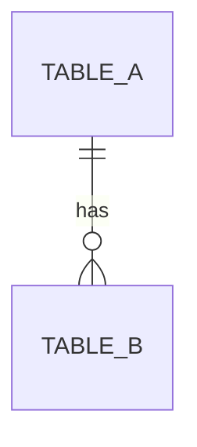

### Migrations
<!-- Migration tool, naming convention, rollback strategy -->
| Item | Standard |
|------|---------|
| Tool | [Prisma Migrate / Flyway / EF Core] |
| Naming | `YYYYMMDDHHMMSS_description` |
| Rollback | Every migration must have a `down` migration |

### Data Migration Strategy
<!-- How to handle schema changes on existing data -->
| Scenario | Strategy |
|----------|---------|
| Add column | Add with default value, backfill async |
| Rename column | Add new → copy data → remove old (across 2 releases) |
| Remove column | Stop reading first → remove in next release |

## Sequence Diagrams (Key Flows)
<!-- One sequence diagram per critical flow -->

### Flow: [Critical Flow Name]
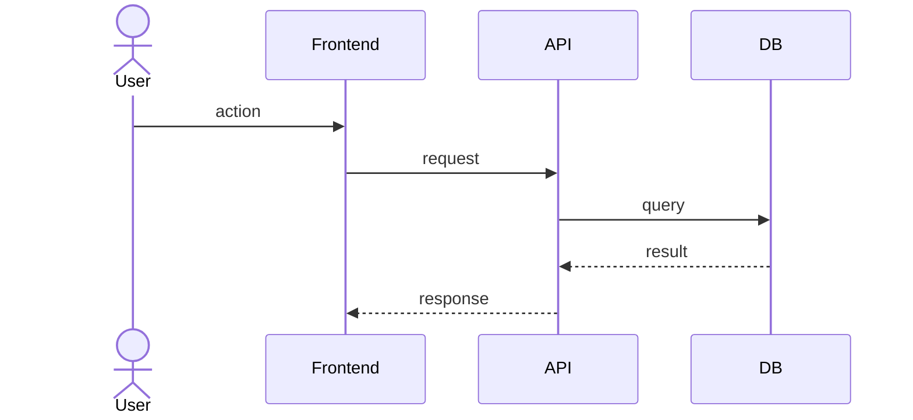

## Authentication & Authorization
<!-- Token flow, role mapping, permission matrix -->
| Role | Permissions |
|------|------------|

## Error Handling
<!-- Error codes, response format, retry strategy -->

## Caching Strategy
| Key Pattern | TTL | Invalidation |
|-------------|-----|-------------|

## Background Jobs / Workers
| Job | System | Trigger | Input | Output |
|-----|--------|---------|-------|--------|

## Third-party Integrations

## ADRs Created
- ADR-NNNN: [title]
```

> **Note:** One doc per project, not per system. Use `## System: [name]` headers to separate each system's specs within the same doc.

---

#### 6. Development Roadmap — `development_roadmap.md`

Defines **when** to build what — milestones, priorities, dependencies.

```markdown
# Development Roadmap: [Project Name]

## Effort Estimation Method

Using **T-shirt sizing** (no story points):

| Size | Effort | Example |
|------|--------|---------|
| XS | < 2 hours | Fix typo, update config |
| S | 2-4 hours | Add API endpoint, simple UI component |
| M | 1-2 days | New feature with DB + API + UI |
| L | 3-5 days | Complex feature across multiple systems |
| XL | 1-2 weeks | New system, major refactor |

## Definition of Done

A feature is "Done" when:
- [ ] Code reviewed and merged to `dev`
- [ ] Unit tests written and passing
- [ ] API documented (OpenAPI / GraphQL schema / proto)
- [ ] UI matches Figma (if applicable)
- [ ] Storybook story added (if UI component)
- [ ] Feature flag configured in Unleash (if gradual rollout)
- [ ] Analytics event implemented (if user-facing)
- [ ] No lint or security scan errors

## Milestones

### M1: [Milestone Name] — [Target Tag]
**Goal:** [one sentence]
**Duration:** [X weeks]

| Feature | Priority | Size | Platform | System | Dependency | Status |
|---------|----------|------|----------|--------|-----------|--------|
| [feature] | P0 | M | Web + Mobile | API + Web + Mobile | — | Not started |
| [feature] | P0 | L | Web (Admin) | Admin API | [depends on] | Not started |

**Risks for this milestone:**
| Risk | Impact | Mitigation |
|------|--------|------------|
| [risk] | [impact] | [plan] |

### M2: [Milestone Name] — [Target Tag]
...

## Dependency Graph
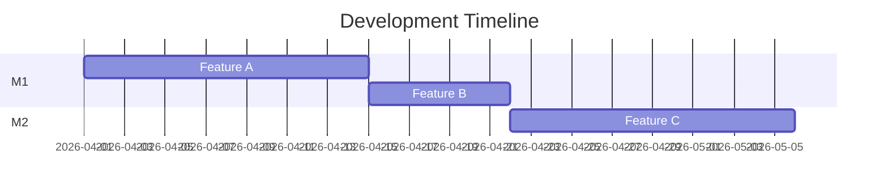

## Release Plan
| Tag | Milestone | Branch | What's Included |
|-----|-----------|--------|----------------|
| project/v0.1.0-rc.1 | M1 | dev | [features] |
| project/v0.1.0 | M1 | stable | [features] |

## Tech Debt Planned
| Item | When | Priority |
|------|------|----------|
```

---

#### 7. Testing Strategy — `testing_strategy.md`

Defines **how** to verify quality — test layers, tools, coverage targets.

```markdown
# Testing Strategy: [Project Name]

## Test Pyramid
| Layer | Tool | Target Coverage | What It Tests |
|-------|------|----------------|--------------|
| Unit | [Jest/JUnit/xUnit] | > 80% | Services, utils, domain logic |
| Integration | [Testcontainers/Supertest] | Key paths | DB queries, API contracts |
| E2E | [Playwright/Detox] | Critical flows | User journeys end-to-end |
| Load | [k6] | SLO thresholds | Performance under stress |

## Test Scenarios

### Unit Tests
| Module | What to Test | Priority |
|--------|-------------|----------|

### Integration Tests
| Flow | What to Test | Dependencies |
|------|-------------|-------------|

### E2E Tests
| Scenario | Platform | Steps | Expected Result |
|----------|----------|-------|----------------|

### Platform-specific Tests
| Platform | Tool | What to Test |
|----------|------|-------------|
| Web | Playwright | Cross-browser (Chrome, Firefox, Safari), responsive layouts |
| iOS | XCTest / Detox | Native gestures, push notifications, deep links, offline mode |
| Android | Espresso / Detox | Back button, intent handling, push notifications, offline mode |
| Unity | Unity Test Framework | 3D rendering, input handling, scene loading |

### Load Tests
| Scenario | Target | Threshold |
|----------|--------|----------|
| [scenario] | p99 < [X]ms | [concurrent users] |

## CI Integration
<!-- Which tests run in CI, which are manual -->
| Test Type | CI? | When |
|-----------|-----|------|
| Unit | ✅ | Every PR |
| Integration | ✅ | Every PR |
| E2E | ✅ | Before release |
| Load | ❌ Manual | Before release |

## Test Data Strategy
| Environment | Data Source | Reset |
|-------------|-----------|-------|
| Unit tests | In-memory mocks / fixtures | Every test run |
| Integration | Testcontainers (ephemeral DB) | Every test run |
| E2E | Seed script (`seed.ts` / `seed.sql`) | Before test suite |
| Load | Generated via k6 scripts | Before test run |

> Never use production data for testing. Always use generated/seeded data.

## Test Environment
| Environment | Purpose | How to Run |
|-------------|---------|-----------|
| Local | Developer machine | `docker compose up` + `npm test` |
| CI | GitHub Actions | Automated on every PR |
| Staging | Pre-release validation | `docker compose -f docker-compose.yml -f docker-compose.[project].yml up` |

## Regression Strategy
| Trigger | What Runs | Purpose |
|---------|----------|---------|
| Every PR | Unit + Integration + SAST/SCA | Catch regressions early |
| Before release (dev → stable) | Unit + Integration + E2E | Full regression |
| Weekly (scheduled) | Full suite + dependency scan | Catch env drift |

## Quality Gates
<!-- PR cannot merge if these fail -->
- [ ] All unit tests pass
- [ ] No lint errors
- [ ] No security scan findings (SAST/SCA)
- [ ] Coverage does not decrease
- [ ] No P0/P1 bugs open for this feature
```

---

### Feature Iteration (v1+)

For new features after initial release, don't rewrite docs. Follow this flow:

1. Write RFC (`rfcs/RFC-NNNN-feature-name.md`)
2. Update `prd.md` (add feature section)
3. Update `ui_ux_design.md` (new Figma screens)
4. Update `system_architecture.md` (if architecture changes)
5. Write ADR (`adrs/ADR-NNNN-decision-title.md`) for major tech decisions
6. Update `technical_design.md` (add feature detail)
7. Update `testing_strategy.md` (add test plan for feature)
8. Develop

### Document Update Frequency

| Document | When to Update | Version? |
|----------|---------------|----------|
| `conops.md` | Rarely — only when product direction changes | No — use git history |
| `prd.md` | Per major feature — append section, don't rewrite | No — use git history |
| `system_architecture.md` | Major architecture changes only | No — use git history |
| `technical_design.md` | Per feature — add implementation detail | No — use git history |
| `ui_ux_design.md` | Per feature — link new Figma screens | No — Figma has its own version history |
| `development_roadmap.md` | Per milestone — update timeline | No — use git history |
| `testing_strategy.md` | Per feature — add test plan | No — use git history |
| `adrs/` | Append only — one file per major decision, never edit old ADRs | No — sequential number |
| `rfcs/` | Per major feature — write before development, update status field | No — sequential number |

> **No document uses version numbers.** Git history is the single source of truth for document versioning. Use `git log -- docs/prd.md` to see the full history of any document.

### ADR (Architecture Decision Record)

Records **why** a technical decision was made. Written after making a tech choice. Never edited — if a decision is reversed, write a new ADR that supersedes it.

| Property | Description |
|---|---|
| **Answers** | Why did we choose A over B? |
| **When** | During initial development (phases 1, 3, 4) or feature iteration |
| **Size** | Short — one decision per file |
| **Editable** | No — append only. New ADR supersedes old one |

**Naming convention:** `ADR-NNNN-kebab-case-title.md`
- 4-digit sequential number (0001, 0002, ...)
- kebab-case title describing the decision
- No version numbers — sequential only
- To supersede: create new ADR referencing old one (e.g. `ADR-0005-supersede-0001-switch-to-rabbitmq.md`)

File: `adrs/ADR-0001-why-temporal-over-bull.md`

```markdown
# ADR-0001: Why Temporal over Bull for workflow engine

## Status
Accepted

## Context
We need a workflow engine for multi-step approval flows.

## Decision
Use Temporal instead of Bull.

## Reason
- Bull is a job queue, not a workflow engine
- Temporal supports long-running workflows with retry/timeout
- Temporal has built-in state persistence

## Consequences
- Need to run Temporal server (Docker, ~2.5GB RAM)
- Team needs to learn Temporal SDK
```

### RFC (Request for Comments)

A **proposal** written before developing a major feature. Describes the problem, proposed solution, and alternatives considered. Status is updated as it progresses.

| Property | Description |
|---|---|
| **Answers** | How should we implement this feature? |
| **When** | Before starting development of a major feature (v1+ iteration) |
| **Size** | Detailed — full proposal with alternatives |
| **Editable** | Yes — update status field only (Draft → Approved → Implemented → Superseded) |

**Naming convention:** `RFC-NNNN-kebab-case-title.md`
- 4-digit sequential number (0001, 0002, ...)
- kebab-case title describing the feature
- No version numbers — sequential only
- Status is updated in-place (the only field that changes)

File: `rfcs/RFC-0001-realtime-cursor-sync.md`

```markdown
# RFC-0001: Realtime Cursor Sync

## Status
Implemented (whiteboard/v0.3.0)

## Problem
Users can't see other people's cursors on the whiteboard.

## Proposal
WebSocket broadcast cursor position via Redis Pub/Sub,
throttled to 60fps.

## Alternatives Considered
1. Polling — too slow (200ms+ latency)
2. SSE — one-directional, can't send cursor from client

## Decision
Approved. Implemented in PR #15.
```

### ADR vs RFC

| | ADR | RFC |
|---|-----|-----|
| **Purpose** | Record a tech decision | Propose a feature implementation |
| **Timing** | After deciding | Before developing |
| **Scope** | One decision | One feature |
| **Mutability** | Never edit, only supersede | Update status field |

---

## Branch Strategy

### Long-lived Branches

| Branch   | Purpose                        | Default |
| -------- | ------------------------------ | ------- |
| `dev`    | Main development line          | ✅ Yes  |
| `stable` | Stable version / demo ready    | No      |

> No `main` branch. `dev` is the GitHub default branch.

### Feature Branches

Format: `<type>/#<issue-number>-<short-description>`

```
feature/#12-ai-whiteboard-canvas
fix/#5-websocket-reconnect
chore/#8-setup-ci
```

### Development Flow

```
1. Create Issue on GitHub
2. Create feature branch from dev
   └─ git checkout -b feature/#<issue>-xxx dev
3. Develop + Commit (with #issue in message)
4. Push feature branch
5. Create PR → dev
6. Merge PR (squash or merge commit)
7. When milestone ready: PR dev → stable + tag
```

> ⚠️ Never push before the issue exists.

### Release Flow (dev → stable)

```bash
gh pr create --base stable --title "🚀release: v0.x.0" --body "..."
# After merge, tag on stable
git checkout stable && git pull
git tag -a <project>/v0.x.0 -m "<project>/v0.x.0: <description>"
git push origin <project>/v0.x.0
```

---

## Commit Convention

### Format

```
<emoji><type>#<issue-number>: <short description>
```

If no issue number, use scope:

```
<emoji><type>(<scope>): <short description>
```

### Types & Emoji

| Type       | Emoji | Use Case                              |
| ---------- | ----- | ------------------------------------- |
| `feat`     | ✨    | New feature                           |
| `fix`      | 🐛    | Bug fix                               |
| `refactor` | ♻️    | Code refactoring (no behavior change) |
| `docs`     | 📘    | Documentation only                    |
| `test`     | 🧪    | Adding/updating tests                 |
| `chore`    | 📦    | Build, tooling, config changes        |
| `style`    | 🎨    | Formatting, whitespace (no logic)     |
| `init`     | 🎉    | Initial project setup                 |

### Rules

1. Emoji + Type always together, type lowercase
2. `#<number>` if linked to a GitHub issue
3. `(<scope>)` if no issue — e.g. `(whiteboard)`, `(ci)`
4. English, imperative mood, no period
5. Body: bullet points (optional for small commits)

---

## Tag Versioning

### Format

| Branch | Tag Format | Example |
|--------|-----------|---------|
| `dev` | `<project>/v<major>.<minor>.<patch>-rc.<n>` | `workspace/v0.2.0-rc.1` |
| `stable` | `<project>/v<major>.<minor>.<patch>` | `workspace/v0.2.0` |

**RC = Release Candidate** — a version that is feature-complete but not yet verified as stable. It's the "this should be ready, but let's test first" version. When an RC is promoted to `stable` without changes, the `-rc.N` suffix is dropped.

```
dev:    workspace/v0.2.0-rc.1  →  workspace/v0.2.0-rc.2  (fixes)
stable: workspace/v0.2.0       (promoted from rc.2, same code)
```

### Project Prefixes

| Prefix       | Project                    |
| ------------ | -------------------------- |
| `workspace`  | Global / cross-project     |
| `whiteboard` | Realtime AI Whiteboard     |
| `workflow`   | Enterprise Workflow System |
| `3d-asset`   | 3D Asset Collaboration     |

### Version Bumping (Conventional Commits + SemVer)

| Commit Type | Version Bump | Trigger |
| ----------- | ------------ | ------- |
| `fix`       | **patch** `0.0.X` | Bug fix, backward compatible |
| `feat`      | **minor** `0.X.0` | New feature, backward compatible |
| any + `BREAKING CHANGE` footer | **major** `X.0.0` | Not backward compatible |
| `docs`, `chore`, `style`, `refactor`, `test` | **no release** | No version bump |

> Automated via `release-please` GitHub Action. Triggers on push to both `dev` (RC tags) and `stable` (release tags).

---

## Branch Protection

> ⚠️ Deferred until repo is set to public (GitHub Free limitation).

Target rules:

| Branch   | Rules                                        |
| -------- | -------------------------------------------- |
| `dev`    | PR only, no direct push                      |
| `stable` | PR only, no direct push, require review      |

---

## CI/CD

- **CI**: GitHub Actions on self-hosted runner (macOS ARM64)
  - Runs on PR to `dev` and `stable`
  - Commit message lint (planned)
  - Per-project test jobs (planned)
- **CD**: None — all local development, no cloud deployment
- **Auto Review**: Claude Code reviews PRs with architecture mermaid diagrams
- **Auto Tag**: `release-please` creates tags on `stable` merges

---

## API Layer Pattern (Real vs Mock)

Every frontend must support switching between real backend and mock data via environment variable. This enables:
- **Local development** — `npm run dev` hits real backend
- **GitHub Pages demo** — `npm run build:demo` uses mock data (no server needed)
- **Testing** — mock client for unit/integration tests without backend

### File Structure

```
src/api/
├─ client.interface.ts    ← abstract API interface (TypeScript interface)
├─ real-client.ts         ← implements interface, fetches from real backend
├─ mock-client.ts         ← implements interface, returns mock JSON
├─ index.ts               ← factory — selects client based on env
└─ mocks/
    ├─ boards.json        ← mock data files
    └─ users.json
```

### Environment Switching

```typescript
// src/api/index.ts
import type { ApiClient } from './client.interface'
import { RealClient } from './real-client'
import { MockClient } from './mock-client'

const apiUrl = import.meta.env.VITE_API_URL

export const api: ApiClient = apiUrl
  ? new RealClient(apiUrl)
  : new MockClient()
```

### Scripts

```json
{
  "dev": "vite --mode local",
  "dev:mock": "vite --mode mock",
  "build": "vite build --mode local",
  "build:demo": "vite build --mode mock"
}
```

### Environment Files

```bash
# .env.local — real backend
VITE_API_URL=http://localhost:4001

# .env.mock — mock data (no value = MockClient)
# VITE_API_URL is intentionally not set
```

### Rules

- Every API call must go through `ApiClient` interface — never call `fetch` directly
- Mock client must return realistic data (same shape as real API)
- Mock data lives in `src/api/mocks/` as JSON files
- New API endpoints must be added to both real and mock clients simultaneously

---

## Coding Standards

### General Rules

| Rule | Standard |
|------|----------|
| Language | English for all code, comments, commit messages, docs |
| File naming | `kebab-case` for files, `PascalCase` for classes/components |
| Max file length | 300 lines — split if larger |
| Max function length | 40 lines — extract if larger |
| PR size | < 400 lines changed — split if larger |
| No magic numbers | Use named constants |
| No commented-out code | Delete it, git has history |

### Per-project Style

| Project | Language | Linter | Formatter |
|---------|---------|--------|-----------|
| Whiteboard | TypeScript | ESLint (strict) | Prettier |
| Workflow | Kotlin | ktlint | ktfmt |
| 3D Asset | C# | .NET Analyzers | dotnet format |

### Naming Conventions

| Context | Convention | Example |
|---------|-----------|---------|
| Variables / functions | camelCase (TS/Kotlin), camelCase (C#) | `getUserById` |
| Classes / interfaces | PascalCase | `WorkflowService` |
| Constants | UPPER_SNAKE_CASE | `MAX_UPLOAD_SIZE` |
| Database tables | snake_case | `approval_step` |
| API endpoints | kebab-case | `/api/v1/approval-steps` |
| Kafka topics | dot-separated | `workflow.approval-events` |
| Feature flags | dot-separated | `workflow.new-approval-ui` |

---

## Security Scanning

### Terminology

| Term | Full Name | What It Is |
|------|-----------|-----------|
| **OWASP** | Open Web Application Security Project | Top 10 web vulnerability categories (Injection, XSS, etc.) |
| **CWE** | Common Weakness Enumeration | Catalog of software weakness types (e.g. CWE-89: SQL Injection) |
| **CVE** | Common Vulnerabilities and Exposures | Known vulnerability in a specific package version (e.g. CVE-2024-xxxxx) |
| **CVSS** | Common Vulnerability Scoring System | Severity score 0-10 for a CVE (Critical ≥ 9.0, High ≥ 7.0, Medium ≥ 4.0, Low < 4.0) |
| **SAST** | Static Application Security Testing | Scan source code for vulnerabilities (CWE) without running it |
| **SCA** | Software Composition Analysis | Scan dependencies for known CVEs |
| **DAST** | Dynamic Application Security Testing | Scan running application for vulnerabilities |

### Scanning Layers

| Layer | Tool | What It Finds | When |
|-------|------|--------------|------|
| **SAST** | Semgrep | Code vulnerabilities (CWE), OWASP patterns | Every PR (CI) |
| **SCA** | Trivy | Dependency CVEs, license violations | Every PR (CI) + weekly |
| **Secret Scan** | gitleaks | Hardcoded API keys, passwords, tokens | Every PR (CI) + pre-commit hook |
| **Container Scan** | Trivy | Docker image CVEs | On image build |
| **Quality** | Semgrep | Code smell, complexity, anti-patterns | Every PR (CI) |
| **Perf** | k6 / Lighthouse | Performance regression | Before release |
| **DAST** | OWASP ZAP | Runtime vulnerabilities | Before release (manual) |
| **Claude Code Review** | Claude (local) | OWASP checklist, architecture risks, CWE patterns | Every PR (manual) |

### CVSS-based Fix Priority

| CVSS Score | Severity | Fix Deadline |
|-----------|----------|-------------|
| 9.0 - 10.0 | Critical | < 24 hours |
| 7.0 - 8.9 | High | < 48 hours |
| 4.0 - 6.9 | Medium | < 1 week |
| 0.1 - 3.9 | Low | Next sprint |

### CI Security Workflow

```
PR opened → GitHub Actions (ubuntu-latest):
├─ Semgrep (SAST)        — scan changed files for CWE patterns
├─ Trivy (SCA)           — scan lockfiles for dependency CVEs
├─ gitleaks (secrets)    — scan diff for leaked credentials
└─ Claude Code Review    — OWASP checklist + architecture risk (via gh pr comment)
```

### Claude Security Review Checklist

When reviewing a PR, Claude also checks:

| Category | Check |
|----------|-------|
| OWASP Injection | Parameterized queries? No string concatenation in SQL/NoSQL? |
| OWASP Auth | Token validation? Expiry check? No hardcoded secrets? |
| OWASP XSS | User input escaped? CSP headers? |
| OWASP Access Control | Authorization check on every endpoint? Resource-level ACL? |
| CWE-798 | No hardcoded credentials in code? |
| CWE-327 | Using strong cryptography? No MD5/SHA1 for passwords? |
| CWE-400 | Rate limiting on public endpoints? |
| Data exposure | No sensitive data in logs? No PII in error responses? |

---

## Tech Debt Tracking

### How to Track

- Label GitHub issues with `tech-debt`
- Include in project board under "Tech Debt" column
- Each tech debt issue must have: **Impact** (what breaks if not fixed) and **Cost** (effort to fix)

### Tech Debt Categories

| Category | Example | Priority |
|----------|---------|----------|
| **Code quality** | Duplicated logic, god class | Low — fix during related feature work |
| **Test coverage** | Missing integration tests | Medium — fix before next release |
| **Dependency** | Outdated package with known CVE | High — fix immediately |
| **Architecture** | Tight coupling between modules | Medium — plan dedicated refactor |
| **Performance** | N+1 queries, missing indexes | High — fix when SLO at risk |

### Paydown Strategy

- Allocate ~20% of each milestone for tech debt
- Critical (CVE, SLO at risk) — fix immediately
- Non-critical — batch into dedicated tech debt PRs

---

## Dependency Management

### Tools

| Project | Tool | Config |
|---------|------|--------|
| Whiteboard | Dependabot (GitHub native) | `.github/dependabot.yml` |
| Workflow | Dependabot | `.github/dependabot.yml` |
| 3D Asset | Dependabot | `.github/dependabot.yml` |

### Policy

| Rule | Standard |
|------|----------|
| Patch updates | Auto-merge if CI passes |
| Minor updates | Review changelog, merge within 1 week |
| Major updates | Create issue, assess breaking changes, plan migration |
| Security alerts | Fix within 48 hours (P1) |

### Dependabot Config

```yaml
# .github/dependabot.yml
version: 2
updates:
  - package-ecosystem: npm
    directory: /realtime_ai_whiteboard/backend
    schedule:
      interval: weekly
  - package-ecosystem: gradle
    directory: /enterprise_workflow_system/backend
    schedule:
      interval: weekly
  - package-ecosystem: nuget
    directory: /3d_asset_collaboration/backend
    schedule:
      interval: weekly
  - package-ecosystem: github-actions
    directory: /
    schedule:
      interval: weekly
```

---

## Git Identity

Per-repo config (not global):

```bash
git config user.name "wolf04"
git config user.email "mickey985ha@gmail.com"
```

## GitHub CLI

Switch to personal account before operations:

```bash
gh auth switch --user coyote7wolf
```
