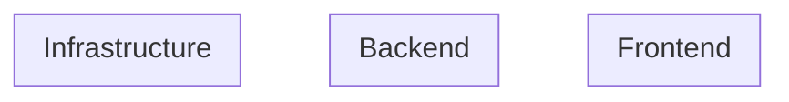
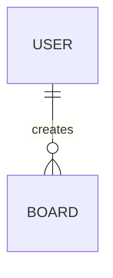
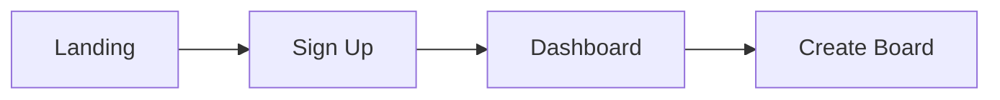
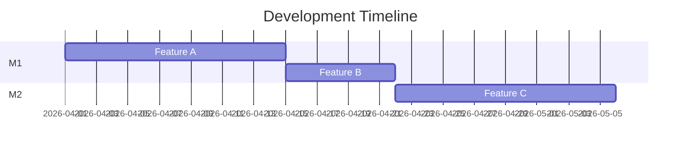

# Development Guidelines

## Development Phases

Each project follows the same document lifecycle. Phases are sequential for initial development.

### Initial Development (v0 → v1)

| Phase | Document | ADR? | Purpose |
|-------|----------|------|---------|
| 1 | `conops.md` | ✅ | Concept of Operations — see ConOps Required Sections below |
| 2 | `prd.md` | — | Product Requirements — features, user stories, acceptance criteria |
| 3 | `system_architecture.md` | ✅ | System design — components, data flow, infrastructure |
| 4 | `technical_design.md` | ✅ | Implementation detail — APIs, DB schema, algorithms |
| 5 | `ui_ux_design.md` | — | UI/UX — wireframes, Figma links, design system |
| 6 | `development_roadmap.md` | — | Timeline — milestones, priorities, dependencies |
| 7 | `testing_strategy.md` | — | Test plan — unit, integration, E2E, load |

> ADRs are written during initial development too — whenever a major tech decision is made (e.g. "Why Kafka over RabbitMQ?", "Why Yjs over OT?").

### Document Templates

---

#### 1. ConOps (Concept of Operations) — `conops.md`

Defines **what** the product is, **who** it's for, and **why** it matters.

```markdown
# ConOps: [Project Name]

## Product Vision
<!-- One-sentence definition of the product -->

## Industry Context
<!-- Which industry (SaaS / Semiconductor / Media), market landscape, competitors -->

## Target Users
<!-- User personas with role, goals, pain points -->
| Persona | Role | Goal | Pain Point |
|---------|------|------|------------|

## Core Scenarios
<!-- 3-5 primary user flows, written as user stories -->
### Scenario 1: [Name]
**As a** [persona], **I want to** [action], **so that** [outcome].
Flow: step 1 → step 2 → step 3

## OKR / Success Metrics
| Objective | Key Result | Target |
|-----------|-----------|--------|

## Risk Register
| Risk | Impact | Likelihood | Mitigation |
|------|--------|-----------|------------|

## ADRs Created
<!-- List ADRs written during this phase -->
- ADR-NNNN: [title]
```

---

#### 2. PRD (Product Requirements Document) — `prd.md`

Defines **what** to build — features, user stories, acceptance criteria.

```markdown
# PRD: [Project Name]

## Overview
<!-- 2-3 sentence product summary, link back to ConOps -->

## Feature List
| # | Feature | Priority | Status |
|---|---------|----------|--------|
| F1 | [name] | P0 (must-have) | Planned |
| F2 | [name] | P1 (should-have) | Planned |
| F3 | [name] | P2 (nice-to-have) | Planned |

## Feature Details

### F1: [Feature Name]
**User Story:** As a [persona], I want to [action], so that [outcome].

**Acceptance Criteria:**
- [ ] Given [context], when [action], then [result]
- [ ] Given [context], when [action], then [result]

**Edge Cases:**
- What happens when [edge case]?

**Out of Scope:**
- [explicitly excluded items]

<!-- Repeat for each feature -->

## Non-functional Requirements
| Requirement | Target |
|-------------|--------|
| Performance | p99 latency < [X]ms |
| Availability | [X]% uptime |
| Security | [OWASP, auth, encryption] |
| Scalability | [concurrent users, data volume] |
| i18n | [supported locales] |
| a11y | WCAG 2.1 AA |

## Dependencies
<!-- External systems, APIs, shared infra -->
```

---

#### 3. System Architecture — `system_architecture.md`

Defines **how** the system is structured — components, data flow, infrastructure.

```markdown
# System Architecture: [Project Name]

## Architecture Pattern
<!-- e.g. Modular Monolith, Clean Architecture, Hexagonal -->

## System Diagram
<!-- Mermaid diagram showing all systems and their connections -->


## Component Overview
| Component | Tech | Responsibility |
|-----------|------|---------------|

## Data Flow
<!-- Describe how data moves through the system for key scenarios -->
### Flow 1: [Scenario Name]
```
User → Frontend → API → DB → Response
```

## API Contracts
| Endpoint / Topic | Protocol | Direction | Description |
|-----------------|----------|-----------|-------------|

## Database Schema (High-level)
<!-- ER diagram or table list — detail goes in technical_design -->


## Infrastructure Dependencies
<!-- Which shared services does this project use -->
| Service | Purpose |
|---------|---------|

## Scalability Considerations
<!-- How would this scale? Horizontal, vertical, caching, CDN -->

## ADRs Created
- ADR-NNNN: [title]
```

---

#### 4. Technical Design — `technical_design.md`

Defines **implementation details** — API specs, DB schema, algorithms.

```markdown
# Technical Design: [Project Name]

## API Specification

### REST / GraphQL / gRPC
<!-- Detailed endpoint definitions -->
| Method | Path | Request | Response | Auth |
|--------|------|---------|----------|------|

### WebSocket / SignalR Events
| Event | Direction | Payload | Description |
|-------|-----------|---------|-------------|

## Database Schema (Detailed)
<!-- Full table definitions with types, constraints, indexes -->
### Table: [name]
| Column | Type | Constraints | Description |
|--------|------|------------|-------------|

### Indexes
| Table | Columns | Type | Purpose |
|-------|---------|------|---------|

### Migrations
<!-- Migration strategy and naming convention -->

## Authentication & Authorization
<!-- Token flow, role mapping, permission matrix -->
| Role | Permissions |
|------|------------|

## Error Handling
<!-- Error codes, response format, retry strategy -->

## Caching Strategy
<!-- What to cache, TTL, invalidation -->
| Key Pattern | TTL | Invalidation |
|-------------|-----|-------------|

## Background Jobs / Workers
<!-- Kafka consumers, Redis Stream workers, scheduled tasks -->
| Job | Trigger | Input | Output |
|-----|---------|-------|--------|

## Third-party Integrations
<!-- External APIs, SDKs -->

## ADRs Created
- ADR-NNNN: [title]
```

---

#### 5. UI/UX Design — `ui_ux_design.md`

Defines **how it looks and feels** — wireframes, Figma links, design system.

```markdown
# UI/UX Design: [Project Name]

## Design Principles
<!-- 3-5 guiding principles for this product's UX -->
1. [principle]
2. [principle]

## Figma Links
| Screen / Flow | Figma Link | Status |
|--------------|-----------|--------|
| Home | [Figma URL] | Draft / Review / Final |
| [Feature] | [Figma URL] | Draft / Review / Final |

## Figma Workflow
```
1. Claude writes UI spec (component list, layout, interactions)
2. Designer/developer creates wireframes in Figma
3. Review and iterate
4. Mark as "Final" when approved
5. Developer implements from Figma specs
6. Storybook components match Figma 1:1
```

## Screen Inventory
| Screen | Route | Components | Notes |
|--------|-------|-----------|-------|

## User Flows
<!-- Mermaid flowchart for key user journeys -->


## Component Library
| Component | Props | Variants | Storybook |
|-----------|-------|----------|-----------|

## Design Tokens
<!-- Reference to shared tokens/ directory -->
- Colors: `tokens/colors.json`
- Spacing: `tokens/spacing.json`
- Typography: `tokens/typography.json`

## Responsive Breakpoints
| Breakpoint | Width | Layout |
|-----------|-------|--------|
| Mobile | < 768px | Single column |
| Tablet | 768-1024px | Two column |
| Desktop | > 1024px | Full layout |

## Accessibility (a11y)
<!-- WCAG 2.1 AA checklist for this project -->
- [ ] Color contrast ≥ 4.5:1
- [ ] All images have alt text
- [ ] Keyboard navigable
- [ ] Screen reader tested
```

---

#### 6. Development Roadmap — `development_roadmap.md`

Defines **when** to build what — milestones, priorities, dependencies.

```markdown
# Development Roadmap: [Project Name]

## Milestones

### M1: [Milestone Name] — [Target Tag]
**Goal:** [one sentence]
**Duration:** [X weeks]

| Feature | Priority | Dependency | Status |
|---------|----------|-----------|--------|
| [feature] | P0 | — | Not started |
| [feature] | P0 | [depends on] | Not started |

### M2: [Milestone Name] — [Target Tag]
...

## Dependency Graph


## Release Plan
| Tag | Milestone | Branch | What's Included |
|-----|-----------|--------|----------------|
| project/v0.1.0-rc.1 | M1 | dev | [features] |
| project/v0.1.0 | M1 | stable | [features] |

## Tech Debt Planned
| Item | When | Priority |
|------|------|----------|
```

---

#### 7. Testing Strategy — `testing_strategy.md`

Defines **how** to verify quality — test layers, tools, coverage targets.

```markdown
# Testing Strategy: [Project Name]

## Test Pyramid
| Layer | Tool | Target Coverage | What It Tests |
|-------|------|----------------|--------------|
| Unit | [Jest/JUnit/xUnit] | > 80% | Services, utils, domain logic |
| Integration | [Testcontainers/Supertest] | Key paths | DB queries, API contracts |
| E2E | [Playwright/Detox] | Critical flows | User journeys end-to-end |
| Load | [k6] | SLO thresholds | Performance under stress |

## Test Scenarios

### Unit Tests
| Module | What to Test | Priority |
|--------|-------------|----------|

### Integration Tests
| Flow | What to Test | Dependencies |
|------|-------------|-------------|

### E2E Tests
| Scenario | Steps | Expected Result |
|----------|-------|----------------|

### Load Tests
| Scenario | Target | Threshold |
|----------|--------|----------|
| [scenario] | p99 < [X]ms | [concurrent users] |

## CI Integration
<!-- Which tests run in CI, which are manual -->
| Test Type | CI? | When |
|-----------|-----|------|
| Unit | ✅ | Every PR |
| Integration | ✅ | Every PR |
| E2E | ✅ | Before release |
| Load | ❌ Manual | Before release |

## Quality Gates
<!-- PR cannot merge if these fail -->
- [ ] All unit tests pass
- [ ] No lint errors
- [ ] No security scan findings (SAST/SCA)
- [ ] Coverage does not decrease
```

---

### Feature Iteration (v1+)

For new features after initial release, don't rewrite docs. Follow this flow:

1. Write RFC (`rfcs/RFC-NNNN-feature-name.md`)
2. Update `prd.md` (add feature section)
3. Update `system_architecture.md` (if architecture changes)
4. Write ADR (`adrs/ADR-NNNN-decision-title.md`) for major tech decisions
5. Update `technical_design.md` (add feature detail)
6. Update `ui_ux_design.md` (new Figma screens)
7. Update `testing_strategy.md` (add test plan for feature)
8. Develop

### Document Update Frequency

| Document | When to Update | Version? |
|----------|---------------|----------|
| `conops.md` | Rarely — only when product direction changes | No — use git history |
| `prd.md` | Per major feature — append section, don't rewrite | No — use git history |
| `system_architecture.md` | Major architecture changes only | No — use git history |
| `technical_design.md` | Per feature — add implementation detail | No — use git history |
| `ui_ux_design.md` | Per feature — link new Figma screens | No — Figma has its own version history |
| `development_roadmap.md` | Per milestone — update timeline | No — use git history |
| `testing_strategy.md` | Per feature — add test plan | No — use git history |
| `adrs/` | Append only — one file per major decision, never edit old ADRs | No — sequential number |
| `rfcs/` | Per major feature — write before development, update status field | No — sequential number |

> **No document uses version numbers.** Git history is the single source of truth for document versioning. Use `git log -- docs/prd.md` to see the full history of any document.

### ADR (Architecture Decision Record)

Records **why** a technical decision was made. Written after making a tech choice. Never edited — if a decision is reversed, write a new ADR that supersedes it.

| Property | Description |
|---|---|
| **Answers** | Why did we choose A over B? |
| **When** | During initial development (phases 1, 3, 4) or feature iteration |
| **Size** | Short — one decision per file |
| **Editable** | No — append only. New ADR supersedes old one |

**Naming convention:** `ADR-NNNN-kebab-case-title.md`
- 4-digit sequential number (0001, 0002, ...)
- kebab-case title describing the decision
- No version numbers — sequential only
- To supersede: create new ADR referencing old one (e.g. `ADR-0005-supersede-0001-switch-to-rabbitmq.md`)

File: `adrs/ADR-0001-why-temporal-over-bull.md`

```markdown
# ADR-0001: Why Temporal over Bull for workflow engine

## Status
Accepted

## Context
We need a workflow engine for multi-step approval flows.

## Decision
Use Temporal instead of Bull.

## Reason
- Bull is a job queue, not a workflow engine
- Temporal supports long-running workflows with retry/timeout
- Temporal has built-in state persistence

## Consequences
- Need to run Temporal server (Docker, ~2.5GB RAM)
- Team needs to learn Temporal SDK
```

### RFC (Request for Comments)

A **proposal** written before developing a major feature. Describes the problem, proposed solution, and alternatives considered. Status is updated as it progresses.

| Property | Description |
|---|---|
| **Answers** | How should we implement this feature? |
| **When** | Before starting development of a major feature (v1+ iteration) |
| **Size** | Detailed — full proposal with alternatives |
| **Editable** | Yes — update status field only (Draft → Approved → Implemented → Superseded) |

**Naming convention:** `RFC-NNNN-kebab-case-title.md`
- 4-digit sequential number (0001, 0002, ...)
- kebab-case title describing the feature
- No version numbers — sequential only
- Status is updated in-place (the only field that changes)

File: `rfcs/RFC-0001-realtime-cursor-sync.md`

```markdown
# RFC-0001: Realtime Cursor Sync

## Status
Implemented (whiteboard/v0.3.0)

## Problem
Users can't see other people's cursors on the whiteboard.

## Proposal
WebSocket broadcast cursor position via Redis Pub/Sub,
throttled to 60fps.

## Alternatives Considered
1. Polling — too slow (200ms+ latency)
2. SSE — one-directional, can't send cursor from client

## Decision
Approved. Implemented in PR #15.
```

### ADR vs RFC

| | ADR | RFC |
|---|-----|-----|
| **Purpose** | Record a tech decision | Propose a feature implementation |
| **Timing** | After deciding | Before developing |
| **Scope** | One decision | One feature |
| **Mutability** | Never edit, only supersede | Update status field |

---

## Branch Strategy

### Long-lived Branches

| Branch   | Purpose                        | Default |
| -------- | ------------------------------ | ------- |
| `dev`    | Main development line          | ✅ Yes  |
| `stable` | Stable version / demo ready    | No      |

> No `main` branch. `dev` is the GitHub default branch.

### Feature Branches

Format: `<type>/#<issue-number>-<short-description>`

```
feature/#12-ai-whiteboard-canvas
fix/#5-websocket-reconnect
chore/#8-setup-ci
```

### Development Flow

```
1. Create Issue on GitHub
2. Create feature branch from dev
   └─ git checkout -b feature/#<issue>-xxx dev
3. Develop + Commit (with #issue in message)
4. Push feature branch
5. Create PR → dev
6. Merge PR (squash or merge commit)
7. When milestone ready: PR dev → stable + tag
```

> ⚠️ Never push before the issue exists.

### Release Flow (dev → stable)

```bash
gh pr create --base stable --title "🚀release: v0.x.0" --body "..."
# After merge, tag on stable
git checkout stable && git pull
git tag -a <project>/v0.x.0 -m "<project>/v0.x.0: <description>"
git push origin <project>/v0.x.0
```

---

## Commit Convention

### Format

```
<emoji><type>#<issue-number>: <short description>
```

If no issue number, use scope:

```
<emoji><type>(<scope>): <short description>
```

### Types & Emoji

| Type       | Emoji | Use Case                              |
| ---------- | ----- | ------------------------------------- |
| `feat`     | ✨    | New feature                           |
| `fix`      | 🐛    | Bug fix                               |
| `refactor` | ♻️    | Code refactoring (no behavior change) |
| `docs`     | 📘    | Documentation only                    |
| `test`     | 🧪    | Adding/updating tests                 |
| `chore`    | 📦    | Build, tooling, config changes        |
| `style`    | 🎨    | Formatting, whitespace (no logic)     |
| `init`     | 🎉    | Initial project setup                 |

### Rules

1. Emoji + Type always together, type lowercase
2. `#<number>` if linked to a GitHub issue
3. `(<scope>)` if no issue — e.g. `(whiteboard)`, `(ci)`
4. English, imperative mood, no period
5. Body: bullet points (optional for small commits)

---

## Tag Versioning

### Format

| Branch | Tag Format | Example |
|--------|-----------|---------|
| `dev` | `<project>/v<major>.<minor>.<patch>-rc.<n>` | `workspace/v0.2.0-rc.1` |
| `stable` | `<project>/v<major>.<minor>.<patch>` | `workspace/v0.2.0` |

**RC = Release Candidate** — a version that is feature-complete but not yet verified as stable. It's the "this should be ready, but let's test first" version. When an RC is promoted to `stable` without changes, the `-rc.N` suffix is dropped.

```
dev:    workspace/v0.2.0-rc.1  →  workspace/v0.2.0-rc.2  (fixes)
stable: workspace/v0.2.0       (promoted from rc.2, same code)
```

### Project Prefixes

| Prefix       | Project                    |
| ------------ | -------------------------- |
| `workspace`  | Global / cross-project     |
| `whiteboard` | Realtime AI Whiteboard     |
| `workflow`   | Enterprise Workflow System |
| `3d-asset`   | 3D Asset Collaboration     |

### Version Bumping (Conventional Commits + SemVer)

| Commit Type | Version Bump | Trigger |
| ----------- | ------------ | ------- |
| `fix`       | **patch** `0.0.X` | Bug fix, backward compatible |
| `feat`      | **minor** `0.X.0` | New feature, backward compatible |
| any + `BREAKING CHANGE` footer | **major** `X.0.0` | Not backward compatible |
| `docs`, `chore`, `style`, `refactor`, `test` | **no release** | No version bump |

> Automated via `release-please` GitHub Action. Triggers on push to both `dev` (RC tags) and `stable` (release tags).

---

## Branch Protection

> ⚠️ Deferred until repo is set to public (GitHub Free limitation).

Target rules:

| Branch   | Rules                                        |
| -------- | -------------------------------------------- |
| `dev`    | PR only, no direct push                      |
| `stable` | PR only, no direct push, require review      |

---

## CI/CD

- **CI**: GitHub Actions on self-hosted runner (macOS ARM64)
  - Runs on PR to `dev` and `stable`
  - Commit message lint (planned)
  - Per-project test jobs (planned)
- **CD**: None — all local development, no cloud deployment
- **Auto Review**: Claude Code reviews PRs with architecture mermaid diagrams
- **Auto Tag**: `release-please` creates tags on `stable` merges

---

## Coding Standards

### General Rules

| Rule | Standard |
|------|----------|
| Language | English for all code, comments, commit messages, docs |
| File naming | `kebab-case` for files, `PascalCase` for classes/components |
| Max file length | 300 lines — split if larger |
| Max function length | 40 lines — extract if larger |
| PR size | < 400 lines changed — split if larger |
| No magic numbers | Use named constants |
| No commented-out code | Delete it, git has history |

### Per-project Style

| Project | Language | Linter | Formatter |
|---------|---------|--------|-----------|
| Whiteboard | TypeScript | ESLint (strict) | Prettier |
| Workflow | Kotlin | ktlint | ktfmt |
| 3D Asset | C# | .NET Analyzers | dotnet format |

### Naming Conventions

| Context | Convention | Example |
|---------|-----------|---------|
| Variables / functions | camelCase (TS/Kotlin), camelCase (C#) | `getUserById` |
| Classes / interfaces | PascalCase | `WorkflowService` |
| Constants | UPPER_SNAKE_CASE | `MAX_UPLOAD_SIZE` |
| Database tables | snake_case | `approval_step` |
| API endpoints | kebab-case | `/api/v1/approval-steps` |
| Kafka topics | dot-separated | `workflow.approval-events` |
| Feature flags | dot-separated | `workflow.new-approval-ui` |

---

## Security Scanning

### Terminology

| Term | Full Name | What It Is |
|------|-----------|-----------|
| **OWASP** | Open Web Application Security Project | Top 10 web vulnerability categories (Injection, XSS, etc.) |
| **CWE** | Common Weakness Enumeration | Catalog of software weakness types (e.g. CWE-89: SQL Injection) |
| **CVE** | Common Vulnerabilities and Exposures | Known vulnerability in a specific package version (e.g. CVE-2024-xxxxx) |
| **CVSS** | Common Vulnerability Scoring System | Severity score 0-10 for a CVE (Critical ≥ 9.0, High ≥ 7.0, Medium ≥ 4.0, Low < 4.0) |
| **SAST** | Static Application Security Testing | Scan source code for vulnerabilities (CWE) without running it |
| **SCA** | Software Composition Analysis | Scan dependencies for known CVEs |
| **DAST** | Dynamic Application Security Testing | Scan running application for vulnerabilities |

### Scanning Layers

| Layer | Tool | What It Finds | When |
|-------|------|--------------|------|
| **SAST** | Semgrep | Code vulnerabilities (CWE), OWASP patterns | Every PR (CI) |
| **SCA** | Trivy | Dependency CVEs, license violations | Every PR (CI) + weekly |
| **Secret Scan** | gitleaks | Hardcoded API keys, passwords, tokens | Every PR (CI) + pre-commit hook |
| **Container Scan** | Trivy | Docker image CVEs | On image build |
| **Quality** | Semgrep | Code smell, complexity, anti-patterns | Every PR (CI) |
| **Perf** | k6 / Lighthouse | Performance regression | Before release |
| **DAST** | OWASP ZAP | Runtime vulnerabilities | Before release (manual) |
| **Claude Code Review** | Claude (local) | OWASP checklist, architecture risks, CWE patterns | Every PR (manual) |

### CVSS-based Fix Priority

| CVSS Score | Severity | Fix Deadline |
|-----------|----------|-------------|
| 9.0 - 10.0 | Critical | < 24 hours |
| 7.0 - 8.9 | High | < 48 hours |
| 4.0 - 6.9 | Medium | < 1 week |
| 0.1 - 3.9 | Low | Next sprint |

### CI Security Workflow

```
PR opened → GitHub Actions (ubuntu-latest):
├─ Semgrep (SAST)        — scan changed files for CWE patterns
├─ Trivy (SCA)           — scan lockfiles for dependency CVEs
├─ gitleaks (secrets)    — scan diff for leaked credentials
└─ Claude Code Review    — OWASP checklist + architecture risk (via gh pr comment)
```

### Claude Security Review Checklist

When reviewing a PR, Claude also checks:

| Category | Check |
|----------|-------|
| OWASP Injection | Parameterized queries? No string concatenation in SQL/NoSQL? |
| OWASP Auth | Token validation? Expiry check? No hardcoded secrets? |
| OWASP XSS | User input escaped? CSP headers? |
| OWASP Access Control | Authorization check on every endpoint? Resource-level ACL? |
| CWE-798 | No hardcoded credentials in code? |
| CWE-327 | Using strong cryptography? No MD5/SHA1 for passwords? |
| CWE-400 | Rate limiting on public endpoints? |
| Data exposure | No sensitive data in logs? No PII in error responses? |

---

## Tech Debt Tracking

### How to Track

- Label GitHub issues with `tech-debt`
- Include in project board under "Tech Debt" column
- Each tech debt issue must have: **Impact** (what breaks if not fixed) and **Cost** (effort to fix)

### Tech Debt Categories

| Category | Example | Priority |
|----------|---------|----------|
| **Code quality** | Duplicated logic, god class | Low — fix during related feature work |
| **Test coverage** | Missing integration tests | Medium — fix before next release |
| **Dependency** | Outdated package with known CVE | High — fix immediately |
| **Architecture** | Tight coupling between modules | Medium — plan dedicated refactor |
| **Performance** | N+1 queries, missing indexes | High — fix when SLO at risk |

### Paydown Strategy

- Allocate ~20% of each milestone for tech debt
- Critical (CVE, SLO at risk) — fix immediately
- Non-critical — batch into dedicated tech debt PRs

---

## Dependency Management

### Tools

| Project | Tool | Config |
|---------|------|--------|
| Whiteboard | Dependabot (GitHub native) | `.github/dependabot.yml` |
| Workflow | Dependabot | `.github/dependabot.yml` |
| 3D Asset | Dependabot | `.github/dependabot.yml` |

### Policy

| Rule | Standard |
|------|----------|
| Patch updates | Auto-merge if CI passes |
| Minor updates | Review changelog, merge within 1 week |
| Major updates | Create issue, assess breaking changes, plan migration |
| Security alerts | Fix within 48 hours (P1) |

### Dependabot Config

```yaml
# .github/dependabot.yml
version: 2
updates:
  - package-ecosystem: npm
    directory: /realtime_ai_whiteboard/backend
    schedule:
      interval: weekly
  - package-ecosystem: gradle
    directory: /enterprise_workflow_system/backend
    schedule:
      interval: weekly
  - package-ecosystem: nuget
    directory: /3d_asset_collaboration/backend
    schedule:
      interval: weekly
  - package-ecosystem: github-actions
    directory: /
    schedule:
      interval: weekly
```

---

## Git Identity

Per-repo config (not global):

```bash
git config user.name "wolf04"
git config user.email "mickey985ha@gmail.com"
```

## GitHub CLI

Switch to personal account before operations:

```bash
gh auth switch --user coyote7wolf
```
