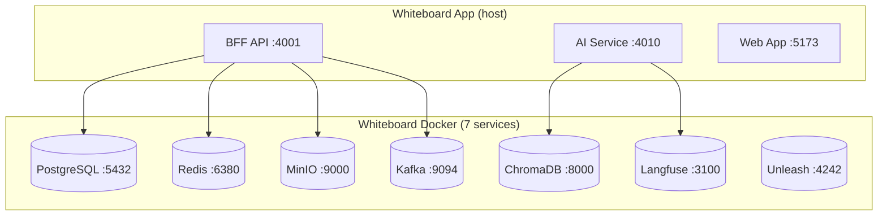
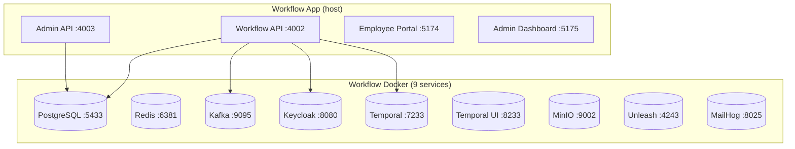
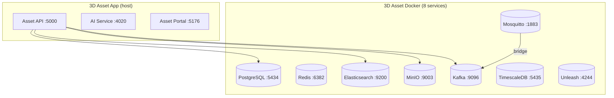

# Infrastructure

> All services run **locally** via Docker Compose. No cloud dependencies.

---

## Network Topology







---

## Docker Compose Structure

Each project has its own `docker-compose.yml` — run one project at a time.

```
realtime_ai_whiteboard/docker-compose.yml      # 7 infra services
enterprise_workflow_system/docker-compose.yml   # 9 infra services
3d_asset_collaboration/docker-compose.yml       # 8 infra services
```

```bash
# Start one project's infra
cd realtime_ai_whiteboard && docker compose up -d

# Stop
docker compose down

# Reset all data
docker compose down -v
```

---

## Port Mapping

### Whiteboard

| Service | Port | UI |
|---------|------|----|
| PostgreSQL | 5432 | — |
| Redis | 6380 | — |
| MinIO | 9000 / 9001 | http://localhost:9001 |
| Kafka | 9094 | — |
| ChromaDB | 8000 | — |
| Langfuse | 3100 | http://localhost:3100 |
| Unleash | 4242 | http://localhost:4242 |
| BFF API | 4001 | — |
| Yjs WebSocket | 4002 | — |
| AI Service | 4010 | — |
| Web App | 5173 | http://localhost:5173 |
| Mobile (Expo) | 8081 | — |

### Workflow

| Service | Port | UI |
|---------|------|----|
| PostgreSQL | 5433 | — |
| Redis | 6381 | — |
| Kafka | 9095 | — |
| Keycloak | 8080 | http://localhost:8080 |
| Temporal | 7233 | — |
| Temporal UI | 8233 | http://localhost:8233 |
| MinIO | 9002 / 9003 | http://localhost:9003 |
| Unleash | 4243 | http://localhost:4243 |
| MailHog | 1025 / 8025 | http://localhost:8025 |
| Workflow API | 4002 | — |
| Admin API | 4003 | — |
| Employee Portal | 5174 | http://localhost:5174 |
| Admin Dashboard | 5175 | http://localhost:5175 |

### 3D Asset

| Service | Port | UI |
|---------|------|----|
| PostgreSQL | 5434 | — |
| Redis | 6382 | — |
| Kafka | 9096 | — |
| MinIO | 9004 / 9005 | http://localhost:9005 |
| Elasticsearch | 9200 | — |
| TimescaleDB | 5435 | — |
| Mosquitto (MQTT) | 1883 | — |
| Unleash | 4244 | http://localhost:4244 |
| Asset API | 5000 | — |
| AI Service | 4020 | — |
| Asset Portal | 5176 | http://localhost:5176 |

---

## Messaging Patterns

| Pattern | Tech | Project | Use Case |
|---------|------|---------|----------|
| Event Streaming | Kafka | Whiteboard | AI task queue, analytics events |
| Event Sourcing | Kafka | Workflow | Immutable audit log, approval state changes |
| IoT → Event Stream | MQTT → Kafka | 3D Asset | Sensor data ingestion, bridged to Kafka |

### Kafka Topics

| Topic | Project | Purpose | Partition Key |
|-------|---------|---------|--------------|
| `workflow.approval-events` | Workflow | Approval state changes | `workflow_id` |
| `workflow.audit-log` | Workflow | Compliance audit trail (exactly-once) | `user_id` |
| `workflow.notifications` | Workflow | Async email/push notifications | `recipient_id` |
| `asset3d.iot-sensor-data` | 3D Asset | IoT sensor readings (from MQTT bridge) | `device_id` |
| `asset3d.asset-events` | 3D Asset | Asset upload, version, delete events | `asset_id` |

### Kafka Design Patterns

| Pattern | Where | Why |
|---------|-------|-----|
| **Event Sourcing** | `workflow.approval-events` | Immutable event log, rebuild state by replaying |
| **Exactly-once** | `workflow.audit-log` | Kafka transactions, critical for compliance |
| **Partitioning** | All topics | Order per entity, parallel across partitions |
| **Consumer Groups** | `workflow.notifications` | Horizontal scaling of notification workers |
| **MQTT → Kafka Bridge** | `asset3d.iot-sensor-data` | Lightweight MQTT ingestion, durable Kafka storage |

---

## Feature Toggles (Unleash)

| Flag | Project | Purpose |
|------|---------|---------|
| `whiteboard.ai-assistant` | Whiteboard | Gradual rollout of AI features |
| `whiteboard.guest-mode` | Whiteboard | Kill switch for anonymous access |
| `workflow.new-approval-ui` | Workflow | A/B test new approval interface |
| `workflow.kafka-audit` | Workflow | Switch audit log from DB to Kafka |
| `asset3d.iot-dashboard` | 3D Asset | Enable IoT data overlay on 3D view |
| `asset3d.versioned-upload` | 3D Asset | Enable asset version history |

---

## AI / LLM Pipeline (Whiteboard)

Local AI — no cloud APIs.

| Service | Tech | Port |
|---------|------|------|
| Ollama | Local LLM runtime (llama3.2:1b) | 11434 |
| ChromaDB | Vector DB for RAG | 8000 |
| Langfuse | LLM observability | 3100 |

```
User prompt
  → classify_intent (info retrieval or action?)
  → plan (ReAct pattern)
  → retrieve_context (embed query → ChromaDB → RAG)
  → execute_tools (MCP: create board, search, export)
  → generate_response (Ollama LLM)
  → reflect (quality check, retry if needed)
  → Langfuse trace
  → SSE stream to user
```

### MCP Tools

| Tool | What It Does |
|------|-------------|
| User Tool | Read/update user profile, preferences |
| Data Tool | Query board data, search content |
| Task Tool | Execute actions via Backend API |

---

## Email (MailHog)

| Feature | How |
|---------|-----|
| View emails | http://localhost:8025 |
| SMTP | `localhost:1025` |

Used by: Workflow (approval notifications, 2FA codes), 3D Asset (share notifications).

---

## 2FA (Keycloak)

Workflow project only. Keycloak built-in TOTP.

```
1. User enables 2FA in profile
2. Keycloak shows QR code
3. User scans with Google Authenticator
4. Next login: password + 6-digit TOTP code
```

---

## MinIO Buckets

| Bucket | Project | Versioned |
|--------|---------|-----------|
| `whiteboard-assets` | Whiteboard | No |
| `workflow-documents` | Workflow | No |
| `3d-assets` | 3D Asset | Yes |

---

## Resource Estimates

| Component | RAM |
|-----------|-----|
| Docker infra (per project) | ~3-4 GB |
| Backend services | ~1.5 GB |
| Ollama (llama3.2:1b) | ~1.5 GB |
| **Total (one project)** | **~6-7 GB** |

Fits comfortably on 16 GB Mac. Run one project at a time.
