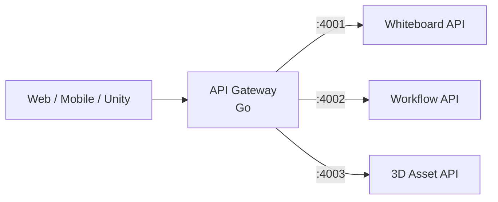
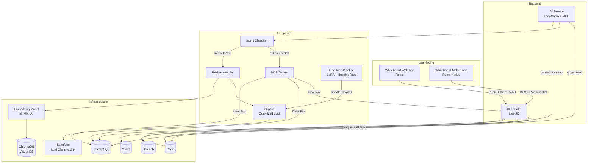
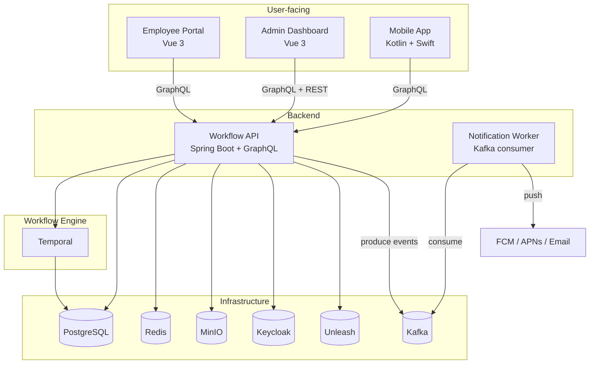
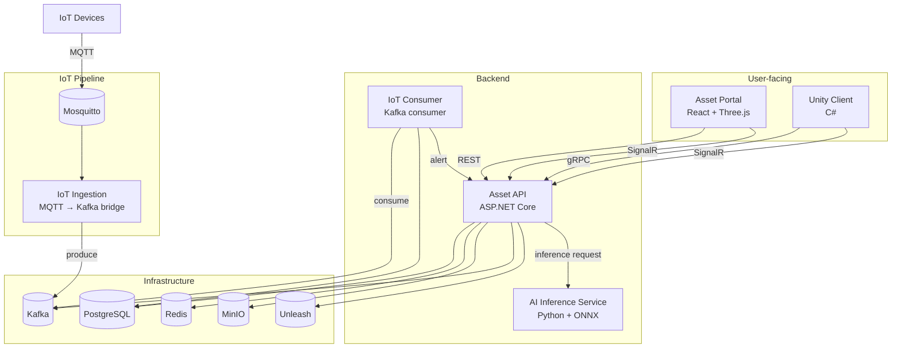

# Global Tech Stack

> All infrastructure runs **locally** — no cloud services. Docker Compose for orchestration.

---

## At a Glance

Three full-stack projects targeting different industries, each with a different tech stack, sharing the same local infrastructure.

| Dimension        | Whiteboard                | Workflow                   | 3D Asset                 |
| ---------------- | ------------------------- | -------------------------- | ------------------------ |
| **Industry**     | SaaS                      | Semiconductor / Manufacturing | Media / Advertising    |
| **Product Type** | Collaborative tool (Miro) | Approval system (Jira)     | DAM + Digital Twin       |
| **Frontend**     | React                     | Vue 3 + Admin Panel        | React + Three.js         |
| **Mobile**       | React Native              | Kotlin + Swift + WebView   | Unity (C#)               |
| **Backend**      | Node.js (NestJS)          | Kotlin (Spring Boot)       | ASP.NET Core             |
| **API Style**    | REST + WebSocket          | GraphQL                    | gRPC + REST              |
| **Realtime**     | Socket.IO + Yjs (CRDT)    | Temporal                   | SignalR + MQTT           |
| **Messaging**    | Redis Stream              | Kafka                      | MQTT → Kafka             |
| **Auth**         | JWT + Guest               | Keycloak (OAuth2 / SSO)    | API Key + JWT + ACL      |
| **Storage**      | MinIO                     | MinIO                      | MinIO (versioned)        |
| **Feature Flags**| Unleash                   | Unleash + Admin UI         | Unleash                  |
| **Remote Config**| Theme + AI toggle         | White-label branding       | Unity scene defaults     |
| **Analytics**    | Kafka events              | Kafka events + Admin       | Kafka events             |
| **AI**           | Ollama + LangChain        | —                          | ONNX Runtime (opt)       |

---

## Shared Infrastructure

All three projects connect to the same local services via Docker Compose.

| Service        | Tech                      | What It Does                             |
| -------------- | ------------------------- | ---------------------------------------- |
| Database       | PostgreSQL                | Relational data for all projects         |
| Cache          | Redis                     | Caching, Pub/Sub, Stream (Whiteboard AI queue) |
| Object Storage | MinIO (S3-compatible)     | File upload / download for all projects  |
| Identity       | Keycloak                  | OAuth2 / OIDC provider (Workflow project)|
| Event Streaming| Kafka (KRaft mode)        | Event bus for Workflow + 3D Asset        |
| IoT Broker     | Mosquitto (MQTT)          | IoT sensor ingestion (3D Asset project)  |
| Feature Flags  | Unleash                   | Feature toggles, A/B testing, kill switch|
| Email (local)  | MailHog                   | Local SMTP server — intercepts all emails|
| 2FA            | Keycloak (TOTP)           | Two-factor auth via Google Authenticator |
| Container      | Docker Compose            | One command to start everything          |

---

### Authentication

Each project uses a different strategy to match its use case.

| Project    | Method                       | Why This Approach                                |
| ---------- | ---------------------------- | ------------------------------------------------ |
| Whiteboard | JWT + Anonymous Guest        | Users need instant access — no forced sign-up    |
| Workflow   | Keycloak (OAuth2/OIDC + SSO) | Enterprise apps require SSO and role management  |
| 3D Asset   | API Key + JWT + Resource ACL | IoT devices and Unity clients can't do OAuth redirects |

<details>
<summary>Details per project</summary>

**Whiteboard** — Anonymous + authenticated hybrid:
```
Registered → Email/Password → Backend issues JWT
Guest      → Anonymous token (read-only, limited features)
```

**Workflow** — Enterprise SSO via Keycloak (Docker):
```
Keycloak (Identity Provider)
├─ OAuth2 Authorization Code Flow
├─ RBAC roles: Admin / Manager / Employee
├─ Spring Security integration
└─ Simulates corporate SSO locally
```

**3D Asset** — Mixed clients (browser + IoT + Unity):
```
API Key → IoT devices / Unity client (M2M)
JWT     → Web user login
ACL     → Owner / Editor / Viewer per asset
```

</details>

---

### File Upload / Download

All projects use MinIO with the same pattern:

```
Upload:   Client → multipart → Backend API → MinIO bucket
Download: Client ← presigned URL ← Backend API ← MinIO
```

| Project    | What Gets Uploaded                          | Bucket              |
| ---------- | ------------------------------------------- | ------------------- |
| Whiteboard | Images, exported PNG / PDF                  | `whiteboard-assets` |
| Workflow   | Form attachments, approval docs, reports    | `workflow-documents`|
| 3D Asset   | GLB / FBX models, textures, scene files     | `3d-assets`         |

> 3D Asset uses **gRPC bidirectional streaming** for large files (50MB+) and **versioned buckets** for asset history.

---

## System Overview (16 Systems)

### Shared — 1 System



| System | Tech | Purpose |
|--------|------|---------|
| API Gateway | **Go** (net/http + middleware) | Unified entry point, routing, rate limiting, auth token validation, request logging |

> Go is chosen for the gateway because of its low latency, small memory footprint, and excellent concurrency model — ideal for a proxy layer.

### Whiteboard — 5 Systems



### Workflow — 5 Systems



### 3D Asset — 5 Systems



### System Count Summary

| Project | User-facing | Backend | Async Workers | Total |
|---------|------------|---------|---------------|-------|
| Whiteboard | 2 (Web, Mobile) | 1 (BFF + API) | 2 (AI Service, Fine-tune Pipeline) | **5** |
| Workflow | 3 (Employee, Admin, Mobile) | 1 (Workflow API) | 1 (Notification Worker) | **5** |
| 3D Asset | 2 (Portal, Unity) | 1 (Asset API) | 3 (AI Service, IoT Ingestion, IoT Consumer) | **6** |
| Shared | — | 1 (API Gateway) | — | **1** |
| **Total** | **7** | **4** | **6** | **17** |

---

## Project Details

### 1. Realtime AI Whiteboard

**Industry:** SaaS — collaborative tool (think Miro + ChatGPT, fully local)

| Layer        | Tech                         |
| ------------ | ---------------------------- |
| Web          | React                        |
| Mobile       | React Native (iOS + Android) |
| Backend      | Node.js (NestJS)             |
| API          | REST + WebSocket             |
| Realtime     | WebSocket (Socket.IO)        |
| State Sync   | Yjs (CRDT)                   |
| DB           | PostgreSQL (schema-per-tenant)|
| Cache/Queue  | Redis (Pub/Sub + Stream)     |
| Storage      | MinIO                        |
| Auth         | JWT + Anonymous Guest        |
| Feature Flags| Unleash                      |
| AI / LLM     | Ollama (quantized) + LangChain |
| RAG          | Embedding → ChromaDB → RAG Assembler |
| MCP          | MCP Server (User / Data / Task tools) |
| Fine-tuning  | HuggingFace + LoRA           |
| LLM Observability | Langfuse                |
| Vector DB    | ChromaDB                     |

**Key technical decisions:**

| Challenge                  | Solution                                        |
| -------------------------- | ----------------------------------------------- |
| Multi-user editing conflicts | CRDT (Yjs) — conflict-free, no central lock    |
| Scale to multiple servers  | Redis Pub/Sub bridges WebSocket instances        |
| AI without cloud API costs | Ollama runs quantized LLM locally               |
| AI context awareness       | RAG — embed board content into ChromaDB, retrieve relevant context for prompts |
| AI tool execution          | MCP Server — LLM decides when to call tools (create board, search, export) |
| AI quality improvement     | LoRA fine-tuning on user feedback via HuggingFace pipeline |
| AI observability           | Langfuse traces every LLM call (latency, tokens, cost, quality) |
| Intent routing             | Classifier routes to info retrieval (RAG) or action execution (MCP) |
| One codebase, two platforms| React + React Native shared business logic       |
| Multi-tenancy (SaaS)      | Schema-per-tenant in PostgreSQL — data isolation |
| Usage metering             | Track API calls + storage per tenant → Kafka     |
| Subscription access control| Plan-based feature gating via Unleash            |

---

### 2. Enterprise Workflow System

**Industry:** Semiconductor / Manufacturing — approval and compliance system (think Jira + custom workflow engine)

| Layer           | Tech                                      |
| --------------- | ----------------------------------------- |
| Web             | Vue 3 + Pinia + Element Plus              |
| Admin Panel     | Vue 3 (user mgmt, config, analytics)      |
| Mobile          | Kotlin (Android) + Swift (iOS) + WebView  |
| Backend         | Kotlin + Spring Boot                      |
| API             | GraphQL                                   |
| Workflow Engine | Temporal                                  |
| Event Streaming | Kafka (KRaft)                             |
| DB              | PostgreSQL                                |
| Cache           | Redis                                     |
| Storage         | MinIO                                     |
| Auth            | Keycloak (OAuth2/OIDC + SSO + RBAC)      |
| Feature Flags   | Unleash + Admin UI                        |

**Key technical decisions:**

| Challenge                    | Solution                                       |
| ---------------------------- | ---------------------------------------------- |
| Complex multi-step approvals | Temporal — durable workflow with retry/timeout  |
| Enterprise-grade permissions | Keycloak RBAC (Admin / Manager / Employee)      |
| Audit compliance (SOC 2)    | Kafka event sourcing — immutable audit log with exactly-once guarantee |
| Data retention policy        | Kafka log retention + PostgreSQL archival       |
| Async notifications          | Kafka consumer groups — horizontal scaling of notification workers |
| Native + Web with shared UI  | WebView for shared screens, native for platform features |

---

### 3. 3D Asset Collaboration (Digital Twin + AIoT)

**Industry:** Media / Advertising — DAM (Digital Asset Management) + Digital Twin + IoT dashboard

| Layer           | Tech                         |
| --------------- | ---------------------------- |
| Web             | React + Three.js             |
| Client          | Unity (C#)                   |
| Backend         | ASP.NET Core                 |
| API             | gRPC + REST                  |
| Realtime        | SignalR                      |
| IoT Broker      | MQTT (Mosquitto)             |
| Event Streaming | Kafka (via MQTT → Kafka bridge) |
| DB              | PostgreSQL                   |
| Cache           | Redis (Pub/Sub)              |
| Storage         | MinIO (versioned)            |
| Auth            | API Key + JWT + Resource ACL |
| Feature Flags   | Unleash                      |
| AI Service      | Python + FastAPI + ONNX Runtime |

**Key technical decisions:**

| Challenge                      | Solution                                        |
| ------------------------------ | ----------------------------------------------- |
| Large 3D files (50MB+)        | gRPC bidirectional stream + versioned MinIO      |
| DAM asset library              | Tagging, search, preview, version tree per asset |
| Cross-brand asset sharing      | Tenant-scoped buckets + resource-level ACL       |
| IoT sensor data ingestion     | MQTT (Mosquitto) → Kafka bridge → consumer processing |
| IoT data ordering             | Kafka partitioning by `device_id` — ordered per device, parallel across devices |
| Browser 3D preview            | Three.js renders GLB/FBX without Unity install   |
| Unity ↔ Web state sync        | SignalR + Redis Pub/Sub as shared message bus     |
| Device auth (no browser)      | API Key for M2M, JWT for web users               |
| Asset state tracking          | Kafka compacted topic as materialized view of current asset state |

---

## Observability (Production Knowledge)

Not part of local Docker setup, but each project uses structured logging for debuggability.

| Project    | Logging Library | Format |
| ---------- | --------------- | ------ |
| Whiteboard | Pino (Node.js)  | Structured JSON |
| Workflow   | Logback (Kotlin)| Structured JSON |
| 3D Asset   | Serilog (.NET)  | Structured JSON |

> In production, these would feed into Prometheus + Grafana (metrics) and OpenTelemetry + Jaeger (tracing). Not included in local setup to keep the focus on application code.

---

## Architecture Patterns

Each project uses a different architecture pattern at every layer to demonstrate breadth.

### Frontend Architecture

| Project | Pattern | State Management | Why |
|---------|---------|-----------------|-----|
| Whiteboard | Feature-based + Flux | Zustand | Canvas-heavy, feature modules, unidirectional data flow |
| Workflow | MVVM | Pinia | Vue 3 is naturally MVVM, Pinia as ViewModel layer |
| 3D Asset | Clean Architecture (3 layers) | Zustand | Presentation → Domain → Data, complex 3D scene logic needs clear separation |

```
Frontend Clean Architecture (3D Asset):
┌─────────────────────┐
│  Presentation Layer  │  ← React components, Three.js views
├─────────────────────┤
│    Domain Layer      │  ← Business logic, entities, use cases
├─────────────────────┤
│     Data Layer       │  ← API clients (gRPC/REST), local cache
└─────────────────────┘
```

### Backend Architecture

| Project | Pattern | Layers | Why |
|---------|---------|--------|-----|
| Whiteboard | Modular Monolith | NestJS Modules (board, auth, ai, storage) | Single service, module-isolated. No microservice overhead needed |
| Workflow | Clean Architecture + DDD + CQRS | Controller → UseCase → Domain → Infrastructure | Enterprise-grade, domain logic decoupled from framework. Read/write separation for complex queries |
| 3D Asset | Hexagonal (Ports & Adapters) | Core ← Ports (interfaces) ← Adapters (gRPC, REST, MQTT, MinIO) | Multiple I/O adapters (gRPC, REST, MQTT), core logic unchanged |

```
Backend Clean Architecture (Workflow):
┌──────────────────────┐
│   Controller Layer    │  ← GraphQL resolvers, REST endpoints
├──────────────────────┤
│   Application Layer   │  ← Use cases, command/query handlers (CQRS)
├──────────────────────┤
│     Domain Layer      │  ← Entities, Aggregate Roots, Value Objects, Domain Events (DDD)
├──────────────────────┤
│  Infrastructure Layer │  ← Repositories, Kafka producer, Keycloak client, Temporal client
└──────────────────────┘
```

```
Hexagonal Architecture (3D Asset):
              ┌─────────────────┐
  gRPC ──────►│                 │
  REST ──────►│   Core Logic    │──────► MinIO (storage)
  MQTT ──────►│  (Ports/Ifaces) │──────► PostgreSQL (data)
  SignalR ───►│                 │──────► Kafka (events)
              └─────────────────┘
```

### System Architecture

| Pattern | Project | Implementation |
|---------|---------|---------------|
| **BFF (Backend for Frontend)** | Whiteboard | Separate API surface for Web (`/api/web/`) and Mobile (`/api/mobile/`) — different payload shapes, pagination, and auth flows |
| **EDA (Event-Driven Architecture)** | Workflow, 3D Asset | Kafka event bus — services communicate via events, not direct API calls |
| **CQRS** | Workflow | Write: Temporal workflows + Kafka events. Read: dedicated read model (materialized view) for GraphQL queries |
| **Saga Pattern** | Workflow | Multi-step approval as distributed transaction — orchestrated by Temporal with compensation logic |
| **DDD (Domain-Driven Design)** | Workflow | Bounded Contexts: Approval, User, Notification. Aggregate Roots: Workflow, Step. Domain Events: StepApproved, WorkflowCompleted |
| **Repository Pattern** | All | Abstract DB access behind interfaces — enables testing with in-memory repositories |
| **API Gateway** | All | Single entry point routes to 3 backends, handles rate limiting and auth token validation |

### Architecture Summary

| Layer | Whiteboard | Workflow | 3D Asset |
|-------|-----------|----------|----------|
| **Frontend** | Feature-based + Flux | MVVM | Clean Architecture |
| **Backend** | Modular Monolith | Clean Arch + DDD + CQRS | Hexagonal |
| **System** | BFF | EDA + Saga | EDA |
| **State** | Zustand | Pinia | Zustand |
| **Data Access** | Repository (Prisma) | Repository (Exposed) | Repository (EF Core) |

> Staff-level interview signal: "Why did you choose this architecture? What are the trade-offs?"

---

## API Design Strategy

Each project uses a different API style to demonstrate breadth.

| Project    | API Style         | Why                                            |
| ---------- | ----------------- | ---------------------------------------------- |
| Whiteboard | REST + WebSocket  | Simple CRUD + realtime — no over-engineering   |
| Workflow   | GraphQL           | Complex relational queries (approvals, roles)  |
| 3D Asset   | gRPC + REST       | gRPC streaming for large file transfer, REST for web |

<details>
<summary>Details per project</summary>

**Whiteboard** — REST for CRUD, WebSocket for realtime:
```
GET  /api/boards/:id        → fetch board
POST /api/boards             → create board
WS   /ws/board/:id          → realtime cursor + drawing sync
```

**Workflow** — GraphQL for flexible queries:
```graphql
query {
  workflow(id: "...") {
    steps { assignee { name, role } status }
    attachments { url, uploadedAt }
  }
}
```

**3D Asset** — gRPC for streaming, REST for web:
```
gRPC  AssetService.Upload    → chunked bidirectional stream
gRPC  AssetService.Download  → server-side stream
REST  GET /api/assets/:id    → metadata + presigned URL
```

</details>

---

## Resilience Patterns

| Pattern              | Tech                        | Project    |
| -------------------- | --------------------------- | ---------- |
| Circuit Breaker      | Resilience4j (Spring Boot)  | Workflow   |
| Retry + Exp. Backoff | Polly (.NET)                | 3D Asset   |
| Retry + Backoff      | NestJS built-in / axios-retry | Whiteboard |
| Graceful Degradation | AI offline fallback         | Whiteboard |
| Timeout / Deadline   | Temporal activity timeout   | Workflow   |
| Bulkhead             | Resilience4j                | Workflow   |

> Whiteboard: if Ollama is down, AI features gracefully degrade — users can still draw and collaborate.

---

## Testing Strategy

| Layer       | Tool                  | Project    | What It Tests                     |
| ----------- | --------------------- | ---------- | --------------------------------- |
| Unit        | Jest                  | Whiteboard | Services, utils, pure functions   |
| Unit        | JUnit 5               | Workflow   | Services, domain logic            |
| Unit        | xUnit                 | 3D Asset   | Services, domain logic            |
| Integration | Testcontainers        | Workflow   | DB queries, Temporal workflows    |
| E2E         | Playwright            | Whiteboard | Multi-user realtime collaboration |
| Load        | k6                    | 3D Asset   | Large file upload stress test     |
| API         | Supertest             | Whiteboard | REST endpoint contracts           |
| API         | REST Assured          | Workflow   | GraphQL query validation          |

> Staff-level interview signal: "How do you decide what to test and at what layer?"

---

## Security & Compliance

Demonstrates understanding of SOC 2 / ISO 27001 controls without formal certification.

### OWASP Top 10 Coverage

| Risk                  | Mitigation                                | Project    |
| --------------------- | ----------------------------------------- | ---------- |
| Injection (SQL/NoSQL) | Parameterized queries, ORM (Prisma / Exposed / EF Core) | All |
| Broken Auth           | Keycloak (OAuth2), JWT validation, token expiry | All |
| Sensitive Data Exposure | TLS in transit, MinIO encryption at rest | All |
| XXE                   | Disable external entity parsing           | Workflow   |
| Broken Access Control | RBAC (Keycloak), Resource ACL             | Workflow, 3D Asset |
| Security Misconfiguration | Hardened Docker images, no default passwords | All |
| XSS                   | React/Vue auto-escaping, CSP headers      | All        |
| Insecure Deserialization | Input validation, DTO schemas           | All        |

### SOC 2 / ISO 27001 Aligned Controls

| Control                | Implementation                             | Project    |
| ---------------------- | ------------------------------------------ | ---------- |
| Audit Log              | All operations logged: who / what / when   | Workflow   |
| Encryption at rest     | MinIO server-side encryption (SSE-S3)      | 3D Asset   |
| Encryption in transit  | TLS everywhere (HTTPS, WSS, gRPCs)        | All        |
| RBAC / Least privilege | Keycloak role mapping, resource-level ACL  | Workflow, 3D Asset |
| Input validation       | DTO validation at API boundary             | All        |
| Secret management      | `.env` + Docker secrets (no hardcoded secrets) | All    |
| Data retention policy  | Auto-cleanup old asset versions            | 3D Asset   |
| Incident response      | Structured logging + Grafana alerts        | All        |

> Staff-level interview signal: "How do you approach security in your systems?"

---

## Database Patterns

| Pattern              | Tech / Approach                          | Project    |
| -------------------- | ---------------------------------------- | ---------- |
| Migration            | Prisma Migrate                           | Whiteboard |
| Migration            | Flyway                                   | Workflow   |
| Migration            | EF Core migrations                       | 3D Asset   |
| Indexing strategy     | Composite indexes on hot query paths     | All        |
| Query optimization   | EXPLAIN ANALYZE, N+1 detection           | All        |
| Connection pooling   | Prisma pool / HikariCP / Npgsql          | All        |
| Soft delete          | `deleted_at` timestamp                   | Workflow   |
| Optimistic locking   | Version column for concurrent edits      | 3D Asset   |

---

## Caching Strategy

| Pattern           | Implementation                        | Project    |
| ----------------- | ------------------------------------- | ---------- |
| Cache-aside       | Redis GET → miss → DB → SET           | All        |
| Write-through     | Update DB + Redis in same transaction | Workflow   |
| Cache invalidation | Event-driven invalidation via Redis Pub/Sub | Whiteboard |
| TTL-based expiry  | Short TTL for volatile data           | All        |
| Session cache     | Redis for JWT session metadata        | Workflow   |

---

## Architecture Decision Records (ADR)

Each major technical choice is documented as an ADR in project docs.

| ADR | Decision | Project |
| --- | -------- | ------- |
| ADR-001 | Why Temporal over Bull for workflow engine | Workflow |
| ADR-002 | Why gRPC for 3D asset transfer | 3D Asset |
| ADR-003 | Why Keycloak over Auth0 for enterprise auth | Workflow |
| ADR-004 | Why Yjs (CRDT) over OT for collaborative editing | Whiteboard |
| ADR-005 | Why MQTT over WebSocket for IoT ingestion | 3D Asset |
| ADR-006 | Why GraphQL over REST for workflow queries | Workflow |

> ADR format: Context → Decision → Consequences. Stored in each project's `docs/` folder.

---

## Performance

| Concern              | Approach                                  | Project    |
| -------------------- | ----------------------------------------- | ---------- |
| N+1 query detection  | DataLoader (GraphQL), eager loading       | Workflow   |
| Connection pooling   | Prisma pool / HikariCP / Npgsql          | All        |
| Throttling           | Cursor sync throttled to 60fps max       | Whiteboard |
| Lazy loading         | Three.js progressive LOD for 3D models   | 3D Asset   |
| Bundle size          | Code splitting, tree shaking             | All (web)  |
| Image optimization   | Sharp (Node.js) for thumbnail generation | Whiteboard |
| Profiling            | Clinic.js / async-profiler / dotnet-trace | Per runtime |

---

## Mobile Engineering

### Offline-first

| Project | Strategy | Sync |
|---------|----------|------|
| Whiteboard | CRDT (Yjs) — edit offline, auto-merge on reconnect | Conflict-free by design |
| Workflow | Local SQLite cache, queue pending approvals | Sync on reconnect, server wins |
| 3D Asset | Cache asset metadata locally, defer uploads | Background upload when online |

### Push Notifications

| Project | Android | iOS | Use Case |
|---------|---------|-----|----------|
| Whiteboard | FCM | APNs | "@mention in board", "AI result ready" |
| Workflow | FCM | APNs | "Approval pending", "Step rejected", "Deadline approaching" |
| 3D Asset | FCM via Unity | APNs via Unity | "Asset upload complete", "IoT alert" |

> Push notification service runs as a Kafka consumer — reads from `workflow.notifications` / `analytics.*-events` topics.

### Deep Linking

| Project | Android | iOS | Example |
|---------|---------|-----|---------|
| Whiteboard | App Links | Universal Links | `app://whiteboard/board/123` → opens board |
| Workflow | App Links | Universal Links | `app://workflow/approval/456` → opens approval |
| 3D Asset | Unity Deep Link | Unity Deep Link | `app://asset3d/asset/789` → opens 3D viewer |

### OTA Updates (Over-the-Air)

| Project | Tech | What It Updates |
|---------|------|----------------|
| Whiteboard | Expo Updates (React Native) | JS bundle — no app store release needed |
| Workflow | — (native apps) | Relies on Remote Config for dynamic changes |
| 3D Asset | Unity Addressables | Scene configs, shader patches |

### Crash Reporting

All mobile apps use **Sentry** (self-hosted via Docker, or free tier) for crash reporting and performance monitoring.

| Metric | What It Tracks |
|--------|---------------|
| Crash-free rate | % of sessions without crashes |
| App startup time | Cold start / warm start duration |
| Frame rate | UI jank detection (< 60fps) |
| ANR (Android) | Application Not Responding events |

### Mobile Performance Budgets

| Metric | Target | How to Measure |
|--------|--------|---------------|
| Cold start | < 2s | Sentry App Start span |
| Warm start | < 500ms | Sentry App Start span |
| Frame rate | 60fps (no jank) | Sentry frame tracking |
| JS bundle (RN) | < 2MB | `npx react-native-bundle-visualizer` |
| APK size | < 30MB | Android Studio APK Analyzer |
| IPA size | < 40MB | Xcode App Thinning report |
| Memory (idle) | < 100MB | Xcode Instruments / Android Profiler |
| TTI (Time to Interactive) | < 3s | Lighthouse (web) / custom span (mobile) |

> Performance budgets are enforced in CI — build fails if bundle size exceeds limit.

### CI/CD for Mobile

| Project | Platform | Build Tool | Distribution |
|---------|---------|-----------|-------------|
| Whiteboard | React Native | **Fastlane** + Expo EAS | TestFlight (iOS), Play Console Internal Track (Android) |
| Workflow | Native | **Fastlane** | TestFlight (iOS), Play Console Internal Track (Android) |
| 3D Asset | Unity | Unity Cloud Build or local `BuildPipeline` | TestFlight (iOS), Play Console Internal Track (Android) |

```
Fastlane workflow:
1. fastlane match (code signing / provisioning)
2. fastlane build (archive IPA / APK)
3. fastlane pilot (upload to TestFlight) / fastlane supply (upload to Play Console)
```

> Local dev: Fastlane runs on Mac. CI: GitHub Actions self-hosted runner (for code signing keychain access).

---

## SLA / SLO / SLI

Service Level definitions for each project — demonstrates production-readiness thinking.

| Term | Definition |
|------|-----------|
| **SLI** (Indicator) | The metric you measure (e.g. request latency) |
| **SLO** (Objective) | The target for that metric (e.g. p99 latency < 200ms) |
| **SLA** (Agreement) | The business promise (e.g. 99.9% uptime or credits issued) |

### Per-project SLOs

| SLI | Whiteboard SLO | Workflow SLO | 3D Asset SLO |
|-----|---------------|-------------|-------------|
| API latency (p99) | < 200ms | < 300ms | < 500ms (large file ops excluded) |
| Availability | 99.9% | 99.95% (enterprise) | 99.9% |
| Error rate | < 0.5% | < 0.1% (compliance) | < 0.5% |
| WebSocket reconnect | < 3s | — | < 3s (SignalR) |
| File upload success | > 99% | > 99% | > 99.5% (chunked resume) |
| Push notification delivery | — | < 30s from event | < 60s from alert |

### How to Monitor (Production Knowledge)

| SLI | How to Measure |
|-----|---------------|
| Latency | Structured log timestamps / OpenTelemetry spans |
| Availability | Health check endpoint (`/health`) + uptime probe |
| Error rate | Count 5xx responses / total responses |
| Burn rate | Remaining error budget consumption rate |

> In local development, SLOs are not enforced. These define the production targets to design for.
> Staff-level interview signal: "How do you define and monitor SLOs? What happens when you burn your error budget?"

---

## API Versioning

| Project | API Style | Versioning Strategy |
|---------|----------|-------------------|
| Whiteboard | REST | URL path: `/api/v1/boards`, `/api/v2/boards` |
| Workflow | GraphQL | Schema evolution — deprecate fields, add new ones. No version in URL |
| 3D Asset | gRPC | Package versioning: `asset.v1.AssetService`, `asset.v2.AssetService` |

> Staff-level interview signal: "How do you handle breaking API changes without disrupting clients?"

---

## API Documentation

| Project | API Style | Documentation Tool |
|---------|----------|-------------------|
| Whiteboard | REST | OpenAPI 3.0 (Swagger UI at `/api/docs`) |
| Workflow | GraphQL | GraphQL Playground + auto-generated schema docs |
| 3D Asset | gRPC + REST | Protobuf `.proto` files + Buf documentation. REST via OpenAPI |

---

## Internationalization (i18n)

| Layer | Approach | Project |
|-------|----------|---------|
| Web (React) | `react-i18next` — JSON translation files | Whiteboard, 3D Asset |
| Web (Vue) | `vue-i18n` — JSON translation files | Workflow |
| Mobile (RN) | `react-i18next` (shared with web) | Whiteboard |
| Mobile (Native) | Android `strings.xml` + iOS `Localizable.strings` | Workflow |
| Mobile (Unity) | Unity Localization package | 3D Asset |
| Backend | Error messages and email templates | All |

**Supported locales:** `en`, `zh-TW` (minimum). Extensible to more.

> Translation files stored in each project's repo. Backend returns error codes, frontend maps to localized strings.

---

## Accessibility (a11y)

| Standard | Implementation | Project |
|----------|---------------|---------|
| WCAG 2.1 AA | Semantic HTML, ARIA labels, keyboard navigation | All web |
| Color contrast | Minimum 4.5:1 ratio, checked in Design System | All web |
| Screen reader | VoiceOver (iOS) / TalkBack (Android) tested | All mobile |
| Focus management | Logical tab order, visible focus indicators | All web |
| Reduced motion | `prefers-reduced-motion` media query respected | Whiteboard (animations) |

> Staff-level interview signal: "How do you ensure your app is accessible?"

---

## Build Pipeline / Toolchain

| Project | Bundler | Runtime | Package Manager | Config |
|---------|---------|---------|----------------|--------|
| Whiteboard (Web) | Vite | Node.js 20 | pnpm | `vite.config.ts` |
| Whiteboard (Mobile) | Metro (Expo) | Node.js 20 | pnpm | `metro.config.js` |
| Workflow (Web) | Vite | Node.js 20 | pnpm | `vite.config.ts` |
| Workflow (Backend) | Gradle (Kotlin) | JVM 21 | Gradle | `build.gradle.kts` |
| 3D Asset (Web) | Vite | Node.js 20 | pnpm | `vite.config.ts` |
| 3D Asset (Backend) | .NET SDK | .NET 8 | NuGet | `*.csproj` |
| 3D Asset (Client) | Unity | Unity 2022 LTS | Unity Package Manager | `Packages/manifest.json` |

### Why Vite

| vs Webpack | Vite Advantage |
|-----------|---------------|
| Dev server startup | Instant (native ESM) vs slow (full bundle) |
| HMR | < 50ms vs seconds |
| Build | Rollup-based, tree-shaking |
| Config | Minimal vs verbose |

> All web frontends use **Vite**. Webpack is not used anywhere — Vite is the modern standard.

### Monorepo Tooling

```
fullstack_ai_workspace/
├─ packages/
│   └─ shared/                  ← cross-project shared library
│       ├─ src/
│       │   ├─ validation/      ← input validation schemas (Zod)
│       │   ├─ types/           ← shared TypeScript types
│       │   ├─ utils/           ← date formatting, error helpers
│       │   └─ constants/       ← shared constants, error codes
│       ├─ package.json
│       └─ tsconfig.json
├─ realtime_ai_whiteboard/
├─ enterprise_workflow_system/
└─ 3d_asset_collaboration/
```

| Shared Library | What's Inside | Used By |
|---------------|--------------|---------|
| `@workspace/shared` | Zod schemas, TS types, error codes, date utils | Whiteboard (FE+BE), 3D Asset (FE) |

> Workflow (Kotlin/Vue) can't use the TS shared lib directly — it defines its own Kotlin equivalents. But the **API contract types** (error codes, enum values) are kept in sync.

---

## Design System

Each project has its own component library with Storybook for documentation and visual testing.

| Project | Framework | Component Library | Storybook | Tokens |
|---------|----------|------------------|-----------|--------|
| Whiteboard | React | Custom components (canvas-focused) | ✅ `localhost:6006` | CSS variables |
| Workflow | Vue 3 | Element Plus (extended) | ✅ `localhost:6007` | CSS variables |
| 3D Asset | React | Custom components (3D viewer widgets) | ✅ `localhost:6008` | CSS variables |

### Storybook

Each project runs its own Storybook instance for component development and documentation.

```bash
# Start Storybook per project
cd realtime_ai_whiteboard/web && npm run storybook    # :6006
cd enterprise_workflow_system/web && npm run storybook # :6007
cd 3d_asset_collaboration/web && npm run storybook     # :6008
```

| Feature | What It Does |
|---------|-------------|
| Component catalog | Browse all UI components in isolation |
| Visual testing | Chromatic or Percy for visual regression (optional) |
| Interaction testing | `@storybook/test` for component-level tests |
| Docs | Auto-generated props/API documentation |
| Accessibility | `@storybook/addon-a11y` for WCAG checks per component |

> Staff-level interview signal: "How do you maintain UI consistency across a large codebase?"

**Shared design tokens** (colors, spacing, typography) are defined in a `tokens/` directory and consumed by all frontends:

```
tokens/
├─ colors.json       ← brand colors, semantic colors
├─ spacing.json      ← 4px grid system
├─ typography.json   ← font families, sizes, weights
└─ breakpoints.json  ← responsive breakpoints
```

> Tokens support white-label / brand switching via Remote Config.

---

## Rate Limiting

| Layer | Tech | Strategy |
|-------|------|----------|
| API Gateway level | Nginx / Express middleware | Token bucket per IP |
| Per-user | Redis sliding window | X requests per minute per user |
| Per-tenant (SaaS) | Redis + Unleash | Plan-based limits (Free: 100/min, Pro: 1000/min) |

| Project | Limits |
|---------|--------|
| Whiteboard | 100 API calls/min (free), 1000/min (pro) |
| Workflow | 500 API calls/min (enterprise) |
| 3D Asset | 50 uploads/hour, 200 API calls/min |

---

## Pagination

| Project | API Style | Pagination Strategy | Why |
|---------|----------|--------------------|----|
| Whiteboard | REST | Cursor-based (`?cursor=abc&limit=20`) | Realtime data — offset breaks when items are added/removed |
| Workflow | GraphQL | Relay-style connections (`first`, `after`) | GraphQL standard, cursor-based |
| 3D Asset | REST + gRPC | Offset-based (`?page=1&size=20`) for REST, token-based for gRPC stream | Asset list is relatively stable |

> Staff-level interview signal: "When do you use cursor vs offset pagination?"

---

## Error Handling Strategy

All backends return a consistent error response format:

```json
{
  "error": {
    "code": "APPROVAL_NOT_FOUND",
    "message": "Approval with ID 456 not found",
    "details": {},
    "request_id": "uuid",
    "timestamp": "2026-03-19T10:00:00Z"
  }
}
```

| Concern | Approach |
|---------|----------|
| Error codes | Domain-specific enum (not HTTP status alone) |
| Request tracing | `request_id` in every response for debugging |
| Client display | Frontend maps `error.code` → localized user message (i18n) |
| Logging | All errors logged with `request_id` + stack trace |
| Sensitive data | Never expose internal details (DB errors, stack traces) in production |

---

## Tech Diversity Overview

| Dimension         | Whiteboard              | Workflow                    | 3D Asset                  |
| ----------------- | ----------------------- | --------------------------- | ------------------------- |
| **Industry**      | SaaS                    | Semiconductor / Mfg         | Media / Advertising       |
| FE Architecture   | Feature-based + Flux    | MVVM                        | Clean Architecture        |
| BE Architecture   | Modular Monolith        | Clean Arch + DDD + CQRS     | Hexagonal (Ports & Adapters) |
| System Pattern    | BFF                     | EDA + Saga                  | EDA                       |
| Language (BE)     | TypeScript              | Kotlin                      | C# + Python (AI) + Go (Gateway) |
| Language (FE)     | TypeScript (React)      | TypeScript (Vue 3)          | TypeScript (React)        |
| Language (Mobile) | TypeScript (RN)         | Kotlin + Swift              | C# (Unity)                |
| State Management  | Zustand                 | Pinia                       | Redux Toolkit (RTK)       |
| API Style         | REST + WebSocket        | GraphQL                     | gRPC + REST               |
| API Versioning    | URL path (`/v1/`)       | Schema evolution             | Proto package version     |
| API Docs          | OpenAPI / Swagger       | GraphQL Playground          | Protobuf + Buf            |
| Auth              | JWT + Guest             | Keycloak OAuth2/SSO         | API Key + JWT + ACL       |
| Realtime          | Socket.IO + CRDT        | Temporal                    | SignalR + MQTT            |
| Messaging         | Redis Stream            | Kafka                       | MQTT → Kafka              |
| Multi-tenancy     | Schema-per-tenant       | Row-level (org_id)          | Bucket-per-tenant         |
| Feature Flags     | Unleash                 | Unleash + Admin UI          | Unleash                   |
| Remote Config     | Theme + AI toggle       | White-label branding        | Unity scene defaults      |
| Analytics         | Kafka events            | Kafka events + Admin        | Kafka events              |
| Offline-first     | CRDT auto-merge         | SQLite cache + queue        | Metadata cache + deferred upload |
| Push Notifications| FCM + APNs              | FCM + APNs                  | FCM + APNs (via Unity)    |
| OTA Updates       | Expo Updates            | Remote Config               | Unity Addressables        |
| i18n              | react-i18next           | vue-i18n                    | Unity Localization        |
| a11y              | WCAG 2.1 AA             | WCAG 2.1 AA                 | WCAG 2.1 AA              |
| Design System     | Custom (canvas)         | Element Plus (extended)     | Custom (3D widgets)       |
| Storybook         | ✅ :6006                | ✅ :6007                    | ✅ :6008                  |
| Email / 2FA       | —                       | MailHog + Keycloak TOTP     | MailHog                   |
| Pagination        | Cursor-based            | Relay connections           | Offset-based              |
| Rate Limiting     | Plan-based (SaaS)       | Enterprise fixed            | Upload + API limits       |
| Data Access       | Repository (Prisma)     | Repository (Exposed)        | Repository (EF Core)      |
| Resilience        | Retry + Graceful        | Circuit Breaker + Bulkhead  | Retry + Backoff           |
| Testing           | Jest + Playwright       | JUnit + Testcontainers      | xUnit + k6                |
| Logging           | Pino                    | Logback                     | Serilog                   |
| ORM / DB Access   | Prisma                  | Exposed                     | EF Core                   |
| DB Migration      | Prisma Migrate          | Flyway                      | EF Core Migrations        |
| Bundler           | Vite                    | Vite + Gradle               | Vite + .NET SDK           |
| Shared Library    | `@workspace/shared`     | Kotlin equivalents          | `@workspace/shared`       |

> Every dimension uses a different approach across the three projects — maximum breadth for portfolio demonstration.
> Each project targets a different industry to demonstrate domain adaptability.
