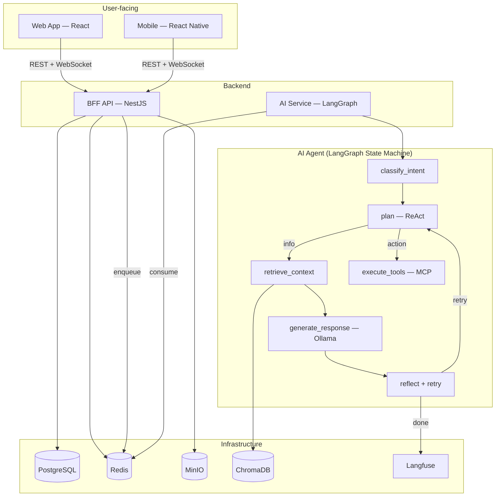
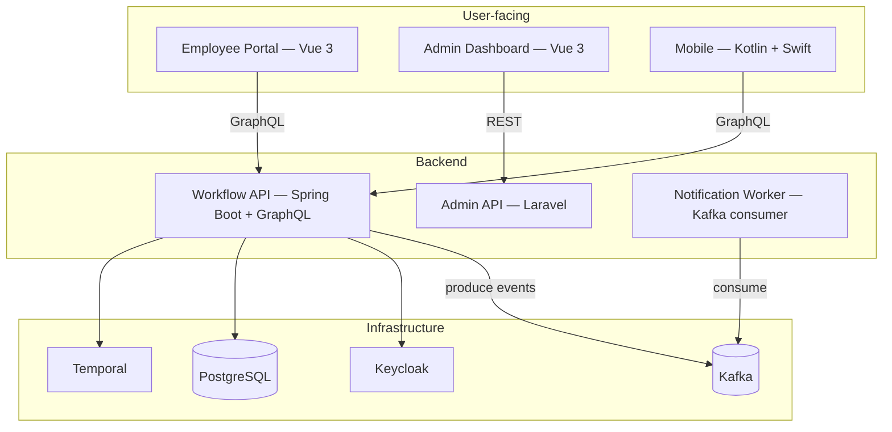
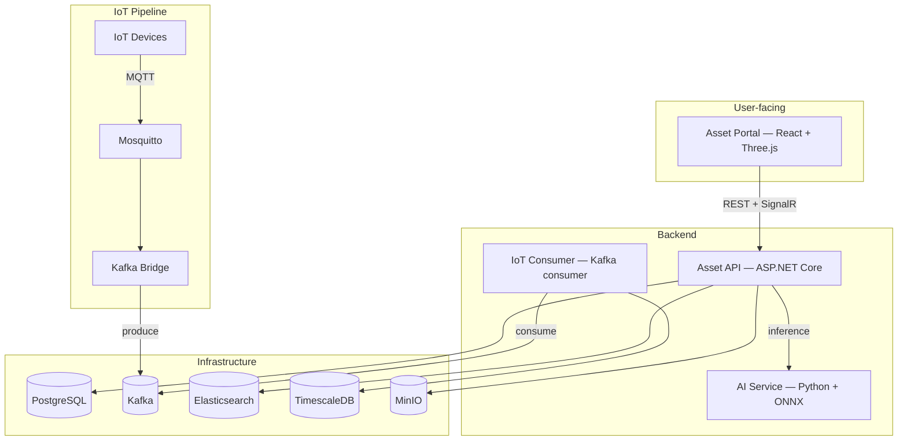

# Tech Stack

> All infrastructure runs **locally** — no cloud services. Docker Compose per project.

---

## At a Glance

| Dimension | Whiteboard | Workflow | 3D Asset |
|-----------|-----------|----------|----------|
| **Industry** | SaaS | Semiconductor | Media / Advertising |
| **Frontend** | React | Vue 3 | React + Three.js |
| **Mobile** | React Native (Expo) | Kotlin + Swift | React Native (Expo) |
| **Backend** | Node.js (NestJS) | Kotlin (Spring Boot) + PHP (Laravel) | ASP.NET Core + Python (FastAPI) |
| **API Style** | REST + WebSocket + SSE | GraphQL + Subscriptions | gRPC + SignalR + REST |
| **Realtime** | Yjs CRDT + WebSocket | Temporal | SignalR + MQTT |
| **Messaging** | Kafka | Kafka | MQTT → Kafka |
| **Auth** | JWT + Guest | Keycloak (OAuth2/SSO + 2FA) | API Key + JWT + ACL |
| **AI** | LangGraph + RAG + MCP | — | ONNX Runtime |
| **Architecture** | Modular Monolith + BFF | Clean Arch + DDD + CQRS | Hexagonal (Ports & Adapters) |

---

## Shared Infrastructure

All three projects connect to the same local services via Docker Compose.

| Service | Tech | Used By |
|---------|------|---------|
| Database | PostgreSQL | All |
| Cache | Redis | All |
| Object Storage | MinIO (S3-compatible) | All |
| Event Streaming | Kafka (KRaft mode) | All |
| Feature Flags | Unleash | All |
| Identity | Keycloak | Workflow |
| IoT Broker | Mosquitto (MQTT) | 3D Asset |
| Search | Elasticsearch | 3D Asset |
| Time-series DB | TimescaleDB | 3D Asset |
| Vector DB | ChromaDB | Whiteboard |
| LLM Observability | Langfuse | Whiteboard |
| Email (local) | MailHog | Workflow |

### Authentication

Each project uses a different strategy to match its use case.

| Project | Method | Why |
|---------|--------|-----|
| Whiteboard | JWT + Anonymous Guest | Users need instant access — no forced sign-up |
| Workflow | Keycloak (OAuth2/OIDC + SSO) | Enterprise apps require SSO and role management |
| 3D Asset | API Key + JWT + Resource ACL | IoT devices can't do OAuth redirects |

### File Upload / Download

All projects use MinIO with the same pattern:

```
Upload:   Client → multipart → Backend API → MinIO bucket
Download: Client ← presigned URL ← Backend API ← MinIO
```

> 3D Asset uses **gRPC bidirectional streaming** for large files (50MB+) and **versioned buckets** for asset history.

---

## Architecture

### Whiteboard — Modular Monolith + BFF



**Key decisions:**

| Challenge | Solution |
|-----------|----------|
| Multi-user editing conflicts | CRDT (Yjs) — conflict-free, no central lock |
| AI without cloud API costs | Ollama runs quantized LLM locally |
| AI multi-step reasoning | LangGraph state machine: classify → plan → retrieve → execute → generate → reflect |
| AI context awareness | RAG — embed board content into ChromaDB, retrieve relevant context |
| AI tool execution | MCP Server — agent decides when to call tools |
| Multi-tenancy (SaaS) | Schema-per-tenant in PostgreSQL |

### Workflow — Clean Architecture + DDD + CQRS



```
Backend Layers:
┌──────────────────────┐
│   Controller Layer    │  GraphQL resolvers, REST endpoints
├──────────────────────┤
│   Application Layer   │  Use cases, command/query handlers (CQRS)
├──────────────────────┤
│     Domain Layer      │  Entities, Aggregate Roots, Domain Events (DDD)
├──────────────────────┤
│  Infrastructure Layer │  Repositories, Kafka, Keycloak, Temporal client
└──────────────────────┘
```

**Key decisions:**

| Challenge | Solution |
|-----------|----------|
| Complex multi-step approvals | Temporal — durable workflow with retry/timeout |
| Enterprise-grade permissions | Keycloak RBAC (Admin / Manager / Employee) |
| Audit compliance | Kafka event sourcing — immutable audit log, exactly-once |
| Async notifications | Kafka consumer groups — horizontal scaling |

### 3D Asset — Hexagonal (Ports & Adapters)



```
Hexagonal Architecture:
            ┌─────────────────┐
REST ──────►│                 │──────► MinIO (storage)
gRPC ──────►│   Core Logic    │──────► PostgreSQL (data)
MQTT ──────►│  (Ports/Ifaces) │──────► Kafka (events)
SignalR ───►│                 │──────► Elasticsearch (search)
            └─────────────────┘
```

**Key decisions:**

| Challenge | Solution |
|-----------|----------|
| Large 3D files (50MB+) | gRPC bidirectional stream + versioned MinIO |
| Full-text asset search | Elasticsearch — 100x faster than SQL LIKE |
| IoT time-series storage | TimescaleDB — optimized for time-bucketed queries |
| IoT data ordering | Kafka partitioning by `device_id` |
| Browser 3D preview | Three.js renders GLB/FBX without Unity install |

---

## API Design

| Project | Style | Versioning | Docs |
|---------|-------|-----------|------|
| Whiteboard | REST + WebSocket + SSE | URL path `/api/v1/` | OpenAPI (Swagger) |
| Workflow | GraphQL | Schema evolution (deprecate fields) | GraphQL Playground |
| 3D Asset | gRPC + REST | Proto package `asset.v1.AssetService` | Protobuf `.proto` files |

---

## Resilience

| Pattern | Tech | Project |
|---------|------|---------|
| Circuit Breaker + Bulkhead | Resilience4j | Workflow |
| Retry + Exponential Backoff | Polly (.NET) | 3D Asset |
| Retry + Graceful Degradation | axios-retry + AI fallback | Whiteboard |
| Timeout / Deadline | Temporal activity timeout | Workflow |

> Whiteboard: if Ollama is down, AI features degrade gracefully — users can still draw and collaborate.

---

## Database

| Pattern | Whiteboard | Workflow | 3D Asset |
|---------|-----------|----------|----------|
| ORM | Prisma | Exposed (Kotlin) | EF Core |
| Migration | Prisma Migrate | Flyway | EF Core Migrations |
| Multi-tenancy | Schema-per-tenant | Row-level (org_id) | Bucket-per-tenant |
| Connection pool | Prisma pool | HikariCP | Npgsql |

---

## Caching

| Pattern | Implementation | Project |
|---------|---------------|---------|
| Cache-aside | Redis GET → miss → DB → SET | All |
| Write-through | Update DB + Redis in same transaction | Workflow |
| Event-driven invalidation | Redis Pub/Sub | Whiteboard |
| TTL-based expiry | Short TTL for volatile data | All |

---

## Security

### OWASP Top 10

| Risk | Mitigation |
|------|-----------|
| Injection | Parameterized queries via ORM (Prisma / Exposed / EF Core) |
| Broken Auth | Keycloak (OAuth2), JWT validation, token expiry |
| XSS | React/Vue auto-escaping, CSP headers |
| Broken Access Control | RBAC (Keycloak), Resource ACL, tenant isolation |
| Security Misconfiguration | Hardened Docker images, no default passwords |

### Compliance Controls

| Control | Implementation |
|---------|---------------|
| Audit Log | Kafka event sourcing — who / what / when (Workflow) |
| Encryption at rest | MinIO server-side encryption |
| Encryption in transit | TLS (HTTPS, WSS, gRPCs) |
| RBAC / Least privilege | Keycloak role mapping, resource-level ACL |
| Input validation | DTO validation at API boundary |

---

## Testing

| Layer | Whiteboard | Workflow | 3D Asset |
|-------|-----------|----------|----------|
| Unit | Jest | JUnit 5 | xUnit |
| Integration | — | Testcontainers | — |
| E2E | Playwright | — | — |
| API | Supertest | REST Assured | — |
| Load | — | — | k6 |

---

## Observability

| Project | Logging | Format |
|---------|---------|--------|
| Whiteboard | Pino (Node.js) | Structured JSON |
| Workflow | Logback (Kotlin) | Structured JSON |
| 3D Asset | Serilog (.NET) | Structured JSON |

> Production targets: Prometheus + Grafana (metrics), OpenTelemetry + Jaeger (tracing). Not included in local setup.

---

## ADR (Architecture Decision Records)

| ADR | Decision | Project |
|-----|----------|---------|
| 001 | Temporal over Bull for workflow engine | Workflow |
| 002 | gRPC for 3D asset transfer (streaming large files) | 3D Asset |
| 003 | Keycloak over Auth0 (self-hosted, no vendor lock-in) | Workflow |
| 004 | Yjs CRDT over OT for collaborative editing | Whiteboard |
| 005 | MQTT over WebSocket for IoT ingestion | 3D Asset |
| 006 | GraphQL over REST for workflow queries | Workflow |

---

## Build & Tooling

| Project | Bundler | Runtime | Package Manager |
|---------|---------|---------|----------------|
| Whiteboard (Web) | Vite | Node.js 20 | pnpm |
| Whiteboard (Mobile) | Metro (Expo) | Node.js 20 | pnpm |
| Workflow (Web) | Vite | Node.js 20 | pnpm |
| Workflow (Backend) | Gradle | JVM 17 | Gradle |
| 3D Asset (Web) | Vite | Node.js 20 | pnpm |
| 3D Asset (Backend) | .NET SDK | .NET 8 | NuGet |

---

## i18n

| Project | Web | Mobile |
|---------|-----|--------|
| Whiteboard | react-i18next | react-i18next (shared) |
| Workflow | vue-i18n | Android `strings.xml` + iOS `Localizable.strings` |
| 3D Asset | react-i18next | react-i18next (shared) |

Supported locales: `en`, `zh-TW`. Extensible.
