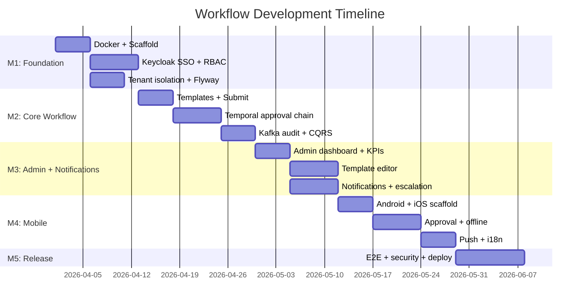

# Development Roadmap: Enterprise Workflow System

## Effort Estimation Method

Using **T-shirt sizing** (same as workspace-wide convention).

## Definition of Done

- [ ] Code reviewed and merged to `dev`
- [ ] Unit tests written and passing
- [ ] API documented (GraphQL schema / OpenAPI for REST)
- [ ] UI matches Figma (if applicable)
- [ ] Storybook story added (if UI component)
- [ ] Feature flag configured in Unleash (if gradual rollout)
- [ ] Analytics event implemented (if user-facing)
- [ ] No lint or security scan errors

## Milestones

### M1: Foundation — `workflow/v0.1.0`

**Goal:** Docker infra (including Temporal + Keycloak), project scaffold, SSO auth, RBAC, feature flags.
**Duration:** 3 weeks

| Feature | Priority | Size | Platform | System | Dependency | Status |
|---------|----------|------|----------|--------|-----------|--------|
| Docker Compose (PG, Redis, Kafka, MinIO, Keycloak, Temporal, Unleash, MailHog) | P0 | L | — | Infra | — | Not started |
| Spring Boot project scaffold (Kotlin + DGS GraphQL) | P0 | M | — | Workflow API | Docker | Not started |
| Laravel project scaffold (Admin API) | P0 | M | — | Admin API | Docker PG | Not started |
| Vue 3 project scaffold (Vite + Pinia + Element Plus) — Employee Portal | P0 | M | Web | Employee Portal | — | Not started |
| Vue 3 project scaffold — Admin Dashboard | P0 | M | Web | Admin Dashboard | — | Not started |
| Keycloak SSO integration (OAuth2 PKCE + Spring Security) | P0 | XL | Web | Workflow API + Portal | Keycloak Docker | Not started |
| RBAC (Admin / Manager / Employee) | P0 | L | — | Workflow API + Keycloak | SSO | Not started |
| 2FA (TOTP via Keycloak) | P1 | M | Web | Keycloak | SSO | Not started |
| Row-level tenant isolation (org_id middleware) | P0 | L | — | Workflow API | Flyway | Not started |
| Flyway migrations (initial schema) | P0 | M | — | Workflow API | Docker PG | Not started |
| Unleash feature flags integration | P0 | S | All | All | Unleash Docker | Not started |
| API Layer pattern (real + mock) — both frontends | P0 | M | Web | Portal + Admin | Vue scaffold | Not started |
| Storybook setup (Element Plus extended) | P1 | S | Web | Portal + Admin | Vue scaffold | Not started |
| CI workflow (ktlint + Jest placeholder) | P1 | S | — | CI | — | Not started |

**Risks:**
| Risk | Impact | Mitigation |
|------|--------|------------|
| Keycloak SSO configuration complexity | High | Follow Keycloak quickstart, test with multiple realms early |
| Temporal Docker setup resource heavy | Medium | Allocate 2.5GB RAM, test startup script |

---

### M2: Core Workflow — `workflow/v0.2.0`

**Goal:** Submit request, approval chain, Temporal orchestration, audit logging.
**Duration:** 3 weeks

| Feature | Priority | Size | Platform | System | Dependency | Status |
|---------|----------|------|----------|--------|-----------|--------|
| Workflow template model + CRUD | P0 | M | — | Workflow API | Flyway | Not started |
| Submit request (GraphQL mutation + dynamic form) | P0 | L | Web | Workflow API + Portal | Templates | Not started |
| Temporal workflow definition (sequential approval chain) | P0 | XL | — | Workflow API + Temporal | Temporal Docker | Not started |
| Approve / Reject step (GraphQL mutation + Temporal signal) | P0 | L | Web | Workflow API + Portal | Temporal | Not started |
| Kafka audit log producer (exactly-once) | P0 | L | — | Workflow API | Kafka Docker | Not started |
| CQRS audit read model (Kafka consumer → PG) | P0 | L | — | Notification Worker | Kafka | Not started |
| File attachment upload (MinIO) | P0 | M | Web | Workflow API + Portal | MinIO Docker | Not started |
| Status timeline component | P1 | M | Web | Portal | Submit + Approve | Not started |
| Dashboard (my requests + stats) | P1 | M | Web | Portal | Submit | Not started |
| GraphQL subscriptions (realtime status) | P1 | L | Web | Workflow API + Portal | GraphQL | Not started |

**Risks:**
| Risk | Impact | Mitigation |
|------|--------|------------|
| Temporal SDK learning curve | High | Start with simple sequential workflow, add complexity incrementally |
| Kafka exactly-once configuration | Medium | Test with Kafka transactions, verify with integration tests |

---

### M3: Admin + Notifications — `workflow/v0.3.0`

**Goal:** Admin dashboard, workflow template editor, push + email notifications, auto-escalation.
**Duration:** 3 weeks

| Feature | Priority | Size | Platform | System | Dependency | Status |
|---------|----------|------|----------|--------|-----------|--------|
| Admin dashboard KPIs (ECharts) | P1 | L | Web | Admin Dashboard + Admin API | Audit data | Not started |
| User management (Keycloak Admin API) | P1 | L | Web | Admin Dashboard + Admin API | Keycloak | Not started |
| Workflow template editor (drag-and-drop) | P1 | XL | Web | Admin Dashboard + Admin API | Templates | Not started |
| Parallel approval (A AND B) via Temporal | P1 | L | — | Workflow API + Temporal | M2 sequential | Not started |
| Notification Worker (Kafka consumer → FCM/APNs + MailHog) | P0 | L | — | Notification Worker | Kafka | Not started |
| Push notifications (FCM + APNs) | P0 | M | Mobile | Notification Worker | Worker | Not started |
| Email notifications (MailHog) | P1 | M | — | Notification Worker | Worker + MailHog | Not started |
| Auto-escalation (Temporal timeout activity) | P1 | L | — | Workflow API + Temporal | Temporal | Not started |
| Audit log viewer + export (CSV/PDF) | P1 | M | Web | Admin Dashboard + Admin API | CQRS read model | Not started |
| Remote config (branding, notification templates) | P2 | M | Web | Admin Dashboard + Admin API | — | Not started |

**Risks:**
| Risk | Impact | Mitigation |
|------|--------|------------|
| Template editor UX complexity | High | Start with simple sequential, add parallel later |
| FCM/APNs setup without production creds | Low | Use test mode, verify with device simulator |

---

### M4: Mobile App — `workflow/v0.4.0`

**Goal:** Native mobile app (Kotlin + Swift) with approval queue, offline, push.
**Duration:** 3 weeks

| Feature | Priority | Size | Platform | System | Dependency | Status |
|---------|----------|------|----------|--------|-----------|--------|
| Android project scaffold (Kotlin + Compose + Apollo) | P1 | M | Android | Mobile App | — | Not started |
| iOS project scaffold (Swift + SwiftUI + Apollo) | P1 | M | iOS | Mobile App | — | Not started |
| Keycloak AppAuth integration (OAuth2 PKCE mobile) | P1 | L | Mobile | Mobile App | Keycloak | Not started |
| Approval queue screen | P1 | M | Mobile | Mobile App | GraphQL API | Not started |
| Request detail screen | P1 | M | Mobile | Mobile App | GraphQL API | Not started |
| Swipe-to-approve/reject | P1 | M | Mobile | Mobile App | Approve mutation | Not started |
| Offline approval queue (Room / CoreData) | P1 | L | Mobile | Mobile App | — | Not started |
| Offline sync worker | P1 | L | Mobile | Mobile App | Offline queue | Not started |
| Push notification handling (deep link to request) | P1 | M | Mobile | Mobile App | FCM/APNs | Not started |
| i18n (en + zh-TW) — all frontends | P2 | M | All | All frontends | — | Not started |

**Risks:**
| Risk | Impact | Mitigation |
|------|--------|------------|
| Two native codebases (Kotlin + Swift) | High | Share ViewModel logic pattern, not code |
| Offline sync race conditions | Medium | Use optimistic locking, server wins on conflict |

---

### M5: Polish + Release — `workflow/v1.0.0`

**Goal:** E2E tests, performance, security scan, demo build, demo-ready.
**Duration:** 2 weeks

| Feature | Priority | Size | Platform | System | Dependency | Status |
|---------|----------|------|----------|--------|-----------|--------|
| E2E tests (Playwright — submit → approve flow) | P1 | L | Web | CI | All features | Not started |
| Integration tests (Testcontainers — Temporal + Kafka) | P1 | L | — | CI | All features | Not started |
| Performance optimization (GraphQL N+1, caching) | P1 | M | — | Workflow API | DataLoader | Not started |
| Security scan (Semgrep + Trivy) | P1 | M | — | CI | — | Not started |
| Static demo build (mock mode → GitHub Pages) | P2 | M | Web | Portal + Admin | API Layer | Not started |
| Demo video recording | P2 | S | — | — | All features | Not started |
| GitHub Pages deploy | P2 | M | Web | CI | Static demo | Not started |

## Dependency Graph

## Release Plan

| Tag | Milestone | Branch | What's Included |
|-----|-----------|--------|----------------|
| workflow/v0.1.0-rc.1 | M1 | dev | SSO + RBAC + scaffold |
| workflow/v0.1.0 | M1 | stable | Foundation complete |
| workflow/v0.2.0 | M2 | stable | Core approval workflow |
| workflow/v0.3.0 | M3 | stable | Admin + notifications |
| workflow/v0.4.0 | M4 | stable | Mobile app |
| workflow/v1.0.0 | M5 | stable | MVP — demo ready |

## Tech Debt Planned

| Item | When | Priority |
|------|------|----------|
| Refactor Temporal workflow definition for reusability | After M2 | Medium |
| Add DataLoader for GraphQL N+1 prevention | M5 | High |
| Optimize Kafka consumer lag monitoring | After M3 | Medium |
| Add integration tests for parallel approval edge cases | After M3 | High |
| Bundle size optimization (Vue code splitting) | M5 | Medium |
