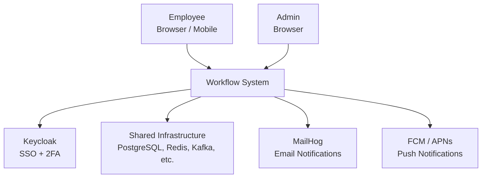
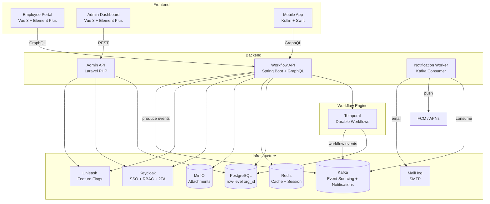
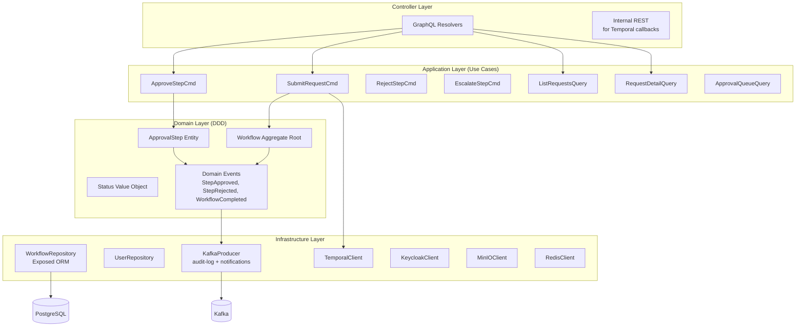
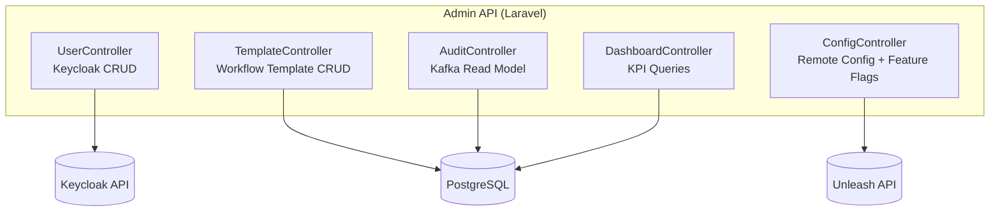
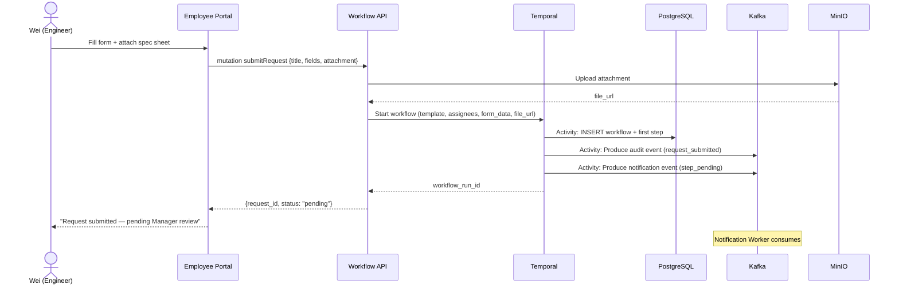
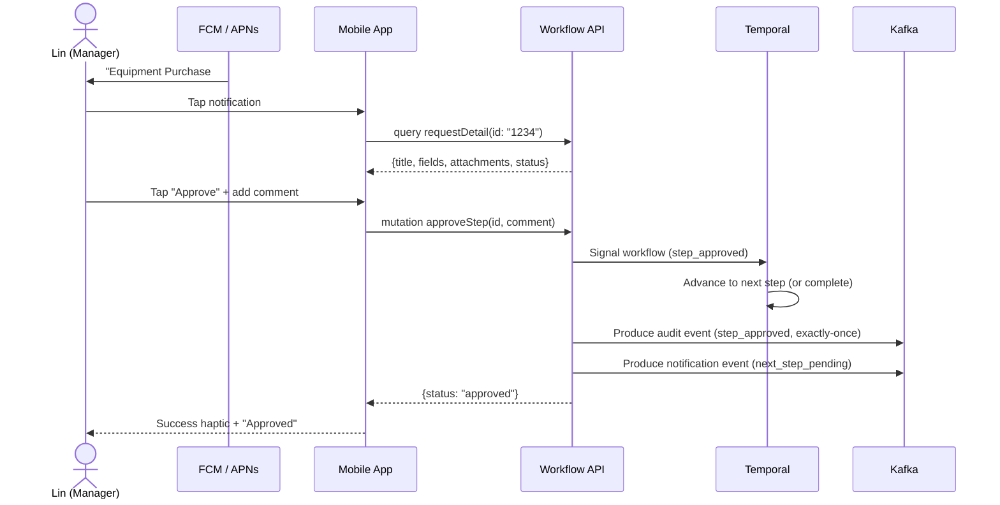
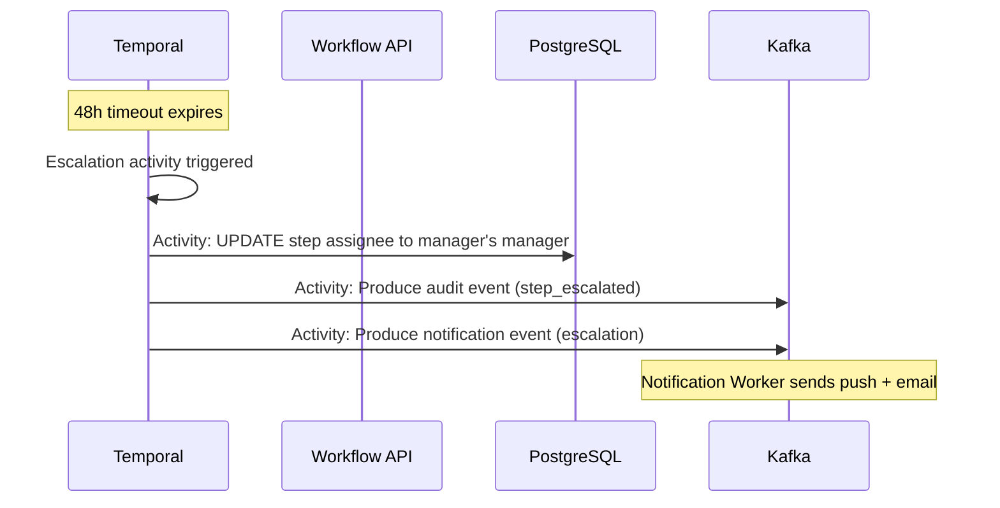
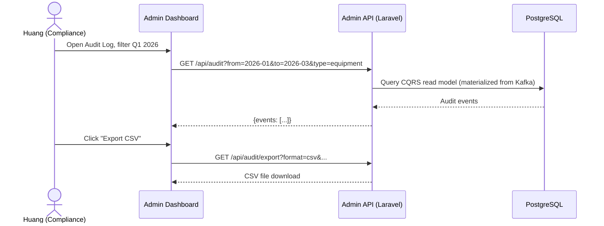
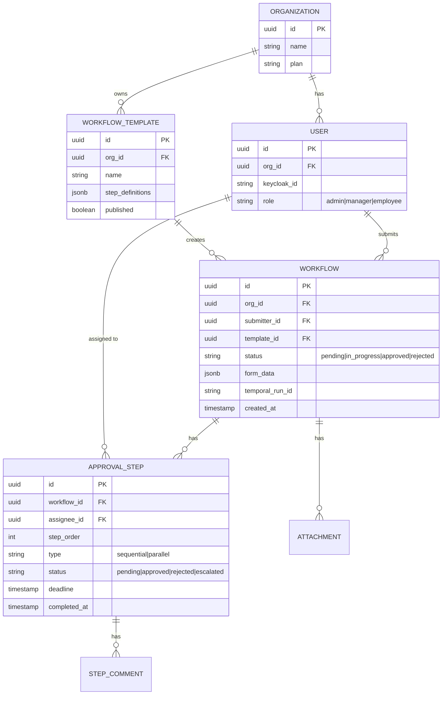
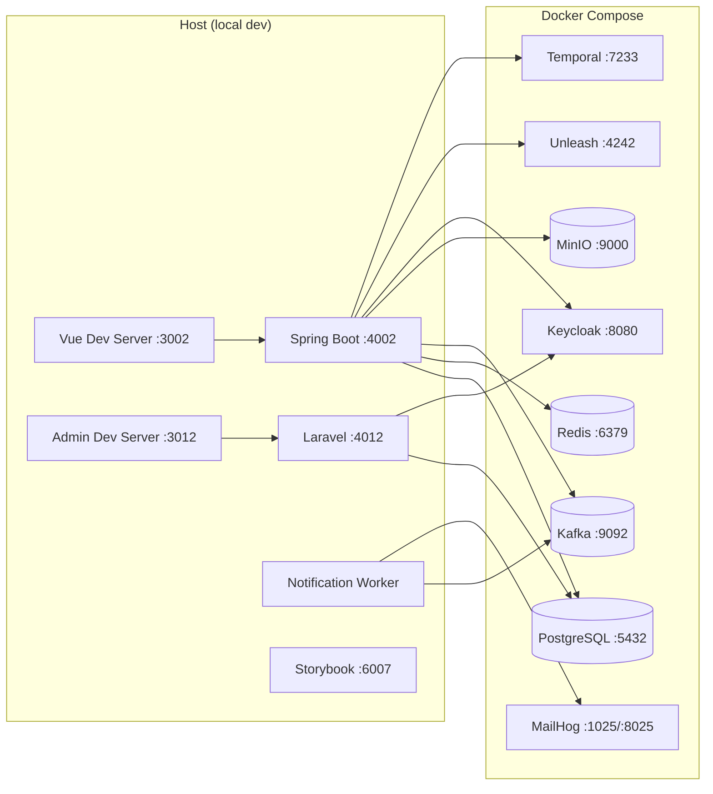

# System Architecture: Enterprise Workflow System

## Architecture Pattern

**Clean Architecture + DDD + CQRS + EDA** — Spring Boot backend with domain-driven layering, command/query separation (write via Temporal + Kafka, read via dedicated read model), and event-driven communication. Admin Panel is a separate Laravel service.

## C4 Model

### Level 1: System Context

### Level 2: Container Diagram

### Level 3: Component Diagram (Workflow API — Clean Architecture)

### Level 3: Component Diagram (Admin API — Laravel)

## Component Overview

| Component | Tech | System | Responsibility |
|-----------|------|--------|---------------|
| Employee Portal | Vue 3 + Pinia + Element Plus | Frontend | Submit requests, track status, approve/reject |
| Admin Dashboard | Vue 3 + Element Plus | Frontend | User mgmt, templates, audit log, config |
| Mobile App | Kotlin (Android) + Swift (iOS) | Frontend | Mobile approval, push notifications |
| Workflow API | Spring Boot + Kotlin + GraphQL (DGS) | Backend | Core business logic, CQRS, Temporal orchestration |
| Admin API | Laravel (PHP) | Backend | CMS, user mgmt, config, audit read model |
| Notification Worker | Kafka Consumer (Kotlin) | Worker | Push (FCM/APNs) + Email (MailHog) notifications |
| Temporal | Temporal Server | Engine | Durable workflow orchestration |

## Data Flow (Sequence Diagrams)

### Flow 1: Submit Approval Request

### Flow 2: Mobile Approval

### Flow 3: Auto-Escalation

### Flow 4: Compliance Audit Report

## API Contracts (High-level)

| Endpoint | Protocol | System | Direction | Description |
|----------|----------|--------|-----------|-------------|
| `query requestDetail` | GraphQL | Workflow API | Client → Server | Get request with steps + attachments |
| `query approvalQueue` | GraphQL | Workflow API | Client → Server | List pending approvals for current user |
| `mutation submitRequest` | GraphQL | Workflow API | Client → Server | Create new approval request |
| `mutation approveStep` | GraphQL | Workflow API | Client → Server | Approve a pending step |
| `mutation rejectStep` | GraphQL | Workflow API | Client → Server | Reject with reason |
| `GET /api/users` | REST | Admin API | Admin → Server | List users (via Keycloak) |
| `POST /api/templates` | REST | Admin API | Admin → Server | Create workflow template |
| `GET /api/audit` | REST | Admin API | Admin → Server | Query audit log |
| `workflow.approval-events` | Kafka | — | Producer → Consumer | Immutable approval state changes |
| `workflow.audit-log` | Kafka | — | Producer → Consumer | Compliance audit trail (exactly-once) |
| `workflow.notifications` | Kafka | — | Producer → Consumer | Async notification dispatch |

## Database Schema (High-level)

## Deployment Diagram

## Security Architecture

| Layer | Measure |
|-------|---------|
| Auth | Keycloak OAuth2 Authorization Code Flow. SSO across Portal + Admin + Mobile. |
| 2FA | Keycloak TOTP (Google Authenticator). Email OTP fallback via MailHog. |
| Authorization | RBAC: Admin (full access), Manager (approve + view team), Employee (submit + view own). |
| Multi-tenancy | Row-level isolation with `org_id` on every table. Enforced in repository layer. |
| Data in transit | HTTPS (GraphQL), WSS (subscriptions). TLS-ready. |
| Data at rest | MinIO SSE-S3 for attachments. PostgreSQL encryption (planned). |
| Audit integrity | Kafka exactly-once semantics. Append-only topic. No update/delete. |
| Secrets | `.env` files. Keycloak client secrets rotated. |
| Input validation | Kotlin data classes with Bean Validation. GraphQL input types validated. |
| CORS | Whitelist Portal, Admin, and Mobile origins. |
| Dependencies | SAST (Semgrep) + SCA (Trivy) in CI. |

## Infrastructure Dependencies

| Service | Purpose | Port |
|---------|---------|------|
| PostgreSQL | Workflow data, audit read model | 5432 |
| Redis | Cache, session store | 6379 |
| Kafka | Event sourcing (audit), notifications, analytics | 9092 |
| MinIO | File attachments | 9000 |
| Keycloak | SSO, RBAC, 2FA | 8080 |
| Unleash | Feature flags | 4242 |
| MailHog | Email notifications (local SMTP) | 1025/8025 |
| Temporal | Durable workflow engine | 7233 |

## Scalability Considerations

| Concern | Current (local) | Production Strategy |
|---------|-----------------|-------------------|
| Users | Single API instance | Horizontal behind load balancer |
| Workflows | Single Temporal | Temporal cluster (multi-worker) |
| Audit log | Single Kafka broker | Multi-broker Kafka cluster with replication |
| Database | Single PostgreSQL | Read replicas for CQRS read model |
| Notifications | Single consumer | Kafka consumer group (multiple workers) |
| File storage | Single MinIO | S3 in cloud |
| Auth | Single Keycloak | Keycloak cluster with shared DB |

## ADRs Created

- [ADR-0001: Why Temporal over Bull for workflow orchestration](adrs/ADR-0001-why-temporal-over-bull.md)
- [ADR-0002: Why GraphQL over REST for Workflow API](adrs/ADR-0002-why-graphql-over-rest.md)
- [ADR-0003: Why Kafka event sourcing for audit log](adrs/ADR-0003-why-kafka-event-sourcing-audit.md)
- [ADR-0004: Why Laravel for Admin Panel](adrs/ADR-0004-why-laravel-for-admin.md)
- [ADR-0005: Why CQRS for approval data access](adrs/ADR-0005-why-cqrs.md)
