# System Architecture: Enterprise Workflow System

## Table of Contents

- [Architecture Pattern](#architecture-pattern)
- [C4 Model](#c4-model)
  - [Level 1: System Context](#level-1-system-context)
  - [Level 2: Container Diagram](#level-2-container-diagram)
  - [Level 3: Component Diagram (Workflow API — Clean Architecture)](#level-3-component-diagram-workflow-api-clean-architecture)
  - [Level 3: Component Diagram (Admin API — Laravel)](#level-3-component-diagram-admin-api-laravel)
  - [Level 3: Component Diagram (Employee Portal — Vue 3)](#level-3-component-diagram-employee-portal-vue-3)
  - [Level 3: Component Diagram (Admin Dashboard — Vue 3)](#level-3-component-diagram-admin-dashboard-vue-3)
  - [Level 3: Component Diagram (Mobile App — Kotlin + Swift)](#level-3-component-diagram-mobile-app-kotlin-swift)
- [Component Overview](#component-overview)
- [Data Flow (Sequence Diagrams)](#data-flow-sequence-diagrams)
  - [Flow 1: Submit Approval Request](#flow-1-submit-approval-request)
  - [Flow 2: Mobile Approval](#flow-2-mobile-approval)
  - [Flow 3: Auto-Escalation](#flow-3-auto-escalation)
  - [Flow 4: Compliance Audit Report](#flow-4-compliance-audit-report)
- [API Contracts (High-level)](#api-contracts-high-level)
- [Database Schema (High-level)](#database-schema-high-level)
- [Deployment Diagram](#deployment-diagram)
- [Security Architecture](#security-architecture)
- [Infrastructure Dependencies](#infrastructure-dependencies)
- [Scalability Considerations](#scalability-considerations)
- [ADRs Created](#adrs-created)

---


## Architecture Pattern

**Clean Architecture + DDD + CQRS + EDA** — Spring Boot backend with domain-driven layering, command/query separation (write via Temporal + Kafka, read via dedicated read model), and event-driven communication. Admin Panel is a separate Laravel service.

## C4 Model

### Level 1: System Context

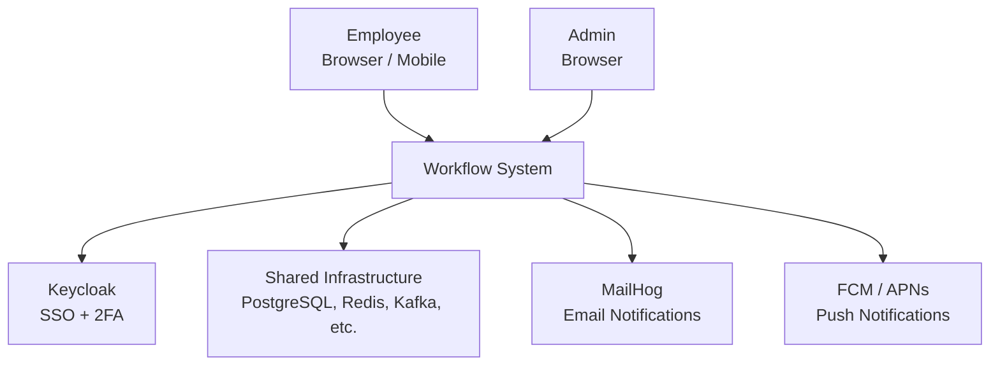

### Level 2: Container Diagram

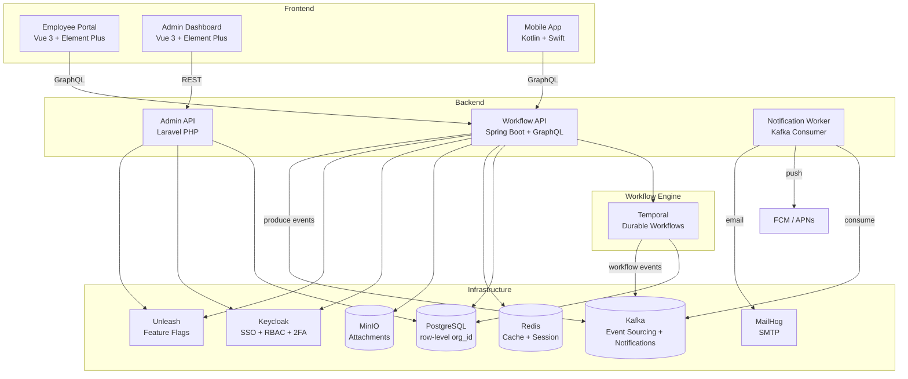

### Level 3: Component Diagram (Workflow API — Clean Architecture)

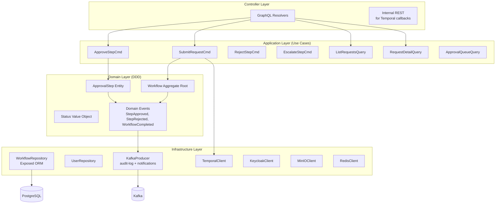

### Level 3: Component Diagram (Admin API — Laravel)

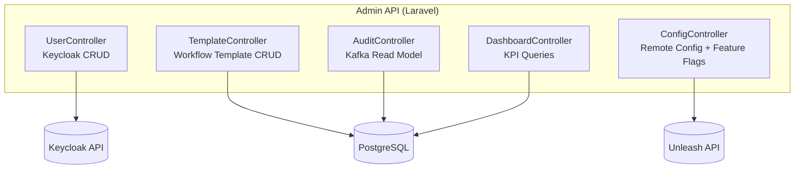

### Level 3: Component Diagram (Employee Portal — Vue 3)

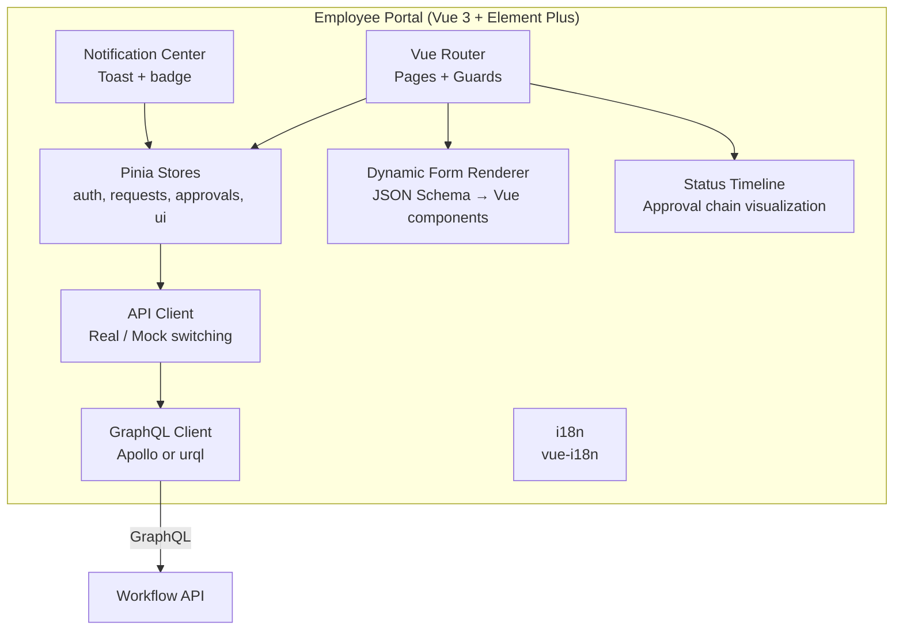

#### Employee Portal — Key Modules

| Module | Responsibility | Key Libraries |
|--------|---------------|---------------|
| Router | Page routing, auth guards (Keycloak redirect) | Vue Router v4 |
| Stores | Global state (auth, requests, approvals, UI) | Pinia |
| GraphQL Client | Query/mutation/subscription to Workflow API | Apollo Client or urql |
| Dynamic Form | Render form from template JSON schema | VeeValidate + Zod |
| Status Timeline | Visual approval chain (dots + lines + status) | Custom component |
| Notification Center | Toast messages + unread badge count | Element Plus ElNotification |
| i18n | Multi-language (en, zh-TW) | vue-i18n |
| API Client | Real/mock switching by env | Wrapper for GraphQL client; Axios for file uploads only |

#### Employee Portal — Route Structure

| Route | Page | Auth |
|-------|------|------|
| `/auth` | Keycloak SSO redirect | Public |
| `/` | Dashboard (stats + my requests) | JWT (Keycloak) |
| `/request/new` | New Request (template selector + form) | JWT |
| `/request/:id` | Request Detail (timeline + attachments) | JWT |
| `/approvals` | Approval Queue (filterable list) | JWT (manager+) |
| `/history` | My History (past requests) | JWT |
| `/profile` | Profile + 2FA settings | JWT |

### Level 3: Component Diagram (Admin Dashboard — Vue 3)

```mermaid
graph TD
  subgraph "Admin Dashboard (Vue 3 + Element Plus)"
    ROUTER_A[Vue Router<br/>Admin pages + role guard]
    STORE_A[Pinia Stores<br/>users, templates, audit, config]
    TMPL_EDITOR[Template Editor<br/>Drag-and-drop step builder]
    AUDIT_VIEWER[Audit Log Viewer<br/>Filterable table + export]
    KPI_DASH[KPI Dashboard<br/>ECharts charts]
    USER_MGMT[User Management<br/>CRUD table + role editor]
    CONFIG_EDITOR[Config Editor<br/>Branding + notification templates]
    API_A[API Client<br/>REST to Admin API (Laravel)]
  end

  ROUTER_A --> STORE_A
  ROUTER_A --> TMPL_EDITOR
  ROUTER_A --> AUDIT_VIEWER
  ROUTER_A --> KPI_DASH
  ROUTER_A --> USER_MGMT
  ROUTER_A --> CONFIG_EDITOR
  API_A -->|REST| ADM_API[Admin API - Laravel]
```

#### Admin Dashboard — Key Modules

| Module | Responsibility | Key Libraries |
|--------|---------------|---------------|
| Router | Admin pages, role-based guard (admin only) | Vue Router v4 |
| Stores | Admin state (users, templates, audit, config) | Pinia |
| Template Editor | Drag-and-drop workflow step builder | vuedraggable + custom |
| Audit Log Viewer | Filterable table, date range, export CSV/PDF | Element Plus ElTable |
| KPI Dashboard | Charts (turnaround time, volume, escalation rate) | ECharts |
| User Management | CRUD table, role badges, invite | Element Plus ElTable + ElDialog |
| Config Editor | Branding (colors, logo), notification templates | Custom form |
| API Client | REST calls to Laravel Admin API | Axios |

#### Admin Dashboard — Route Structure

| Route | Page | Auth |
|-------|------|------|
| `/admin` | KPI Dashboard | JWT (admin) |
| `/admin/users` | User Management | JWT (admin) |
| `/admin/templates` | Workflow Templates List | JWT (admin) |
| `/admin/templates/:id` | Template Editor | JWT (admin) |
| `/admin/audit` | Audit Log Viewer | JWT (admin) |
| `/admin/features` | Feature Toggle Management | JWT (admin) |
| `/admin/config` | Remote Config Editor | JWT (admin) |

### Level 3: Component Diagram (Mobile App — Kotlin + Swift)

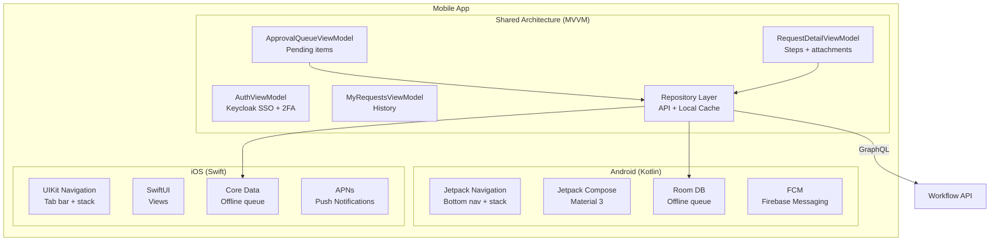

#### Mobile App — Key Modules

| Module | Android (Kotlin) | iOS (Swift) |
|--------|-----------------|-------------|
| Architecture | MVVM + Repository | MVVM + Repository |
| UI Framework | Jetpack Compose + Material 3 | SwiftUI |
| Navigation | Jetpack Navigation (bottom nav + stack) | UIKit TabBarController + NavigationController |
| GraphQL | Apollo Kotlin | Apollo iOS |
| Offline Cache | Room DB (SQLite) | Core Data |
| Push | FCM (Firebase Cloud Messaging) | APNs |
| Auth | Keycloak AppAuth (OAuth2 PKCE) | Keycloak AppAuth |
| Swipe Actions | `SwipeToDismiss` composable | `UISwipeActionsConfiguration` |
| Haptics | `HapticFeedbackConstants` | `UIImpactFeedbackGenerator` |

#### Mobile App — Navigation Structure

| Tab | Screens | Auth |
|-----|---------|------|
| Home | Dashboard → Request Detail | JWT (Keycloak) |
| Approvals | Approval Queue → Request Detail → Approve/Reject | JWT (manager+) |
| My Requests | Request List → Request Detail | JWT |
| Profile | Profile + 2FA + Notification Settings | JWT |

#### Mobile App — Offline Strategy

```
Online:
  GraphQL query → API → display

Offline:
  Data request → Room/CoreData cache → display
  Approve action → queue in local DB

Reconnect:
  Sync queued approvals → API
  Refresh cache from API
```

## Component Overview

| Component | Tech | System | Responsibility |
|-----------|------|--------|---------------|
| Employee Portal | Vue 3 + Pinia + Element Plus | Frontend | Submit requests, track status, approve/reject |
| Admin Dashboard | Vue 3 + Element Plus | Frontend | User mgmt, templates, audit log, config |
| Mobile App | Kotlin (Android) + Swift (iOS) | Frontend | Mobile approval, push notifications |
| Workflow API | Spring Boot + Kotlin + GraphQL (DGS) | Backend | Core business logic, CQRS, Temporal orchestration |
| Admin API | Laravel (PHP) | Backend | CMS, user mgmt, config, audit read model |
| Notification Worker | Kafka Consumer (Kotlin) | Worker | Push (FCM/APNs) + Email (MailHog) notifications |
| Temporal | Temporal Server | Engine | Durable workflow orchestration |

## Data Flow (Sequence Diagrams)

### Flow 1: Submit Approval Request

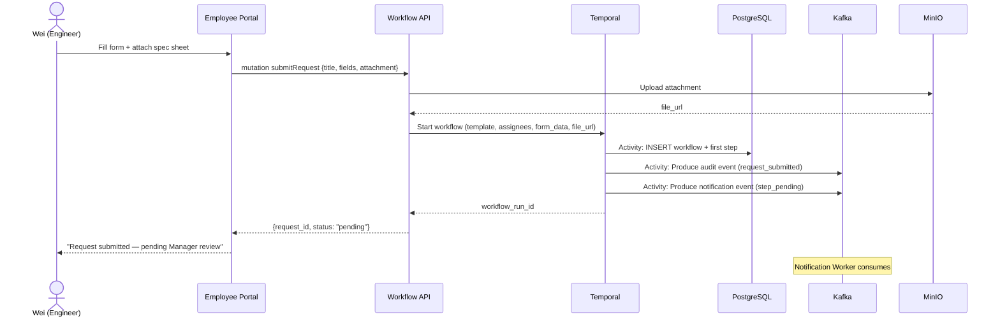

### Flow 2: Mobile Approval

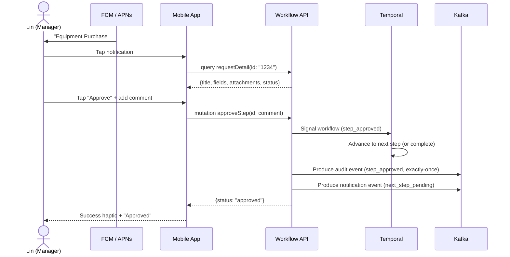

### Flow 3: Auto-Escalation

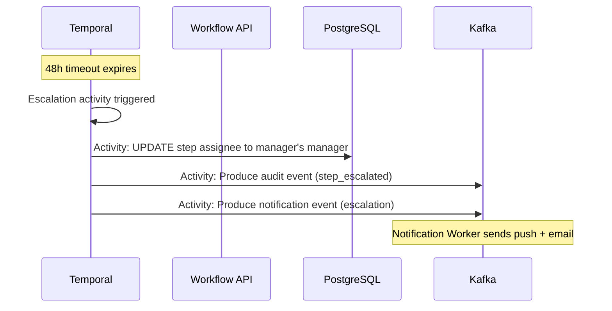

### Flow 4: Compliance Audit Report

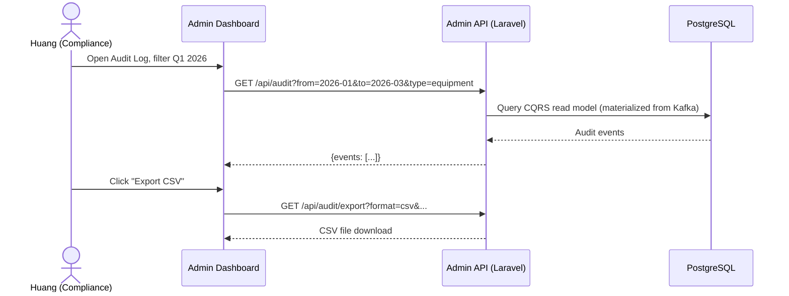

## API Contracts (High-level)

| Endpoint | Protocol | System | Direction | Description |
|----------|----------|--------|-----------|-------------|
| `query requestDetail` | GraphQL | Workflow API | Client → Server | Get request with steps + attachments |
| `query approvalQueue` | GraphQL | Workflow API | Client → Server | List pending approvals for current user |
| `mutation submitRequest` | GraphQL | Workflow API | Client → Server | Create new approval request |
| `mutation approveStep` | GraphQL | Workflow API | Client → Server | Approve a pending step |
| `mutation rejectStep` | GraphQL | Workflow API | Client → Server | Reject with reason |
| `GET /api/users` | REST | Admin API | Admin → Server | List users (via Keycloak) |
| `POST /api/templates` | REST | Admin API | Admin → Server | Create workflow template |
| `GET /api/audit` | REST | Admin API | Admin → Server | Query audit log |
| `workflow.approval-events` | Kafka | — | Producer → Consumer | Immutable approval state changes |
| `workflow.audit-log` | Kafka | — | Producer → Consumer | Compliance audit trail (exactly-once) |
| `workflow.notifications` | Kafka | — | Producer → Consumer | Async notification dispatch |

## Database Schema (High-level)

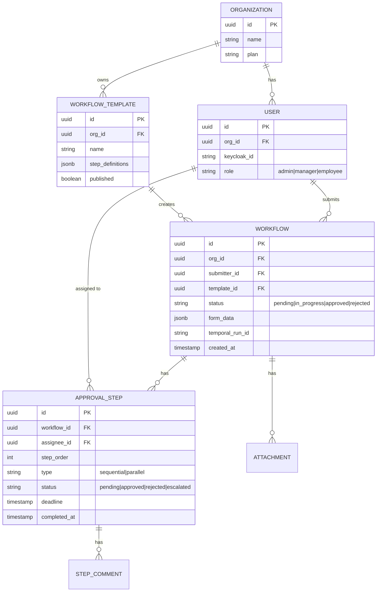

## Deployment Diagram

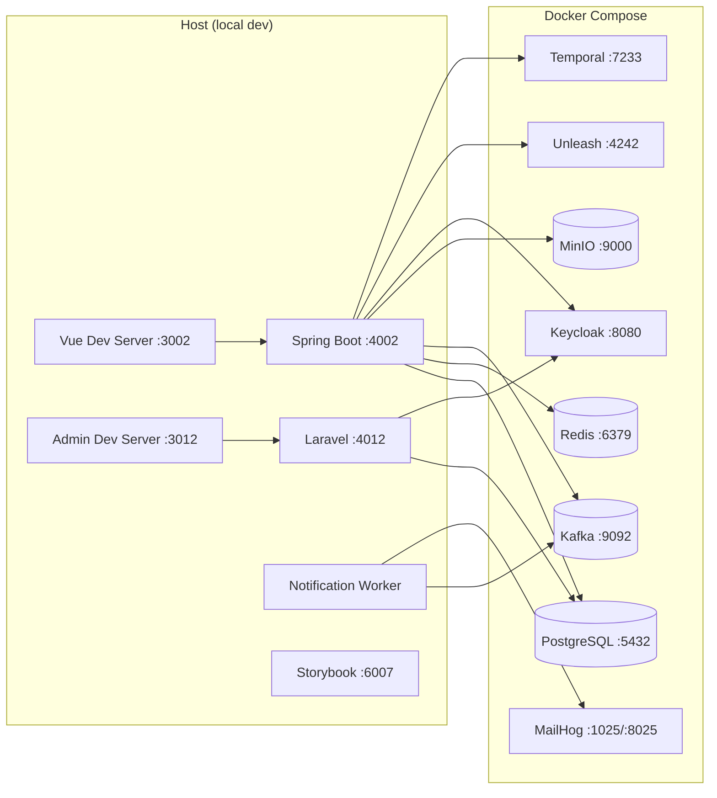

## Security Architecture

| Layer | Measure |
|-------|---------|
| Auth | Keycloak OAuth2 Authorization Code Flow. SSO across Portal + Admin + Mobile. |
| 2FA | Keycloak TOTP (Google Authenticator). Email OTP fallback via MailHog. |
| Authorization | RBAC: Admin (full access), Manager (approve + view team), Employee (submit + view own). |
| Multi-tenancy | Row-level isolation with `org_id` on every table. Enforced in repository layer. |
| Data in transit | HTTPS (GraphQL), WSS (subscriptions). TLS-ready. |
| Data at rest | MinIO SSE-S3 for attachments. PostgreSQL encryption (planned). |
| Audit integrity | Kafka exactly-once semantics. Append-only topic. No update/delete. |
| Secrets | `.env` files. Keycloak client secrets rotated. |
| Input validation | Kotlin data classes with Bean Validation. GraphQL input types validated. |
| CORS | Whitelist Portal, Admin, and Mobile origins. |
| Dependencies | SAST (Semgrep) + SCA (Trivy) in CI. |

## Infrastructure Dependencies

| Service | Purpose | Port |
|---------|---------|------|
| PostgreSQL | Workflow data, audit read model | 5432 |
| Redis | Cache, session store | 6379 |
| Kafka | Event sourcing (audit), notifications, analytics | 9092 |
| MinIO | File attachments | 9000 |
| Keycloak | SSO, RBAC, 2FA | 8080 |
| Unleash | Feature flags | 4242 |
| MailHog | Email notifications (local SMTP) | 1025/8025 |
| Temporal | Durable workflow engine | 7233 |

## Scalability Considerations

| Concern | Current (local) | Production Strategy |
|---------|-----------------|-------------------|
| Users | Single API instance | Horizontal behind load balancer |
| Workflows | Single Temporal | Temporal cluster (multi-worker) |
| Audit log | Single Kafka broker | Multi-broker Kafka cluster with replication |
| Database | Single PostgreSQL | Read replicas for CQRS read model |
| Notifications | Single consumer | Kafka consumer group (multiple workers) |
| File storage | Single MinIO | S3 in cloud |
| Auth | Single Keycloak | Keycloak cluster with shared DB |

## ADRs Created

- [ADR-0001: Why Temporal over Bull for workflow orchestration](adrs/ADR-0001-why-temporal-over-bull.md)
- [ADR-0002: Why GraphQL over REST for Workflow API](adrs/ADR-0002-why-graphql-over-rest.md)
- [ADR-0003: Why Kafka event sourcing for audit log](adrs/ADR-0003-why-kafka-event-sourcing-audit.md)
- [ADR-0004: Why Laravel for Admin Panel](adrs/ADR-0004-why-laravel-for-admin.md)
- [ADR-0005: Why CQRS for approval data access](adrs/ADR-0005-why-cqrs.md)
