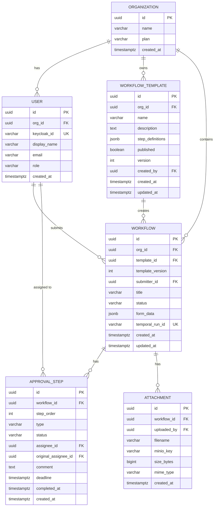
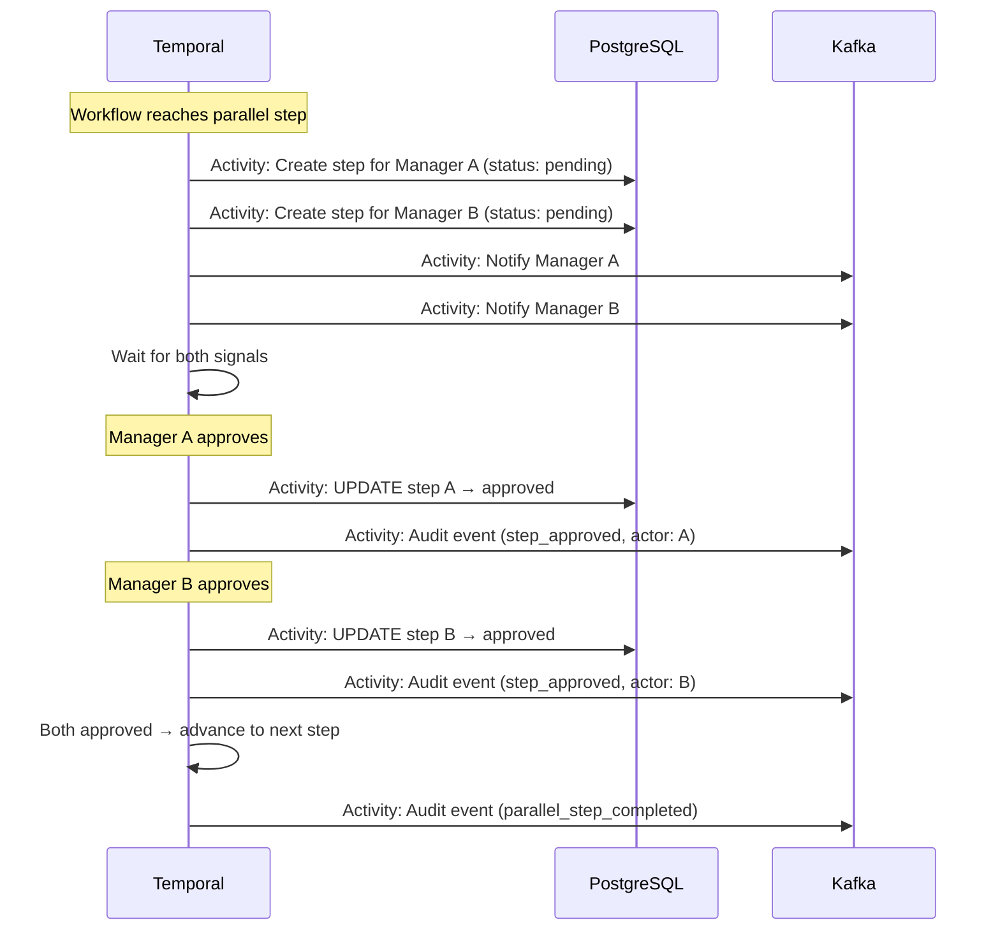
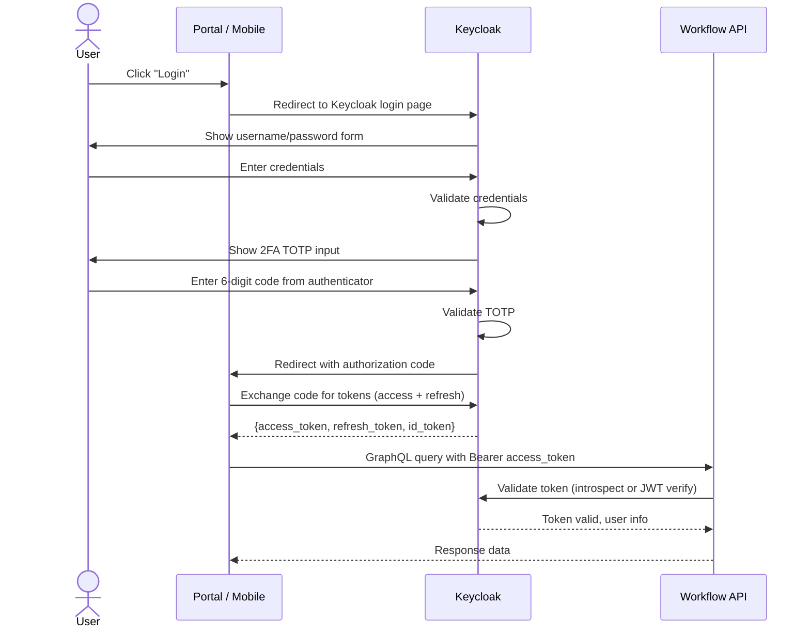

# Technical Design: Enterprise Workflow System

## Table of Contents

- [System: Workflow API (Spring Boot + GraphQL)](#system-workflow-api-spring-boot-graphql)
  - [API Specification — GraphQL](#api-specification-graphql)
  - [Database Tables (owned by Workflow API)](#database-tables-owned-by-workflow-api)
  - [Indexes](#indexes)
- [System: Admin API (Laravel)](#system-admin-api-laravel)
  - [API Specification — REST](#api-specification-rest)
- [System: Notification Worker (Kafka Consumer)](#system-notification-worker-kafka-consumer)
  - [Consumed Topics](#consumed-topics)
  - [Notification Types](#notification-types)
- [Database Schema (Full)](#database-schema-full)
  - [ER Diagram](#er-diagram)
  - [Migrations](#migrations)
  - [Data Migration Strategy](#data-migration-strategy)
- [Sequence Diagrams (Key Flows)](#sequence-diagrams-key-flows)
  - [Flow: Parallel Approval (A AND B must both approve)](#flow-parallel-approval-a-and-b-must-both-approve)
  - [Flow: Keycloak SSO + 2FA Login](#flow-keycloak-sso-2fa-login)
- [Authentication & Authorization](#authentication-authorization)
  - [Token Flow](#token-flow)
- [Error Handling](#error-handling)
- [Caching Strategy](#caching-strategy)
- [Background Jobs / Workers](#background-jobs-workers)
- [Third-party Integrations](#third-party-integrations)
- [System: Employee Portal (Vue 3)](#system-employee-portal-vue-3)
  - [State Management (Pinia)](#state-management-pinia)
  - [Route Definitions](#route-definitions)
  - [Component Architecture](#component-architecture)
  - [GraphQL Client Setup](#graphql-client-setup)
  - [API Client (Real vs Mock)](#api-client-real-vs-mock)
  - [Key Component Specs](#key-component-specs)
- [System: Admin Dashboard (Vue 3)](#system-admin-dashboard-vue-3)
  - [State Management (Pinia)](#state-management-pinia)
  - [Route Definitions](#route-definitions)
  - [Template Editor — Drag-and-Drop](#template-editor-drag-and-drop)
  - [API Client (REST to Laravel)](#api-client-rest-to-laravel)
- [System: Mobile App (Kotlin + Swift)](#system-mobile-app-kotlin-swift)
  - [Architecture — MVVM + Repository](#architecture-mvvm-repository)
  - [ViewModels](#viewmodels)
  - [Offline Approval Queue](#offline-approval-queue)
  - [Push Notification Handling](#push-notification-handling)
  - [GraphQL Client](#graphql-client)
  - [Navigation (per platform)](#navigation-per-platform)
- [ADRs Created](#adrs-created)

---


## System: Workflow API (Spring Boot + GraphQL)

### API Specification — GraphQL

#### Queries

```graphql
type Query {
  # Dashboard
  myRequests(status: Status, cursor: String, limit: Int): RequestConnection!
  approvalQueue(cursor: String, limit: Int): RequestConnection!
  requestDetail(id: ID!): Request!

  # Templates
  templates: [WorkflowTemplate!]!
  templateDetail(id: ID!): WorkflowTemplate!
}
```

#### Mutations

```graphql
type Mutation {
  # Request lifecycle
  submitRequest(input: SubmitRequestInput!): Request!
  approveStep(stepId: ID!, comment: String): ApprovalStep!
  rejectStep(stepId: ID!, reason: String!): ApprovalStep!

  # User
  updateProfile(input: UpdateProfileInput!): User!
  enable2FA: TwoFactorSetup!
}

input SubmitRequestInput {
  templateId: ID!
  title: String!
  formData: JSON!
  attachmentIds: [ID!]
}
```

#### Subscriptions

```graphql
type Subscription {
  # Realtime status updates
  requestStatusChanged(requestId: ID!): Request!
  approvalQueueUpdated: ApprovalStep!
}
```

#### Types

```graphql
type Request {
  id: ID!
  title: String!
  status: Status!
  template: WorkflowTemplate!
  submitter: User!
  formData: JSON!
  attachments: [Attachment!]!
  steps: [ApprovalStep!]!
  createdAt: DateTime!
  updatedAt: DateTime!
}

type ApprovalStep {
  id: ID!
  order: Int!
  type: StepType! # SEQUENTIAL | PARALLEL
  status: StepStatus! # PENDING | APPROVED | REJECTED | ESCALATED
  assignee: User!
  comment: String
  deadline: DateTime!
  completedAt: DateTime
}

enum Status { PENDING, IN_PROGRESS, APPROVED, REJECTED }
enum StepType { SEQUENTIAL, PARALLEL }
enum StepStatus { PENDING, APPROVED, REJECTED, ESCALATED }
```

#### File Upload (REST — GraphQL doesn't handle multipart natively)

| Method | Path | Request | Response | Auth |
|--------|------|---------|----------|------|
| POST | `/api/attachments/upload` | multipart/form-data `{file}` | `{attachmentId, url, size}` | JWT (Keycloak) |
| GET | `/api/attachments/:id/download` | — | Presigned URL redirect | JWT (Keycloak) |

### Database Tables (owned by Workflow API)

#### Table: `organizations`

| Column | Type | Constraints | Description |
|--------|------|------------|-------------|
| id | uuid | PK | |
| name | varchar(255) | NOT NULL | Organization name |
| plan | varchar(20) | DEFAULT 'enterprise' | |
| created_at | timestamptz | DEFAULT now() | |

#### Table: `users`

| Column | Type | Constraints | Description |
|--------|------|------------|-------------|
| id | uuid | PK | |
| org_id | uuid | FK → organizations.id, NOT NULL | Row-level tenant isolation |
| keycloak_id | varchar(255) | UNIQUE, NOT NULL | Keycloak subject ID |
| display_name | varchar(100) | NOT NULL | |
| email | varchar(255) | NOT NULL | |
| role | varchar(20) | NOT NULL | admin / manager / employee |
| created_at | timestamptz | DEFAULT now() | |

#### Table: `workflow_templates`

| Column | Type | Constraints | Description |
|--------|------|------------|-------------|
| id | uuid | PK | |
| org_id | uuid | FK → organizations.id, NOT NULL | |
| name | varchar(255) | NOT NULL | Template name |
| description | text | NULL | |
| step_definitions | jsonb | NOT NULL | Ordered list of step configs |
| published | boolean | DEFAULT false | Visible to employees when true |
| version | int | DEFAULT 1 | Immutable per in-progress workflows |
| created_by | uuid | FK → users.id | |
| created_at | timestamptz | DEFAULT now() | |
| updated_at | timestamptz | DEFAULT now() | |

#### Table: `workflows`

| Column | Type | Constraints | Description |
|--------|------|------------|-------------|
| id | uuid | PK | |
| org_id | uuid | FK → organizations.id, NOT NULL | Row-level isolation |
| template_id | uuid | FK → workflow_templates.id | |
| template_version | int | NOT NULL | Snapshot of template version at creation |
| submitter_id | uuid | FK → users.id | |
| title | varchar(255) | NOT NULL | |
| status | varchar(20) | DEFAULT 'pending' | pending / in_progress / approved / rejected |
| form_data | jsonb | NOT NULL | Dynamic form values |
| temporal_run_id | varchar(255) | UNIQUE, NULL | Temporal workflow run ID |
| created_at | timestamptz | DEFAULT now() | |
| updated_at | timestamptz | DEFAULT now() | |

#### Table: `approval_steps`

| Column | Type | Constraints | Description |
|--------|------|------------|-------------|
| id | uuid | PK | |
| workflow_id | uuid | FK → workflows.id, NOT NULL | |
| step_order | int | NOT NULL | Position in chain |
| type | varchar(20) | NOT NULL | sequential / parallel |
| status | varchar(20) | DEFAULT 'pending' | pending / approved / rejected / escalated |
| assignee_id | uuid | FK → users.id | Current assignee |
| original_assignee_id | uuid | FK → users.id | Before escalation |
| comment | text | NULL | Approver's comment |
| deadline | timestamptz | NOT NULL | Auto-escalation after this |
| completed_at | timestamptz | NULL | |
| created_at | timestamptz | DEFAULT now() | |

#### Table: `attachments`

| Column | Type | Constraints | Description |
|--------|------|------------|-------------|
| id | uuid | PK | |
| workflow_id | uuid | FK → workflows.id, NULL | Nullable — set after workflow created (pre-upload flow) |
| uploaded_by | uuid | FK → users.id, NOT NULL | |
| filename | varchar(255) | NOT NULL | Original filename |
| minio_key | varchar(500) | NOT NULL | MinIO object key |
| size_bytes | bigint | NOT NULL | |
| mime_type | varchar(100) | NOT NULL | |
| created_at | timestamptz | DEFAULT now() | |

#### Table: `audit_read_model` (CQRS — materialized from Kafka)

| Column | Type | Constraints | Description |
|--------|------|------------|-------------|
| id | uuid | PK | |
| org_id | uuid | NOT NULL | For filtering |
| workflow_id | uuid | NULL | |
| step_id | uuid | NULL | |
| actor_id | uuid | NOT NULL | Who performed the action |
| action | varchar(50) | NOT NULL | request_submitted / step_approved / step_rejected / step_escalated / parallel_step_completed |
| detail | jsonb | NULL | Additional context |
| kafka_offset | bigint | NOT NULL | For replay tracking |
| timestamp | timestamptz | NOT NULL | Event timestamp |

### Indexes

| Table | Columns | Type | Purpose |
|-------|---------|------|---------|
| workflows | org_id, status | btree | Dashboard filter by org + status |
| workflows | submitter_id, created_at DESC | btree | My requests list |
| workflows | temporal_run_id | btree unique | Temporal lookup |
| approval_steps | workflow_id, step_order | btree | Step chain ordering |
| approval_steps | assignee_id, status | btree | Approval queue |
| audit_read_model | org_id, timestamp DESC | btree | Audit log queries |
| audit_read_model | org_id, action, timestamp | btree | Filtered audit queries |

## System: Admin API (Laravel)

### API Specification — REST

| Method | Path | Request | Response | Auth |
|--------|------|---------|----------|------|
| GET | `/api/admin/users` | `?search&role&page` | `{users[], total}` | JWT (admin) |
| POST | `/api/admin/users` | `{email, displayName, role}` | `{user}` (creates in Keycloak) | JWT (admin) |
| PATCH | `/api/admin/users/:id` | `{role?, displayName?}` | `{user}` | JWT (admin) |
| DELETE | `/api/admin/users/:id` | — | `204` (deactivates in Keycloak) | JWT (admin) |
| GET | `/api/admin/templates` | `?published` | `{templates[]}` | JWT (admin) |
| POST | `/api/admin/templates` | `{name, description, stepDefinitions}` | `{template}` | JWT (admin) |
| PATCH | `/api/admin/templates/:id` | `{name?, stepDefinitions?, published?}` | `{template}` | JWT (admin) |
| GET | `/api/admin/audit` | `?from&to&action&userId&page` | `{events[], total}` | JWT (admin) |
| GET | `/api/admin/audit/export` | `?from&to&action&format=csv` | CSV file download | JWT (admin) |
| GET | `/api/admin/dashboard/kpis` | `?from&to` | `{avgTurnaround, pendingCount, completedCount, escalationRate}` | JWT (admin) |
| GET | `/api/admin/config` | — | `{branding, notificationTemplates}` | JWT (admin) |
| PATCH | `/api/admin/config` | `{branding?, notificationTemplates?}` | `{config}` | JWT (admin) |

## System: Notification Worker (Kafka Consumer)

### Consumed Topics

| Topic | Consumer Group | Action |
|-------|---------------|--------|
| `workflow.notifications` | `notification-worker` | Send push (FCM/APNs) + email (MailHog) |
| `workflow.audit-log` | `audit-materializer` | Materialize events into audit_read_model table |

### Notification Types

| Type | Channel | Template |
|------|---------|----------|
| `step_pending` | Push + Email | "Request #{id} needs your approval" |
| `step_approved` | Push | "Your request #{id} was approved by {name}" |
| `step_rejected` | Push + Email | "Your request #{id} was rejected: {reason}" |
| `step_escalated` | Push + Email | "Request #{id} escalated to {newAssignee}" |
| `deadline_reminder` | Push | "Request #{id} deadline in 24 hours" |

---

## Database Schema (Full)

### ER Diagram



### Migrations

| Item | Standard |
|------|---------|
| Tool | Flyway |
| Naming | `V{version}__{description}.sql` (e.g. `V1__create_workflows.sql`) |
| Rollback | Revert with a new migration (e.g. `V2__revert_xyz.sql`). Never use undo in production. |
| Row-level isolation | Every query includes `WHERE org_id = ?` — enforced in repository layer |

### Data Migration Strategy

| Scenario | Strategy |
|----------|---------|
| Add column | Add with default value, backfill async |
| Rename column | Add new → copy → remove old (2 releases) |
| Remove column | Stop reading → remove in next release |
| Template schema change | Version templates — in-progress workflows keep old version |

## Sequence Diagrams (Key Flows)

### Flow: Parallel Approval (A AND B must both approve)



### Flow: Keycloak SSO + 2FA Login



## Authentication & Authorization

| Role | Submit Request | Approve | View Own | View Team | Admin Dashboard | Manage Templates | Manage Users |
|------|---------------|---------|----------|-----------|----------------|-----------------|-------------|
| Employee | ✅ | ❌ | ✅ | ❌ | ❌ | ❌ | ❌ |
| Manager | ✅ | ✅ (assigned) | ✅ | ✅ (team) | ❌ | ❌ | ❌ |
| Admin | ✅ | ✅ | ✅ | ✅ (all) | ✅ | ✅ | ✅ |

### Token Flow

| Token | Source | TTL | Storage |
|-------|--------|-----|---------|
| Access Token | Keycloak | 5 min | Memory |
| Refresh Token | Keycloak | 30 days | HttpOnly cookie |
| ID Token | Keycloak | 5 min | Memory (for user info) |

## Error Handling

| Code | HTTP | Description |
|------|------|-------------|
| `AUTH_SSO_FAILED` | 401 | Keycloak authentication failed |
| `AUTH_2FA_REQUIRED` | 403 | 2FA not completed |
| `AUTH_FORBIDDEN` | 403 | Insufficient role for this action |
| `WORKFLOW_NOT_FOUND` | 404 | Workflow doesn't exist in this org |
| `STEP_NOT_ASSIGNED` | 403 | This step is not assigned to you |
| `STEP_ALREADY_COMPLETED` | 409 | Step already approved/rejected |
| `TEMPLATE_IN_USE` | 409 | Cannot delete template with active workflows |
| `ATTACHMENT_TOO_LARGE` | 413 | File exceeds 50MB limit |
| `RATE_LIMITED` | 429 | Too many requests |

## Caching Strategy

| Key Pattern | TTL | Invalidation | Data |
|-------------|-----|-------------|------|
| `user:{keycloakId}:profile` | 10 min | On Keycloak user update | User role, org_id |
| `template:{id}:v{version}` | 1 hour | Immutable (versioned) | Template step definitions |
| `org:{id}:config` | 30 min | On admin config update | Branding, notification templates |
| `kpi:{orgId}:{dateRange}` | 5 min | On workflow status change | Dashboard KPIs |

## Background Jobs / Workers

| Job | System | Trigger | Input | Output |
|-----|--------|---------|-------|--------|
| Notification Dispatch | Notification Worker | Kafka `workflow.notifications` | `{type, recipientId, data}` | Push (FCM/APNs) + Email (MailHog) |
| Audit Materializer | Notification Worker | Kafka `workflow.audit-log` | `{action, actorId, ...}` | INSERT into audit_read_model |
| KPI Aggregator | Admin API | Scheduled (every 5 min) | `{orgId}` | Aggregated KPIs in Redis cache |

## Third-party Integrations

| Integration | Purpose | How |
|-------------|---------|-----|
| Keycloak | SSO + RBAC + 2FA | OpenID Connect (Spring Security) |
| Temporal | Workflow orchestration | Temporal Java/Kotlin SDK |
| Kafka | Event sourcing + notifications | Spring Kafka |
| MinIO | File attachments | MinIO Java SDK |
| Unleash | Feature flags | Unleash Java SDK |
| MailHog | Email (dev only) | Spring Mail → SMTP localhost:1025 |
| FCM / APNs | Push notifications | Firebase Admin SDK / APNs HTTP/2 |

## System: Employee Portal (Vue 3)

### State Management (Pinia)

| Store | State | Actions | Getters |
|-------|-------|---------|---------|
| `authStore` | `user, token, isAuthenticated` | `login(), logout(), refresh()` | `isManager, isAdmin` |
| `requestStore` | `requests[], current, loading` | `fetchMyRequests(), fetchDetail(), submit()` | `pendingCount` |
| `approvalStore` | `queue[], loading` | `fetchQueue(), approve(), reject()` | `pendingApprovals` |
| `uiStore` | `locale, sidebarOpen, toasts[]` | `setLocale(), addToast(), dismissToast()` | — |

### Route Definitions

| Route | Component | Guard | Lazy Load |
|-------|-----------|-------|-----------|
| `/auth` | `AuthPage` | Public (redirect if logged in) | No |
| `/` | `DashboardPage` | `requireAuth` | Yes |
| `/request/new` | `NewRequestPage` | `requireAuth` | Yes |
| `/request/:id` | `RequestDetailPage` | `requireAuth` | Yes |
| `/approvals` | `ApprovalQueuePage` | `requireAuth + requireManager` | Yes |
| `/history` | `HistoryPage` | `requireAuth` | Yes |
| `/profile` | `ProfilePage` | `requireAuth` | Yes |

### Component Architecture

| Type | Examples | Convention |
|------|---------|-----------|
| Pages | `DashboardPage`, `RequestDetailPage` | One per route, orchestrates layout |
| Containers | `RequestListContainer`, `ApprovalQueueContainer` | Connects to store, passes data to presentational |
| Presentational | `RequestCard`, `StatusTimeline`, `ApprovalButton` | Pure UI, props only, no store access |
| Shared | `AppHeader`, `Sidebar`, `Toast`, `SkeletonLoader` | Reusable across pages |

### GraphQL Client Setup

```typescript
// src/api/graphql-client.ts
import { createClient } from '@urql/vue'
import { useAuthStore } from '@/stores/auth'

export const client = createClient({
  url: import.meta.env.VITE_API_URL || '/mock/graphql',
  fetchOptions: () => {
    const authStore = useAuthStore()
    return {
      headers: { Authorization: `Bearer ${authStore.token}` }
    }
  }
})
```

### API Client (Real vs Mock)

```
src/api/
├─ client.interface.ts     ← abstract interface
├─ graphql-client.ts       ← real: urql → Workflow API
├─ mock-client.ts          ← mock: return JSON fixtures
├─ index.ts                ← factory: select by VITE_API_URL env
└─ mocks/
    ├─ requests.json
    └─ templates.json
```

### Key Component Specs

#### Dynamic Form Renderer

Renders form fields from workflow template JSON schema:

```typescript
// Template step_definitions example
{
  "fields": [
    { "name": "item", "type": "text", "label": "Item Name", "required": true },
    { "name": "cost", "type": "number", "label": "Estimated Cost", "required": true },
    { "name": "justification", "type": "textarea", "label": "Justification" },
    { "name": "priority", "type": "select", "options": ["low", "medium", "high"] }
  ]
}
```

| Field Type | Vue Component | Validation |
|-----------|--------------|------------|
| text | `ElInput` | Zod `z.string().min(1)` |
| number | `ElInputNumber` | Zod `z.number().positive()` |
| textarea | `ElInput type="textarea"` | Zod `z.string()` |
| select | `ElSelect` | Zod `z.enum([...])` |
| date | `ElDatePicker` | Zod `z.date()` |
| file | Custom upload component | Max 50MB, allowed types |

---

## System: Admin Dashboard (Vue 3)

### State Management (Pinia)

| Store | State | Actions | Getters |
|-------|-------|---------|---------|
| `userMgmtStore` | `users[], loading, search` | `fetchUsers(), createUser(), updateRole(), deleteUser()` | `filteredUsers` |
| `templateStore` | `templates[], currentTemplate` | `fetchTemplates(), createTemplate(), publishTemplate()` | `publishedTemplates` |
| `auditStore` | `events[], filters, loading` | `fetchAudit(), exportCSV()` | `filteredEvents` |
| `configStore` | `branding, notificationTemplates` | `fetchConfig(), updateConfig()` | — |
| `kpiStore` | `kpis, dateRange, loading` | `fetchKPIs()` | — |

### Route Definitions

| Route | Component | Guard | Lazy Load |
|-------|-----------|-------|-----------|
| `/admin` | `AdminDashboardPage` | `requireAdmin` | Yes |
| `/admin/users` | `UserManagementPage` | `requireAdmin` | Yes |
| `/admin/templates` | `TemplateListPage` | `requireAdmin` | Yes |
| `/admin/templates/:id` | `TemplateEditorPage` | `requireAdmin` | Yes |
| `/admin/audit` | `AuditLogPage` | `requireAdmin` | Yes |
| `/admin/features` | `FeatureTogglesPage` | `requireAdmin` | Yes |
| `/admin/config` | `ConfigEditorPage` | `requireAdmin` | Yes |

### Template Editor — Drag-and-Drop

```typescript
// Step definition structure
interface StepDefinition {
  id: string
  name: string
  type: 'sequential' | 'parallel'
  assigneeRule: 'by_role' | 'by_department' | 'specific_user'
  assigneeValue: string
  deadlineHours: number
  escalationEnabled: boolean
  escalationTargetRule: string
}
```

| Interaction | Implementation |
|-------------|---------------|
| Drag step to reorder | `vuedraggable` library |
| Add parallel branch | Click "Add parallel" → splits into A + B |
| Configure step | Click step → side panel with form |
| Preview flow | Mermaid diagram auto-generated from steps |
| Publish | Validation → confirm dialog → POST to Admin API |

### API Client (REST to Laravel)

```
src/api/
├─ admin-client.interface.ts
├─ admin-real-client.ts     ← Axios → Laravel Admin API
├─ admin-mock-client.ts     ← mock JSON
├─ index.ts                 ← factory
└─ mocks/
    ├─ users.json
    ├─ templates.json
    └─ audit.json
```

---

## System: Mobile App (Kotlin + Swift)

### Architecture — MVVM + Repository

```
┌─────────────┐
│    View      │  ← Compose (Android) / SwiftUI (iOS)
├─────────────┤
│  ViewModel   │  ← Business logic, UI state
├─────────────┤
│  Repository  │  ← Data access (API + local cache)
├─────────────┤
│  Data Layer  │  ← GraphQL client + Room/CoreData
└─────────────┘
```

### ViewModels

| ViewModel | State | Actions |
|-----------|-------|---------|
| `AuthViewModel` | `isLoggedIn, user, is2FARequired` | `loginViaKeycloak(), complete2FA(), logout()` |
| `ApprovalQueueViewModel` | `queue[], isLoading, isRefreshing` | `fetchQueue(), approve(id, comment), reject(id, reason)` |
| `RequestDetailViewModel` | `request, steps[], attachments[]` | `fetchDetail(id)` |
| `MyRequestsViewModel` | `requests[], isLoading` | `fetchMyRequests()` |
| `NotificationsViewModel` | `notifications[], unreadCount` | `fetchNotifications(), markRead(id)` |

### Offline Approval Queue

```kotlin
// Android — Room entity
@Entity(tableName = "pending_approvals")
data class PendingApproval(
  @PrimaryKey val stepId: String,
  val action: String, // "approve" | "reject"
  val comment: String?,
  val createdAt: Long
)

// Sync on reconnect
class ApprovalSyncWorker : CoroutineWorker {
  override suspend fun doWork(): Result {
    val pending = db.pendingApprovalDao().getAll()
    for (approval in pending) {
      try {
        val successful = if (approval.action == "approve") {
          api.approveStep(approval.stepId, approval.comment).isSuccessful
        } else {
          api.rejectStep(approval.stepId, approval.comment ?: "Rejected offline").isSuccessful
        }
        if (successful) {
          db.pendingApprovalDao().delete(approval)
        } else {
          return Result.retry() // API failed, retry later
        }
      } catch (e: Exception) {
        return Result.retry() // Network error, retry later
      }
    }
    return Result.success()
  }
}
```

### Push Notification Handling

| Platform | Registration | Handler |
|----------|-------------|---------|
| Android | `FirebaseMessagingService.onNewToken()` → send to API | `onMessageReceived()` → navigate to request detail |
| iOS | `UNUserNotificationCenter` delegate → `didRegisterForRemoteNotifications` | `userNotificationCenter(_:didReceive:)` → deep link |

### GraphQL Client

| Platform | Library | Config |
|----------|---------|--------|
| Android | Apollo Kotlin | `ApolloClient.Builder().serverUrl(apiUrl).addHttpHeader("Authorization", token)` |
| iOS | Apollo iOS | `ApolloClient(url: apiUrl, interceptorProvider: TokenInterceptor)` |

### Navigation (per platform)

**Android (Jetpack Compose):**
```kotlin
sealed class Screen(val route: String) {
  object Home : Screen("home")
  object ApprovalQueue : Screen("approvals")
  object RequestDetail : Screen("request/{id}")
  object MyRequests : Screen("my-requests")
  object Profile : Screen("profile")
}
```

**iOS (SwiftUI):**
```swift
enum Tab: Hashable {
  case home, approvals, requests, profile
}

enum Route: Hashable {
  case requestDetail(id: String)
  case approve(stepId: String)
}
```

---

## ADRs Created

- [ADR-0001: Why Temporal over Bull for workflow orchestration](adrs/ADR-0001-why-temporal-over-bull.md)
- [ADR-0002: Why GraphQL over REST for Workflow API](adrs/ADR-0002-why-graphql-over-rest.md)
- [ADR-0003: Why Kafka event sourcing for audit log](adrs/ADR-0003-why-kafka-event-sourcing-audit.md)
- [ADR-0004: Why Laravel for Admin Panel](adrs/ADR-0004-why-laravel-for-admin.md)
- [ADR-0005: Why CQRS for approval data access](adrs/ADR-0005-why-cqrs.md)
