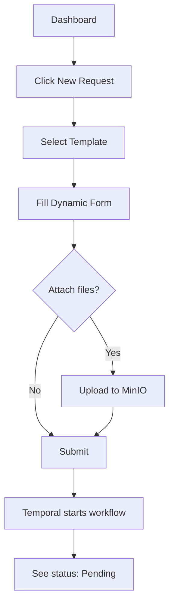
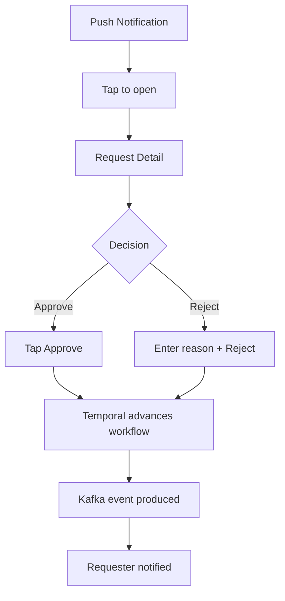
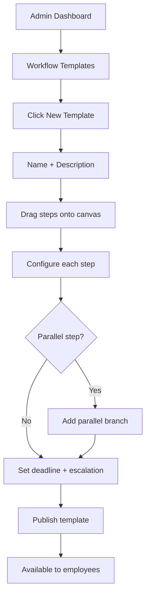

# UI/UX Design: Enterprise Workflow System

## Table of Contents

- [Design Principles](#design-principles)
- [Figma Project Structure](#figma-project-structure)
- [Web UI — Employee Portal](#web-ui-employee-portal)
  - [Screen Inventory (Employee Portal)](#screen-inventory-employee-portal)
  - [Employee Portal Layout](#employee-portal-layout)
- [Web UI — Admin Dashboard](#web-ui-admin-dashboard)
  - [Screen Inventory (Admin Dashboard)](#screen-inventory-admin-dashboard)
  - [Admin Dashboard Layout](#admin-dashboard-layout)
- [Mobile UI (iOS + Android)](#mobile-ui-ios-android)
  - [Screen Inventory (Mobile)](#screen-inventory-mobile)
  - [Mobile Layout](#mobile-layout)
  - [Mobile-specific Patterns](#mobile-specific-patterns)
- [Screen States](#screen-states)
- [User Flows](#user-flows)
  - [Submit Request Flow](#submit-request-flow)
  - [Mobile Approval Flow](#mobile-approval-flow)
  - [Admin Template Configuration Flow](#admin-template-configuration-flow)
- [Interaction Specification](#interaction-specification)
  - [Web Interactions](#web-interactions)
  - [Mobile Interactions](#mobile-interactions)
- [Key Components](#key-components)
- [Design Tokens](#design-tokens)
- [Responsive Breakpoints](#responsive-breakpoints)
- [Handoff Notes](#handoff-notes)
- [Accessibility (a11y) Checklist](#accessibility-a11y-checklist)
- [Figma Version History](#figma-version-history)
- [Screenshots](#screenshots)
- [Stitch Prompts](#stitch-prompts)

---

## Design Principles

1. **Clarity over decoration** — approval workflows must be unambiguous. Status, assignee, deadline must be instantly visible.
2. **Mobile-first approval** — managers approve on factory floor. One-tap approve/reject from notification.
3. **Admin self-service** — workflow template configuration without developer involvement.
4. **Compliance visible** — audit trail accessible at every level, not hidden in a separate tool.
5. **Enterprise trust** — professional, clean UI. No playful elements. Consistent with corporate tools.

## Figma Project Structure

| File | Content | Link |
|------|---------|------|
| Workflow — Design System | Shared components (Element Plus extended), tokens | [Figma URL TBD] |
| Workflow — Wireframes | Low-fi wireframes for all screens | [Figma URL TBD] |
| Workflow — UI Design | High-fi mockups (final) | [Figma URL TBD] |
| Workflow — Prototype | Interactive prototype with transitions | [Figma URL TBD] |

## Web UI — Employee Portal

### Screen Inventory (Employee Portal)

| Screen | Route | Components | Figma Page | Status |
|--------|-------|-----------|-----------|--------|
| Login (SSO) | `/auth` | Keycloak login form, 2FA input | Screens — Auth | Draft |
| Dashboard | `/` | Stats cards, My requests list, Pending approvals | Screens — Dashboard | Draft |
| New Request | `/request/new` | Template selector, Dynamic form, File upload | Screens — New Request | Draft |
| Request Detail | `/request/:id` | Status timeline, Approver chain, Attachments, Comments | Screens — Request Detail | Draft |
| Approval Queue | `/approvals` | Filterable list, Status badges, Quick actions | Screens — Approval Queue | Draft |
| Approve/Reject Modal | (overlay on `/approvals` or `/request/:id`) | Request summary, Comment input, Approve/Reject buttons | Screens — Approval Modal | Draft |
| My History | `/history` | Past requests with filters (date, status, type) | Screens — History | Draft |
| Profile | `/profile` | User info, 2FA settings, Notification preferences | Screens — Profile | Draft |

### Employee Portal Layout

```
┌─────────────────────────────────────────────────┐
│ Top Bar: Logo │ Search │ Notifications 🔔 │ 👤  │
├──────────┬──────────────────────────────────────┤
│          │                                      │
│ Side     │     Main Content Area                │
│ Nav      │                                      │
│          │     ┌─────────┐ ┌─────────┐         │
│ 📊 Dash  │     │ Stats   │ │ Stats   │         │
│ ➕ New   │     │ Card    │ │ Card    │         │
│ ✅ Queue │     └─────────┘ └─────────┘         │
│ 📋 History│                                     │
│ 👤 Profile│    ┌──────────────────────┐         │
│          │     │ Request List Table   │         │
│          │     │ ...                  │         │
│          │     └──────────────────────┘         │
└──────────┴──────────────────────────────────────┘
```

## Web UI — Admin Dashboard

### Screen Inventory (Admin Dashboard)

| Screen | Route | Components | Figma Page | Status |
|--------|-------|-----------|-----------|--------|
| Admin Dashboard | `/admin` | KPI cards, Charts (turnaround time, volume) | Screens — Admin Dashboard | Draft |
| User Management | `/admin/users` | User table, Role badges, Invite button | Screens — Admin Users | Draft |
| Workflow Templates | `/admin/templates` | Template list, Drag-and-drop editor | Screens — Admin Templates | Draft |
| Template Editor | `/admin/templates/:id` | Step builder, Assignee rules, Deadline config | Screens — Template Editor | Draft |
| Audit Log | `/admin/audit` | Event log table, Filters (date, type, user), Export | Screens — Admin Audit | Draft |
| Feature Toggles | `/admin/features` | Unleash embed or custom toggle list | Screens — Admin Features | Draft |
| Remote Config | `/admin/config` | Brand settings, Notification templates | Screens — Admin Config | Draft |

### Admin Dashboard Layout

```
┌─────────────────────────────────────────────────┐
│ Top Bar: Logo │ "Admin" badge │ Switch to Portal│
├──────────┬──────────────────────────────────────┤
│          │                                      │
│ Admin    │     KPI Cards Row                    │
│ Side     │     ┌────┐ ┌────┐ ┌────┐ ┌────┐    │
│ Nav      │     │Avg │ │Pend│ │Comp│ │Esc │    │
│          │     │Time│ │ing │ │lete│ │alat│    │
│ 📊 Dash  │     └────┘ └────┘ └────┘ └────┘    │
│ 👥 Users │                                      │
│ ⚙️ Templ │     Charts Row                       │
│ 📜 Audit │     ┌──────────┐ ┌──────────┐       │
│ 🚩 Flags │     │Turnaround│ │ Volume   │       │
│ 🎨 Config│     │ Chart    │ │ Chart    │       │
│          │     └──────────┘ └──────────┘       │
└──────────┴──────────────────────────────────────┘
```

## Mobile UI (iOS + Android)

### Screen Inventory (Mobile)

| Screen | Route | Platform | Figma Page | Status |
|--------|-------|----------|-----------|--------|
| Splash | — | iOS + Android | Screens — Mobile | Draft |
| Login (SSO + 2FA) | `/auth` | iOS + Android | Screens — Mobile | Draft |
| Home (Dashboard) | `/` | iOS + Android | Screens — Mobile | Draft |
| Approval Queue | `/approvals` | iOS + Android | Screens — Mobile | Draft |
| Request Detail | `/request/:id` | iOS + Android | Screens — Mobile | Draft |
| Approve/Reject | `/approvals/:id` | iOS + Android | Screens — Mobile | Draft |
| My Requests | `/requests` | iOS + Android | Screens — Mobile | Draft |
| Notifications | `/notifications` | iOS + Android | Screens — Mobile | Draft |
| Profile | `/profile` | iOS + Android | Screens — Mobile | Draft |

### Mobile Layout

```
┌──────────────────────────┐
│ Status Bar               │
├──────────────────────────┤
│ Approval Queue     🔔 👤 │
├──────────────────────────┤
│                          │
│ ┌──────────────────────┐ │
│ │ Request #1234        │ │
│ │ Equipment Purchase   │ │
│ │ Wei Chen · 2h ago    │ │
│ │ [Approve] [Reject]   │ │
│ └──────────────────────┘ │
│                          │
│ ┌──────────────────────┐ │
│ │ Request #1235        │ │
│ │ ...                  │ │
│ └──────────────────────┘ │
│                          │
├──────────────────────────┤
│ 🏠  ✅  📋  👤          │  ← Tab bar
│ Home Queue Requests Prof │
└──────────────────────────┘
```

### Mobile-specific Patterns

| Pattern | iOS | Android |
|---------|-----|---------|
| Navigation | Tab bar (bottom): Home, Queue, Requests, Profile | Bottom navigation: same |
| Approve action | Swipe right on request card → Reveals "Approve" action button | Same |
| Reject action | Swipe left on request card → Reveals "Reject" action button (requires comment) | Same |
| Push notification | Tap notification → opens Request Detail | Same |
| Offline | Queue approvals locally, sync when online | Same |
| Back | Swipe from left edge | System back button |
| Pull to refresh | Pull down on any list | Same |
| Haptics | Success haptic on approve, warning on reject | Same |

## Screen States

| State | Description | Example |
|-------|------------|---------|
| Default | Normal loaded state with data | Dashboard with requests |
| Loading | Skeleton loader (Element Plus skeleton) | Dashboard loading |
| Empty | No data — show illustration + CTA | "No pending approvals" with illustration |
| Error | API failure — retry button | "Failed to load. Tap to retry." |
| Offline | No network (mobile) — show cached data + banner | "Offline — approvals will sync when online" |

## User Flows

### Submit Request Flow



### Mobile Approval Flow



### Admin Template Configuration Flow



## Interaction Specification

### Web Interactions

| Element | Trigger | Action | Animation | Duration |
|---------|---------|--------|-----------|----------|
| Side nav item | Hover | Highlight background | Background fade | 150ms |
| Side nav item | Click | Navigate, highlight active | Instant | 0ms |
| Stats card | Hover | Subtle elevation increase | Shadow grow | 200ms |
| Request row | Click | Navigate to detail | Page transition | 200ms |
| Approve button | Click | Confirm dialog | Modal fade in | 200ms |
| Status badge | — | Color-coded (pending=yellow, approved=green, rejected=red) | — | — |
| Timeline step | — | Connected dots with status color | — | — |
| Template step (drag) | Drag | Move step in sequence | Follow cursor | Realtime |
| Toast (success) | Approve action | "Request approved" | Slide in top-right | 300ms |
| File upload | Drop | Progress bar | Linear progress | Duration of upload |

### Mobile Interactions

| Element | Trigger | Action | Animation | Duration |
|---------|---------|--------|-----------|----------|
| Request card | Swipe right | Reveal "Approve" action | Slide reveal green | 200ms |
| Request card | Swipe left | Reveal "Reject" action | Slide reveal red | 200ms |
| Request card | Tap | Open detail | Push from right | 300ms |
| Approve | Confirm | Success haptic + toast | Haptic + slide | 300ms |
| Reject | Confirm | Warning haptic + toast | Haptic + slide | 300ms |
| Pull to refresh | Pull down | Refresh list | Spring bounce | 500ms |
| Tab bar | Tap | Switch view | Fade | 150ms |

## Key Components

| Component | Variants | States | Notes |
|-----------|----------|--------|-------|
| Request Card | compact (list), expanded (detail) | pending, in-progress, approved, rejected, escalated | Yellow/blue/green/red/orange border accent |
| Status Badge | pending, in-progress, approved, rejected, escalated | — | Color-coded pill |
| Status Timeline | horizontal (detail), vertical (mobile) | completed, current, upcoming | Connected dots |
| Approval Button | approve (green), reject (red) | default, hover, loading, disabled | Icon + text |
| Dynamic Form | text, number, date, select, file upload | default, focus, error, disabled | Generated from template config |
| Template Step | sequential, parallel | default, selected, dragging | Drag-and-drop in admin editor |
| KPI Card | number, percentage, chart-mini | default, loading | Dashboard stats |
| Notification Badge | count | empty (hidden), has-count | Red dot with number |
| Audit Log Row | — | — | Timestamp, user, action, details |

## Design Tokens

| Token | File | Example |
|-------|------|---------|
| Colors | `tokens/colors.json` | Primary: `#409EFF` (Element Plus blue), Success: `#67C23A`, Warning: `#E6A23C`, Danger: `#F56C6C` |
| Spacing | `tokens/spacing.json` | 4px grid. Card padding: 16px. Side nav width: 220px. |
| Typography | `tokens/typography.json` | Body: 14px/1.5 'PingFang SC', 'Helvetica Neue', 'Microsoft YaHei', Arial, sans-serif. Heading: 18px/1.3 Bold. |
| Shadows | `tokens/shadows.json` | Card: `0 2px 12px rgba(0,0,0,0.1)`. |
| Border radius | `tokens/radius.json` | Button: 4px. Card: 8px. Badge: 10px (pill). |

> Uses Element Plus design system as base, extended with custom components.

## Responsive Breakpoints

| Breakpoint | Width | Layout Change |
|-----------|-------|--------------|
| Mobile | < 768px | Side nav hidden, bottom tab bar, cards stack vertically |
| Tablet | 768-1024px | Side nav collapsed (icons only), main content fills |
| Desktop | > 1024px | Full side nav + main content |

## Handoff Notes

| Item | Where to Find |
|------|--------------|
| Component library | Element Plus docs + custom Storybook |
| Icons | Element Plus icons (`@element-plus/icons-vue`) |
| Charts | ECharts (Apache) — bar, line, pie for admin dashboard |
| Form validation | VeeValidate + Zod schema |
| i18n | vue-i18n — all text via translation keys |

## Accessibility (a11y) Checklist

- [ ] Color contrast ≥ 4.5:1 (Element Plus default meets this)
- [ ] All form inputs have visible labels (not just placeholder)
- [ ] Status badges have text, not just color (for colorblind users)
- [ ] Approve/Reject confirmation prevents accidental actions
- [ ] Keyboard navigable: Tab through form fields, Enter to submit
- [ ] Screen reader: `aria-live` for toast notifications
- [ ] Touch targets ≥ 44x44px on mobile
- [ ] Swipe actions have button fallback (for accessibility)

## Figma Version History

| Version | Git Tag | Date | Figma Page | What Changed |
|---------|---------|------|-----------|-------------|
| — | — | — | — | No designs yet — UI spec complete, ready to start Figma |

> See [dev_guidelines.md](../../docs/dev_guidelines.md#figma--stitch-version-control) for Figma operation guide.

## Screenshots

```
enterprise_workflow_system/docs/screenshots/
├─ v0.1.0/
│   ├─ dashboard.png
│   ├─ approval-queue.png
│   └─ admin-templates.png
└─ v0.2.0/
    └─ ...
```

> No screenshots yet — will be added when Figma designs are created.

## Stitch Prompts

Each screen has a dedicated Stitch prompt file in `docs/design/stitch_prompts/`. These contain detailed natural-language descriptions ready to paste into [Google Stitch](https://stitch.withgoogle.com) for rapid layout generation, plus design tokens, states to generate, and acceptance criteria.

**Workflow**: Copy the "Stitch Prompt" section → paste into Stitch → pick best layout → recreate/refine in Figma.

| # | Screen | Prompt File | Platform |
|---|--------|------------|----------|
| 01 | Login (SSO) | [01_login_sso.md](design/stitch_prompts/01_login_sso.md) | Web |
| 02 | Employee Dashboard | [02_employee_dashboard.md](design/stitch_prompts/02_employee_dashboard.md) | Web |
| 03 | New Request | [03_new_request.md](design/stitch_prompts/03_new_request.md) | Web |
| 04 | Request Detail | [04_request_detail.md](design/stitch_prompts/04_request_detail.md) | Web |
| 05 | Approval Queue | [05_approval_queue.md](design/stitch_prompts/05_approval_queue.md) | Web |
| 06 | Approve/Reject Modal | [06_approve_reject_modal.md](design/stitch_prompts/06_approve_reject_modal.md) | Web |
| 07 | My History | [07_my_history.md](design/stitch_prompts/07_my_history.md) | Web |
| 08 | Employee Profile | [08_employee_profile.md](design/stitch_prompts/08_employee_profile.md) | Web |
| 09 | Admin Dashboard | [09_admin_dashboard.md](design/stitch_prompts/09_admin_dashboard.md) | Web |
| 10 | User Management | [10_user_management.md](design/stitch_prompts/10_user_management.md) | Web |
| 11 | Workflow Templates | [11_workflow_templates.md](design/stitch_prompts/11_workflow_templates.md) | Web |
| 12 | Template Editor | [12_template_editor.md](design/stitch_prompts/12_template_editor.md) | Web |
| 13 | Audit Log | [13_audit_log.md](design/stitch_prompts/13_audit_log.md) | Web |
| 14 | Feature Toggles | [14_feature_toggles.md](design/stitch_prompts/14_feature_toggles.md) | Web |
| 15 | Remote Config | [15_remote_config.md](design/stitch_prompts/15_remote_config.md) | Web |
| 16 | Mobile Splash | [16_mobile_splash.md](design/stitch_prompts/16_mobile_splash.md) | iOS + Android |
| 17 | Mobile Login | [17_mobile_login.md](design/stitch_prompts/17_mobile_login.md) | iOS + Android |
| 18 | Mobile Home | [18_mobile_home.md](design/stitch_prompts/18_mobile_home.md) | iOS + Android |
| 19 | Mobile Approval Queue | [19_mobile_approval_queue.md](design/stitch_prompts/19_mobile_approval_queue.md) | iOS + Android |
| 20 | Mobile Request Detail | [20_mobile_request_detail.md](design/stitch_prompts/20_mobile_request_detail.md) | iOS + Android |
| 21 | Mobile Approve/Reject | [21_mobile_approve_reject.md](design/stitch_prompts/21_mobile_approve_reject.md) | iOS + Android |
| 22 | Mobile My Requests | [22_mobile_my_requests.md](design/stitch_prompts/22_mobile_my_requests.md) | iOS + Android |
| 23 | Mobile Notifications | [23_mobile_notifications.md](design/stitch_prompts/23_mobile_notifications.md) | iOS + Android |
| 24 | Mobile Profile | [24_mobile_profile.md](design/stitch_prompts/24_mobile_profile.md) | iOS + Android |

> See [dev_guidelines.md](../../docs/dev_guidelines.md#figma--stitch-version-control) for the full Claude → Stitch → Figma workflow.
