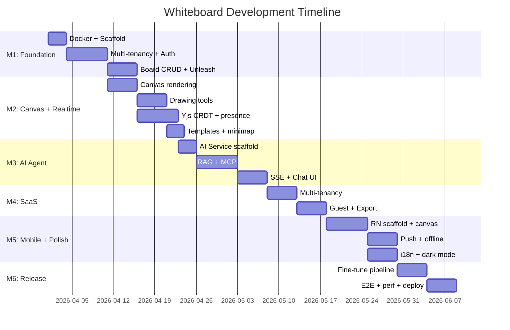

# Development Roadmap: Realtime AI Whiteboard

## Effort Estimation Method

Using **T-shirt sizing**:

| Size | Effort | Example |
|------|--------|---------|
| XS | < 2 hours | Fix typo, update config |
| S | 2-4 hours | Add API endpoint, simple component |
| M | 1-2 days | New feature with API + UI |
| L | 3-5 days | Complex feature across systems |
| XL | 1-2 weeks | New system, major refactor |

## Definition of Done

A feature is "Done" when:
- [ ] Code reviewed and merged to `dev`
- [ ] Unit tests written and passing
- [ ] API documented (OpenAPI)
- [ ] UI matches Figma (if applicable)
- [ ] Storybook story added (if UI component)
- [ ] Feature flag configured in Unleash (if gradual rollout)
- [ ] Analytics event implemented (if user-facing)
- [ ] No lint or security scan errors

## Milestones

### M1: Foundation — `whiteboard/v0.1.0`

**Goal:** Project scaffold, auth, multi-tenancy, basic board CRUD, Docker infra, feature flags.
**Duration:** 3 weeks

| Feature | Priority | Size | Platform | System | Dependency | Status |
|---------|----------|------|----------|--------|-----------|--------|
| Docker Compose (PG, Redis, MinIO, Unleash) | P0 | M | — | Infra | — | Not started |
| NestJS project scaffold + module structure | P0 | M | — | BFF + API | Docker | Not started |
| React project scaffold (Vite + Zustand + Router) | P0 | M | Web | Web App | — | Not started |
| Multi-tenancy (schema-per-tenant + middleware) | P0 | XL | — | BFF + API | Prisma + Docker PG | Not started |
| User auth (register, login, JWT with tenantId) | P0 | L | Web | BFF + API | Multi-tenancy | Not started |
| Board CRUD (create, list, delete) | P0 | M | Web | BFF + API + Web App | Auth | Not started |
| Prisma schema + migrations (per-tenant) | P0 | L | — | BFF + API | Multi-tenancy | Not started |
| Feature flags (Unleash integration) | P0 | S | All | All | Unleash Docker | Not started |
| API Layer pattern (real + mock client) | P0 | S | Web | Web App | React scaffold | Not started |
| Storybook setup | P1 | S | Web | Web App | React scaffold | Not started |
| CI workflow (ESLint + Jest placeholder) | P1 | S | — | CI | — | Not started |

**Risks:**
| Risk | Impact | Mitigation |
|------|--------|------------|
| Schema-per-tenant migration complexity | High | Implement in M1 to avoid later refactor |

---

### M2: Canvas + Realtime — `whiteboard/v0.2.0`

**Goal:** Drawing canvas with realtime multi-user collaboration via CRDT.
**Duration:** 3 weeks

| Feature | Priority | Size | Platform | System | Dependency | Status |
|---------|----------|------|----------|--------|-----------|--------|
| Canvas rendering (Fabric.js/Konva) | P0 | XL | Web | Web App | M1 | Not started |
| Drawing tools (rect, circle, line, arrow, sticky, text, freehand) | P0 | L | Web | Web App | Canvas | Not started |
| Element selection, resize, rotate | P0 | L | Web | Web App | Canvas | Not started |
| Yjs CRDT integration + WebSocket provider | P0 | XL | Web | BFF + API + Web App | Canvas | Not started |
| Cursor presence (see other users) | P0 | M | Web | BFF + API + Web App | Yjs | Not started |
| Yjs IndexedDB persistence (offline) | P1 | M | Web | Web App | Yjs | Not started |
| Board templates (brainstorm, retro, kanban) | P1 | M | Web | BFF + API + Web App | Canvas + Yjs | Not started |
| Minimap + zoom controls | P1 | M | Web | Web App | Canvas | Not started |
| Keyboard shortcuts | P1 | S | Web | Web App | Canvas | Not started |

**Risks:**
| Risk | Impact | Mitigation |
|------|--------|------------|
| Canvas performance with many elements | Medium | Virtual rendering (viewport culling) |
| Yjs + Fabric.js binding complexity | High | Build thin adapter layer, test early |

---

### M3: AI Agent — `whiteboard/v0.3.0`

**Goal:** AI chat assistant with RAG + MCP tool use.
**Duration:** 3 weeks

| Feature | Priority | Size | Platform | System | Dependency | Status |
|---------|----------|------|----------|--------|-----------|--------|
| AI Service scaffold (LangGraph + LangChain) | P0 | L | — | AI Service | Docker (Ollama, ChromaDB) | Not started |
| Redis Stream producer (BFF) + consumer (AI Service) | P0 | M | — | BFF + AI Service | Redis | Not started |
| Intent classifier | P0 | M | — | AI Service | LangGraph | Not started |
| RAG pipeline (embed → ChromaDB → retrieve → augment) | P0 | L | — | AI Service | ChromaDB | Not started |
| MCP Server (User, Data, Task tools) | P0 | L | — | AI Service | BFF API | Not started |
| ReAct planner + reflector | P1 | L | — | AI Service | LangGraph | Not started |
| SSE streaming (token-by-token) | P0 | M | Web | BFF + Web App | AI Service | Not started |
| AI Chat Panel UI | P0 | M | Web | Web App | SSE | Not started |
| Langfuse integration | P1 | S | — | AI Service | Langfuse Docker | Not started |
| ChromaDB board indexer | P1 | M | — | AI Service | ChromaDB | Not started |

**Risks:**
| Risk | Impact | Mitigation |
|------|--------|------------|
| Ollama too slow on older machines | High | Default to 7B 4-bit, show loading state |
| MCP tool execution fails silently | Medium | Log all tool calls in Langfuse, retry with reflection |

---

### M4: SaaS Features — `whiteboard/v0.4.0`

**Goal:** Multi-tenancy, guest access, export, subscription plans.
**Duration:** 2 weeks

| Feature | Priority | Size | Platform | System | Dependency | Status |
|---------|----------|------|----------|--------|-----------|--------|
| Guest access via shared link | P1 | L | Web | BFF + API + Web App | Auth | Not started |
| Export (PNG, PDF) | P1 | M | Web | BFF + Web App | Canvas | Not started |
| Subscription plans (Free / Pro) | P2 | L | Web | BFF + API + Web App + Unleash | Multi-tenancy (M1) | Not started |
| Usage metering (Redis counter → Kafka) | P2 | M | — | BFF + API | Kafka | Not started |

**Risks:**
| Risk | Impact | Mitigation |
|------|--------|------------|
| Subscription plan gating complexity | Medium | Use Unleash feature flags (already in M1) |

---

### M5: Mobile + Polish — `whiteboard/v0.5.0`

**Goal:** React Native mobile app, WebRTC voice, i18n, dark mode.
**Duration:** 3 weeks

| Feature | Priority | Size | Platform | System | Dependency | Status |
|---------|----------|------|----------|--------|-----------|--------|
| React Native project scaffold (Expo) | P1 | M | Mobile | Mobile App | — | Not started |
| Mobile canvas (touch drawing, pinch zoom) | P1 | XL | Mobile | Mobile App | Yjs | Not started |
| Mobile AI chat (full-screen overlay) | P1 | M | Mobile | Mobile App | SSE | Not started |
| Push notifications (Expo + FCM/APNs) | P2 | M | Mobile | Mobile App + BFF | Kafka | Not started |
| Offline editing (y-async-storage) | P1 | M | Mobile | Mobile App | Yjs | Not started |
| WebRTC voice/video (P2P, max 4-6 users) | P2 | XL | Web | Web App | — | Not started |
| i18n (en + zh-TW) | P2 | M | Web + Mobile | All frontends | — | Not started |
| Dark mode | P2 | M | Web + Mobile | All frontends | Design tokens | Not started |
| Static demo build (mock mode → GitHub Pages) | P2 | M | Web | Web App | API Layer | Not started |

**Risks:**
| Risk | Impact | Mitigation |
|------|--------|------------|
| React Native canvas performance | Medium | Use Skia if Fabric.js is too slow |
| WebRTC NAT traversal | Medium | Use STUN server, fallback to relay |
| WebRTC P2P limited to 4-6 users | Low | Future: add SFU (Mediasoup/LiveKit) for larger groups |

---

### M6: Fine-tune + Release — `whiteboard/v1.0.0`

**Goal:** LoRA fine-tuning pipeline, E2E tests, performance optimization, demo-ready.
**Duration:** 2 weeks

| Feature | Priority | Size | Platform | System | Dependency | Status |
|---------|----------|------|----------|--------|-----------|--------|
| Fine-tune pipeline (data collection + LoRA + GGUF + Ollama deploy) | P2 | XL | — | Fine-tune Pipeline | Langfuse data | Not started |
| E2E tests (Playwright) | P1 | L | Web | CI | All features | Not started |
| Performance optimization (canvas, API, bundle size) | P1 | L | All | All | All features | Not started |
| Security scan (Semgrep + Trivy) | P1 | M | — | CI | — | Not started |
| Demo video recording | P2 | S | — | — | All features | Not started |
| GitHub Pages deploy | P2 | M | Web | CI | Static demo build | Not started |

## Dependency Graph

## Release Plan

| Tag | Milestone | Branch | What's Included |
|-----|-----------|--------|----------------|
| whiteboard/v0.1.0-rc.1 | M1 | dev | Scaffold, auth, board CRUD |
| whiteboard/v0.1.0 | M1 | stable | Foundation complete |
| whiteboard/v0.2.0-rc.1 | M2 | dev | Canvas + CRDT realtime |
| whiteboard/v0.2.0 | M2 | stable | Canvas complete |
| whiteboard/v0.3.0-rc.1 | M3 | dev | AI agent + RAG + MCP |
| whiteboard/v0.3.0 | M3 | stable | AI complete |
| whiteboard/v0.4.0 | M4 | stable | SaaS features |
| whiteboard/v0.5.0 | M5 | stable | Mobile + polish |
| whiteboard/v1.0.0 | M6 | stable | MVP — demo ready |

## Tech Debt Planned

| Item | When | Priority |
|------|------|----------|
| Refactor canvas adapter layer (Fabric.js ↔ Yjs) | After M2 | Medium |
| Optimize Yjs document size for large boards | After M2 | Medium |
| Add rate limiting per tenant | M4 | High |
| Bundle size optimization (code splitting) | M6 | Medium |
| Add integration tests for tenant isolation | M4 | High |
