# System Architecture: Realtime AI Whiteboard

## Table of Contents

- [Architecture Pattern](#architecture-pattern)
- [C4 Model](#c4-model)
  - [Level 1: System Context](#level-1-system-context)
  - [Level 2: Container Diagram](#level-2-container-diagram)
  - [Level 3: Component Diagram (BFF + API)](#level-3-component-diagram-bff-api)
  - [Level 3: Component Diagram (AI Service)](#level-3-component-diagram-ai-service)
  - [Level 3: Component Diagram (Web App — React)](#level-3-component-diagram-web-app-react)
  - [Level 3: Component Diagram (Mobile App — React Native)](#level-3-component-diagram-mobile-app-react-native)
- [Component Overview](#component-overview)
- [Data Flow (Sequence Diagrams)](#data-flow-sequence-diagrams)
  - [Flow 1: Create Board and Start Collaborating](#flow-1-create-board-and-start-collaborating)
  - [Flow 2: AI Content Generation](#flow-2-ai-content-generation)
  - [Flow 3: Guest Access](#flow-3-guest-access)
  - [Flow 4: Offline → Online Sync](#flow-4-offline-online-sync)
- [API Contracts (High-level)](#api-contracts-high-level)
- [Database Schema (High-level)](#database-schema-high-level)
- [Deployment Diagram](#deployment-diagram)
- [Security Architecture](#security-architecture)
- [Infrastructure Dependencies](#infrastructure-dependencies)
- [Scalability Considerations](#scalability-considerations)
- [ADRs Created](#adrs-created)

---

## Architecture Pattern

**Modular Monolith + BFF** — a single NestJS backend organized by feature modules, with a BFF layer that serves different API surfaces for Web and Mobile clients. AI runs as a separate service (LangGraph) consuming from Redis Stream.

## C4 Model

### Level 1: System Context

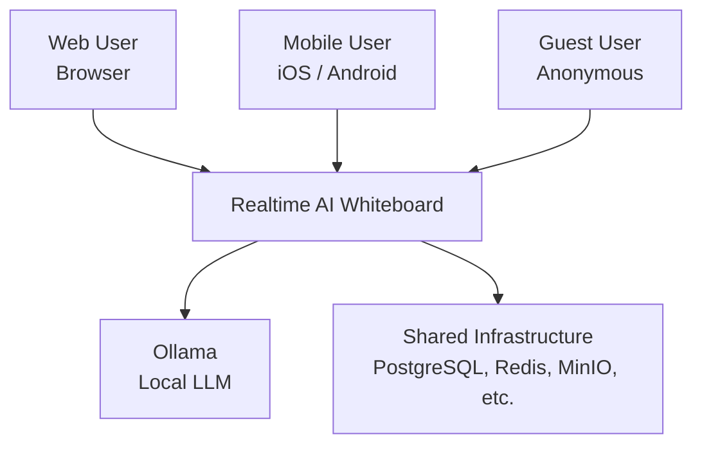

### Level 2: Container Diagram

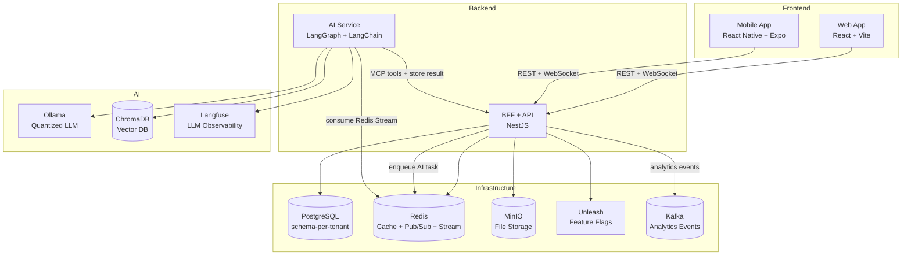

### Level 3: Component Diagram (BFF + API)

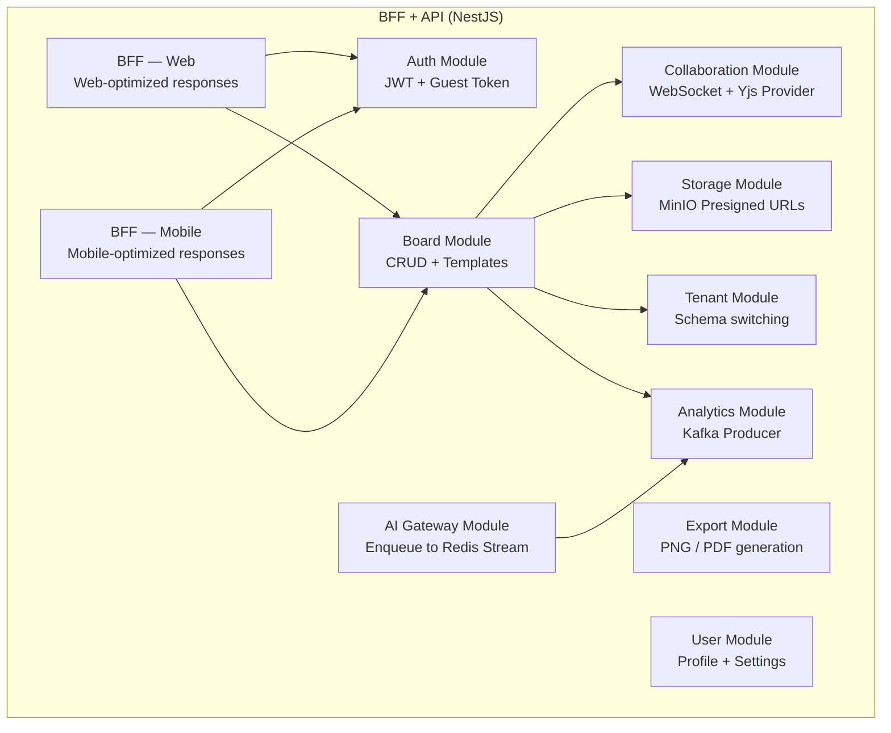

### Level 3: Component Diagram (AI Service)

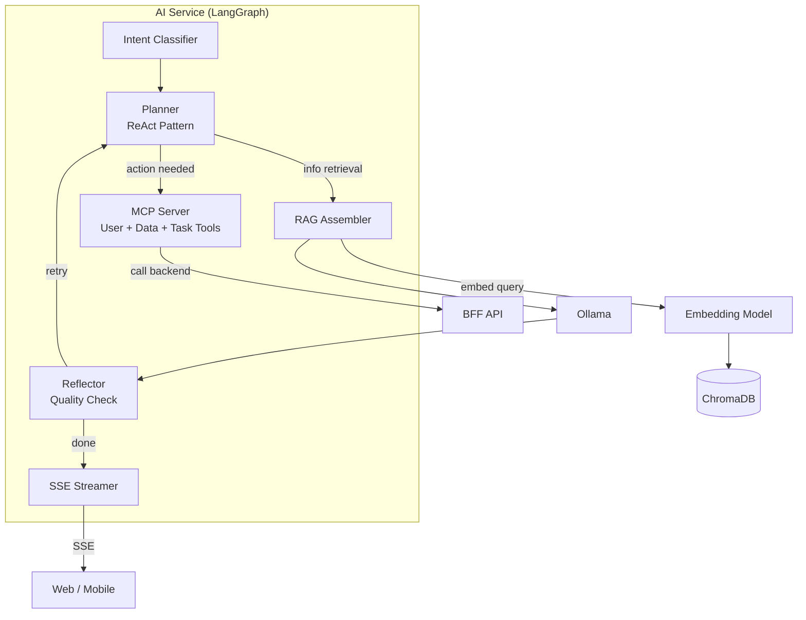

### Level 3: Component Diagram (Web App — React)

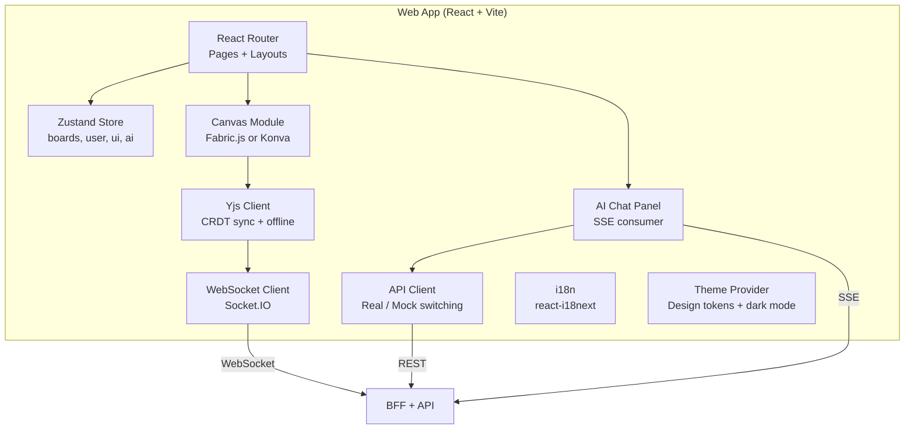

#### Web App — Key Modules

| Module | Responsibility | Key Libraries |
|--------|---------------|---------------|
| Router | Page routing, layout, auth guards | React Router v6 |
| Store | Global state (boards, user, UI, AI chat) | Zustand |
| Canvas | Drawing surface, element rendering, selection | Fabric.js or Konva |
| Yjs Client | CRDT document, offline persistence, sync | Yjs, y-websocket, y-indexeddb |
| WebSocket Client | Connection management, reconnect, presence | Socket.IO client |
| AI Chat Panel | Prompt input, SSE stream consumer, tool results | EventSource API |
| API Client | REST calls, real/mock switching by env | Axios + API Layer pattern |
| i18n | Multi-language (en, zh-TW) | react-i18next |
| Theme | Design tokens, dark mode toggle, CSS variables | CSS custom properties |

#### Web App — Route Structure

| Route | Page | Auth |
|-------|------|------|
| `/` | Landing Page | Public |
| `/auth` | Login / Sign Up | Public |
| `/dashboard` | Board Grid | JWT |
| `/board/:id` | Canvas + AI Panel | JWT / Guest |
| `/board/:id/settings` | Board Settings | JWT (owner) |
| `/settings` | Account Settings | JWT |
| `/pricing` | Plan Comparison | Public |

### Level 3: Component Diagram (Mobile App — React Native)

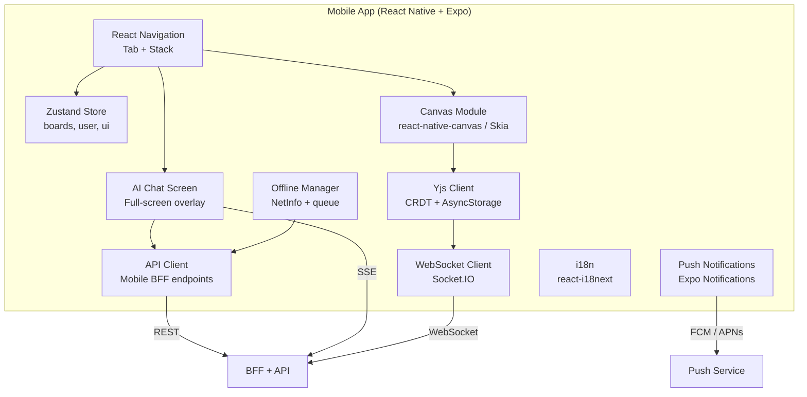

#### Mobile App — Key Modules

| Module | Responsibility | Key Libraries |
|--------|---------------|---------------|
| Navigation | Tab bar + stack navigation | React Navigation v6 |
| Store | Global state (shared with web via Zustand) | Zustand |
| Canvas | Touch drawing, pinch zoom, pan | react-native-canvas or Skia |
| Yjs Client | CRDT sync, offline persistence via AsyncStorage | Yjs, y-websocket, y-async-storage |
| WebSocket Client | Connection, auto-reconnect | Socket.IO client |
| AI Chat | Full-screen chat overlay | Custom screen |
| API Client | Mobile BFF REST calls | Axios |
| Push | Register device token, handle notifications | Expo Notifications |
| Offline Manager | Detect network state, queue actions | @react-native-community/netinfo |
| i18n | Multi-language | react-i18next (shared config with web) |

#### Mobile App — Navigation Structure

| Tab | Stack Screens | Auth |
|-----|--------------|------|
| Home | Board List → Board Canvas | JWT |
| Search | Search → Board Canvas | JWT |
| Create | New Board → Board Canvas | JWT |
| Settings | Account, Profile | JWT |
| (Overlay) | AI Chat (full screen) | JWT |

## Component Overview

| Component | Tech | System | Responsibility |
|-----------|------|--------|---------------|
| Web App | React + Vite + Zustand | Frontend | Canvas UI, toolbar, AI chat panel |
| Mobile App | React Native + Expo | Frontend | Mobile canvas, touch controls, offline |
| BFF + API | NestJS (TypeScript) | Backend | REST/WS API, auth, CRUD, BFF layer |
| Collaboration | Yjs + y-websocket | Backend | CRDT sync, cursor presence |
| AI Service | LangGraph + LangChain | AI Worker | Agent state machine, RAG, MCP tools |
| Ollama | Ollama server | AI Runtime | Local LLM inference |
| ChromaDB | ChromaDB | AI Storage | Vector embeddings for RAG |
| Langfuse | Langfuse server | AI Observability | LLM trace logging |

## Data Flow (Sequence Diagrams)

### Flow 1: Create Board and Start Collaborating

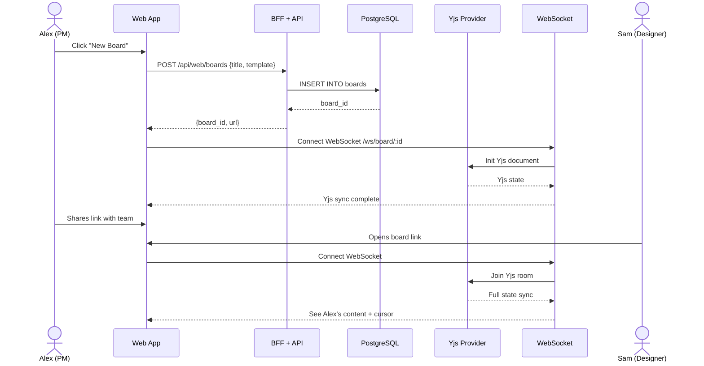

### Flow 2: AI Content Generation

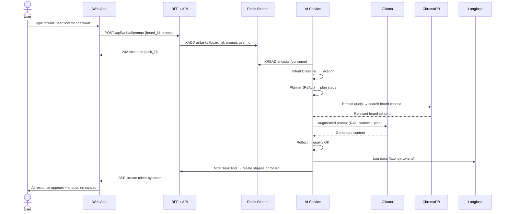

### Flow 3: Guest Access

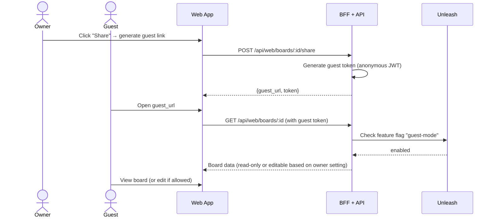

### Flow 4: Offline → Online Sync

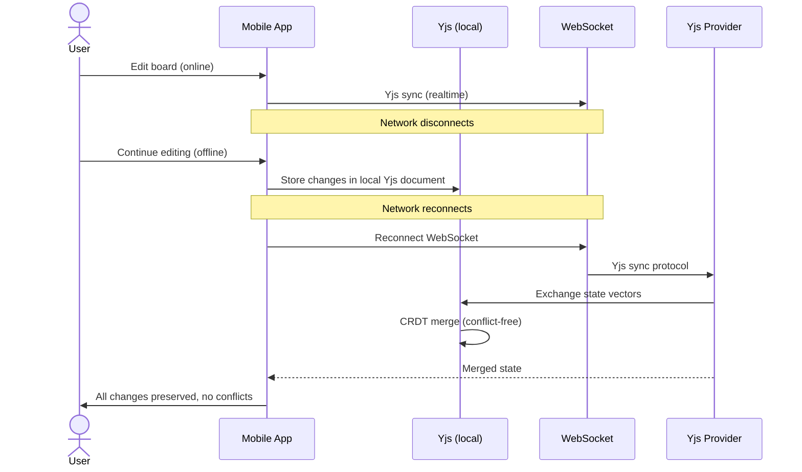

## API Contracts (High-level)

| Endpoint | Protocol | Direction | Description |
|----------|----------|-----------|-------------|
| `POST /api/web/boards` | REST | Client → Server | Create board |
| `GET /api/web/boards/:id` | REST | Client → Server | Get board data |
| `POST /api/web/ai/prompt` | REST | Client → Server | Submit AI prompt |
| `GET /api/web/ai/stream/:taskId` | SSE | Server → Client | Stream AI response |
| `/ws/board/:id` | WebSocket | Bidirectional | Yjs CRDT sync + cursor presence |
| `POST /api/mobile/boards` | REST | Client → Server | Create board (mobile-optimized) |
| `POST /api/web/boards/:id/share` | REST | Client → Server | Generate guest link |
| `GET /api/web/boards/:id/export` | REST | Client → Server | Export as PNG/PDF |
| `analytics.whiteboard-events` | Kafka topic | Producer → Consumer | User behavior events |

## Database Schema (High-level)

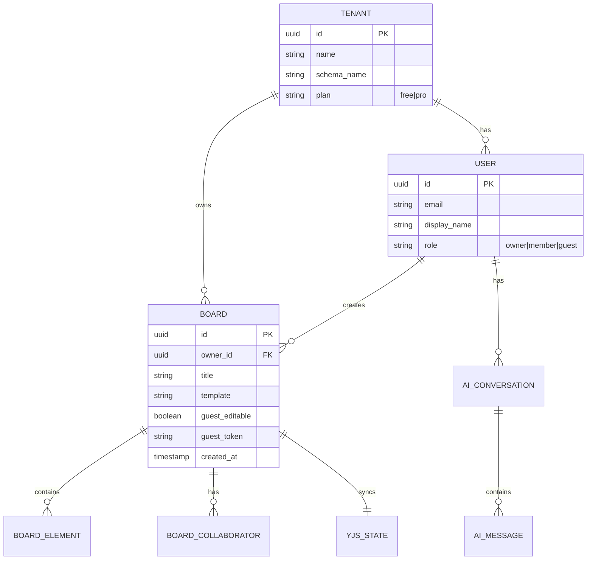

## Deployment Diagram

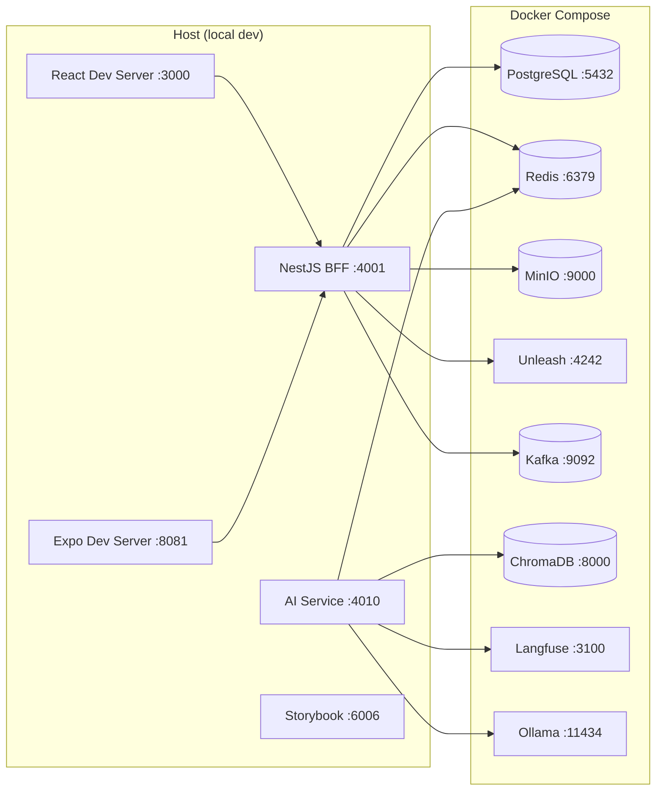

## Security Architecture

| Layer | Measure |
|-------|---------|
| Network | Docker network isolation. Only mapped ports accessible from host. |
| Auth (registered) | JWT with RS256. Access token (15min) + refresh token (7d). |
| Auth (guest) | Anonymous JWT with limited permissions. No refresh. |
| Authorization | Board-level: owner, collaborator, guest. Tenant-level: schema isolation. |
| Data in transit | HTTPS (REST), WSS (WebSocket), all local but TLS-ready. |
| Data at rest | MinIO SSE-S3 encryption. PostgreSQL at-rest encryption (planned). |
| Secrets | `.env` files. Never in code. Docker secrets for production. |
| Input validation | Zod schemas at API boundary. Sanitize HTML in board elements. |
| Rate limiting | Per-user Redis sliding window. Plan-based limits via Unleash. |
| CORS | Whitelist `localhost:3000` (web) and `localhost:8081` (mobile). |
| Dependencies | SAST (Semgrep) + SCA (Trivy) in CI. |

## Infrastructure Dependencies

| Service | Purpose | Port |
|---------|---------|------|
| PostgreSQL | Board data, user data, tenant schemas | 5432 |
| Redis | Cache, Pub/Sub (WebSocket scale), Stream (AI queue) | 6379 |
| MinIO | Board exports (PNG, PDF), uploaded images | 9000 |
| Unleash | Feature flags, plan-based gating | 4242 |
| Kafka | Analytics events | 9092 |
| ChromaDB | Vector embeddings for RAG | 8000 |
| Langfuse | LLM observability | 3100 |
| Ollama | Local LLM inference | 11434 |

## Scalability Considerations

| Concern | Current (local) | Production Strategy |
|---------|-----------------|-------------------|
| Concurrent boards | Single NestJS instance | Horizontal scaling + Redis Pub/Sub for WebSocket fan-out |
| Database | Single PostgreSQL | Read replicas per tenant schema |
| WebSocket connections | Single process | Multiple instances behind load balancer + sticky sessions |
| AI inference | Single Ollama | Multiple Ollama instances or GPU cluster |
| File storage | Single MinIO | S3 in cloud with CloudFront CDN |
| Search | N/A (no Elasticsearch for Whiteboard) | Add Elasticsearch if board search needed at scale |
| Caching | Single Redis | Redis Cluster |

## ADRs Created

- [ADR-0001: Why Yjs (CRDT) over OT](adrs/ADR-0001-why-yjs-over-ot.md)
- [ADR-0002: Why Ollama over cloud LLM](adrs/ADR-0002-why-ollama-over-cloud-llm.md)
- [ADR-0003: Why schema-per-tenant](adrs/ADR-0003-why-schema-per-tenant.md)
- [ADR-0004: Why NestJS Modular Monolith over microservices](adrs/ADR-0004-why-modular-monolith.md)
- [ADR-0005: Why Redis Stream over Kafka for AI task queue](adrs/ADR-0005-why-redis-stream-over-kafka.md)
