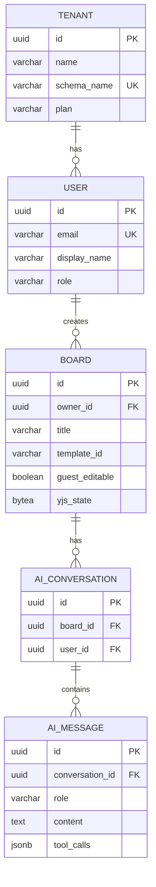
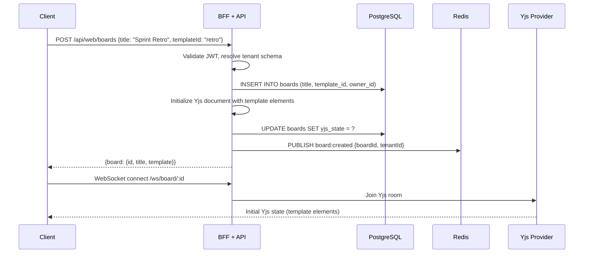
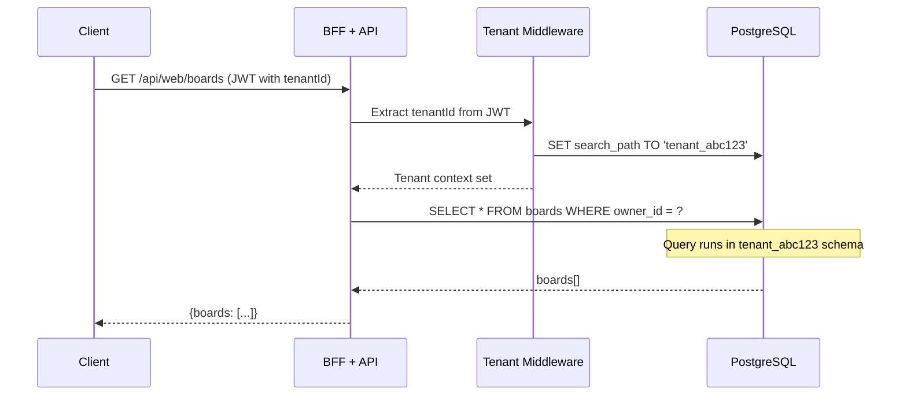

# Technical Design: Realtime AI Whiteboard

## System: BFF + API (NestJS)

### API Specification

#### REST — Web BFF

| Method | Path | Request | Response | Auth |
|--------|------|---------|----------|------|
| POST | `/api/web/auth/register` | `{email, password, displayName}` | `{accessToken, refreshToken, user}` | Public |
| POST | `/api/web/auth/login` | `{email, password}` | `{accessToken, refreshToken, user}` | Public |
| POST | `/api/web/auth/refresh` | `{refreshToken}` | `{accessToken}` | Public |
| GET | `/api/web/boards` | `?page&limit&search` | `{boards[], cursor, total}` | JWT |
| POST | `/api/web/boards` | `{title, templateId?}` | `{board}` | JWT |
| GET | `/api/web/boards/:id` | — | `{board, elements[], collaborators[]}` | JWT / Guest |
| PATCH | `/api/web/boards/:id` | `{title?, guestEditable?}` | `{board}` | JWT (owner) |
| DELETE | `/api/web/boards/:id` | — | `204` | JWT (owner) |
| POST | `/api/web/boards/:id/share` | `{permission: "view"\|"edit"}` | `{guestUrl, guestToken}` | JWT (owner) |
| DELETE | `/api/web/boards/:id/share` | — | `204` | JWT (owner) |
| POST | `/api/web/boards/:id/export` | `{format: "png"\|"pdf"}` | `{downloadUrl}` | JWT |
| POST | `/api/web/ai/prompt` | `{boardId, prompt}` | `{taskId}` | JWT |
| GET | `/api/web/ai/stream/:taskId` | — | SSE stream | JWT |
| GET | `/api/web/user/me` | — | `{user, plan, usage}` | JWT |
| PATCH | `/api/web/user/me` | `{displayName?, locale?}` | `{user}` | JWT |

#### REST — Mobile BFF

| Method | Path | Request | Response | Auth |
|--------|------|---------|----------|------|
| GET | `/api/mobile/boards` | `?cursor&limit` | `{boards[], nextCursor}` | JWT |
| GET | `/api/mobile/boards/:id` | — | `{board, elements[]}` (compact) | JWT |
| POST | `/api/mobile/boards` | `{title, templateId?}` | `{board}` | JWT |
| POST | `/api/mobile/ai/prompt` | `{boardId, prompt}` | `{taskId}` | JWT |

> Mobile BFF returns smaller payloads (no collaborator details, compressed element data).

#### WebSocket Events

| Event | Direction | Payload | Description |
|-------|-----------|---------|-------------|
| `yjs:sync` | Bidirectional | Yjs binary protocol | CRDT state sync |
| `yjs:update` | Bidirectional | Yjs update binary | Incremental CRDT update |
| `cursor:update` | Client → Server | `{userId, x, y, color}` | Cursor position (throttled 60fps) |
| `cursor:broadcast` | Server → Clients | `{userId, x, y, color, name}` | Other user cursor |
| `presence:join` | Server → Clients | `{userId, name, color}` | User joined board |
| `presence:leave` | Server → Clients | `{userId}` | User left board |

#### SSE (AI Response Stream)

| Event | Data | Description |
|-------|------|-------------|
| `token` | `{text: "Hello"}` | Single token from LLM |
| `tool_call` | `{tool: "createShape", args: {...}}` | MCP tool execution |
| `tool_result` | `{result: {...}}` | Tool execution result |
| `done` | `{totalTokens, latencyMs}` | Stream complete |
| `error` | `{code, message}` | AI error |

### Database Tables (owned by BFF + API)

#### Table: `tenants`

| Column | Type | Constraints | Description |
|--------|------|------------|-------------|
| id | uuid | PK, DEFAULT gen_random_uuid() | Tenant ID |
| name | varchar(255) | NOT NULL | Workspace name |
| schema_name | varchar(63) | UNIQUE, NOT NULL | PostgreSQL schema name |
| plan | varchar(20) | DEFAULT 'free' | free / pro |
| created_at | timestamptz | DEFAULT now() | |

#### Table: `users` (per-tenant schema)

| Column | Type | Constraints | Description |
|--------|------|------------|-------------|
| id | uuid | PK | |
| email | varchar(255) | UNIQUE, NOT NULL | |
| password_hash | varchar(255) | NOT NULL | bcrypt hash |
| display_name | varchar(100) | NOT NULL | |
| role | varchar(20) | DEFAULT 'member' | owner / member |
| locale | varchar(10) | DEFAULT 'en' | en / zh-TW |
| created_at | timestamptz | DEFAULT now() | |

#### Table: `boards` (per-tenant schema)

| Column | Type | Constraints | Description |
|--------|------|------------|-------------|
| id | uuid | PK | |
| owner_id | uuid | FK → users.id, NOT NULL | |
| title | varchar(255) | NOT NULL | |
| template_id | varchar(50) | NULL | brainstorm / retro / kanban / null |
| guest_editable | boolean | DEFAULT false | |
| guest_token | varchar(255) | UNIQUE, NULL | For guest access |
| yjs_state | bytea | NULL | Serialized Yjs document |
| thumbnail_url | varchar(500) | NULL | Auto-generated |
| created_at | timestamptz | DEFAULT now() | |
| updated_at | timestamptz | DEFAULT now() | |

#### Table: `ai_conversations` (per-tenant schema)

| Column | Type | Constraints | Description |
|--------|------|------------|-------------|
| id | uuid | PK | |
| board_id | uuid | FK → boards.id | |
| user_id | uuid | FK → users.id | |
| created_at | timestamptz | DEFAULT now() | |

#### Table: `ai_messages` (per-tenant schema)

| Column | Type | Constraints | Description |
|--------|------|------------|-------------|
| id | uuid | PK | |
| conversation_id | uuid | FK → ai_conversations.id | |
| role | varchar(20) | NOT NULL | user / assistant / tool |
| content | text | NOT NULL | Message text |
| tool_calls | jsonb | NULL | MCP tool calls (if assistant) |
| tokens_used | int | NULL | Token count |
| latency_ms | int | NULL | Response time |
| created_at | timestamptz | DEFAULT now() | |

### Indexes

| Table | Columns | Type | Purpose |
|-------|---------|------|---------|
| boards | owner_id | btree | Fast lookup by owner |
| boards | created_at DESC | btree | Dashboard sort |
| boards | guest_token | btree unique | Guest link lookup |
| ai_messages | conversation_id, created_at | btree | Chat history pagination |

## System: AI Service (LangGraph)

### Pipeline Specification

| Stage | Input | Output | Tech |
|-------|-------|--------|------|
| Intent Classifier | User prompt + board context | `"info_retrieval"` or `"action_execution"` | LangChain classifier |
| Planner (ReAct) | Intent + context | List of steps (reasoning + actions) | LangGraph node |
| RAG Assembler | Query | Augmented prompt with relevant board content | ChromaDB + Embedding |
| LLM Inference | Augmented prompt | Generated text / tool calls | Ollama |
| MCP Executor | Tool call | Tool result | MCP Server |
| Reflector | LLM output + tool results | Pass / Retry decision | LangGraph conditional edge |
| SSE Streamer | Final output | Token-by-token stream | NestJS SSE endpoint |

### MCP Tools

| Tool | Method | Parameters | Returns | Side Effect |
|------|--------|-----------|---------|-------------|
| `user.getProfile` | GET | `{userId}` | `{name, plan, boards}` | None |
| `user.getPreferences` | GET | `{userId}` | `{locale, theme}` | None |
| `data.searchBoards` | GET | `{query, limit}` | `{boards[]}` | None |
| `data.getBoardContent` | GET | `{boardId}` | `{elements[], title}` | None |
| `task.createShape` | POST | `{boardId, type, x, y, text}` | `{elementId}` | Creates element on board |
| `task.createConnector` | POST | `{boardId, fromId, toId}` | `{connectorId}` | Creates connector |
| `task.updateElement` | PATCH | `{boardId, elementId, props}` | `{updated}` | Modifies element |
| `task.exportBoard` | POST | `{boardId, format}` | `{downloadUrl}` | Generates export file |

### ChromaDB Collections

| Collection | Embedding | Content | Purpose |
|-----------|-----------|---------|---------|
| `board_elements` | all-MiniLM-L6-v2 | Board element text (sticky notes, text boxes) | RAG context retrieval |
| `user_history` | all-MiniLM-L6-v2 | Past AI conversations | Long-term memory |

---

## Database Schema (Full)

### ER Diagram



### Migrations

| Item | Standard |
|------|---------|
| Tool | Prisma Migrate |
| Naming | `YYYYMMDDHHMMSS_description` (e.g. `20260401120000_create_boards`) |
| Rollback | Every migration has `down` migration via `prisma migrate reset` |
| Tenant schemas | Migration runs per tenant schema on deploy |

### Data Migration Strategy

| Scenario | Strategy |
|----------|---------|
| Add column | Add with default value, backfill async if needed |
| Rename column | Add new → copy data → remove old (across 2 releases) |
| Remove column | Stop reading first → remove in next release |
| New tenant | Auto-create schema + run all migrations on signup |

## Sequence Diagrams (Key Flows)

### Flow: Board Creation with Template



### Flow: Multi-tenant Schema Switching



## Authentication & Authorization

| Role | Create Board | Edit Board | View Board | Share Board | AI Chat | Delete Board | Manage Team |
|------|-------------|-----------|------------|------------|---------|-------------|-------------|
| Owner | ✅ | ✅ (own) | ✅ (all) | ✅ (own) | ✅ | ✅ (own) | ✅ |
| Member | ✅ | ✅ (own + shared) | ✅ (own + shared) | ✅ (own) | ✅ | ✅ (own) | ❌ |
| Guest | ❌ | ✅/❌ (per board) | ✅ | ❌ | ❌ | ❌ | ❌ |

### JWT Token Structure

```json
{
  "sub": "user-uuid",
  "tenantId": "tenant-uuid",
  "role": "member",
  "plan": "pro",
  "iat": 1711234567,
  "exp": 1711235467
}
```

| Token | TTL | Storage |
|-------|-----|---------|
| Access Token | 15 min | Memory (client) |
| Refresh Token | 7 days | HttpOnly cookie |
| Guest Token | 24 hours | URL parameter |

## Error Handling

```json
{
  "error": {
    "code": "BOARD_NOT_FOUND",
    "message": "Board with ID xyz not found",
    "request_id": "req-uuid",
    "timestamp": "2026-04-01T10:00:00Z"
  }
}
```

| Code | HTTP | Description |
|------|------|-------------|
| `AUTH_INVALID_TOKEN` | 401 | JWT expired or invalid |
| `AUTH_FORBIDDEN` | 403 | No permission for this resource |
| `BOARD_NOT_FOUND` | 404 | Board doesn't exist or not in tenant |
| `BOARD_LIMIT_REACHED` | 403 | Free plan limit (5 boards) |
| `AI_UNAVAILABLE` | 503 | Ollama not running |
| `AI_TIMEOUT` | 504 | LLM response timed out (>30s) |
| `UPLOAD_TOO_LARGE` | 413 | File exceeds limit |
| `RATE_LIMITED` | 429 | Too many requests |

## Caching Strategy

| Key Pattern | TTL | Invalidation | Data |
|-------------|-----|-------------|------|
| `board:{id}:meta` | 5 min | On board update | Board title, owner, settings |
| `user:{id}:profile` | 10 min | On profile update | User display name, plan |
| `tenant:{id}:plan` | 30 min | On plan change | Tenant plan + limits |
| `board:{id}:presence` | Realtime | On WS disconnect | Active user list |

## Background Jobs / Workers

| Job | System | Trigger | Input | Output |
|-----|--------|---------|-------|--------|
| AI Task Processor | AI Service | Redis Stream `ai-tasks` | `{boardId, prompt, userId}` | AI response → SSE stream |
| Board Thumbnail | BFF (async) | Board update event | `{boardId, yjsState}` | Thumbnail PNG → MinIO |
| Usage Metering | BFF | Every API call | `{tenantId, endpoint}` | Counter in Redis → Kafka analytics |
| ChromaDB Indexer | AI Service | Board element change | `{boardId, elements}` | Updated vector embeddings |

## Third-party Integrations

| Integration | Purpose | How |
|-------------|---------|-----|
| Ollama | LLM inference | HTTP API `http://localhost:11434/api/generate` |
| ChromaDB | Vector search | HTTP API `http://localhost:8000/api/v1/collections` |
| Langfuse | LLM tracing | LangChain callback handler |
| Unleash | Feature flags | Unleash SDK for Node.js |

## ADRs Created

- [ADR-0001: Why Yjs (CRDT) over OT](adrs/ADR-0001-why-yjs-over-ot.md)
- [ADR-0002: Why Ollama over cloud LLM](adrs/ADR-0002-why-ollama-over-cloud-llm.md)
- [ADR-0003: Why schema-per-tenant](adrs/ADR-0003-why-schema-per-tenant.md)
- [ADR-0004: Why NestJS Modular Monolith](adrs/ADR-0004-why-modular-monolith.md)
- [ADR-0005: Why Redis Stream over Kafka](adrs/ADR-0005-why-redis-stream-over-kafka.md)
