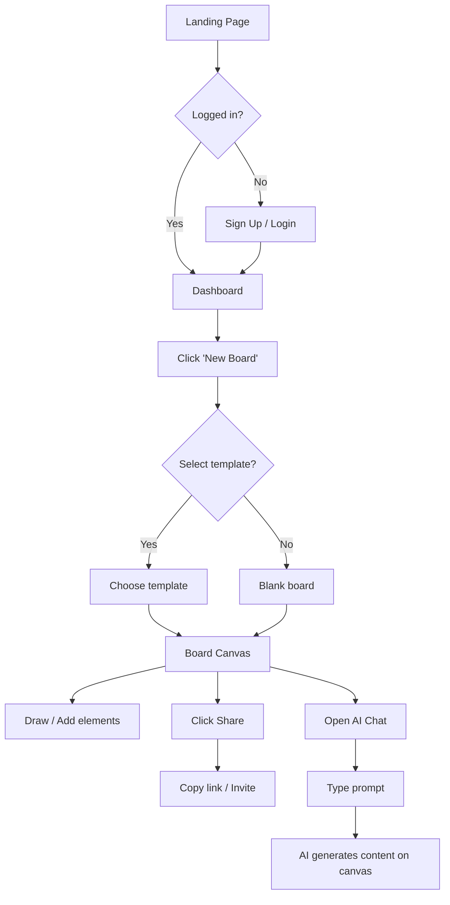
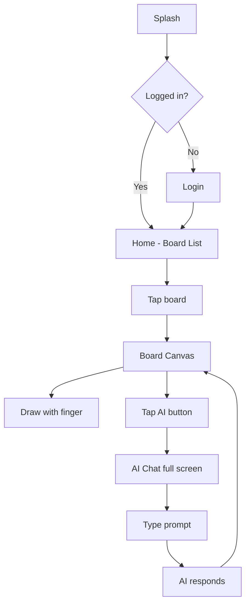

# UI/UX Design: Realtime AI Whiteboard

## Design Principles

1. **Canvas-first** — the board IS the product. Minimize chrome, maximize canvas space.
2. **Instant collaboration** — other users' cursors and changes must feel instant, not laggy.
3. **AI is a sidekick** — AI chat panel is always accessible but never blocks the canvas.
4. **Zero friction onboard** — first board creation in < 30 seconds, no tutorial required.
5. **Works everywhere** — responsive web + native mobile with consistent interaction patterns.

## Web UI

### Screen Inventory (Web)

| Screen | Route | Components | Figma Page | Status |
|--------|-------|-----------|-----------|--------|
| Landing Page | `/` | Hero, Feature cards, CTA, Pricing | Screens — Landing | Draft |
| Sign Up / Login | `/auth` | Form, OAuth buttons, 2-step | Screens — Auth | Draft |
| Dashboard | `/dashboard` | Board grid, Search bar, New board button, Sidebar | Screens — Dashboard | Draft |
| Board Canvas | `/board/:id` | Canvas, Toolbar, Cursor presence, Minimap, Share button | Screens — Canvas | Draft |
| AI Chat Panel | `/board/:id` (side panel) | Chat input, Message list, Typing indicator, Tool result | Screens — AI Chat | Draft |
| Board Settings | `/board/:id/settings` | Title, Permissions, Guest link, Delete | Screens — Settings | Draft |
| Account Settings | `/settings` | Profile, Plan, Usage, Team | Screens — Account | Draft |
| Pricing | `/pricing` | Plan comparison table, CTA buttons | Screens — Pricing | Draft |

### Screen States

Every screen must have these states designed in Figma:

| State | Description |
|-------|------------|
| Default | Normal loaded state with data |
| Loading | Skeleton loader (not spinner) |
| Empty | First-time user, no data yet — show illustration + CTA |
| Error | API failure — show retry button + error message |

### Web Layout

```
┌─────────────────────────────────────────────────┐
│ Top Bar: Logo │ Board Title │ Share │ Avatar    │
├────────┬────────────────────────────┬───────────┤
│        │                            │           │
│ Tool   │                            │  AI Chat  │
│ bar    │        Canvas              │  Panel    │
│ (left) │        (center)            │  (right)  │
│        │                            │  toggle   │
│        │                            │           │
├────────┴────────────────────────────┴───────────┤
│ Bottom: Zoom │ Minimap │ Page indicator          │
└─────────────────────────────────────────────────┘
```

### Web-specific Patterns

| Pattern | Implementation |
|---------|---------------|
| Navigation | Minimal — top bar only. No side nav on canvas page. |
| Toolbar | Left side, vertical, icon-only with tooltip on hover |
| AI Panel | Right side drawer, toggleable. 350px width. |
| Canvas zoom | Scroll wheel + pinch. Zoom controls bottom-left. |
| Keyboard shortcuts | `V` select, `R` rectangle, `T` text, `Space` pan, `Cmd+Z` undo, `Cmd+Shift+Z` redo |
| Drag & drop | HTML5 DnD for image upload onto canvas |
| Multi-select | Click + drag to marquee select, Shift+click to add |

### Key Components (Web)

| Component | Variants | States | Notes |
|-----------|----------|--------|-------|
| Toolbar Button | tool type (select, rect, circle, line, arrow, text, sticky, freehand, image) | default, hover, active (selected), disabled | Icon-only, 40x40px |
| Canvas Element | shape, sticky, text, image, freehand, connector | default, selected (with handles), dragging, locked | Each has resize handles when selected |
| Cursor Presence | — | other user's cursor with name label + color | Color assigned per user, label fades after 3s idle |
| AI Chat Message | user message, AI response, tool result | default, streaming (typing), error | AI responses stream token-by-token |
| AI Chat Input | — | default, focused, disabled (AI processing) | Submit on Enter, Shift+Enter for newline |
| Board Card | — | default, hover (scale up), loading | Dashboard grid item, shows thumbnail + title + last edited |
| Share Modal | — | default, link copied, guest toggle | Copy link button, guest edit toggle |
| Skeleton Loader | board card, canvas, chat | loading | Pulse animation, matches layout shape |
| Empty State | dashboard (no boards), search (no results) | — | Illustration + CTA button |
| Toast | success, error, info | show, hiding | Slide in from top-right, auto-dismiss 5s |

## Mobile UI (iOS + Android)

### Screen Inventory (Mobile)

| Screen | Route | Platform | Figma Page | Status |
|--------|-------|----------|-----------|--------|
| Splash | — | iOS + Android | Screens — Mobile | Draft |
| Login / Sign Up | `/auth` | iOS + Android | Screens — Mobile | Draft |
| Home (Board List) | `/` | iOS + Android | Screens — Mobile | Draft |
| Board Canvas | `/board/:id` | iOS + Android | Screens — Mobile | Draft |
| AI Chat (full screen) | `/board/:id/ai` | iOS + Android | Screens — Mobile | Draft |
| Board Settings | `/board/:id/settings` | iOS + Android | Screens — Mobile | Draft |
| Account | `/settings` | iOS + Android | Screens — Mobile | Draft |

### Mobile-specific Patterns

| Pattern | iOS | Android |
|---------|-----|---------|
| Navigation | Tab bar (bottom): Home, Search, Create, Settings | Bottom navigation: same |
| Canvas interaction | Pinch to zoom, two-finger pan, one-finger draw | Same |
| Toolbar | Bottom floating bar (above tab bar) | Same |
| AI Chat | Full-screen overlay (push from right) | Same |
| Back | Swipe from left edge | System back button |
| Pull to refresh | UIRefreshControl on board list | SwipeRefreshLayout |
| Haptics | Light haptic on tool selection | HapticFeedbackConstants |
| Selection | Tap element to select, long-press for context menu | Same |
| Image upload | Tap image tool → camera or gallery picker | Same |

### Mobile Layout

```
┌──────────────────────────┐
│ Status Bar               │
├──────────────────────────┤
│ Board Title    │ Share 👤 │
├──────────────────────────┤
│                          │
│                          │
│        Canvas            │
│                          │
│                          │
├──────────────────────────┤
│[Select][Rect][Circle][Line]│
│[Arrow][Text][Sticky][Draw]│  ← Floating toolbar
│         [AI]              │
├──────────────────────────┤
│[Home] [Search] [+] [Settings]│  ← Tab bar
└──────────────────────────┘
```

## User Flows

### Web Flow: Create Board + Collaborate



### Mobile Flow: Quick Board Access



## Interaction Specification

### Web Interactions

| Element | Trigger | Action | Animation | Duration |
|---------|---------|--------|-----------|----------|
| Toolbar button | Hover | Show tooltip | Fade in | 150ms |
| Toolbar button | Click | Select tool, highlight button | Instant | 0ms |
| Canvas element | Click | Select (show handles) | Scale handles in | 100ms |
| Canvas element | Drag | Move element | Follow cursor (60fps) | Realtime |
| Canvas | Scroll wheel | Zoom in/out | Smooth zoom to cursor | 150ms |
| AI Panel | Toggle button | Slide in/out from right | Slide + fade | 200ms |
| AI message | Streaming | Token-by-token appear | Typewriter | Per token |
| Share modal | Open | Center modal + overlay | Fade in + scale | 200ms |
| Toast | Show | Slide in from top-right | Slide + fade | 300ms |
| Toast | Auto-dismiss | Slide out | Slide + fade | 300ms, after 5s |
| Board card | Hover | Slight scale up | Scale 1.02 | 150ms |
| Cursor presence | Move | Follow remote user's cursor | Smooth interpolation | 50ms |

### Mobile Interactions

| Element | Trigger | Action | Animation | Duration |
|---------|---------|--------|-----------|----------|
| Toolbar button | Tap | Select tool, haptic feedback | Highlight | 100ms |
| Canvas | Pinch | Zoom in/out | Native gesture | Realtime |
| Canvas | Two-finger pan | Pan canvas | Native gesture | Realtime |
| Canvas | One-finger draw | Draw with selected tool | Ink trail | Realtime |
| AI Chat | Tap AI button | Push full-screen chat | Slide from right | 300ms |
| Board list | Pull down | Refresh boards | Spring bounce | 500ms |
| Board card | Tap | Open board | Push navigation | 300ms |

## Design Tokens

| Token | File | Example |
|-------|------|---------|
| Colors | `tokens/colors.json` | Primary: `#2563EB`, Canvas bg: `#FAFAFA`, Sticky yellow: `#FEF3C7` |
| Spacing | `tokens/spacing.json` | 4px grid. Toolbar gap: 8px. Panel padding: 16px. |
| Typography | `tokens/typography.json` | Body: 14px/1.5 Inter. Heading: 20px/1.3 Inter Bold. |
| Shadows | `tokens/shadows.json` | Card: `0 2px 8px rgba(0,0,0,0.08)`. Modal: `0 8px 24px rgba(0,0,0,0.15)`. |
| Border radius | `tokens/radius.json` | Button: 8px. Card: 12px. Modal: 16px. |

## Responsive Breakpoints

| Breakpoint | Width | Layout Change |
|-----------|-------|--------------|
| Mobile | < 768px | No AI panel (full-screen overlay). Toolbar at bottom. |
| Tablet | 768-1024px | AI panel toggleable. Toolbar left. |
| Desktop | > 1024px | AI panel open by default. Full toolbar + shortcuts. |

## Handoff Notes (Figma → Developer)

| Item | Where to Find |
|------|--------------|
| Spacing & sizing | Figma Dev Mode → Inspect panel |
| Colors | Design tokens (never hardcode hex) |
| Icons | Lucide React (icon library) — consistent 24px stroke icons |
| Assets (logo, illustrations) | Figma → Export as SVG |
| Interaction specs | This doc → Interaction Specification tables |
| Responsive behavior | This doc → Responsive Breakpoints table |
| Component props | Storybook → Component docs |

## Accessibility (a11y) Checklist

- [ ] Color contrast ≥ 4.5:1 (verified with Figma a11y plugin)
- [ ] All toolbar buttons have `aria-label`
- [ ] Canvas elements are keyboard-focusable (Tab to select, Arrow keys to move)
- [ ] AI chat messages are announced by screen reader (`aria-live="polite"`)
- [ ] Focus visible indicator on all interactive elements
- [ ] Touch targets ≥ 44x44px on mobile
- [ ] Reduced motion: disable canvas animations when `prefers-reduced-motion` is set
- [ ] Empty state illustrations have alt text

See [Design Map](design/design_map.md) for all Figma node links and Stitch prompts.
